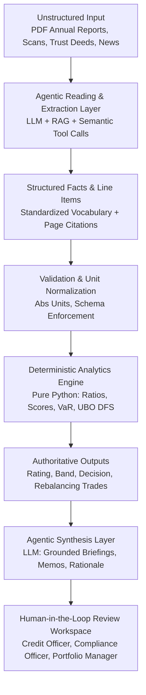
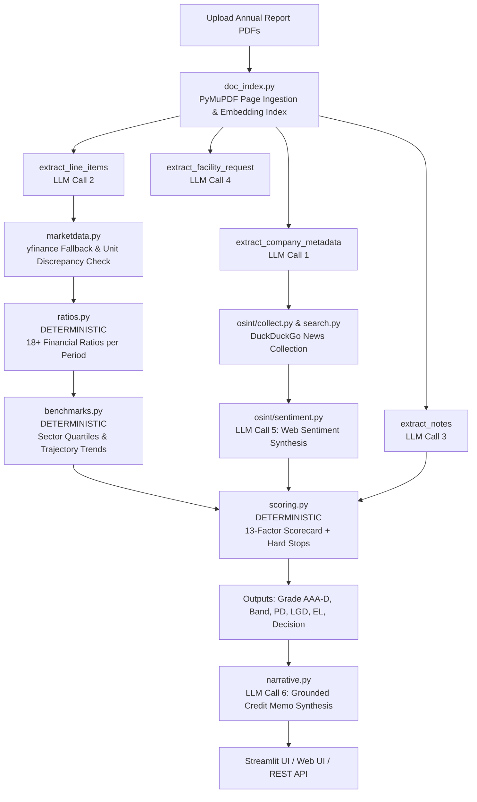
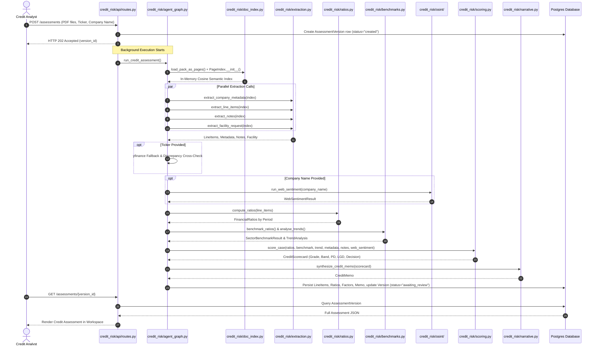
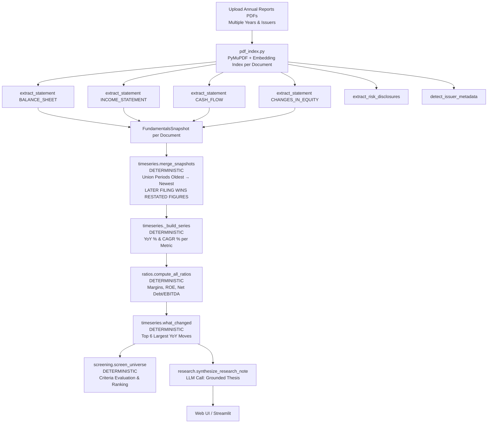
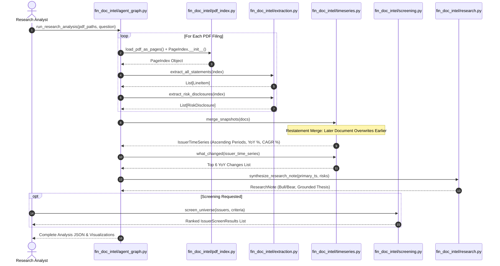
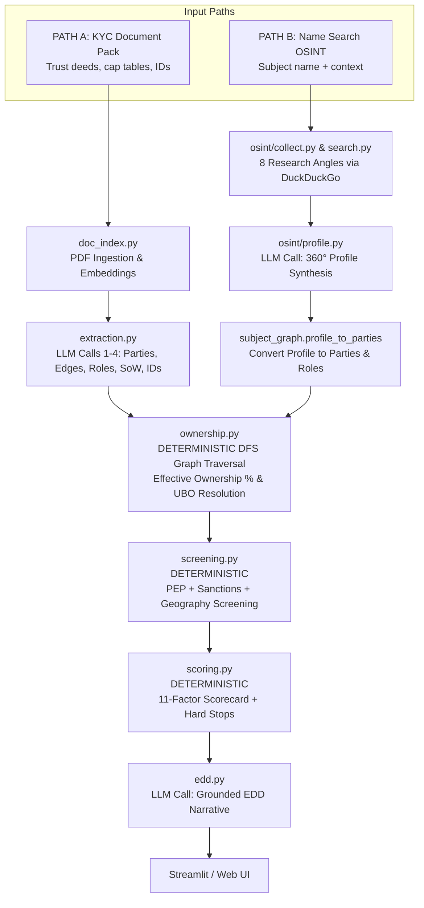
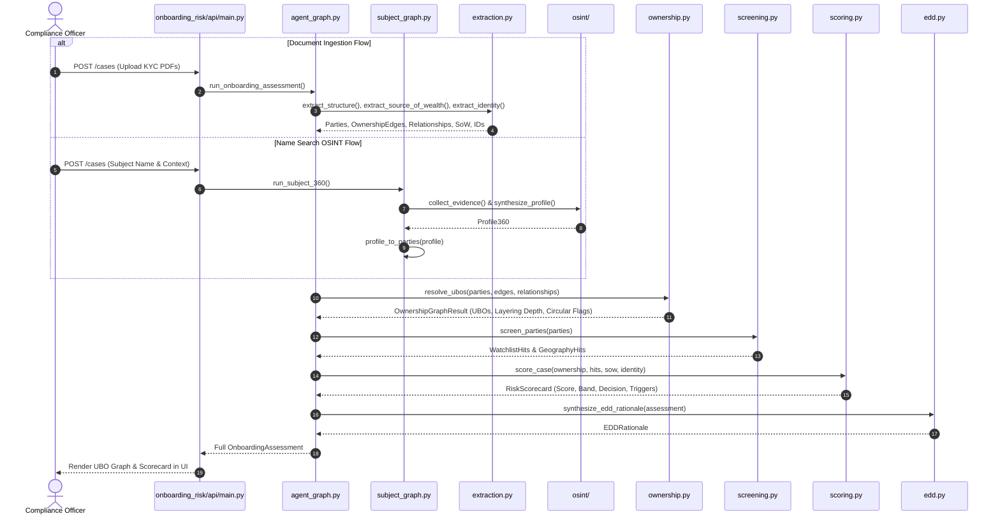
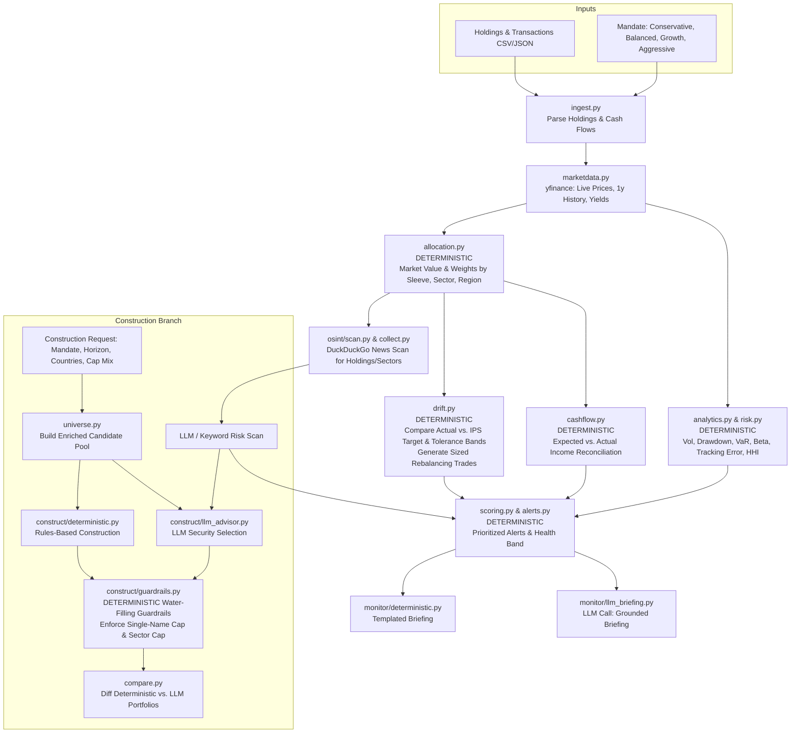
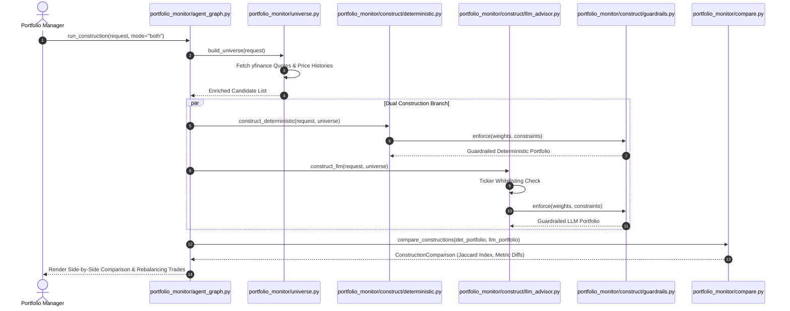
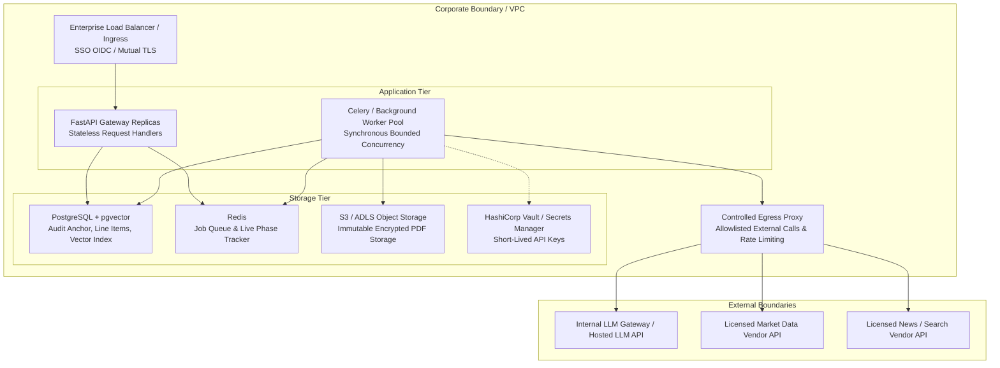

# Enterprise AI in Banking and Financial Services: Masterclass Architectures, Production Code Logic, and System Design Case Studies

---

## Table of Contents
1. [Preface: Who This Book Is For & How to Master It](#preface-who-this-book-is-for--how-to-master-it)
2. [Chapter 1: The AI Paradigm Shift in Banking & Capital Markets](#chapter-1-the-ai-paradigm-shift-in-banking--capital-markets)
3. [Chapter 2: Core Architectural Directives & Engineering Principles](#chapter-2-core-architectural-directives--engineering-principles)
4. [Chapter 3: Corporate Credit Risk Assessment Agent](#chapter-3-corporate-credit-risk-assessment-agent)
5. [Chapter 4: Financial Document Intelligence Agent](#chapter-4-financial-document-intelligence-agent)
6. [Chapter 5: Onboarding Risk Scoring & Fraud Detection Agent](#chapter-5-onboarding-risk-scoring--fraud-detection-agent)
7. [Chapter 6: Investment Research Copilot](#chapter-6-investment-research-copilot)
8. [Chapter 7: Enterprise Operations, Security, and Production Engineering](#chapter-7-enterprise-operations-security-and-production-engineering)
9. [Appendix: Repository Directory Index & File Map](#appendix-repository-directory-index--file-map)

---

## Preface: Who This Book Is For & How to Master It

### The Industry Challenge
Over the past decade, financial engineering and enterprise software development in Banking, Financial Services, and Insurance (BFSI) have undergone a radical transformation. Traditional automation relied on static rule engines and brittle OCR scripts that failed when filing layouts shifted or terminology differed across jurisdictions (e.g., "Revenue" vs. "Turnover" vs. "Operating Top-Line").

While Large Language Models (LLMs) solved the unstructured reading problem, early enterprise deployments highlighted a fatal flaw: **LLMs hallucinate figures and fail at reliable multi-step arithmetic**. In a credit underwriting committee, a Know-Your-Customer (KYC) compliance review, or a quantitative portfolio monitoring desk, an invented EBITDA figure, an unverified ownership percentage, or a miscalculated Value-at-Risk (VaR) can lead to severe regulatory penalties, capital loss, and reputational damage.

### How This Book Teaches You
This book is written as a Socratic, interview-driven masterclass between a **Senior Banking AI Architect** (Interviewer) and a **Lead Fintech Systems Engineer** (Candidate). Instead of abstract conceptual summaries, every single use case is built from the ground up:
1. **Business Context & Domain Realities**: Understanding why the problem matters to a bank, who the operational users are, and how ROI is measured.
2. **High-Level Design (HLD)**: Topology, container boundaries, sequence diagrams, and system flowcharts.
3. **Low-Level Design (LLD)**: Exact Pydantic schemas, database models, and function contracts.
4. **Concrete Source Code Logic**: Real Python code snippets from this repository detailing the exact algorithms, unit normalizations, graph traversals, and water-filling guardrails.
5. **Exact Prompt Engineering**: Literal system prompts, user context blocks, and JSON outputs passed to LLM call sites.
6. **Code Index & Repository Mapping**: Direct links to every file in the codebase so you can run, inspect, and deploy the code yourself.

---

## Chapter 1: The AI Paradigm Shift in Banking & Capital Markets

**Interviewer:** Welcome. Let's start with the big picture. Financial software has existed for decades. Why are legacy systems no longer sufficient, and why are raw Large Language Models by themselves dangerous in a bank?

**Candidate:** Legacy financial systems are exceptional at deterministic arithmetic, database transactions, and macro execution, but they are completely blind to unstructured text. An annual report, a trust deed, a court judgment, or an earnings call transcript cannot be parsed by a SQL query.

On the flip side, deploying a raw LLM to evaluate a loan application or calculate portfolio risk is an operational disaster. LLMs are non-deterministic, probabilistic text generators. They cannot guarantee that running the exact same 300-page filing twice will produce the exact same Debt/EBITDA ratio or credit grade. Furthermore, LLMs frequently make simple arithmetic mistakes when processing financial tables.



**Interviewer:** So what is the architectural pattern that solves both problems?

**Candidate:** The **Hybrid Deterministic-Agentic Architecture**. We draw a strict, un-crossable line between what the LLM is allowed to do and what Python is required to do:
- **LLM Responsibility (Perception & Narrative)**: Parse unstructured PDF text, map inconsistent printed labels to standardized financial vocabularies, extract verbatim text snippets with page citations, synthesize multi-source news findings, and write grounded explanatory memos.
- **Python Responsibility (Math, Scoring, & Governance)**: Normalize units, compute financial ratios, run depth-first-search (DFS) graph traversals for UBO resolution, apply weighted scorecard factors, execute water-filling constraint algorithms, and enforce hard-stop regulatory rules.

---

## Chapter 2: Core Architectural Directives & Engineering Principles

**Interviewer:** What are the non-negotiable architectural principles that govern every agent in this repository?

**Candidate:** Four core directives guide every line of code across all four projects:

### Directive 1: The Isolation Directive
The LLM is strictly prohibited from performing arithmetic or altering scorecard parameters.
- *Forbidden*: Asking an LLM, *"Calculate Debt/EBITDA and tell me if we should approve a $10M loan."*
- *Required*: The LLM extracts line items with page numbers $\rightarrow$ Python normalizes units and calculates $\text{Net Debt} / \text{EBITDA}$ $\rightarrow$ Python evaluates scorecard weights and assigns a BB rating $\rightarrow$ The LLM receives the finished scorecard JSON and drafts a credit memo explaining Python's decision.

### Directive 2: 100% Deterministic Reproducibility
Given identical input files, reference benchmarks, and model versions, the numerical ratings, risk bands, and rebalancing recommendations MUST be 100% reproducible. If two credit committee reviews of the exact same financial pack produce different ratings, the system fails compliance auditing.

### Directive 3: Source-Page Provenance & Attribution
Every extracted line item, covenant mention, or risk flag must carry an immutable provenance tag containing:
- Document filename and SHA-256 content hash.
- Global 1-based page number.
- Verbatim source text snippet.

### Directive 4: Human-in-the-Loop Override & Versioning
AI outputs are always drafts until signed off by an authorized human reviewer. When a reviewer edits an extracted line item or overrides a credit decision:
- The original AI-extracted value is preserved in an immutable audit trail.
- A new assessment version is created with a `parent_version_id` link.
- All downstream ratios, scores, and memos are automatically recomputed from the human-corrected input.

---

## Chapter 3: Corporate Credit Risk Assessment Agent

### 3.1 Business Context & Value Proposition

**Interviewer:** Walk me through the credit risk problem. What does a corporate bank actually do when a middle-market company asks for a $20M credit facility?

**Candidate:** When a company applies for debt, a credit analyst spends 3 to 5 days manually analyzing 3 to 5 years of audited financial statements (50 to 300 pages each). They spread the financial statements into a standard model, calculate 20+ financial ratios, compare those ratios against sector benchmarks, read the notes for contingent liabilities or auditor warnings, search public news for adverse media, and draft a 15-page Credit Memo for the Credit Committee.

The **Credit Risk Assessment Agent** automates this entire pipeline—reducing turnaround time from 5 days to under 3 minutes while providing complete mathematical auditability.

* **Git Repository Path**: [`/Credit_Risk_Assesment_Agent/`](./Credit_Risk_Assesment_Agent/)
* **Key Source Code Files**:
  * Orchestration: [`credit_risk/agent_graph.py`](./Credit_Risk_Assesment_Agent/credit_risk/agent_graph.py)
  * Line Item & Note Extraction: [`credit_risk/extraction.py`](./Credit_Risk_Assesment_Agent/credit_risk/extraction.py)
  * Deterministic Ratio Engine: [`credit_risk/ratios.py`](./Credit_Risk_Assesment_Agent/credit_risk/ratios.py)
  * Benchmarking & Trends: [`credit_risk/benchmarks.py`](./Credit_Risk_Assesment_Agent/credit_risk/benchmarks.py)
  * Scorecard & Hard Stops: [`credit_risk/scoring.py`](./Credit_Risk_Assesment_Agent/credit_risk/scoring.py)
  * Credit Memo Synthesis: [`credit_risk/narrative.py`](./Credit_Risk_Assesment_Agent/credit_risk/narrative.py)
  * REST API: [`credit_risk/api/routes.py`](./Credit_Risk_Assesment_Agent/credit_risk/api/routes.py)

---

### 3.2 High-Level Architecture (HLD) & Flow



---

### 3.3 Low-Level Design (LLD): Module & Schema Specifications

**Interviewer:** Show me the exact data contracts and function interfaces that drive this agent.

**Candidate:** All data models are defined using Pydantic in [`credit_risk/schemas.py`](./Credit_Risk_Assesment_Agent/credit_risk/schemas.py):

#### Pydantic Schemas (`schemas.py`)
```python
class StandardLabel(str, Enum):
    REVENUE = "revenue"
    EBITDA = "ebitda"
    EBIT = "ebit"
    NET_INCOME = "net_income"
    SHORT_TERM_DEBT = "short_term_debt"
    LONG_TERM_DEBT = "long_term_debt"
    TOTAL_DEBT = "total_debt"
    CASH_AND_EQUIVALENTS = "cash_and_equivalents"
    TOTAL_EQUITY = "total_equity"
    TOTAL_ASSETS = "total_assets"
    CURRENT_ASSETS = "current_assets"
    CURRENT_LIABILITIES = "current_liabilities"
    OPERATING_CASH_FLOW = "operating_cash_flow"
    CAPITAL_EXPENDITURE = "capital_expenditure"
    INTEREST_EXPENSE = "interest_expense"
    OTHER = "other"

class LineItem(BaseModel):
    label: str
    standardised_label: StandardLabel = StandardLabel.OTHER
    value: Optional[float] = None
    currency: Optional[str] = None
    unit: str = "absolute"  # "absolute", "thousands", "millions"
    period: str            # e.g., "FY2023"
    period_type: PeriodType = PeriodType.ANNUAL
    statement_type: StatementType = StatementType.OTHER
    page: Optional[int] = None
    source_snippet: Optional[str] = None

class RatioValue(BaseModel):
    name: str
    value: Optional[float] = None
    category: str
    inputs_used: List[str] = Field(default_factory=list)
    missing_inputs: List[str] = Field(default_factory=list)
    pages: List[int] = Field(default_factory=list)

class RatingFactorResult(BaseModel):
    factor: RatingFactorType
    present: bool
    severity: str  # "low", "medium", "high", "critical"
    weight: float
    contribution: float
    evidence: List[str] = Field(default_factory=list)
    pages: List[int] = Field(default_factory=list)
```

#### Function Contract Matrix

| Module | Function Signature | Return Type | Description |
|---|---|---|---|
| `doc_index.py` | `load_pack_as_pages(pdf_paths: List[str])` | `List[PageChunk]` | Reads PDFs via PyMuPDF; assigns global 1-based page numbers. |
| `doc_index.py` | `PageIndex.__init__(pages: List[PageChunk])` | `PageIndex` | Batch embeds all page texts for cosine similarity search. |
| `extraction.py` | `extract_line_items(index: PageIndex, k=10)` | `List[LineItem]` | Tool-calling LLM extraction of balance sheet, P&L, and cash flow items. |
| `ratios.py` | `compute_ratios(line_items: List[LineItem])` | `Tuple[List[str], List[FinancialRatios]]` | Pure Python: Unit normalization + 18 financial ratios per period. |
| `benchmarks.py` | `benchmark_ratios(latest, industry)` | `SectorBenchmarkResult` | Pure Python: Evaluates ratios against sector quartiles in `reference.py`. |
| `scoring.py` | `score_case(ratios, benchmark, trend, company, notes, web_sentiment)` | `CreditScorecard` | Pure Python: 13-factor scorecard, PD/LGD calculation, and hard-stop enforcement. |

---

### 3.4 LLM Prompts, Grounded Context, & Evidence Blocks

**Interviewer:** Show me the exact prompts used for financial line item extraction and credit memo synthesis.

**Candidate:** Here are the literal prompt templates and evidence blocks from [`credit_risk/extraction.py`](./Credit_Risk_Assesment_Agent/credit_risk/extraction.py) and [`credit_risk/narrative.py`](./Credit_Risk_Assesment_Agent/credit_risk/narrative.py):

#### Line Item Extraction Prompt (`extraction.py`)

**System Prompt**:
```text
You are a financial-statement spreading analyst. Your job is to transcribe every printed financial line item from the provided document page text ONLY.

Rules:
1. Emit ONE record per (line item x period). If a row shows FY2023 and FY2022, emit two records.
2. Map each printed label to the single best standardised_label from the allowed list:
   [revenue, ebitda, ebit, net_income, short_term_debt, long_term_debt, total_debt, cash_and_equivalents, total_equity, total_assets, current_assets, current_liabilities, operating_cash_flow, capital_expenditure, interest_expense, other].
3. Transcribe value EXACTLY as printed. Do NOT compute, sum, infer, or rescale values.
4. Record unit as 'absolute', 'thousands', or 'millions' if stated on the statement header.
5. Set statement_type to where the row appears (balance_sheet, income_statement, cash_flow_statement).
6. Record the exact 1-based page number where the line item was read.
7. Output ONLY a valid JSON array of LineItem objects. No markdown formatting or prose.
```

**User Context / Evidence Block**:
```text
--- PAGE 42 (annual_report_2023.pdf) ---
CONSOLIDATED BALANCE SHEET
As at 31 December 2023  (USD millions)
                          2023    2022
Total assets             2,456   2,180
Current assets             890     760
Cash and equivalents       234     198
Total liabilities        1,420   1,310
Current liabilities        510     480
Short-term borrowings      150     120
Long-term debt             650     600
Total equity             1,036     870

--- PAGE 47 (annual_report_2023.pdf) ---
INCOME STATEMENT
For the year ended 31 December 2023 (USD millions)
                          2023    2022
Revenue                  1,240   1,100
Operating expenses        (890)   (810)
EBIT                       350     290
Interest expense           (45)    (42)
Net Income                 230     195
```

#### Credit Memo Synthesis Prompt (`narrative.py`)

**System Prompt**:
```text
You are a senior credit risk officer writing a formal Credit Memo for the Credit Committee.
You are given a DETERMINISTICALLY calculated Credit Scorecard and Financial Assessment.
These numbers, ratings, and decisions are AUTHORITATIVE and FINAL.

CRITICAL DIRECTIVES:
1. Do NOT recalculate any financial ratios, scores, or default probabilities.
2. Quote the exact numbers provided in the input JSON (e.g., Net Debt/EBITDA, Interest Coverage, Score, Rating).
3. Do NOT change the rating grade or lending decision under any circumstances.
4. Explain the rationale behind active risk factors and benchmark gaps using professional banking language.
5. Output ONLY JSON matching the CreditMemo schema:
   {"executive_summary": str, "financial_analysis": str, "key_strengths": [str], "key_risks": [str], "mitigants": [str], "recommended_covenants": [str], "monitoring_triggers": [str]}.
```

---

### 3.5 Deterministic Mathematics: Formulas & Scorecard Logic

**Interviewer:** Walk me through the exact mathematical logic in `ratios.py` and `scoring.py`.

**Candidate:**

#### Unit Normalization Logic (`ratios.py`)
Before calculating any ratio, every line item value is normalized to absolute units:
$$V_{\text{absolute}} = V_{\text{raw}} \times \text{multiplier}(\text{unit})$$
where $\text{multiplier}(\text{millions}) = 1,000,000$, $\text{multiplier}(\text{thousands}) = 1,000$, and $\text{multiplier}(\text{absolute}) = 1.0$.

#### Financial Ratio Formulas (`ratios.py`)
1. **Total Debt**:
$$\text{Total Debt} = \text{Short-Term Debt} + \text{Long-Term Debt}$$
2. **Net Debt**:
$$\text{Net Debt} = \text{Total Debt} - \text{Cash \& Equivalents}$$
3. **Net Debt / EBITDA**:
$$\text{Net Debt / EBITDA} = \frac{\text{Net Debt}}{\text{EBITDA}}$$
4. **Interest Coverage Ratio**:
$$\text{Interest Coverage} = \frac{\text{EBITDA}}{\text{Interest Expense}}$$
5. **Debt Service Coverage Ratio (DSCR)**:
$$\text{DSCR} = \frac{\text{EBITDA} - \text{Capex}}{\text{Interest Expense} + \text{Principal Repayments}}$$
6. **Current Ratio**:
$$\text{Current Ratio} = \frac{\text{Current Assets}}{\text{Current Liabilities}}$$

#### 13-Factor Deterministic Scorecard (`scoring.py`)
Each factor $i$ has a maximum weight $W_i$ and severity multiplier $S_i \in \{0.0, 0.6, 1.0, 1.6\}$:
$$\text{Raw Score} = \sum_{i=1}^{13} (W_i \times S_i \times \mathbb{I}(\text{factor}_i \text{ active}))$$
$$\text{Normalized Score} = \min(100.0, \text{Raw Score})$$

```
Factor Base Weights (W_i):
LEVERAGE:               22 pts max
DEBT_SERVICE_COVERAGE:  22 pts max
LIQUIDITY:              16 pts max
PROFITABILITY:          16 pts max
CASH_FLOW_QUALITY:      14 pts max
DETERIORATING_TREND:    16 pts max
SECTOR_UNDERPERFORMANCE:10 pts max
SIZE_SCALE:              8 pts max
JURISDICTION:            6 pts max
AUDIT_QUALITY:          20 pts max  (Adverse/Disclaimer opinion = HARD STOP)
OFF_BALANCE_SHEET:      10 pts max
ADVERSE_MEDIA:          14 pts max  (Web news, credited with discount)
MARKET_SENTIMENT:        8 pts max
```

**Hard Stop Logic**:
If `auditor_opinion` is `ADVERSE` or `DISCLAIMER`, or if `going_concern` is present:
$$\text{Score} \leftarrow 100.0, \quad \text{Grade} \leftarrow \text{"D"}, \quad \text{Decision} \leftarrow \text{"DECLINE"}$$

---

### 3.6 Execution Sequence & Call Graph



---

### 3.7 Case Study & Interview Deep-Dive

**Interviewer:** What happens if the annual report is incomplete—for example, if the cash flow statement is missing?

**Candidate:** In [`credit_risk/agent_graph.py`](./Credit_Risk_Assesment_Agent/credit_risk/agent_graph.py), if a stock ticker is provided, the agent uses `marketdata.py` to fetch missing financial statements from Yahoo Finance. However, **documents always win**: `_merge_yfinance_items()` only fills cells that were missing in the document extraction. Furthermore, `_cross_check()` compares extracted document figures against Yahoo Finance. If a discrepancy exceeds `YF_DISCREPANCY_TOL` (2%), the system flags it in `reconciliation.discrepancies` so the analyst can verify if a unit scaling error occurred during extraction.

**Interviewer:** How do you handle reruns when an analyst disagrees with an extracted number?

**Candidate:** When an analyst submits a correction via `POST /assessments/{id}/rerun`, the API creates a new `AssessmentVersion` with `parent_version_id` set to the original ID. The human correction replaces the extracted `LineItem` value, and Python re-executes `ratios.py`, `benchmarks.py`, `scoring.py`, and `narrative.py` in sequence. The original version remains untouched in Postgres for full compliance auditability.

---

## Chapter 4: Financial Document Intelligence Agent

### 4.1 Business Context & Value Proposition

**Interviewer:** How does the Financial Document Intelligence Agent differ from the Credit Risk Agent?

**Candidate:** While the Credit Risk Agent focuses on a single company's debt facility application, the **Financial Document Intelligence Agent** is designed for equity research analysts, credit research desks, and quantitative portfolio managers who monitor dozens of issuers across multiple historical filings.

Its primary innovations are:
1. **Chronological Time-Series Merge with Restatement Handling**: Correctly overriding prior-year figures when a company restates numbers in a later filing.
2. **Automated CAGR & YoY Growth Analytics**: Calculating compound annual growth rates and flagging major trend shifts.
3. **Cross-Issuer Universe Screening**: Filtering a portfolio universe using multi-metric quantitative rules.

* **Git Repository Path**: [`/FinDoc_IIntelligence_Agent/`](./FinDoc_IIntelligence_Agent/)
* **Key Source Code Files**:
  * Pipeline Entry Point: [`fin_doc_intel/agent_graph.py`](./FinDoc_IIntelligence_Agent/fin_doc_intel/agent_graph.py)
  * Statement Extraction: [`fin_doc_intel/extraction.py`](./FinDoc_IIntelligence_Agent/fin_doc_intel/extraction.py)
  * Time-Series & Restatement Merge: [`fin_doc_intel/timeseries.py`](./FinDoc_IIntelligence_Agent/fin_doc_intel/timeseries.py)
  * Ratios Engine: [`fin_doc_intel/ratios.py`](./FinDoc_IIntelligence_Agent/fin_doc_intel/ratios.py)
  * Quantitative Screening Engine: [`fin_doc_intel/screening.py`](./FinDoc_IIntelligence_Agent/fin_doc_intel/screening.py)
  * Research Note Synthesis: [`fin_doc_intel/research.py`](./FinDoc_IIntelligence_Agent/fin_doc_intel/research.py)

---

### 4.2 High-Level Architecture (HLD) & Flow



---

### 4.3 Low-Level Design (LLD): Module & Schema Specifications

#### Pydantic Schemas (`schemas.py`)

```python
class CanonicalKey(str, Enum):
    REVENUE = "revenue"
    EBIT = "ebit"
    EBITDA = "ebitda"
    NET_INCOME = "net_income"
    EPS = "eps"
    TOTAL_ASSETS = "total_assets"
    CASH = "cash"
    TOTAL_DEBT = "total_debt"
    EQUITY = "equity"
    CFO = "cfo"
    CAPEX = "capex"
    OTHER = "other"

class MetricSeries(BaseModel):
    metric: str
    points: List[TrendPoint] = Field(default_factory=list)
    latest: Optional[float] = None
    latest_yoy_pct: Optional[float] = None
    cagr_pct: Optional[float] = None

class IssuerTimeSeries(BaseModel):
    issuer: Optional[str] = None
    currency: Optional[str] = None
    periods: List[str] = Field(default_factory=list)  # Chronologically ascending
    by_period: Dict[str, Dict[str, float]] = Field(default_factory=dict)
    provenance: Dict[str, Dict[str, int]] = Field(default_factory=dict)
    fundamentals_series: Dict[str, MetricSeries] = Field(default_factory=dict)
    ratio_series: Dict[str, MetricSeries] = Field(default_factory=dict)

class ScreeningCriterion(BaseModel):
    metric: str  # e.g., "Net Debt / EBITDA" or "revenue"
    op: str      # ">", ">=", "<", "<=", "=="
    threshold: float
    weight: float = 1.0

class IssuerScreenResult(BaseModel):
    issuer: str
    period: Optional[str] = None
    outcomes: List[CriterionOutcome] = Field(default_factory=list)
    pass_count: int = 0
    weighted_score: float = 0.0
    all_passed: bool = False
```

---

### 4.4 Restatement Resolution & Time-Series Algorithms

**Interviewer:** Explain the exact code logic that handles restated financial figures.

**Candidate:** In [`fin_doc_intel/timeseries.py`](./FinDoc_IIntelligence_Agent/fin_doc_intel/timeseries.py), `merge_snapshots()` takes a list of extracted document snapshots. When companies restate prior-year figures in a later filing, the later filing contains the true corrected value.

#### Code Implementation (`timeseries.py`)
```python
def merge_snapshots(docs: List[Tuple[str, FundamentalsSnapshot]]) -> IssuerTimeSeries:
    # 1. Sort document snapshots chronologically by their latest period date
    docs_sorted = sorted(
        docs,
        key=lambda pair: _sort_key_for_period(pair[1].periods[-1] if pair[1].periods else "")
    )

    merged_by_period = defaultdict(dict)
    provenance = defaultdict(dict)
    period_source_doc = {}

    # 2. Iterate chronologically; later documents overwrite earlier values for overlapping periods
    for doc_name, snap in docs_sorted:
        for period, line_map in snap.by_period.items():
            for key, val in line_map.items():
                merged_by_period[period][key] = val
                provenance[period][key] = snap.source_pages.get(key, 0)
                period_source_doc[period] = doc_name

    # 3. Build chronological period list and derive FCF (CFO - Capex)
    all_periods = sorted(list(merged_by_period.keys()), key=_sort_key_for_period)
    for p in all_periods:
        cfo = merged_by_period[p].get(CanonicalKey.CFO.value)
        capex = merged_by_period[p].get(CanonicalKey.CAPEX.value)
        if cfo is not None and capex is not None:
            merged_by_period[p]["free_cash_flow"] = cfo - capex

    # 4. Compute YoY % and CAGR % for every fundamental metric and ratio
    # ...
    return IssuerTimeSeries(...)
```

#### CAGR & YoY Formulas (`ratios.py`, `timeseries.py`)
$$\text{YoY \%} = \frac{V_t - V_{t-1}}{|V_{t-1}|} \times 100$$
$$\text{CAGR \%} = \left[ \left( \frac{V_{\text{last}}}{V_{\text{first}}} \right)^{\frac{1}{N - 1}} - 1 \right] \times 100$$

---

### 4.5 LLM Prompts, Grounded Context, & Evidence Blocks

#### Institutional Research Note Prompt (`research.py`)

**System Prompt**:
```text
You are a senior equity research analyst. You are provided with a DETERMINISTICALLY merged issuer fundamentals time series (values, YoY %, CAGR % - already computed and authoritative), a 'what_changed' list, and extracted risk disclosures.

RULES:
1. Ground every claim in the supplied numbers. Quote exact metrics, YoY %, and CAGR %.
2. Do NOT recalculate or invent any financial growth rates or ratios.
3. Pass through the 'what_changed' list VERBATIM as provided in the input JSON.
4. Present a balanced thesis covering both Bull Case and Bear Case arguments.
5. Output ONLY valid JSON matching the ResearchNote schema:
   {"thesis_summary": str, "bull_case": [str], "bear_case": [str], "what_changed": [str], "key_trends": [str], "watch_items": [str]}.
```

**User Context / Input Snapshot**:
```json
{
  "issuer": "Tata Steel Ltd",
  "currency": "INR",
  "periods": ["FY2020", "FY2021", "FY2022", "FY2023", "FY2024"],
  "fundamentals": {
    "revenue": {"by_period": {"FY2020": 138000, "FY2021": 131000, "FY2022": 210000, "FY2023": 243000, "FY2024": 245000}, "latest": 245000, "latest_yoy_pct": 0.82, "cagr_pct": 15.4},
    "net_income": {"by_period": {"FY2020": 2300, "FY2021": 6600, "FY2022": 41700, "FY2023": 8070, "FY2024": 8900}, "latest": 8900, "latest_yoy_pct": 10.28, "cagr_pct": 39.8}
  },
  "what_changed": [
    "net_income: +10.3% YoY",
    "capex: +28.0% YoY",
    "Net Debt / EBITDA: -0.4x YoY"
  ]
}
```

---

### 4.6 Cross-Issuer Quantitative Screening Engine

**Interviewer:** How does the screening engine rank an entire universe of companies?

**Candidate:** In [`fin_doc_intel/screening.py`](./FinDoc_IIntelligence_Agent/fin_doc_intel/screening.py), `screen_universe()` tests every `IssuerTimeSeries` against a list of `ScreeningCriterion`:

```python
def screen_issuer(ts: IssuerTimeSeries, criteria: List[ScreeningCriterion]) -> IssuerScreenResult:
    outcomes = []
    pass_count = 0
    weighted_score = 0.0

    for c in criteria:
        val = _lookup_metric(ts, c.metric)
        passed = _eval_op(val, c.op, c.threshold) if val is not None else False
        if passed:
            pass_count += 1
            weighted_score += c.weight
        outcomes.append(CriterionOutcome(metric=c.metric, op=c.op, threshold=c.threshold, actual=val, passed=passed))

    all_passed = (pass_count == len(criteria)) and len(criteria) > 0
    return IssuerScreenResult(issuer=ts.issuer, period=ts.latest_period, outcomes=outcomes, pass_count=pass_count, weighted_score=weighted_score, all_passed=all_passed)
```

Issuers are then sorted deterministically by:
$$\text{Sort Key} = (\text{all\_passed DESC}, \text{weighted\_score DESC}, \text{pass\_count DESC})$$

---

### 4.7 Execution Sequence & Call Graph



---

### 4.8 Case Study & Interview Deep-Dive

**Interviewer:** How do you generate the `what_changed` surveillance list, and why is it kept separate from the LLM?

**Candidate:** In `timeseries.py::what_changed()`, Python computes the absolute YoY percentage change or absolute delta between the two most recent periods across all metrics and ratios. It sorts these moves by magnitude and extracts the top 6 largest variations. This list is injected directly into the `ResearchNote.what_changed` attribute and into the LLM prompt. The system prompt instructs the LLM to pass this list through **verbatim** without editing a single character or number. This ensures that the key operational surveillance signals presented to a portfolio manager are 100% mathematically verifiable.

---

## Chapter 5: Onboarding Risk Scoring & Fraud Detection Agent

### 5.1 Business Context & Value Proposition

**Interviewer:** Walk me through the onboarding and AML risk problem in private banking.

**Candidate:** When a High Net-Worth Individual (HNI), Ultra High Net-Worth Individual (UHNI), or complex corporate entity applies to open private banking accounts, global regulations (FATF, FinCEN, FCA, MAS) mandate strict **Know Your Customer (KYC)** and **Enhanced Due Diligence (EDD)**.

Financial criminals hide beneficial ownership behind layered holding companies, offshore trusts, nominee directors, and circular shareholding structures. Compliance teams spend weeks manually reviewing trust deeds, cap tables, passport copies, and public records to answer three questions:
1. **Who is the Ultimate Beneficial Owner (UBO)?**
2. **Is anyone sanctioned, a Politically Exposed Person (PEP), or flagged in adverse media?**
3. **What is the deterministic risk score and EDD requirement?**

The **Onboarding Risk Scoring & Fraud Detection Agent** handles two workflows:
- **Document-Based Path**: Processes uploaded KYC packs, trust deeds, and cap tables.
- **Name-Search OSINT Path**: Conducts an automated 360° open-source intelligence scan across 8 research angles.

* **Git Repository Path**: [`/Fraud_Detection_Agent/`](./Fraud_Detection_Agent/)
* **Key Source Code Files**:
  * Document Orchestration: [`agent_graph.py`](./Fraud_Detection_Agent/agent_graph.py)
  * OSINT Subject Orchestration: [`subject_graph.py`](./Fraud_Detection_Agent/subject_graph.py)
  * UBO Graph Engine: [`ownership.py`](./Fraud_Detection_Agent/ownership.py)
  * Watchlist & Geography Screening: [`screening.py`](./Fraud_Detection_Agent/screening.py)
  * Deterministic Scorecard: [`scoring.py`](./Fraud_Detection_Agent/scoring.py)
  * Grounded EDD Rationale: [`edd.py`](./Fraud_Detection_Agent/edd.py)

---

### 5.2 High-Level Architecture (HLD) & Dual Ingestion Flow



---

### 5.3 Low-Level Design (LLD): Module & Schema Specifications

#### Pydantic Schemas (`schemas.py`)

```python
class PartyType(str, Enum):
    INDIVIDUAL = "individual"
    TRUST = "trust"
    FOUNDATION = "foundation"
    HOLDING_COMPANY = "holding_company"
    OPERATING_COMPANY = "operating_company"
    SPV = "spv"
    NOMINEE = "nominee"
    OTHER = "other"

class RoleType(str, Enum):
    APPLICANT = "applicant"
    SETTLOR = "settlor"
    TRUSTEE = "trustee"
    PROTECTOR = "protector"
    BENEFICIARY = "beneficiary"
    DIRECTOR = "director"
    SHAREHOLDER = "shareholder"
    SIGNATORY = "signatory"
    NOMINEE = "nominee"

class OwnershipEdge(BaseModel):
    owner_id: str
    owned_id: str
    percentage: Optional[float] = None
    interest_type: InterestType = InterestType.EQUITY
    page: Optional[int] = None

class UBO(BaseModel):
    party_id: str
    name: str
    effective_ownership_pct: Optional[float] = None
    basis: str  # "ownership", "control", "senior_managing_official"
    control_roles: List[str] = Field(default_factory=list)
    paths: List[str] = Field(default_factory=list)

class OwnershipGraphResult(BaseModel):
    applicant_party_id: Optional[str] = None
    ubos: List[UBO] = Field(default_factory=list)
    num_entities: int = 0
    num_parties: int = 0
    max_layering_depth: int = 0
    has_nominee: bool = False
    has_bearer_shares: bool = False
    has_circular_ownership: bool = False
```

---

### 5.4 UBO Resolution Graph Engine (DFS Algorithm)

**Interviewer:** Show me the exact code that computes effective ownership across multi-layered entities and trust structures.

**Candidate:** In [`ownership.py`](./Fraud_Detection_Agent/ownership.py), we model parties as nodes and ownership edges as weighted directed edges. We execute a depth-first search (DFS) with cycle detection:

#### Python Implementation (`ownership.py`)
```python
def _paths_to_applicant(
    owner_id: str,
    applicant_id: str,
    edges_by_owner: Dict[str, List[OwnershipEdge]],
    visited: Set[str]
) -> List[Tuple[float, List[str]]]:
    if owner_id == applicant_id:
        return [(100.0, [applicant_id])]
    if owner_id in visited:
        return []  # Cycle detected: Circular ownership!

    visited.add(owner_id)
    results = []

    for edge in edges_by_owner.get(owner_id, []):
        pct = edge.percentage if edge.percentage is not None else 100.0
        sub_paths = _paths_to_applicant(edge.owned_id, applicant_id, edges_by_owner, visited.copy())
        for sub_pct, path_nodes in sub_paths:
            effective_pct = (pct / 100.0) * sub_pct
            results.append((effective_pct, [owner_id] + path_nodes))

    return results
```

#### Effective Ownership Mathematical Formula
For a natural person $P$ and applicant entity $A$:
$$\text{Effective Ownership}(P \to A) = \sum_{p \in \text{paths}(P \to A)} \left( \prod_{e \in p} \frac{\text{percentage}(e)}{100} \right) \times 100\%$$

**Three UBO Qualification Criteria**:
1. **Ownership Basis**: $\text{Effective Ownership} \ge 25.0\%$.
2. **Control Basis**: Natural person holding roles $\in \{\text{settlor, trustee, protector, director, signatory}\}$.
3. **Senior Managing Official Fallback**: Designated if no natural person satisfies ownership or control thresholds.

---

### 5.5 OSINT 360° Profiling & Evidence Assembly

When no documents exist, `osint/collect.py` executes search queries across **8 Research Angles**:
- `BIOGRAPHY`, `PROFESSIONAL`, `COMPANY_PERFORMANCE`, `ADVERSE_MEDIA`, `PEP`, `SOCIAL_BEHAVIORAL`, `RELATIONSHIPS`, `WEALTH`.

Results are deduplicated by URL and synthesized by `osint/profile.py` into a `Profile360` object. `subject_graph.py::profile_to_parties()` converts profile findings into structured `Party` and `Relationship` objects so they feed the exact same deterministic scoring engine as document cases.

---

### 5.6 LLM Prompts, Grounded Context, & Evidence Blocks

#### EDD Rationale Prompt (`edd.py`)

**System Prompt**:
```text
You are a Financial Crime / AML Compliance Officer authoring a formal EDD Rationale.
You are given an AUTHORITATIVE, DETERMINISTIC Risk Scorecard and UBO Ownership Graph.

CRITICAL DIRECTIVES:
1. Do NOT recalculate risk scores, modify risk bands, or alter the onboarding decision.
2. Quote exact UBO names, effective ownership %, layering depth, and active risk triggers.
3. Recommend concrete Enhanced Due Diligence (EDD) measures (e.g., bank references, audited accounts).
4. List specific information required from the applicant to clear the case.
5. Output ONLY valid JSON matching the EDDRationale schema:
   {"risk_summary": str, "key_drivers": [str], "edd_measures": [str], "information_required": [str], "watch_items": [str]}.
```

---

### 5.7 Deterministic Risk Scorecard & Hard Stops

#### 11-Factor Scorecard Weights (`scoring.py`)
```
SANCTIONS:                100 pts  (HARD STOP -> PROHIBITED)
PEP:                       30 pts
ADVERSE_MEDIA:             28 pts
OPAQUE_SOURCE_OF_WEALTH:   26 pts
NOMINEE_ARRANGEMENT:       24 pts
BEARER_SHARES:             24 pts
HIGH_RISK_GEOGRAPHY:       20 pts
COMPLEX_STRUCTURE:         16 pts
LAYERING:                  16 pts
ID_VERIFICATION_GAP:       14 pts
OFFSHORE_JURISDICTION:     10 pts
```

#### Onboarding Decision Mapping
- **Score 0–24 (LOW)**: `APPROVE_STANDARD_CDD`
- **Score 25–49 (MEDIUM)**: `APPROVE_WITH_EDD`
- **Score 50+ (HIGH)**: `ESCALATE_MLRO`
- **Sanctions / Prohibited Country**: `DECLINE` (`PROHIBITED`)

---

### 5.8 Execution Sequence & Call Graph



---

### 5.9 Case Study & Interview Deep-Dive

**Interviewer:** How do you handle adverse media credibility, preventing a single tabloid blog post from forcing an HNI client into a PROHIBITED decision?

**Candidate:** In [`scoring.py`](./Fraud_Detection_Agent/scoring.py), we apply an **Adverse Media Credibility Discount**. Curated compliance databases (e.g., World-Check, Refinitiv) are credited at full severity. OSINT web-derived adverse media findings are discounted by one severity level. Furthermore, a single web finding cannot reach "high" severity on its own—it requires corroboration from at least two independent high-severity web hits. Finally, if `profile.disambiguation_confidence` is `low`, the adverse media factor severity is capped at `medium`, ensuring unverified web rumors do not trigger a false `DECLINE`.

---

## Chapter 6: Investment Research Copilot

### 6.1 Business Context & Value Proposition

**Interviewer:** What problem does the Investment Research Copilot solve for portfolio managers and wealth advisors?

**Candidate:** Portfolio managers face two continuous operational challenges:
1. **Portfolio Risk Monitoring**: Tracking allocation drift against Investment Policy Statements (IPS), identifying single-stock and sector concentration, detecting cash-flow income shortfalls (missing dividend payments), checking statistical risk limits (Volatility, VaR, Max Drawdown, Beta, HHI), and scanning news for emerging risks.
2. **From-Scratch Portfolio Construction**: Building custom multi-asset portfolios matching a client's mandate, horizon, geography, and cap-mix constraints—with hard guardrails ensuring no stock or sector breaches policy caps.

The **Investment Research Copilot** automates both workflows, combining pure NumPy statistical analytics, deterministic trade sizing, and LLM market intelligence.

* **Git Repository Path**: [`/Investment_Research_Copilot/`](./Investment_Research_Copilot/)
* **Key Source Code Files**:
  * Orchestration: [`portfolio_monitor/agent_graph.py`](./Investment_Research_Copilot/portfolio_monitor/agent_graph.py)
  * Quantitative Math: [`portfolio_monitor/analytics.py`](./Investment_Research_Copilot/portfolio_monitor/analytics.py)
  * Allocation & Drift: [`portfolio_monitor/allocation.py`](./Investment_Research_Copilot/portfolio_monitor/allocation.py), [`drift.py`](./Investment_Research_Copilot/portfolio_monitor/drift.py)
  * Risk Limits & Scorecard: [`portfolio_monitor/risk.py`](./Investment_Research_Copilot/portfolio_monitor/risk.py), [`scoring.py`](./Investment_Research_Copilot/portfolio_monitor/scoring.py)
  * Construction & Guardrails: [`portfolio_monitor/construct/`](./Investment_Research_Copilot/portfolio_monitor/construct/)
  * Country Research Graph (LangGraph): [`portfolio_monitor/research/graph.py`](./Investment_Research_Copilot/portfolio_monitor/research/graph.py)

---

### 6.2 High-Level Architecture (HLD) & Dual-Mode Pipeline



---

### 6.3 Low-Level Design (LLD): Module & Schema Specifications

#### Pydantic Schemas (`schemas.py`)

```python
class ConstructionConstraints(BaseModel):
    single_name_cap: float = 0.10  # Max 10% in any single stock
    sector_cap: float = 0.30       # Max 30% in any single sector
    min_position: float = 0.01     # Drop positions < 1%
    exclusions: List[str] = Field(default_factory=list)

class ConstructionRequest(BaseModel):
    mandate: str = "balanced"
    risk_tolerance: str = "medium"
    horizon_years: int = 5
    invest_amount: float = 1000000.0
    constraints: ConstructionConstraints = Field(default_factory=ConstructionConstraints)
    weighting_method: WeightingMethod = WeightingMethod.EQUAL_WEIGHT
    geography_mode: GeographyMode = GeographyMode.GLOBAL
    countries: List[str] = Field(default_factory=list)
    style: PortfolioStyle = PortfolioStyle.MULTI_CAP

class SelectedPosition(BaseModel):
    symbol: str
    name: Optional[str] = None
    asset_class: AssetClass = AssetClass.EQUITY
    sector: Optional[str] = None
    target_weight: float
    amount: float
    shares: Optional[float] = None
    price: Optional[float] = None
    rationale: str
    pros: List[str] = Field(default_factory=list)
    cons: List[str] = Field(default_factory=list)

class ConstructedPortfolio(BaseModel):
    method: str  # "deterministic" or "llm"
    positions: List[SelectedPosition] = Field(default_factory=list)
    expected_metrics: RiskMetrics
    guardrail_corrections: List[str] = Field(default_factory=list)
    narrative: str = ""
```

---

### 6.4 Statistical Risk Analytics & IPS Drift Mathematics

#### Statistical Calculations (`analytics.py`)
Calculated using NumPy over a 252-day return series $r_t = \frac{P_t - P_{t-1}}{P_{t-1}}$:
- **Annualized Volatility**:
$$\sigma_{\text{annual}} = \text{std}(r) \times \sqrt{252}$$
- **Maximum Drawdown**:
$$\text{Max Drawdown} = \min_t \left( \frac{P_t}{\max_{\tau \le t} P_\tau} - 1 \right)$$
- **Value at Risk (VaR 95%, 1-Day Historical)**:
$$\text{VaR}_{0.95} = - r_{(\lfloor 0.05 \times T \rfloor)}$$
- **Herfindahl-Hirschman Index (HHI) & Effective $N$**:
$$\text{HHI} = \sum_{i=1}^n w_i^2, \quad \text{Effective } N = \frac{1}{\text{HHI}}$$

#### IPS Drift & Rebalancing Trade Sizing (`drift.py`)
For an asset class sleeve with target weight $w_{\text{target}}$ and tolerance band $b$ (e.g., $60\% \pm 5\%$):
- Status = `BREACH_OVER` if $w_{\text{actual}} > w_{\text{target}} + b$.
- Status = `BREACH_UNDER` if $w_{\text{actual}} < w_{\text{target}} - b$.
- Rebalancing Trade Size:
$$\text{Trade Value} = (w_{\text{target}} - w_{\text{actual}}) \times \text{Total Portfolio Market Value}$$

---

### 6.5 Iterative Water-Filling Guardrail Algorithm

**Interviewer:** Show me the exact Python algorithm that clamps single-stock and sector weights.

**Candidate:** In [`construct/guardrails.py`](./Investment_Research_Copilot/portfolio_monitor/construct/guardrails.py), `enforce()` executes an iterative water-filling algorithm:

```python
def enforce_single_name_cap(weights: Dict[str, float], cap: float) -> Tuple[Dict[str, float], List[str]]:
    corrections = []
    w = weights.copy()

    for iteration in range(200):
        over_capped = {k: val for k, val in w.items() if val > cap + 1e-6}
        if not over_capped:
            break  # Convergence achieved

        excess = sum(val - cap for val in over_capped.values())
        for k in over_capped:
            w[k] = cap
            corrections.append(f"Capped {k} at {cap*100:.1f}%")

        under_capped = {k: val for k, val in w.items() if val < cap - 1e-6}
        if not under_capped:
            break  # Residual weight becomes cash

        under_sum = sum(under_capped.values())
        for k, val in under_capped.items():
            w[k] += excess * (val / under_sum)

    return w, corrections
```

---

### 6.6 Dual-Mode Portfolio Construction Engine

1. **Deterministic Mode (`construct/deterministic.py`)**:
   - Maps candidate universe to sleeves based on mandate SAA.
   - Selects top $N$ securities per sleeve ranked by historical expected return.
   - Applies equal-weight or inverse-volatility weighting within sleeves.
   - Passes weights through `guardrails.enforce()`.

2. **LLM Advisor Mode (`construct/llm_advisor.py`)**:
   - Passes candidate stats (symbol, sector, volatility, yield, news risk) to the LLM.
   - **Ticker Whitelisting**: Drops any symbol proposed by the LLM that does not exist in the candidate pool.
   - Passes weights through the exact same `guardrails.enforce()` water-filling algorithm.

3. **Side-by-Side Comparison Engine (`compare.py`)**:
   - Computes Jaccard Overlap Index:
$$J(A, B) = \frac{|A \cap B|}{|A \cup B|}$$
   - Calculates metric deltas ($\Delta \text{Volatility}$, $\Delta \text{Yield}$, $\Delta \text{HHI}$).

---

### 6.7 LLM Prompts, Grounded Context, & Evidence Blocks

#### LLM Portfolio Advisor Prompt (`construct/llm_advisor.py`)

**System Prompt**:
```text
You are an institutional portfolio manager constructing a portfolio for a client mandate.
You are provided with a pre-filtered universe of candidate securities with live prices, volatility, and dividend yield stats.

RULES & HARD CONSTRAINTS:
1. You may ONLY select securities from the provided candidate universe list. Do NOT invent tickers.
2. Output proposed weights as decimal fractions summing to approximately 1.0.
3. Respect the target asset class mix near: equity 60%, fixed_income 30%, cash 10%.
4. Provide a 1-sentence rationale for every security selected.
5. Your proposed weights WILL be passed through a deterministic water-filling guardrail engine
   that strictly enforces a 10% single-name cap and a 30% sector cap.
6. Output ONLY valid JSON matching the schema: {"positions": [{"symbol": str, "target_weight": float, "rationale": str}], "narrative": str}.
```

---

### 6.8 Execution Sequence & Call Graph



---

### 6.9 Case Study & Interview Deep-Dive

**Interviewer:** How do you handle DuckDuckGo news search rate limits or ticker lookup failures?

**Candidate:** DuckDuckGo news search frequently rejects exchange-suffixed tickers (e.g., searching `"RELIANCE.NS stock risk"` yields 0 results). In `agent_graph.py`, we map tickers to real company names (`symbol_to_name = {"RELIANCE.NS": "Reliance Industries"}`) using `yfinance.info`. In `osint/collect.py`, we search using the clean company name instead of the ticker. If DuckDuckGo returns a rate-limit exception, `osint/scan.py` catches it gracefully and falls back to a deterministic keyword scanner over any pre-cached snippets, setting `MarketRiskScan.data_gaps = ["classified by keywords, not LLM"]`.

---

## Chapter 7: Enterprise Operations, Security, and Production Engineering

### 7.1 Infrastructure, Containerization, & Kubernetes Manifests

In production, financial agents operate inside isolated VPCs or on-premise Kubernetes clusters with strict egress controls:



---

### 7.2 Task Queues & Concurrency (Celery, Redis, Threads)

Financial assessment tasks take 1 to 3 minutes to execute due to sequential LLM round trips and market data lookups. Holding open HTTP connections causes load balancer timeouts.
Production deployments decouple job creation from job execution:

1. `POST /assessments` saves inputs, creates a DB row with `status="queued"`, and returns HTTP 202 in < 100ms.
2. The job is dispatched to a Celery worker pool backed by Redis.
3. Workers execute the assessment pipeline synchronously.
4. Clients poll `GET /status` backed by Redis DB 0 for live execution phase labels (`"extracting_financials"`, `"computing_ratios"`, `"synthesizing_memo"`).

---

### 7.3 Enterprise Security, Vaults, & Data Governance
1. **No Sensitive PII Egress**: PII and confidential financial figures must be masked or passed through internal gateway proxies.
2. **Secrets Management**: Replace `.env` files with short-lived secrets fetched from enterprise vaults (AWS Secrets Manager, Azure Key Vault, HashiCorp Vault).
3. **Data Encryption**: Server-side encryption at rest (AES-256) for PDF object storage and TLS 1.3 in transit.
4. **Immutable Audit Logging**: Every LLM request/response, prompt version, model name, and user review action must be written to an append-only database table (`reviews`, `assessment_versions`).

---

### 7.4 Production Observability, Alerting, & Telemetry Metrics

| Boundary | Key Metric | Alert Threshold / Target |
| --- | --- | --- |
| **Ingestion** | Scanned / Image-only PDF Rate | Alert if > 10% (requires OCR worker) |
| **LLM Gateway** | Token Usage & Cost per Case | Track cost drift; alert if > $2.00 / assessment |
| **LLM Gateway** | JSON Parsing & Schema Failure Rate | Target < 1%; alert if > 3% |
| **Deterministic Engine** | Line Item Data Coverage / Ratio Gap % | Alert if required ratio inputs < 80% |
| **Scoring Engine** | Scorecard Hard-Stop Activation Rate | Monitor trend spikes in `PROHIBITED` / `D` ratings |
| **Human Review** | Analyst Override & Correction Rate | High correction rate indicates model/prompt regression |

---

## Appendix: Repository Links & Complete Code Index

### Complete Directory Index

```
.
├── Credit_Risk_Assesment_Agent/
│   ├── credit_risk/             # Core package (doc_index, extraction, ratios, scoring, narrative)
│   ├── app_streamlit/           # Streamlit UI interface
│   ├── web/                     # Production Vanilla-JS frontend
│   ├── tests/                   # Pytest suite
│   ├── k8s/                     # Kubernetes manifests
│   ├── CASE_STUDY.md            # Interview-style case study
│   ├── DOCUMENTATION.md         # Plain-English technical documentation
│   ├── REQUIREMENTS.md          # Business & technical requirements
│   └── pyproject.toml           # Project dependencies & configuration
│
├── FinDoc_IIntelligence_Agent/
│   ├── fin_doc_intel/           # Core package (pdf_index, extraction, timeseries, ratios, screening, research)
│   ├── web/                     # Production Web UI
│   ├── tests/                   # Pytest suite
│   ├── k8s/                     # Kubernetes manifests
│   ├── CASE_STUDY.md            # Interview-style case study
│   ├── DOCUMENTATION.md         # Technical documentation
│   └── REQUIREMENTS.md          # Requirements specification
│
├── Fraud_Detection_Agent/
│   ├── onboarding_risk/         # Core package (doc_index, extraction, ownership, screening, scoring, edd, osint)
│   ├── app_streamlit/           # Streamlit UI (documents & subject search)
│   ├── web/                     # Production Web UI
│   ├── tests/                   # Pytest suite
│   ├── k8s/                     # Kubernetes manifests
│   ├── CASE_STUDY.md            # Interview-style case study
│   └── DOCUMENTATION.md         # Technical documentation
│
└── Investment_Research_Copilot/
    ├── portfolio_monitor/       # Core package (ingest, marketdata, allocation, drift, risk, scoring, construct)
    ├── app_streamlit/           # Streamlit UI
    ├── web/                     # Production Web UI
    ├── tests/                   # Pytest suite
    ├── k8s/                     # Kubernetes manifests
    ├── CASE_STUDY.md            # Interview-style case study
    └── DOCUMENTATION.md         # Technical documentation
```

### Direct File Links

#### 1. Corporate Credit Risk Assessment Agent
- [Directory Root](./Credit_Risk_Assesment_Agent/)
- [Requirements Spec](./Credit_Risk_Assesment_Agent/REQUIREMENTS.md)
- [Complete Documentation](./Credit_Risk_Assesment_Agent/DOCUMENTATION.md)
- [Interview Case Study](./Credit_Risk_Assesment_Agent/CASE_STUDY.md)
- [Pipeline Entry Point (`agent_graph.py`)](./Credit_Risk_Assesment_Agent/credit_risk/agent_graph.py)
- [Deterministic Ratio Engine (`ratios.py`)](./Credit_Risk_Assesment_Agent/credit_risk/ratios.py)
- [Scorecard & Hard Stops (`scoring.py`)](./Credit_Risk_Assesment_Agent/credit_risk/scoring.py)
- [API Service (`api/routes.py`)](./Credit_Risk_Assesment_Agent/credit_risk/api/routes.py)

#### 2. Financial Document Intelligence Agent
- [Directory Root](./FinDoc_IIntelligence_Agent/)
- [Requirements Spec](./FinDoc_IIntelligence_Agent/REQUIREMENTS.md)
- [Complete Documentation](./FinDoc_IIntelligence_Agent/DOCUMENTATION.md)
- [Interview Case Study](./FinDoc_IIntelligence_Agent/CASE_STUDY.md)
- [Pipeline Entry Point (`agent_graph.py`)](./FinDoc_IIntelligence_Agent/fin_doc_intel/agent_graph.py)
- [Restatement & Time-Series Merge (`timeseries.py`)](./FinDoc_IIntelligence_Agent/fin_doc_intel/timeseries.py)
- [Universe Screening Engine (`screening.py`)](./FinDoc_IIntelligence_Agent/fin_doc_intel/screening.py)
- [Grounded Research Note (`research.py`)](./FinDoc_IIntelligence_Agent/fin_doc_intel/research.py)

#### 3. Onboarding Risk Scoring & Fraud Detection Agent
- [Directory Root](./Fraud_Detection_Agent/)
- [Requirements Spec](./Fraud_Detection_Agent/REQUIREMENTS.md)
- [Complete Documentation](./Fraud_Detection_Agent/DOCUMENTATION.md)
- [Interview Case Study](./Fraud_Detection_Agent/CASE_STUDY.md)
- [Document Pipeline (`agent_graph.py`)](./Fraud_Detection_Agent/agent_graph.py)
- [OSINT Pipeline (`subject_graph.py`)](./Fraud_Detection_Agent/subject_graph.py)
- [UBO Graph Traversal Engine (`ownership.py`)](./Fraud_Detection_Agent/ownership.py)
- [Watchlist & Geography Screening (`screening.py`)](./Fraud_Detection_Agent/screening.py)
- [11-Factor Scorecard (`scoring.py`)](./Fraud_Detection_Agent/scoring.py)

#### 4. Investment Research Copilot
- [Directory Root](./Investment_Research_Copilot/)
- [Requirements Spec](./Investment_Research_Copilot/REQUIREMENTS.md)
- [Complete Documentation](./Investment_Research_Copilot/DOCUMENTATION.md)
- [Interview Case Study](./Investment_Research_Copilot/CASE_STUDY.md)
- [Pipeline Entry Point (`agent_graph.py`)](./Investment_Research_Copilot/portfolio_monitor/agent_graph.py)
- [Statistical Risk Math (`analytics.py`)](./Investment_Research_Copilot/portfolio_monitor/analytics.py)
- [Drift & Rebalancing Engine (`drift.py`)](./Investment_Research_Copilot/portfolio_monitor/drift.py)
- [Guardrails Engine (`construct/guardrails.py`)](./Investment_Research_Copilot/portfolio_monitor/construct/guardrails.py)
- [LangGraph Country Research (`research/graph.py`)](./Investment_Research_Copilot/portfolio_monitor/research/graph.py)
