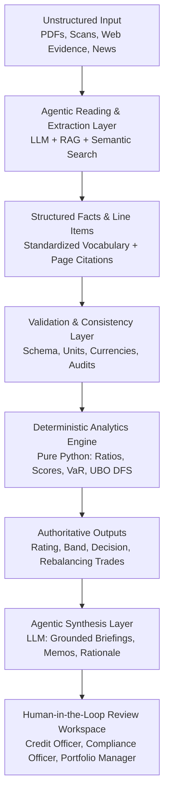
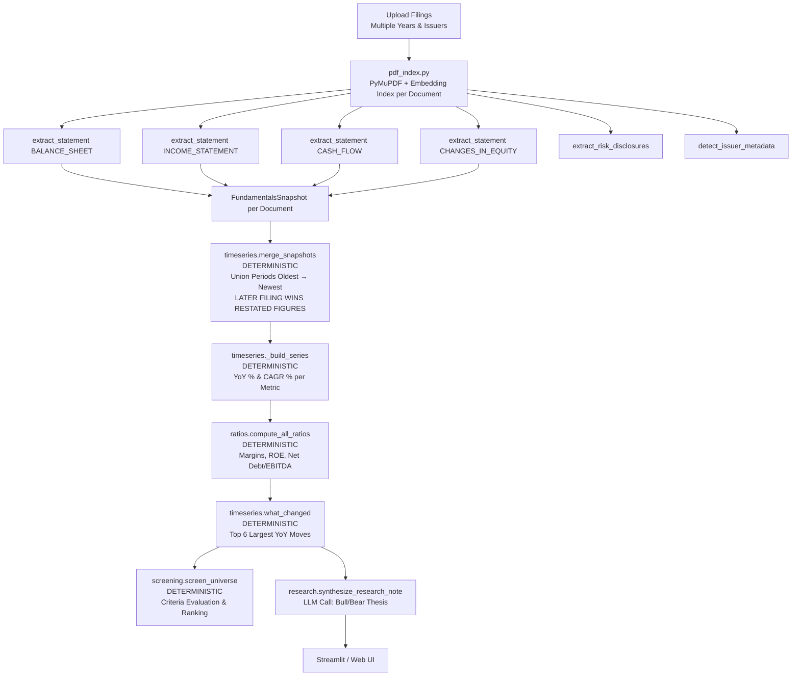
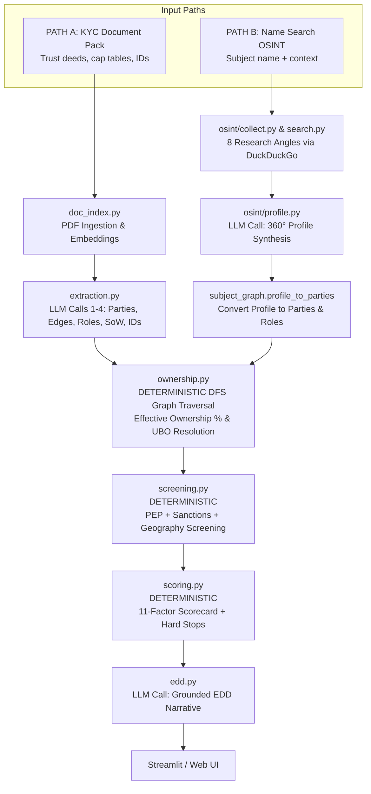
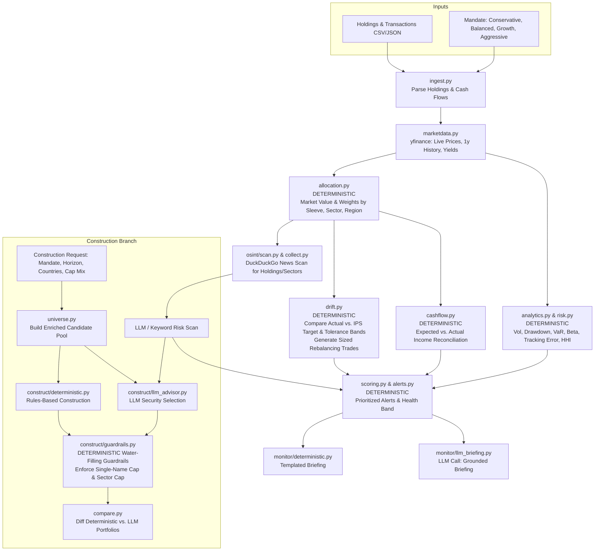
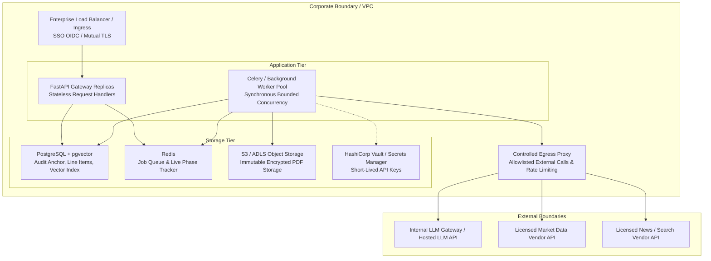

# AI for Banking and Financial Services: Production Systems, Architectures, and Case Studies

---

## Table of Contents
1. [Preface: Who This Book Is For](#preface-who-this-book-is-for)
2. [Chapter 1: The AI Paradigm Shift in Banking & Capital Markets](#chapter-1-the-ai-paradigm-shift-in-banking--capital-markets)
3. [Chapter 2: Core Architectural Directives & Guiding Principles](#chapter-2-core-architectural-directives--guiding-principles)
4. [Chapter 3: Corporate Credit Risk Assessment Agent](#chapter-3-corporate-credit-risk-assessment-agent)
5. [Chapter 4: Financial Document Intelligence Agent](#chapter-4-financial-document-intelligence-agent)
6. [Chapter 5: Onboarding Risk Scoring & Fraud Detection Agent](#chapter-5-onboarding-risk-scoring--fraud-detection-agent)
7. [Chapter 6: Investment Research Copilot](#chapter-6-investment-research-copilot)
8. [Chapter 7: Deploying, Monitoring, and Operating Agentic AI in Production](#chapter-7-deploying-monitoring-and-operating-agentic-ai-in-production)
9. [Appendix: Repository Links & Code Index](#appendix-repository-links--code-index)

---

## Preface: Who This Book Is For

The integration of Artificial Intelligence—specifically Large Language Models (LLMs), Retrieval-Augmented Generation (RAG), and Agentic Workflows—into Banking, Financial Services, and Insurance (BFSI) has transitioned from experimental innovation labs to core infrastructure. However, financial engineering and enterprise software development in banking operate under strict constraints that do not exist in consumer technology:
1. **Zero Tolerance for Unbacked Claims / Hallucinations**: A model cannot "guess" a borrower's EBITDA, invent a covenant breach, or miscalculate a Value-at-Risk (VaR) figure.
2. **Deterministic Governance & Reproducibility**: Financial regulators (SEC, FCA, PRA, BaFin, MAS) and credit committees require that identical inputs, rule sets, and model versions yield identical numerical and rating outcomes.
3. **Auditability & Traceability**: Every rating, alert, UBO (Ultimate Beneficial Owner) determination, or portfolio rebalance recommendation must trace directly back to primary evidence (e.g., specific PDF pages, raw line items, or licensed market feeds).

### Who Should Read This Book?
- **Financial Technology Consultants & Solutions Architects**: Looking for proven, production-grade architectural patterns to implement AI solutions for enterprise financial clients.
- **Enterprise Software Engineers & AI Engineers**: Transitioning from general AI development into high-stakes financial domains such as credit underwriting, equity research, KYC/AML compliance, and wealth management.
- **Financial Analysts, Credit Officers, & Portfolio Managers**: Wanting to understand how AI copilots operate under the hood, how deterministic validation guarantees accuracy, and how human-in-the-loop controls function.
- **Students & Graduates**: Aspiring to join quantitative finance, financial software engineering, or fintech consultancy with real-world case study experience.

### How to Use This Book
This book is structured as a technical handbook and interview-style case study collection. Each case study chapter covers a real-world enterprise agent, detailing:
- **Business Narrative & Requirement**: The underlying financial domain problem and organizational ROI.
- **Data & Compliance Requirements**: Inputs, reference data, regulatory bounds, and security constraints.
- **Agentic Solution & Architecture**: System context, component diagrams, sequence flows, and LLD/HLD breakdowns.
- **Deterministic vs. Agentic Split**: The architectural division of responsibility between LLMs (reading, transcribing, explaining) and deterministic Python (calculating, scoring, enforcing hard stops).
- **Code Repository Links**: Direct pointers to source code files within this repository for immediate inspection and execution.

---

## Chapter 1: The AI Paradigm Shift in Banking & Capital Markets

Historically, financial automation relied on two disjointed technologies:
1. **Legacy Deterministic Software**: Rule engines, database queries, and spreadsheet macros. Highly reliable for math, but completely blind to unstructured text (PDF filings, trust deeds, news articles, commentary).
2. **Early NLP & OCR Models**: Named Entity Recognition (NER) models and template-based OCR that frequently broke when document layouts changed or terminology shifted across jurisdictions (e.g., "Net Sales" vs. "Turnover" vs. "Revenue from Operations").

The emergence of Large Language Models (LLMs) solved the **unstructured reading problem**. However, early attempts to deploy raw LLMs directly to decision-making failed catastrophically due to hallucinations, arithmetic errors, and non-deterministic logic.

### The Hybrid Agentic Pattern
The state-of-the-art pattern in financial AI engineering—and the core theme of this book—is the **Hybrid Deterministic-Agentic Architecture**:



In this paradigm:
- **LLMs perform perceptual & narrative tasks**: Semantic retrieval, parsing unstructured layout, mapping terms to canonical vocabularies, synthesizing multi-source findings, and drafting explanatory memos.
- **Deterministic Code performs math & governance tasks**: Unit scaling, ratio calculations, multi-period trend analysis, scorecard factor weighting, UBO graph traversal, risk limit checks, and rebalancing trade sizing.

---

## Chapter 2: Core Architectural Directives & Guiding Principles

Across all four enterprise agents detailed in this book, a set of non-negotiable architectural directives governs the code structure:

### 1. The Strict Isolation Directive
The LLM is strictly prohibited from performing arithmetic or altering scorecard parameters.
- *Wrong*: "Prompting an LLM: 'Calculate Debt/EBITDA and decide if this loan should be approved.'"
- *Right*: "The LLM extracts line items with page citations -> Python normalizes units and computes `Net Debt / EBITDA` -> Python applies the scorecard weights -> The LLM writes a credit memo explaining why Python assigned a BB rating."

### 2. Complete Reproducibility
Given a fixed snapshot of input files, reference data, and model parameters, the numerical rating, risk score, and decision MUST be 100% reproducible. If two credit committee reviews of the exact same filing pack produce different credit grades, trust in the system vanishes.

### 3. Source-Page Attribution & Grounding
Every extracted number, covenant mention, or risk flag must carry an immutable provenance tag containing:
- Document filename and SHA-256 hash.
- Global 1-based page number.
- Verbatim source text snippet.

### 4. Human-in-the-Loop Override & Versioning
AI outputs are always drafts until signed off by an authorized human reviewer (e.g., Credit Officer, MLRO, or Portfolio Manager). When a human modifies an extracted line item or overrides a decision:
- The original extracted value is never overwritten; it is preserved in an audit trail.
- A new assessment version is minted with a `parent_version_id` link.
- All downstream ratios, scores, and memos are recomputed deterministically from the human-corrected value.

---

## Chapter 3: Corporate Credit Risk Assessment Agent

### 3.1 Business Context & Value Proposition
When a corporation applies for a $10M–$100M loan facility, a bank credit team spends 3–5 days reviewing 3–5 years of annual reports (50–300 pages each), calculating 20+ financial ratios, benchmarking against industry peers, scanning news for adverse media, checking auditor opinions, and authoring a formal **Credit Memo**.

The **Credit Risk Assessment Agent** automates the entire ingestion, ratio calculation, peer benchmarking, OSINT news scan, scorecard rating, and memo writing process—reducing turnaround time from days to under 5 minutes while maintaining complete regulatory auditability.

* **Git Repository Path**: [`/Credit_Risk_Assesment_Agent/`](./Credit_Risk_Assesment_Agent/)
* **Key Entry Points**:
  * Orchestration: [`credit_risk/agent_graph.py`](./Credit_Risk_Assesment_Agent/credit_risk/agent_graph.py)
  * Deterministic Ratio Engine: [`credit_risk/ratios.py`](./Credit_Risk_Assesment_Agent/credit_risk/ratios.py)
  * Scorecard & Hard Stops: [`credit_risk/scoring.py`](./Credit_Risk_Assesment_Agent/credit_risk/scoring.py)
  * API Layer: [`credit_risk/api/routes.py`](./Credit_Risk_Assesment_Agent/credit_risk/api/routes.py)

---

### 3.2 High-Level Architecture & End-to-End Flow


---

### 3.3 Module-by-Module Deep Dive

#### 1. Page Indexing & Grounded Retrieval (`doc_index.py`, `tools.py`, `tool_loop.py`)
Rather than dumping 300 pages into an LLM context window, `doc_index.PageIndex` parses PDF pages using PyMuPDF and computes page embeddings. Tool-calling agents (`tools.py`) invoke `search_pages` and `get_page` dynamically inside a bounded loop (`tool_loop.py`) to fetch only the exact balance sheet, income statement, or note pages needed.

#### 2. Standardized Extraction (`extraction.py`)
Four parallel/sequential LLM calls transcribe raw values and map company-specific terminology into `StandardLabel` vocabulary:
- Revenue / Turnover / Net Sales → `StandardLabel.REVENUE`
- Bank Debt / Borrowings → `StandardLabel.SHORT_TERM_DEBT` / `LONG_TERM_DEBT`
- Net Profit / PAT → `StandardLabel.NET_INCOME`

Every line item record stores:
```python
LineItem(
    label="Turnover",
    standardised_label=StandardLabel.REVENUE,
    value=1240.0,
    unit="millions",
    currency="USD",
    period="FY2023",
    statement_type=StatementType.INCOME_STATEMENT,
    page=47,
    source_snippet="Turnover 1,240 1,100"
)
```

#### 3. Deterministic Ratio Computation (`ratios.py`)
All values are first converted to absolute units (e.g., `$1,240 \times 1,000,000 = 1,240,000,000`). The engine then computes 18+ financial ratios per period across 6 categories:
- **Leverage**: Debt/Equity, Debt/Assets, Net Debt/EBITDA.
- **Liquidity**: Current Ratio, Quick Ratio, Cash Ratio.
- **Profitability**: EBITDA Margin, EBIT Margin, Net Margin, ROE, ROA, ROCE.
- **Coverage**: Interest Coverage (`EBITDA / Interest Expense`), DSCR (`(EBITDA - Capex) / (Interest + Principal)`).
- **Cash Flow Quality**: Cash Conversion (`OCF / Net Income`), FCF Margin.
- **Efficiency**: Asset Turnover, Inventory Days, DSO.

#### 4. Sector Benchmarking & Trend Analysis (`benchmarks.py`, `reference.py`)
Ratios are benchmarked against sector quartiles stored in `reference.py`. Multi-period trends compute trajectory (Improving, Stable, Deteriorating, Volatile) and percentage change.

#### 5. 13-Factor Deterministic Scorecard (`scoring.py`)
The scorecard assigns weights up to 100 points:
```
LEVERAGE:               22 pts max
DEBT_SERVICE_COVERAGE:  22 pts max
LIQUIDITY:              16 pts max
PROFITABILITY:          16 pts max
CASH_FLOW_QUALITY:      14 pts max
DETERIORATING_TREND:    16 pts max
SECTOR_UNDERPERFORMANCE:10 pts max
SIZE_SCALE:              8 pts max
JURISDICTION:            6 pts max
AUDIT_QUALITY:          20 pts max  (Adverse opinion = HARD STOP)
OFF_BALANCE_SHEET:      10 pts max
ADVERSE_MEDIA:          14 pts max  (Web news, credited with discount)
MARKET_SENTIMENT:        8 pts max
```

**Hard Stop Rules**:
1. **Adverse or Disclaimer Audit Opinion**: Immediately forces rating to **D / Decline**.
2. **Going-Concern Warning**: Auditor expresses doubt on survival → **D / Decline**.

**Rating Scale & Calibrated Pricing**:
- **0–20**: AAA/AA (Strong Investment Grade) → SOFR + 80–130 bps
- **21–35**: A/BBB (Investment Grade) → SOFR + 130–220 bps
- **36–50**: BB (Sub-Investment Grade) → SOFR + 250–400 bps → Approve with Conditions
- **51–65**: B/CCC (Speculative) → SOFR + 450–700 bps → Refer to Credit Committee
- **66–80**: CC/C (Distressed) → Decline / Bespoke
- **81+**: D (Default) → Decline

#### 6. Grounded Narrative Synthesis (`narrative.py`)
LLM Call 6 receives the compact JSON scorecard (score, rating, PD, LGD, ratio breakdown, benchmark gaps). It drafts the formal **Credit Memo** (Executive Summary, Financial Analysis, Strengths, Risks, Mitigants, Recommended Covenants). It is explicitly prohibited from changing any number or rating.

---

### 3.4 Interview Case Study Highlights (Q&A Excerpt)

**Interviewer**: How do you prevent an LLM from hallucinating a company's revenue or EBITDA?
**Candidate**: The LLM is never allowed to perform math or output final ratios. Its sole job in extraction is to transcribe printed labels and numbers alongside global page numbers. Those line items are validated by Pydantic schemas. The ratio engine (`ratios.py`) is 100% deterministic Python code that parses those structured items, converts units, and executes standard financial formulas. If an input item is missing, the engine records `RatioValue.missing_inputs` and marks the ratio as `None` rather than guessing.

**Interviewer**: What happens if web search returns news for a company with a similar name?
**Candidate**: In `osint/sentiment.py`, the LLM evaluates `disambiguation_confidence` (`low`, `medium`, `high`). Furthermore, in `scoring.py`, web findings are subjected to a credibility discount: web news severity is capped at `medium` unless corroborated by multiple independent high-severity findings. If `disambiguation_confidence` is low, the `ADVERSE_MEDIA` score contribution is capped at a minor level so unverified internet rumors cannot override clean audited accounts.

---

## Chapter 4: Financial Document Intelligence Agent

### 4.1 Business Context & Value Proposition
Equity research analysts, credit research desks, and quant funds monitor dozens of issuers publishing 100–250 page annual reports each year. The **Financial Document Intelligence Agent** automates multi-document processing across multiple years and issuers. It performs grounded line-item extraction, handles restated comparative numbers, computes YoY and CAGR metrics, evaluates quantitative screening criteria across an entire universe of companies, and generates grounded research notes.

* **Git Repository Path**: [`/FinDoc_IIntelligence_Agent/`](./FinDoc_IIntelligence_Agent/)
* **Key Entry Points**:
  * Orchestration: [`fin_doc_intel/agent_graph.py`](./FinDoc_IIntelligence_Agent/fin_doc_intel/agent_graph.py)
  * Extraction: [`fin_doc_intel/extraction.py`](./FinDoc_IIntelligence_Agent/fin_doc_intel/extraction.py)
  * Time-Series & Restatement Merge: [`fin_doc_intel/timeseries.py`](./FinDoc_IIntelligence_Agent/fin_doc_intel/timeseries.py)
  * Screening Engine: [`fin_doc_intel/screening.py`](./FinDoc_IIntelligence_Agent/fin_doc_intel/screening.py)
  * Research Synthesis: [`fin_doc_intel/research.py`](./FinDoc_IIntelligence_Agent/fin_doc_intel/research.py)

---

### 4.2 High-Level Architecture & End-to-End Flow



---

### 4.3 Key Technical Innovations

#### 1. Multi-Document Merge & Restatement Resolution (`timeseries.py`)
Companies frequently restate prior-year figures in subsequent filings (e.g., FY2022 figures presented as comparatives in the FY2023 report may be adjusted for accounting changes or discontinued operations).
- `merge_snapshots()` sorts filings chronologically by period.
- When an overlapping period is encountered (e.g., FY2022 in both the 2022 and 2023 reports), **the later filing's value overrides the earlier filing**.
- Provenance is maintained so the user can see which document supplied each specific cell.

```python
# Deterministic restatement resolution logic in timeseries.py
for doc_name, snap in docs_sorted:
    for period, line_map in snap.by_period.items():
        for key, val in line_map.items():
            # Later document overwrites earlier document's value for the same period
            merged_by_period[period][key] = val
            provenance[period][key] = snap.source_pages.get(key, 0)
            period_source_doc[period] = doc_name
```

#### 2. Automated CAGR & Surveillance Signals (`timeseries.py`, `ratios.py`)
- **CAGR Calculation**:
$$\text{CAGR} = \left(\frac{\text{Value}_{\text{last}}}{\text{Value}_{\text{first}}}\right)^{\frac{1}{N}} - 1$$
- **`what_changed()` Surveillance Signal**: A deterministic algorithm scans all metrics and ratios between the two most recent periods and returns the top 6 largest YoY percentage or absolute moves (e.g., `net_income: +34.2% YoY`, `capex: +28.0% YoY`). This signal is injected directly into the research note prompt as unalterable fact.

#### 3. Quantitative Universe Screening Engine (`screening.py`)
Portfolio managers define multi-metric filter rules:
```python
criteria = [
    ScreeningCriterion(metric="Net Debt / EBITDA", op="<", threshold=2.0, weight=2.0),
    ScreeningCriterion(metric="ROE %", op=">", threshold=15.0, weight=1.5),
    ScreeningCriterion(metric="revenue", op=">", threshold=0.0, weight=1.0)
]
```
The screening engine evaluates each issuer in the universe deterministically and ranks them by:
1. `all_passed` (Boolean flag: did the issuer meet 100% of criteria?)
2. `weighted_score` (Sum of weights for passed criteria)
3. `pass_count`

---

## Chapter 5: Onboarding Risk Scoring & Fraud Detection Agent

### 5.1 Business Context & Value Proposition
When a High Net-Worth Individual (HNI), Ultra High Net-Worth Individual (UHNI), or complex corporate structure applies to open private banking accounts, anti-money laundering (AML) regulations (FATF, FinCEN, FCA) require strict **Know Your Customer (KYC)** and **Enhanced Due Diligence (EDD)**.
Concealed ownership structures involving nominee directors, shell companies, offshore trusts, and circular shareholding are primary indicators of money laundering and financial crime.

The **Onboarding Risk Scoring & Fraud Detection Agent** handles two onboarding paths:
1. **Document-Based Path**: Ingests KYC packs, trust deeds, identity documents, and cap tables.
2. **Name-Search OSINT Path**: Conducts an automated 360° open-source intelligence lookup across 8 research angles.

It executes depth-first search (DFS) graph traversal to determine Ultimate Beneficial Owners (UBOs), screens parties against PEP/Sanctions/Adverse Media lists, scores risk on an 11-factor scorecard, and drafts an EDD rationale.

* **Git Repository Path**: [`/Fraud_Detection_Agent/`](./Fraud_Detection_Agent/)
* **Key Entry Points**:
  * Document Orchestration: [`agent_graph.py`](./Fraud_Detection_Agent/agent_graph.py)
  * OSINT Subject Orchestration: [`subject_graph.py`](./Fraud_Detection_Agent/subject_graph.py)
  * UBO Graph Engine: [`ownership.py`](./Fraud_Detection_Agent/ownership.py)
  * Watchlist & Geography Screening: [`screening.py`](./Fraud_Detection_Agent/screening.py)
  * Deterministic Scorecard: [`scoring.py`](./Fraud_Detection_Agent/scoring.py)
  * Grounded EDD Rationale: [`edd.py`](./Fraud_Detection_Agent/edd.py)

---

### 5.2 High-Level Architecture



---

### 5.3 Deep Dive into Graph & Risk Algorithms

#### 1. UBO Resolution Graph Traversal (`ownership.py`)
Ownership structures form a directed acyclic (or sometimes circular) graph $G = (V, E)$ where vertices $V$ represent parties (individuals, holding companies, trusts) and edges $E$ represent ownership percentages.

```
Individual (P1) -- 100% --> Holding Co (P2) -- 100% --> Trust (P3) -- 100% --> Applicant Account
```

**Effective Ownership Computation**:
For any natural person $P$, effective ownership in the applicant entity $A$ is the sum over all simple paths $path(P \to A)$ of the product of edge weights along each path:
$$\text{Effective Ownership}(P \to A) = \sum_{p \in \text{paths}(P \to A)} \left( \prod_{e \in p} \text{percentage}(e) \right)$$

**Three Criteria for UBO Status**:
1. **Ownership Basis**: Effective ownership $\ge 25\%$ (configurable via `UBO_THRESHOLD_PCT`).
2. **Control Basis**: Natural person holding control roles (`settlor`, `trustee`, `protector`, `director`, `signatory`) regardless of ownership percentage.
3. **Senior Managing Official Fallback**: If no individual meets ownership or control criteria, the senior managing director is recorded as UBO on a control basis (FATF compliant).

**Structure Opacity Metrics**:
- `max_layering_depth`: Maximum depth of legal entities stacked between an individual and the applicant. Layering depth $\ge 3$ flags complex structure risk.
- `has_nominee`: Flagged if nominee shareholders or directors are present.
- `has_bearer_shares`: Flagged if bearer shares are detected (high opacity).
- `has_circular_ownership`: Graph cycle detection ($A \to B \to A$). Circular ownership makes UBO resolution impossible and triggers a high-risk flag.

#### 2. Name Screening & Geography Risk (`screening.py`)
- **Fuzzy Token Matching**: Matches extracted party names against PEP, OFAC Sanctions, and Adverse Media lists using normalized token similarity.
- **Sanctions Match = HARD STOP**: Any confirmed sanctions match immediately forces `band = PROHIBITED` and `decision = DECLINE`.
- **Jurisdiction Risk**: Classifies jurisdictions into Prohibited (North Korea, Iran, Syria, Russia), High-Risk (FATF Grey List), or Offshore Secrecy (BVI, Cayman, Liechtenstein).

#### 3. 11-Factor Risk Scorecard (`scoring.py`)
```
SANCTIONS:                100 pts  (HARD STOP -> PROHIBITED)
PEP:                       30 pts
ADVERSE_MEDIA:             28 pts
OPAQUE_SOURCE_OF_WEALTH:   26 pts
NOMINEE_ARRANGEMENT:       24 pts
BEARER_SHARES:             24 pts
HIGH_RISK_GEOGRAPHY:       20 pts
COMPLEX_STRUCTURE:         16 pts
LAYERING:                  16 pts
ID_VERIFICATION_GAP:       14 pts
OFFSHORE_JURISDICTION:     10 pts
```

**Score Ranges & Decisions**:
- **0–24 (LOW)**: `APPROVE_STANDARD_CDD`
- **25–49 (MEDIUM)**: `APPROVE_WITH_EDD`
- **50+ (HIGH)**: `ESCALATE_MLRO`
- **Sanctions / Prohibited Geo**: `DECLINE` (`PROHIBITED`)

---

## Chapter 6: Investment Research Copilot

### 6.1 Business Context & Value Proposition
Portfolio managers and wealth advisors oversee discretionary and advisory client books consisting of dozens or hundreds of individual portfolios. They face two continuous operational demands:
1. **Ongoing Monitoring & Risk Surveillance**: Identifying allocation drift against Investment Policy Statements (IPS), tracking single-name and sector concentration, detecting cash-flow income shortfalls (missing dividends), checking risk limits (Volatility, VaR, Max Drawdown, Beta, HHI), and scanning for emerging news risks.
2. **From-Scratch Portfolio Construction**: Building custom portfolios aligned with client mandates, horizons, geography preferences, and cap-mix constraints—with hard guardrails ensuring no single stock or sector exceeds policy limits.

The **Investment Research Copilot** executes both workflows, combining pure NumPy statistical calculations, deterministic rebalancing trade generators, and LLM-assisted market intelligence.

* **Git Repository Path**: [`/Investment_Research_Copilot/`](./Investment_Research_Copilot/)
* **Key Entry Points**:
  * Orchestration: [`portfolio_monitor/agent_graph.py`](./Investment_Research_Copilot/portfolio_monitor/agent_graph.py)
  * Quantitative Math: [`portfolio_monitor/analytics.py`](./Investment_Research_Copilot/portfolio_monitor/analytics.py)
  * Allocation & Drift: [`portfolio_monitor/allocation.py`](./Investment_Research_Copilot/portfolio_monitor/allocation.py), [`drift.py`](./Investment_Research_Copilot/portfolio_monitor/drift.py)
  * Risk Limits & Scorecard: [`portfolio_monitor/risk.py`](./Investment_Research_Copilot/portfolio_monitor/risk.py), [`scoring.py`](./Investment_Research_Copilot/portfolio_monitor/scoring.py)
  * Construction & Guardrails: [`portfolio_monitor/construct/`](./Investment_Research_Copilot/portfolio_monitor/construct/)
  * Country Research Graph (LangGraph): [`portfolio_monitor/research/graph.py`](./Investment_Research_Copilot/portfolio_monitor/research/graph.py)

---

### 6.2 High-Level Architecture & End-to-End Flow



---

### 6.3 Quantitative Risk Math & Guardrail Algorithms

#### 1. Statistical Risk Analytics (`analytics.py`)
All statistical metrics are computed using NumPy over 252-day daily price return series $r_t = \frac{P_t - P_{t-1}}{P_{t-1}}$:
- **Annualized Volatility**:
$$\sigma_{\text{annual}} = \text{std}(r) \times \sqrt{252}$$
- **Maximum Drawdown**:
$$\text{Max Drawdown} = \min_t \left( \frac{P_t}{\max_{\tau \le t} P_\tau} - 1 \right)$$
- **Value at Risk (VaR 95%, 1-day Historical)**: 5th percentile of daily return distribution.
- **Herfindahl-Hirschman Index (HHI) & Effective $N$**:
$$\text{HHI} = \sum_{i=1}^n w_i^2, \quad \text{Effective } N = \frac{1}{\text{HHI}}$$
High HHI indicates high concentration risk.

#### 2. IPS Drift & Rebalancing Engine (`drift.py`)
For an asset class sleeve with target weight $w_{\text{target}}$ and tolerance band $b$ (e.g., $60\% \pm 5\%$):
- Status is `BREACH_OVER` if $w_{\text{actual}} > w_{\text{target}} + b$.
- Status is `BREACH_UNDER` if $w_{\text{actual}} < w_{\text{target}} - b$.
- For breached sleeves, the required trade size is:
$$\text{Trade Value} = (w_{\text{target}} - w_{\text{actual}}) \times \text{Total Portfolio Value}$$

#### 3. Hard Guardrail Enforcement via Water-Filling (`construct/guardrails.py`)
When either the deterministic constructor or the LLM advisor proposes position weights $w$, `guardrails.enforce()` guarantees strict compliance with constraints:
1. **Exclusions**: Any security or sector on the exclusion list is removed ($w_i = 0$).
2. **Minimum Position Size**: Positions where $w_i < \text{min\_position}$ (e.g., 1%) are dropped.
3. **Single-Name Cap via Water-Filling**: If any stock exceeds `single_name_cap` (e.g., 10%), its weight is clamped to 10%. The excess weight $\Delta = w_i - 0.10$ is iteratively redistributed proportionally among unconstrained positions whose weights remain below 10%. If all names reach the cap, the remaining excess becomes cash.
4. **Sector Cap**: Sectors exceeding `sector_cap` (e.g., 30%) are scaled down proportionally.
5. All guardrail adjustments are logged in `guardrail_corrections` for auditing.

---

## Chapter 7: Deploying, Monitoring, and Operating Agentic AI in Production

Transitioning financial AI agents from local development (Streamlit / CLI) to enterprise production requires robust infrastructure, security controls, and observability.

### 7.1 Production Deployment Topology
In production, financial agents operate inside isolated VPCs or on-premise Kubernetes clusters with strict egress controls:



### 7.2 Containerization & Orchestration (`Dockerfile`, `k8s/`)
Each project in this codebase contains production-ready Dockerfiles and Kubernetes manifests (`k8s/`):
- **Multi-Stage Docker Build**: Utilizes minimal Python 3.12 slim images, running as non-root users (`uid 10001`).
- **Resource Limits**: Configured CPU and memory requests/limits (e.g., `500m` CPU, `1Gi` RAM request; `2` CPU, `4Gi` RAM limit).
- **Probes**: Native `/health` liveness and readiness HTTP endpoints.
- **Horizontal Pod Autoscaling**: Scaled based on CPU utilization and queue depth.

### 7.3 Enterprise Security & Compliance Checklist
1. **No Sensitive PII Egress**: PII and confidential financial figures must be masked or passed through internal gateway proxies.
2. **Secrets Management**: Replace `.env` files with short-lived secrets fetched from enterprise vaults (AWS Secrets Manager, Azure Key Vault, HashiCorp Vault).
3. **Data Encryption**: Server-side encryption at rest (AES-256) for PDF object storage and TLS 1.3 in transit.
4. **Immutable Audit Logging**: Every LLM request/response, prompt version, model name, and user review action must be written to an append-only database table (`reviews`, `assessment_versions`).

### 7.4 Production Observability Metrics
To maintain operational visibility, monitor four key metric categories:

| Boundary | Key Metric | Alert Threshold / Target |
| --- | --- | --- |
| **Ingestion** | Scanned / Image-only PDF Rate | Alert if > 10% (requires OCR worker) |
| **LLM Gateway** | Token Usage & Cost per Case | Track cost drift; alert if > $2.00 / assessment |
| **LLM Gateway** | JSON Parsing & Schema Failure Rate | Target < 1%; alert if > 3% |
| **Deterministic Engine** | Line Item Data Coverage / Ratio Gap % | Alert if required ratio inputs < 80% |
| **Scoring Engine** | Scorecard Hard-Stop Activation Rate | Monitor trend spikes in `PROHIBITED` / `D` ratings |
| **Human Review** | Analyst Override & Correction Rate | High correction rate indicates model/prompt regression |

---

## Appendix: Repository Links & Code Index

This repository contains full working codebases, test suites, Kubernetes manifests, and sample data for all four agents.

### Complete Directory Index

```
.
├── Credit_Risk_Assesment_Agent/
│   ├── credit_risk/             # Core package (doc_index, extraction, ratios, scoring, narrative)
│   ├── app_streamlit/           # Streamlit UI interface
│   ├── web/                     # Production Vanilla-JS frontend
│   ├── tests/                   # Pytest suite
│   ├── k8s/                     # Kubernetes manifests
│   ├── CASE_STUDY.md            # Interview-style case study
│   ├── DOCUMENTATION.md         # Plain-English technical documentation
│   ├── REQUIREMENTS.md          # Business & technical requirements
│   └── pyproject.toml           # Project dependencies & configuration
│
├── FinDoc_IIntelligence_Agent/
│   ├── fin_doc_intel/           # Core package (pdf_index, extraction, timeseries, ratios, screening, research)
│   ├── web/                     # Production Web UI
│   ├── tests/                   # Pytest suite
│   ├── k8s/                     # Kubernetes manifests
│   ├── CASE_STUDY.md            # Interview-style case study
│   ├── DOCUMENTATION.md         # Technical documentation
│   └── REQUIREMENTS.md          # Requirements specification
│
├── Fraud_Detection_Agent/
│   ├── onboarding_risk/         # Core package (doc_index, extraction, ownership, screening, scoring, edd, osint)
│   ├── app_streamlit/           # Streamlit UI (documents & subject search)
│   ├── web/                     # Production Web UI
│   ├── tests/                   # Pytest suite
│   ├── k8s/                     # Kubernetes manifests
│   ├── CASE_STUDY.md            # Interview-style case study
│   └── DOCUMENTATION.md         # Technical documentation
│
└── Investment_Research_Copilot/
    ├── portfolio_monitor/       # Core package (ingest, marketdata, allocation, drift, risk, scoring, construct)
    ├── app_streamlit/           # Streamlit UI
    ├── web/                     # Production Web UI
    ├── tests/                   # Pytest suite
    ├── k8s/                     # Kubernetes manifests
    ├── CASE_STUDY.md            # Interview-style case study
    └── DOCUMENTATION.md         # Technical documentation
```

### Module Direct Links

#### 1. Corporate Credit Risk Assessment Agent
- [Directory Root](./Credit_Risk_Assesment_Agent/)
- [Requirements Spec](./Credit_Risk_Assesment_Agent/REQUIREMENTS.md)
- [Complete Documentation](./Credit_Risk_Assesment_Agent/DOCUMENTATION.md)
- [Interview Case Study](./Credit_Risk_Assesment_Agent/CASE_STUDY.md)
- [Pipeline Entry Point (`agent_graph.py`)](./Credit_Risk_Assesment_Agent/credit_risk/agent_graph.py)
- [Deterministic Ratio Engine (`ratios.py`)](./Credit_Risk_Assesment_Agent/credit_risk/ratios.py)
- [Scorecard & Hard Stops (`scoring.py`)](./Credit_Risk_Assesment_Agent/credit_risk/scoring.py)
- [API Service (`api/routes.py`)](./Credit_Risk_Assesment_Agent/credit_risk/api/routes.py)

#### 2. Financial Document Intelligence Agent
- [Directory Root](./FinDoc_IIntelligence_Agent/)
- [Requirements Spec](./FinDoc_IIntelligence_Agent/REQUIREMENTS.md)
- [Complete Documentation](./FinDoc_IIntelligence_Agent/DOCUMENTATION.md)
- [Interview Case Study](./FinDoc_IIntelligence_Agent/CASE_STUDY.md)
- [Pipeline Entry Point (`agent_graph.py`)](./FinDoc_IIntelligence_Agent/fin_doc_intel/agent_graph.py)
- [Restatement & Time-Series Merge (`timeseries.py`)](./FinDoc_IIntelligence_Agent/fin_doc_intel/timeseries.py)
- [Universe Screening Engine (`screening.py`)](./FinDoc_IIntelligence_Agent/fin_doc_intel/screening.py)
- [Grounded Research Note (`research.py`)](./FinDoc_IIntelligence_Agent/fin_doc_intel/research.py)

#### 3. Onboarding Risk Scoring & Fraud Detection Agent
- [Directory Root](./Fraud_Detection_Agent/)
- [Requirements Spec](./Fraud_Detection_Agent/REQUIREMENTS.md)
- [Complete Documentation](./Fraud_Detection_Agent/DOCUMENTATION.md)
- [Interview Case Study](./Fraud_Detection_Agent/CASE_STUDY.md)
- [Document Pipeline (`agent_graph.py`)](./Fraud_Detection_Agent/agent_graph.py)
- [OSINT Pipeline (`subject_graph.py`)](./Fraud_Detection_Agent/subject_graph.py)
- [UBO Graph Traversal Engine (`ownership.py`)](./Fraud_Detection_Agent/ownership.py)
- [Watchlist & Geography Screening (`screening.py`)](./Fraud_Detection_Agent/screening.py)
- [11-Factor Scorecard (`scoring.py`)](./Fraud_Detection_Agent/scoring.py)

#### 4. Investment Research Copilot
- [Directory Root](./Investment_Research_Copilot/)
- [Requirements Spec](./Investment_Research_Copilot/REQUIREMENTS.md)
- [Complete Documentation](./Investment_Research_Copilot/DOCUMENTATION.md)
- [Interview Case Study](./Investment_Research_Copilot/CASE_STUDY.md)
- [Pipeline Entry Point (`agent_graph.py`)](./Investment_Research_Copilot/portfolio_monitor/agent_graph.py)
- [Statistical Risk Math (`analytics.py`)](./Investment_Research_Copilot/portfolio_monitor/analytics.py)
- [Drift & Rebalancing Engine (`drift.py`)](./Investment_Research_Copilot/portfolio_monitor/drift.py)
- [Guardrails Engine (`construct/guardrails.py`)](./Investment_Research_Copilot/portfolio_monitor/construct/guardrails.py)
- [LangGraph Country Research (`research/graph.py`)](./Investment_Research_Copilot/portfolio_monitor/research/graph.py)
