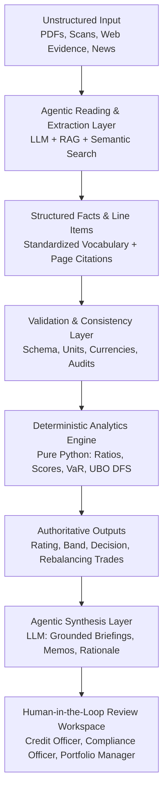
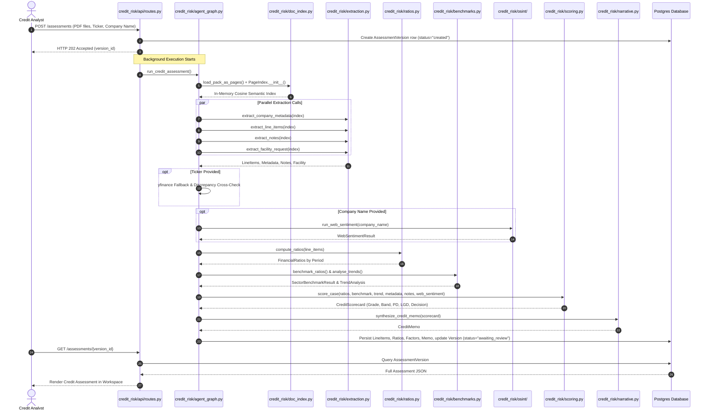
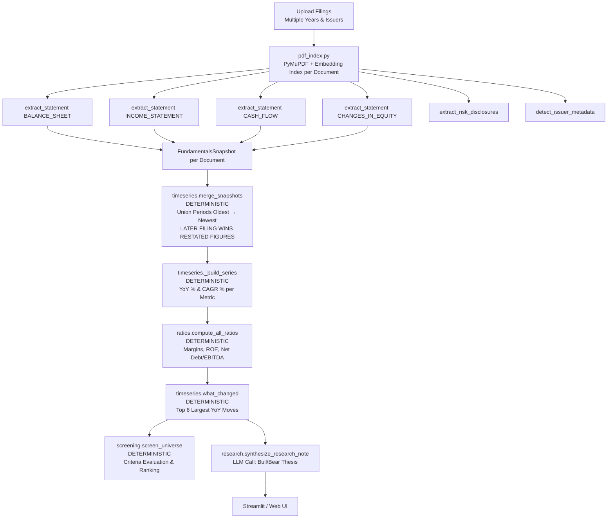
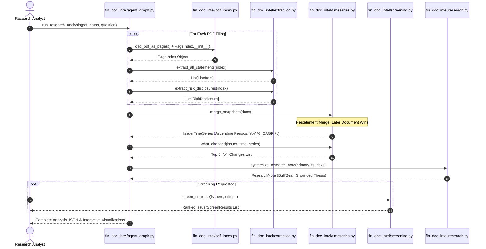
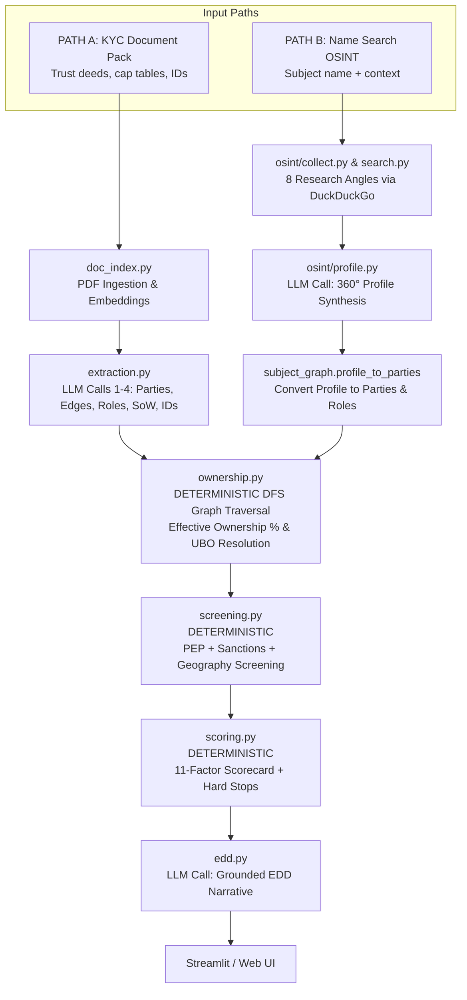
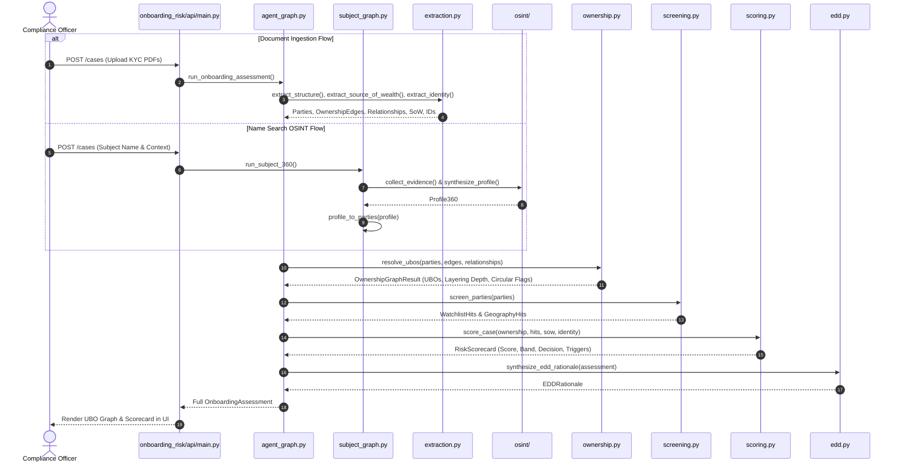
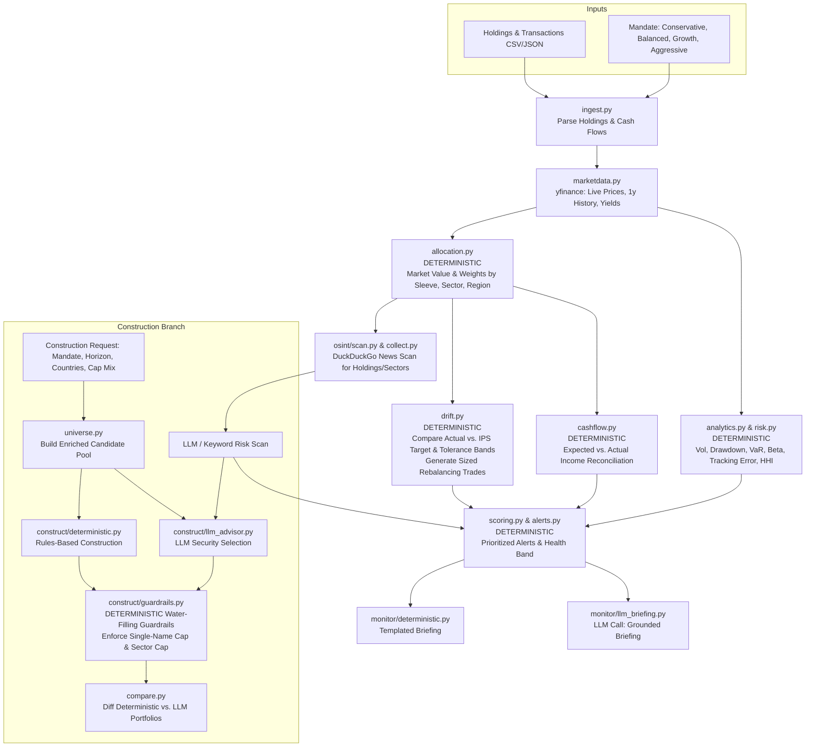
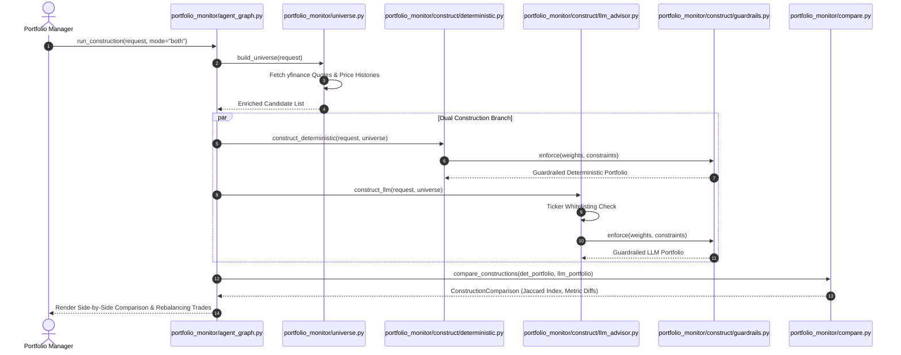
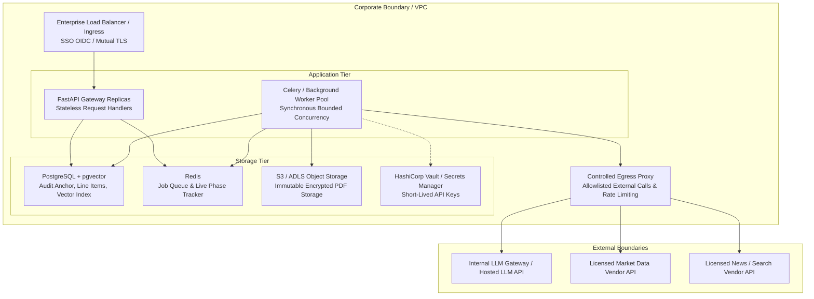

# AI for Banking and Financial Services: Engineering Production Agentic Systems, Architectures, and Technical Case Studies

---

## Table of Contents
1. [Preface: Who This Book Is For](#preface-who-this-book-is-for)
2. [Chapter 1: The AI Paradigm Shift in Banking & Capital Markets](#chapter-1-the-ai-paradigm-shift-in-banking--capital-markets)
3. [Chapter 2: Core Architectural Directives & Engineering Principles](#chapter-2-core-architectural-directives--engineering-principles)
4. [Chapter 3: Corporate Credit Risk Assessment Agent](#chapter-3-corporate-credit-risk-assessment-agent)
   - [3.1 Business Context & Value Proposition](#31-business-context--value-proposition)
   - [3.2 High-Level Architecture (HLD) & Flow](#32-high-level-architecture-hld--flow)
   - [3.3 Low-Level Design (LLD): Module & Schema Specifications](#33-low-level-design-lld-module--schema-specifications)
   - [3.4 LLM Prompts, Grounded Context, & Evidence Blocks](#34-llm-prompts-grounded-context--evidence-blocks)
   - [3.5 Deterministic Mathematics: Formulas & Scorecard Logic](#35-deterministic-mathematics-formulas--scorecard-logic)
   - [3.6 Execution Sequence & Call Graph](#36-execution-sequence--call-graph)
   - [3.7 Case Study & Interview Deep-Dive](#37-case-study--interview-deep-dive)
5. [Chapter 4: Financial Document Intelligence Agent](#chapter-4-financial-document-intelligence-agent)
   - [4.1 Business Context & Value Proposition](#41-business-context--value-proposition)
   - [4.2 High-Level Architecture (HLD) & Flow](#42-high-level-architecture-hld--flow)
   - [4.3 Low-Level Design (LLD): Module & Schema Specifications](#43-low-level-design-lld-module--schema-specifications)
   - [4.4 Restatement Resolution & Time-Series Algorithms](#44-restatement-resolution--time-series-algorithms)
   - [4.5 LLM Prompts, Grounded Context, & Evidence Blocks](#45-llm-prompts-grounded-context--evidence-blocks)
   - [4.6 Cross-Issuer Quantitative Screening Engine](#46-cross-issuer-quantitative-screening-engine)
   - [4.7 Execution Sequence & Call Graph](#47-execution-sequence--call-graph)
   - [4.8 Case Study & Interview Deep-Dive](#48-case-study--interview-deep-dive)
6. [Chapter 5: Onboarding Risk Scoring & Fraud Detection Agent](#chapter-5-onboarding-risk-scoring--fraud-detection-agent)
   - [5.1 Business Context & Value Proposition](#51-business-context--value-proposition)
   - [5.2 High-Level Architecture (HLD) & Dual Ingestion Flow](#52-high-level-architecture-hld--dual-ingestion-flow)
   - [5.3 Low-Level Design (LLD): Module & Schema Specifications](#53-low-level-design-lld-module--schema-specifications)
   - [5.4 UBO Resolution Graph Engine (DFS Algorithm)](#54-ubo-resolution-graph-engine-dfs-algorithm)
   - [5.5 OSINT 360° Profiling & Evidence Assembly](#55-osint-360-profiling--evidence-assembly)
   - [5.6 LLM Prompts, Grounded Context, & Evidence Blocks](#56-llm-prompts-grounded-context--evidence-blocks)
   - [5.7 Deterministic Risk Scorecard & Hard Stops](#57-deterministic-risk-scorecard--hard-stops)
   - [5.8 Execution Sequence & Call Graph](#58-execution-sequence--call-graph)
   - [5.9 Case Study & Interview Deep-Dive](#59-case-study--interview-deep-dive)
7. [Chapter 6: Investment Research Copilot](#chapter-6-investment-research-copilot)
   - [6.1 Business Context & Value Proposition](#61-business-context--value-proposition)
   - [6.2 High-Level Architecture (HLD) & Dual-Mode Pipeline](#62-high-level-architecture-hld--dual-mode-pipeline)
   - [6.3 Low-Level Design (LLD): Module & Schema Specifications](#63-low-level-design-lld-module--schema-specifications)
   - [6.4 Statistical Risk Analytics & IPS Drift Mathematics](#64-statistical-risk-analytics--ips-drift-mathematics)
   - [6.5 Iterative Water-Filling Guardrail Algorithm](#65-iterative-water-filling-guardrail-algorithm)
   - [6.6 Dual-Mode Portfolio Construction Engine](#66-dual-mode-portfolio-construction-engine)
   - [6.7 LLM Prompts, Grounded Context, & Evidence Blocks](#67-llm-prompts-grounded-context--evidence-blocks)
   - [6.8 Execution Sequence & Call Graph](#68-execution-sequence--call-graph)
   - [6.9 Case Study & Interview Deep-Dive](#69-case-study--interview-deep-dive)
8. [Chapter 7: Operating Enterprise Financial AI in Production](#chapter-7-operating-enterprise-financial-ai-in-production)
   - [7.1 Infrastructure, Containerization, & Kubernetes Manifests](#71-infrastructure-containerization--kubernetes-manifests)
   - [7.2 Task Queues & Concurrency (Celery, Redis, Threads)](#72-task-queues--concurrency-celery-redis-threads)
   - [7.3 Enterprise Security, Vaults, & Data Governance](#73-enterprise-security-vaults--data-governance)
   - [7.4 Production Observability, Alerting, & Telemetry Metrics](#74-production-observability-alerting--telemetry-metrics)
9. [Appendix: Repository Links & Complete Code Index](#appendix-repository-links--complete-code-index)

---

## Preface: Who This Book Is For

The introduction of Artificial Intelligence—specifically Large Language Models (LLMs), Retrieval-Augmented Generation (RAG), and Agentic Workflows—into Banking, Financial Services, and Insurance (BFSI) represents a fundamental paradigm shift. However, building production-grade financial software requires adhering to strict regulatory, mathematical, and operational constraints that rarely apply in general enterprise applications:

1. **Zero Tolerance for Hallucinated Financial Figures**: An LLM cannot "guess" a borrower's EBITDA, invent a covenant breach, or miscalculate a Value-at-Risk (VaR) number.
2. **Deterministic Governance & Reproducibility**: Financial regulators (SEC, FCA, PRA, BaFin, MAS, FINMA) and internal credit/compliance committees require that identical inputs, rule sets, and model parameters yield 100% identical numerical ratings and decisions.
3. **Auditability & Provenance**: Every credit grade, UBO (Ultimate Beneficial Owner) determination, risk alert, or portfolio trade recommendation must carry an unbroken audit trail tracing directly back to primary evidence (specific PDF pages, raw line items, or licensed market feeds).

### Who Should Read This Book?
- **Financial Technology Consultants & Solutions Architects**: Seeking complete, field-tested technical blueprints and code architectures to implement AI solutions for enterprise financial clients.
- **Enterprise Software Engineers & AI Engineers**: Transitioning into banking and capital markets who need to master hybrid deterministic-agentic engineering patterns.
- **Credit Officers, Compliance Directors, & Portfolio Managers**: Wanting an insider's look into how AI copilots operate under the hood, how deterministic validation guarantees accuracy, and how human-in-the-loop controls function.
- **Students & Quantitative Finance Graduates**: Looking to bridge the gap between academic AI theory and industrial financial software engineering.

### Structure of This Book
This book is structured as a comprehensive technical treatise and case study handbook. Each system chapter provides:
- **Business Context & Value Proposition**: Domain analysis, workflow friction, and ROI.
- **High-Level Architecture (HLD)**: System topology, component boundaries, and container diagrams.
- **Low-Level Design (LLD)**: Complete Pydantic schemas, database models, and function signatures.
- **Agent Pipeline & Algorithms**: Step-by-step mathematical logic, graph traversal, and restatement algorithms.
- **Exact LLM Prompts & Evidence Blocks**: Literal system prompts, user prompts, and structured evidence blocks passed to model call sites.
- **Sequence Diagrams**: Mermaid call graphs detailing the exact runtime execution flow.
- **Case Study Interview**: Comprehensive Q&A detailing edge cases, error handling, and trade-offs.
- **Code Repository Links**: Direct file-level links to the implementation source code within this repository.

---

## Chapter 1: The AI Paradigm Shift in Banking & Capital Markets

Historically, financial automation relied on two disjointed technologies:
1. **Legacy Deterministic Software**: Rule engines, database queries, and spreadsheet macros. Highly reliable for math, but completely blind to unstructured text (PDF filings, trust deeds, news articles, commentary).
2. **Early NLP & OCR Models**: Named Entity Recognition (NER) models and template-based OCR that frequently broke when document layouts changed or terminology shifted across jurisdictions (e.g., "Net Sales" vs. "Turnover" vs. "Revenue from Operations").

The emergence of Large Language Models (LLMs) solved the **unstructured reading problem**. However, early attempts to deploy raw LLMs directly to decision-making failed catastrophically due to hallucinations, arithmetic errors, and non-deterministic logic.

### The Hybrid Agentic Pattern
The state-of-the-art pattern in financial AI engineering—and the core theme of this book—is the **Hybrid Deterministic-Agentic Architecture**:



In this paradigm:
- **LLMs perform perceptual & narrative tasks**: Semantic retrieval, parsing unstructured layout, mapping terms to canonical vocabularies, synthesizing multi-source findings, and drafting explanatory memos.
- **Deterministic Code performs math & governance tasks**: Unit scaling, ratio calculations, multi-period trend analysis, scorecard factor weighting, UBO graph traversal, risk limit checks, and rebalancing trade sizing.

---

## Chapter 2: Core Architectural Directives & Engineering Principles

Across all four enterprise agents detailed in this book, a set of non-negotiable architectural directives governs the code structure:

### 1. The Strict Isolation Directive
The LLM is strictly prohibited from performing arithmetic or altering scorecard parameters.
- *Wrong*: "Prompting an LLM: 'Calculate Debt/EBITDA and decide if this loan should be approved.'"
- *Right*: "The LLM extracts line items with page citations -> Python normalizes units and computes `Net Debt / EBITDA` -> Python applies the scorecard weights -> The LLM writes a credit memo explaining why Python assigned a BB rating."

### 2. Complete Reproducibility
Given a fixed snapshot of input files, reference data, and model parameters, the numerical rating, risk score, and decision MUST be 100% reproducible. If two credit committee reviews of the exact same filing pack produce different credit grades, trust in the system vanishes.

### 3. Source-Page Attribution & Grounding
Every extracted number, covenant mention, or risk flag must carry an immutable provenance tag containing:
- Document filename and SHA-256 hash.
- Global 1-based page number.
- Verbatim source text snippet.

### 4. Human-in-the-Loop Override & Versioning
AI outputs are always drafts until signed off by an authorized human reviewer (e.g., Credit Officer, MLRO, or Portfolio Manager). When a human modifies an extracted line item or overrides a decision:
- The original extracted value is never overwritten; it is preserved in an audit trail.
- A new assessment version is minted with a `parent_version_id` link.
- All downstream ratios, scores, and memos are recomputed deterministically from the human-corrected value.

---

## Chapter 3: Corporate Credit Risk Assessment Agent

### 3.1 Business Context & Value Proposition
When a corporation applies for a $10M–$100M loan facility, a bank credit team spends 3–5 days reviewing 3–5 years of annual reports (50–300 pages each), calculating 20+ financial ratios, benchmarking against industry peers, scanning news for adverse media, checking auditor opinions, and authoring a formal **Credit Memo**.

The **Credit Risk Assessment Agent** automates the entire ingestion, ratio calculation, peer benchmarking, OSINT news scan, scorecard rating, and memo writing process—reducing turnaround time from days to under 5 minutes while maintaining complete regulatory auditability.

* **Git Repository Path**: [`/Credit_Risk_Assesment_Agent/`](./Credit_Risk_Assesment_Agent/)
* **Key Entry Points**:
  * Orchestration: [`credit_risk/agent_graph.py`](./Credit_Risk_Assesment_Agent/credit_risk/agent_graph.py)
  * Deterministic Ratio Engine: [`credit_risk/ratios.py`](./Credit_Risk_Assesment_Agent/credit_risk/ratios.py)
  * Scorecard & Hard Stops: [`credit_risk/scoring.py`](./Credit_Risk_Assesment_Agent/credit_risk/scoring.py)
  * API Layer: [`credit_risk/api/routes.py`](./Credit_Risk_Assesment_Agent/credit_risk/api/routes.py)

---

### 3.2 High-Level Architecture (HLD) & Flow


---

### 3.3 Low-Level Design (LLD): Module & Schema Specifications

#### Key Pydantic Data Contracts (`schemas.py`)

```python
class StatementType(str, Enum):
    BALANCE_SHEET = "balance_sheet"
    INCOME_STATEMENT = "income_statement"
    CASH_FLOW_STATEMENT = "cash_flow_statement"
    NOTES = "notes"
    OTHER = "other"

class StandardLabel(str, Enum):
    REVENUE = "revenue"
    EBITDA = "ebitda"
    EBIT = "ebit"
    NET_INCOME = "net_income"
    SHORT_TERM_DEBT = "short_term_debt"
    LONG_TERM_DEBT = "long_term_debt"
    TOTAL_DEBT = "total_debt"
    CASH_AND_EQUIVALENTS = "cash_and_equivalents"
    TOTAL_EQUITY = "total_equity"
    TOTAL_ASSETS = "total_assets"
    CURRENT_ASSETS = "current_assets"
    CURRENT_LIABILITIES = "current_liabilities"
    OPERATING_CASH_FLOW = "operating_cash_flow"
    CAPITAL_EXPENDITURE = "capital_expenditure"
    INTEREST_EXPENSE = "interest_expense"
    OTHER = "other"

class LineItem(BaseModel):
    label: str
    standardised_label: StandardLabel = StandardLabel.OTHER
    value: Optional[float] = None
    currency: Optional[str] = None
    unit: str = "absolute"  # absolute, thousands, millions
    period: str  # e.g., FY2023
    period_type: PeriodType = PeriodType.ANNUAL
    statement_type: StatementType = StatementType.OTHER
    page: Optional[int] = None
    source_snippet: Optional[str] = None

class CompanyMetadata(BaseModel):
    company_name: Optional[str] = None
    industry: Optional[str] = None
    auditor: Optional[str] = None
    audit_opinion: AuditOpinion = AuditOpinion.UNKNOWN
    reporting_currency: Optional[str] = None
    management_commentary: Optional[str] = None
    page: Optional[int] = None

class FacilityRequest(BaseModel):
    facility_type: Optional[str] = None
    amount: Optional[float] = None
    currency: Optional[str] = None
    purpose: Optional[str] = None
    tenor: Optional[str] = None
    page: Optional[int] = None
```

#### Core Function Signatures

| Module | Function Signature | Return Type | Side Effects / Description |
|---|---|---|---|
| `doc_index.py` | `load_pack_as_pages(pdf_paths: List[str])` | `List[PageChunk]` | Reads PDFs via PyMuPDF; extracts raw page text. |
| `doc_index.py` | `PageIndex.__init__(pages: List[PageChunk])` | `PageIndex` | Batch calls embedding API (`embed_documents`). |
| `extraction.py` | `extract_line_items(index: PageIndex, k: int = 10)` | `List[LineItem]` | LLM Call: Grounded transcription of balance sheet, P&L, cash flow. |
| `extraction.py` | `extract_company_metadata(index: PageIndex)` | `CompanyMetadata` | LLM Call: Extracts auditor opinion, industry, commentary. |
| `ratios.py` | `compute_ratios(line_items: List[LineItem])` | `Tuple[List[str], List[FinancialRatios]]` | Pure Python: Normalizes units, calculates 18+ ratios per period. |
| `benchmarks.py` | `benchmark_ratios(latest: FinancialRatios, industry: str)` | `SectorBenchmarkResult` | Pure Python: Compares latest ratios against sector quartiles. |
| `benchmarks.py` | `analyse_trends(periods, ratios_by_period)` | `TrendAnalysis` | Pure Python: Calculates trajectory & magnitude per ratio. |
| `scoring.py` | `score_case(ratios, benchmark, trend, company, notes, web_sentiment)` | `CreditScorecard` | Pure Python: Applies 13-factor weights and hard-stop rules. |
| `narrative.py` | `synthesize_credit_memo(assessment: CreditAssessment)` | `CreditMemo` | LLM Call: Drafts executive memo grounded in scorecard JSON. |

---

### 3.4 LLM Prompts, Grounded Context, & Evidence Blocks

#### 1. Line Item Extraction System & User Prompt (`extraction.py`)

**System Prompt**:
```text
You are a senior financial-statement spreading analyst working for a corporate bank.
Your job is to transcribe every printed financial line item from the provided document page text.

Rules:
1. Emit ONE record per (line item x period). If a column shows FY2023 and FY2022, emit two records.
2. Map each printed label to the single best standardised_label from the allowed vocabulary:
   [revenue, ebitda, ebit, net_income, short_term_debt, long_term_debt, total_debt,
    cash_and_equivalents, total_equity, total_assets, current_assets, current_liabilities,
    operating_cash_flow, capital_expenditure, interest_expense, other].
3. Transcribe value EXACTLY as printed. Do NOT compute, sum, infer, or rescale values.
4. Record unit as 'absolute', 'thousands', or 'millions' if stated on the statement header.
5. Record the exact 1-based page number where the line item was read.
6. Output ONLY a valid JSON array of LineItem objects. No markdown formatting or prose.
```

**User Context / Evidence Block**:
```text
--- PAGE 42 (annual_report_2023.pdf) ---
CONSOLIDATED BALANCE SHEET
As at 31 December 2023  (USD millions)
                          2023    2022
Total assets             2,456   2,180
Current assets             890     760
Cash and equivalents       234     198
Total liabilities        1,420   1,310
Current liabilities        510     480
Short-term borrowings      150     120
Long-term debt             650     600
Total equity             1,036     870

--- PAGE 47 (annual_report_2023.pdf) ---
INCOME STATEMENT
For the year ended 31 December 2023 (USD millions)
                          2023    2022
Revenue                  1,240   1,100
Operating expenses        (890)   (810)
EBIT                       350     290
Interest expense           (45)    (42)
Net Income                 230     195
```

**LLM JSON Response**:
```json
[
  {"label": "Revenue", "standardised_label": "revenue", "value": 1240.0, "currency": "USD", "unit": "millions", "period": "FY2023", "period_type": "annual", "statement_type": "income_statement", "page": 47, "source_snippet": "Revenue 1,240 1,100"},
  {"label": "Revenue", "standardised_label": "revenue", "value": 1100.0, "currency": "USD", "unit": "millions", "period": "FY2022", "period_type": "annual", "statement_type": "income_statement", "page": 47, "source_snippet": "Revenue 1,240 1,100"},
  {"label": "Cash and equivalents", "standardised_label": "cash_and_equivalents", "value": 234.0, "currency": "USD", "unit": "millions", "period": "FY2023", "period_type": "balance_sheet", "page": 42, "source_snippet": "Cash and equivalents 234 198"}
]
```

#### 2. Credit Memo Synthesis Prompt (`narrative.py`)

**System Prompt**:
```text
You are a senior credit risk officer writing a formal Credit Memo for the Credit Committee.
You are given a DETERMINISTICALLY calculated Credit Scorecard and Financial Assessment.
These numbers, ratings, and decisions are AUTHORITATIVE and FINAL.

CRITICAL DIRECTIVES:
1. Do NOT recalculate any financial ratios, scores, or default probabilities.
2. Quote the exact numbers provided in the input JSON (e.g., Net Debt/EBITDA, Interest Coverage, Score, Rating).
3. Do NOT change the rating grade or lending decision under any circumstances.
4. Explain the rationale behind active risk factors and benchmark gaps using professional banking language.
5. Structure your response into JSON matching the CreditMemo schema:
   executive_summary, financial_analysis, key_strengths, key_risks, mitigants, recommended_covenants, monitoring_triggers.
```

---

### 3.5 Deterministic Mathematics: Formulas & Scorecard Logic

#### Unit Normalization Logic (`ratios.py`)
Prior to ratio calculation, every line item value is normalized to absolute base currency:
$$V_{\text{absolute}} = V_{\text{raw}} \times \text{multiplier}(\text{unit})$$
where $\text{multiplier}(\text{millions}) = 1,000,000$, $\text{multiplier}(\text{thousands}) = 1,000$, and $\text{multiplier}(\text{absolute}) = 1$.

#### Financial Ratio Mathematical Formulas (`ratios.py`)
1. **Net Debt**:
$$\text{Net Debt} = (\text{Short-Term Debt} + \text{Long-Term Debt}) - \text{Cash \& Equivalents}$$
2. **Net Debt to EBITDA**:
$$\text{Net Debt / EBITDA} = \frac{\text{Net Debt}}{\text{EBITDA}}$$
3. **Interest Coverage Ratio**:
$$\text{Interest Coverage} = \frac{\text{EBITDA}}{\text{Interest Expense}}$$
4. **Debt Service Coverage Ratio (DSCR)**:
$$\text{DSCR} = \frac{\text{EBITDA} - \text{Capex}}{\text{Interest Expense} + \text{Principal Repayments}}$$
5. **Current Ratio**:
$$\text{Current Ratio} = \frac{\text{Current Assets}}{\text{Current Liabilities}}$$
6. **Cash Conversion Ratio**:
$$\text{Cash Conversion} = \frac{\text{Operating Cash Flow}}{\text{Net Income}}$$

#### Scorecard Multiplier & Score Calculation (`scoring.py`)
Each factor $i \in \{1 \dots 13\}$ has an assigned base weight $W_i$ and severity $S_i \in \{\text{low: } 0.5, \text{medium: } 1.0, \text{high: } 1.5, \text{critical: } 2.0\}$.
$$\text{Raw Risk Score} = \sum_{i=1}^{13} (W_i \times S_i \times \mathbb{I}(\text{factor}_i \text{ present}))$$
$$\text{Normalized Score} = \min(100.0, \text{Raw Risk Score})$$

---

### 3.6 Execution Sequence & Call Graph



---

### 3.7 Case Study & Interview Deep-Dive

**Interviewer**: Walk me through how you handle a company whose annual report is 250 pages long. How do you prevent hitting context window limits and avoid massive token costs?
**Candidate**: We use a RAG semantic indexing strategy. During ingestion in `doc_index.py`, PyMuPDF extracts text page by page. Each page is embedded using OpenAI-compatible embeddings and stored in `PageIndex`. When extracting line items, `extraction.py` issues a targeted semantic search query: `"consolidated balance sheet income statement profit loss revenue EBITDA total debt"`. `PageIndex` retrieves only the top 10 most relevant pages based on cosine similarity. Instead of sending 250 pages (over 100,000 tokens), we send approximately 10 pages (around 4,000 tokens) to the LLM. This cuts token cost by over 95% while keeping the context tight and grounded.

**Interviewer**: What happens if the auditor issues a "Disclaimer of Opinion" or notes "Going Concern" doubts?
**Candidate**: That triggers an explicit **Hard Stop** in `scoring.py`. While the LLM extracts the audit opinion string in `extract_company_metadata()`, the decision logic is purely deterministic Python. If `metadata.audit_opinion` is `ADVERSE` or `DISCLAIMER`, or if `going_concern` is flagged in notes, `scoring.py` overrides the scorecard, sets the score to `100.0`, assigns a rating of `D`, and sets the lending decision to `DECLINE`. No matter how strong the financial ratios are, an adverse audit opinion halts the loan application instantly.

---

## Chapter 4: Financial Document Intelligence Agent

### 4.1 Business Context & Value Proposition
Equity research analysts, credit research desks, and quant funds monitor dozens of issuers publishing 100–250 page annual reports each year. The **Financial Document Intelligence Agent** automates multi-document processing across multiple years and issuers. It performs grounded line-item extraction, handles restated comparative numbers, computes YoY and CAGR metrics, evaluates quantitative screening criteria across an entire universe of companies, and generates grounded research notes.

* **Git Repository Path**: [`/FinDoc_IIntelligence_Agent/`](./FinDoc_IIntelligence_Agent/)
* **Key Entry Points**:
  * Orchestration: [`fin_doc_intel/agent_graph.py`](./FinDoc_IIntelligence_Agent/fin_doc_intel/agent_graph.py)
  * Extraction: [`fin_doc_intel/extraction.py`](./FinDoc_IIntelligence_Agent/fin_doc_intel/extraction.py)
  * Time-Series & Restatement Merge: [`fin_doc_intel/timeseries.py`](./FinDoc_IIntelligence_Agent/fin_doc_intel/timeseries.py)
  * Screening Engine: [`fin_doc_intel/screening.py`](./FinDoc_IIntelligence_Agent/fin_doc_intel/screening.py)
  * Research Synthesis: [`fin_doc_intel/research.py`](./FinDoc_IIntelligence_Agent/fin_doc_intel/research.py)

---

### 4.2 High-Level Architecture (HLD) & Flow



---

### 4.3 Low-Level Design (LLD): Module & Schema Specifications

#### Key Data Contracts (`schemas.py`)

```python
class CanonicalKey(str, Enum):
    REVENUE = "revenue"
    EBIT = "ebit"
    EBITDA = "ebitda"
    NET_INCOME = "net_income"
    EPS = "eps"
    TOTAL_ASSETS = "total_assets"
    CASH = "cash"
    TOTAL_DEBT = "total_debt"
    EQUITY = "equity"
    CFO = "cfo"
    CAPEX = "capex"
    OTHER = "other"

class MetricSeries(BaseModel):
    metric: str
    points: List[TrendPoint] = Field(default_factory=list)
    latest: Optional[float] = None
    latest_yoy_pct: Optional[float] = None
    cagr_pct: Optional[float] = None

class IssuerTimeSeries(BaseModel):
    issuer: Optional[str] = None
    currency: Optional[str] = None
    periods: List[str] = Field(default_factory=list)  # Chronologically ascending
    by_period: Dict[str, Dict[str, float]] = Field(default_factory=dict)
    provenance: Dict[str, Dict[str, int]] = Field(default_factory=dict)
    fundamentals_series: Dict[str, MetricSeries] = Field(default_factory=dict)
    ratio_series: Dict[str, MetricSeries] = Field(default_factory=dict)

class ScreeningCriterion(BaseModel):
    metric: str  # e.g., "Net Debt / EBITDA" or "revenue"
    op: str      # ">", ">=", "<", "<=", "=="
    threshold: float
    weight: float = 1.0

class IssuerScreenResult(BaseModel):
    issuer: str
    period: Optional[str] = None
    outcomes: List[CriterionOutcome] = Field(default_factory=list)
    pass_count: int = 0
    weighted_score: float = 0.0
    all_passed: bool = False
```

---

### 4.4 Restatement Resolution & Time-Series Algorithms

When companies publish annual reports, they include comparative prior-year columns. If prior-year numbers were restated due to accounting adjustments or discontinued operations, **the later filing contains the authoritative restated number**.

#### Restatement Resolution Algorithm (`timeseries.py`)
1. Filings are sorted chronologically by period date ($T_1 < T_2 < \dots < T_m$).
2. A merged matrix $M[\text{period}][\text{canonical\_key}]$ is initialized.
3. For each document snapshot in chronological order:
   - For each period $p$ and line item $k$ with value $v$:
     - $M[p][k] \leftarrow v$ (Overwriting any previously stored value for period $p$).
     - $\text{Provenance}[p][k] \leftarrow \text{Document ID} \parallel \text{Page Number}$.
4. Free Cash Flow is derived post-merge: $\text{FCF}_p = \text{CFO}_p - \text{Capex}_p$.

```python
# Complete Restatement & Merge Logic in timeseries.py
def merge_snapshots(docs: List[Tuple[str, FundamentalsSnapshot]]) -> IssuerTimeSeries:
    # 1. Sort documents chronologically by period
    docs_sorted = sorted(docs, key=lambda pair: _sort_key_for_period(pair[1].periods[-1] if pair[1].periods else ""))

    merged_by_period = defaultdict(dict)
    provenance = defaultdict(dict)

    for doc_name, snap in docs_sorted:
        for period, line_map in snap.by_period.items():
            for key, val in line_map.items():
                # Later document overwrites earlier document for period
                merged_by_period[period][key] = val
                provenance[period][key] = snap.source_pages.get(key, 0)

    # 2. Derive chronological period list
    all_periods = sorted(list(merged_by_period.keys()), key=_sort_key_for_period)

    # 3. Build MetricSeries (YoY % & CAGR %)
    # ...
```

---

### 4.5 LLM Prompts, Grounded Context, & Evidence Blocks

#### Research Note Synthesis Prompt (`research.py`)

**System Prompt**:
```text
You are a lead buy-side equity research analyst writing an Institutional Research Note.
You are provided with a DETERMINISTICALLY merged issuer time series, YoY growth rates,
CAGR metrics, top YoY changes, and extracted risk disclosures.

RULES:
1. Ground every single claim in the provided numbers. Quote exact values, YoY %, and CAGR %.
2. Do NOT recalculate or invent any growth rates, ratios, or financial figures.
3. Keep what_changed output VERBATIM as provided in the input JSON.
4. Provide a balanced, objective thesis covering both Bull Case and Bear Case points.
5. Output ONLY JSON matching the ResearchNote schema:
   thesis_summary, bull_case, bear_case, what_changed, key_trends, watch_items.
```

**User Context / Input Snapshot**:
```json
{
  "issuer": "Tata Steel Ltd",
  "currency": "INR",
  "periods": ["FY2020", "FY2021", "FY2022", "FY2023", "FY2024"],
  "fundamentals": {
    "revenue": {"by_period": {"FY2020": 138000, "FY2021": 131000, "FY2022": 210000, "FY2023": 243000, "FY2024": 245000}, "latest": 245000, "latest_yoy_pct": 0.82, "cagr_pct": 15.4},
    "net_income": {"by_period": {"FY2020": 2300, "FY2021": 6600, "FY2022": 41700, "FY2023": 8070, "FY2024": 8900}, "latest": 8900, "latest_yoy_pct": 10.28, "cagr_pct": 39.8}
  },
  "what_changed": [
    "net_income: +10.3% YoY",
    "capex: +28.0% YoY",
    "Net Debt / EBITDA: -0.4x YoY"
  ]
}
```

---

### 4.6 Cross-Issuer Quantitative Screening Engine

`screening.py` evaluates a universe of $M$ issuers against $N$ screening criteria.

#### Operator Evaluation Logic
For each criterion $c = (\text{metric}, \text{op}, \text{threshold}, \text{weight})$ and issuer $I$:
1. Resolve value $V = I.\text{latest\_value}(\text{metric})$.
2. Evaluate Boolean condition: $\text{passed} = \text{eval}(V \text{ op } \text{threshold})$.
3. If passed: $\text{score}_I \leftarrow \text{score}_I + \text{weight}_c$.

#### Universe Ranking
Issuers are sorted by tuple key:
$$\text{Rank Key}(I) = (\text{all\_passed}_I, \text{weighted\_score}_I, \text{pass\_count}_I)$$

---

### 4.7 Execution Sequence & Call Graph



---

### 4.8 Case Study & Interview Deep-Dive

**Interviewer**: How do you ensure that when a company restates its 2022 revenue in its 2023 annual report, the system uses the restated 2022 number rather than the original 2022 report?
**Candidate**: This is solved in `timeseries.py::merge_snapshots()`. We sort all ingested document snapshots chronologically by period. We iterate through the sorted snapshots and insert values into a merged dictionary `merged_by_period[period][canonical_key]`. Because later documents are processed after earlier documents, any restated prior-year figure in a later document overwrites the previously stored value for that period. We also update `provenance[period][canonical_key]` to record the exact document name and page number that supplied the restated figure.

---

## Chapter 5: Onboarding Risk Scoring & Fraud Detection Agent

### 5.1 Business Context & Value Proposition
When a High Net-Worth Individual (HNI), Ultra High Net-Worth Individual (UHNI), or complex corporate structure applies to open private banking accounts, anti-money laundering (AML) regulations (FATF, FinCEN, FCA) require strict **Know Your Customer (KYC)** and **Enhanced Due Diligence (EDD)**.
Concealed ownership structures involving nominee directors, shell companies, offshore trusts, and circular shareholding are primary indicators of money laundering and financial crime.

The **Onboarding Risk Scoring & Fraud Detection Agent** handles two onboarding paths:
1. **Document-Based Path**: Ingests KYC packs, trust deeds, identity documents, and cap tables.
2. **Name-Search OSINT Path**: Conducts an automated 360° open-source intelligence lookup across 8 research angles.

It executes depth-first search (DFS) graph traversal to determine Ultimate Beneficial Owners (UBOs), screens parties against PEP/Sanctions/Adverse Media lists, scores risk on an 11-factor scorecard, and drafts an EDD rationale.

* **Git Repository Path**: [`/Fraud_Detection_Agent/`](./Fraud_Detection_Agent/)
* **Key Entry Points**:
  * Document Orchestration: [`agent_graph.py`](./Fraud_Detection_Agent/agent_graph.py)
  * OSINT Subject Orchestration: [`subject_graph.py`](./Fraud_Detection_Agent/subject_graph.py)
  * UBO Graph Engine: [`ownership.py`](./Fraud_Detection_Agent/ownership.py)
  * Watchlist & Geography Screening: [`screening.py`](./Fraud_Detection_Agent/screening.py)
  * Deterministic Scorecard: [`scoring.py`](./Fraud_Detection_Agent/scoring.py)
  * Grounded EDD Rationale: [`edd.py`](./Fraud_Detection_Agent/edd.py)

---

### 5.2 High-Level Architecture (HLD) & Dual Ingestion Flow



---

### 5.3 Low-Level Design (LLD): Module & Schema Specifications

#### Key Data Contracts (`schemas.py`)

```python
class PartyType(str, Enum):
    INDIVIDUAL = "individual"
    TRUST = "trust"
    FOUNDATION = "foundation"
    HOLDING_COMPANY = "holding_company"
    OPERATING_COMPANY = "operating_company"
    SPV = "spv"
    NOMINEE = "nominee"
    OTHER = "other"

class RoleType(str, Enum):
    APPLICANT = "applicant"
    SETTLOR = "settlor"
    TRUSTEE = "trustee"
    PROTECTOR = "protector"
    BENEFICIARY = "beneficiary"
    DIRECTOR = "director"
    SHAREHOLDER = "shareholder"
    SIGNATORY = "signatory"
    NOMINEE = "nominee"

class OwnershipEdge(BaseModel):
    owner_id: str
    owned_id: str
    percentage: Optional[float] = None
    interest_type: InterestType = InterestType.EQUITY
    page: Optional[int] = None

class UBO(BaseModel):
    party_id: str
    name: str
    effective_ownership_pct: Optional[float] = None
    basis: str  # "ownership", "control", "senior_managing_official"
    control_roles: List[str] = Field(default_factory=list)
    paths: List[str] = Field(default_factory=list)

class OwnershipGraphResult(BaseModel):
    applicant_party_id: Optional[str] = None
    ubos: List[UBO] = Field(default_factory=list)
    num_entities: int = 0
    num_parties: int = 0
    max_layering_depth: int = 0
    has_nominee: bool = False
    has_bearer_shares: bool = False
    has_circular_ownership: bool = False
```

---

### 5.4 UBO Resolution Graph Engine (DFS Algorithm)

The UBO engine in `ownership.py` evaluates complex ownership structures using depth-first search (DFS) traversal over the directed graph $G=(V, E)$.

#### Depth-First Search Path Enumeration
1. Identify target $A = \text{applicant\_party\_id}$.
2. For each natural person $P \in V$:
   - Find all simple paths $p_1, p_2, \dots, p_k$ from $P$ to $A$.
   - Calculate path weight $W(p) = \prod_{e \in p} \text{edge\_weight}(e)$.
   - Calculate total effective ownership: $E(P) = \sum_{j=1}^k W(p_j)$.
3. If $E(P) \ge 25.0\%$, classify $P$ as UBO on **Ownership Basis**.
4. If $P$ holds a role $r \in \{\text{settlor, trustee, protector, director, signatory}\}$, classify $P$ as UBO on **Control Basis**.
5. **Fallback Rule**: If no individual qualifies via ownership or control, the senior managing official is designated as UBO.

```python
# UBO DFS Path Multiplication in ownership.py
def _paths_to_applicant(owner_id: str, applicant_id: str, edges_by_owner: Dict[str, List[OwnershipEdge]], visited: Set[str]) -> List[Tuple[float, List[str]]]:
    if owner_id == applicant_id:
        return [(100.0, [applicant_id])]
    if owner_id in visited:
        return []  # Cycle detected (circular ownership)

    visited.add(owner_id)
    results = []

    for edge in edges_by_owner.get(owner_id, []):
        pct = edge.percentage if edge.percentage is not None else 100.0
        sub_paths = _paths_to_applicant(edge.owned_id, applicant_id, edges_by_owner, visited.copy())
        for sub_pct, path_nodes in sub_paths:
            effective = (pct / 100.0) * sub_pct
            results.append((effective, [owner_id] + path_nodes))

    return results
```

---

### 5.5 OSINT 360° Profiling & Evidence Assembly

When no KYC documents exist, `osint/collect.py` executes targeted web and news queries across **8 Research Angles**:
1. `BIOGRAPHY`: Background, age, education.
2. `PROFESSIONAL`: Directorships, corporate roles.
3. `COMPANY_PERFORMANCE`: Financial health of affiliated firms.
4. `ADVERSE_MEDIA`: Litigation, fraud, investigations.
5. `PEP`: Political office, government ties.
6. `SOCIAL_BEHAVIORAL`: Public interviews, conduct.
7. `RELATIONSHIPS`: Family ties, business associates.
8. `WEALTH`: Estimated net worth, source of funds.

`osint/profile.py` synthesizes collected evidence into a structured `Profile360` object using an LLM call.

---

### 5.6 LLM Prompts, Grounded Context, & Evidence Blocks

#### EDD Rationale Prompt (`edd.py`)

**System Prompt**:
```text
You are a Financial Crime / Anti-Money Laundering (AML) Compliance Officer authoring an EDD Rationale.
You are given an AUTHORITATIVE, DETERMINISTIC Risk Scorecard and UBO Ownership Graph.

RULES:
1. Do NOT recalculate any risk scores, modify risk bands, or alter the onboarding decision.
2. Quote exact UBO names, effective ownership %, layering depth, and active risk triggers.
3. Recommend concrete Enhanced Due Diligence (EDD) measures (e.g., bank references, audited accounts).
4. List specific information required from the applicant to clear the case.
5. Output ONLY valid JSON matching the EDDRationale schema.
```

---

### 5.7 Deterministic Risk Scorecard & Hard Stops

#### 11-Factor Scorecard Base Weights (`scoring.py`)
```
SANCTIONS:                100 pts  (HARD STOP -> PROHIBITED)
PEP:                       30 pts
ADVERSE_MEDIA:             28 pts
OPAQUE_SOURCE_OF_WEALTH:   26 pts
NOMINEE_ARRANGEMENT:       24 pts
BEARER_SHARES:             24 pts
HIGH_RISK_GEOGRAPHY:       20 pts
COMPLEX_STRUCTURE:         16 pts
LAYERING:                  16 pts
ID_VERIFICATION_GAP:       14 pts
OFFSHORE_JURISDICTION:     10 pts
```

#### Onboarding Decision Mapping
- **Score 0–24 (LOW)**: `APPROVE_STANDARD_CDD`
- **Score 25–49 (MEDIUM)**: `APPROVE_WITH_EDD`
- **Score 50+ (HIGH)**: `ESCALATE_MLRO`
- **Sanctions / Prohibited Country**: `DECLINE` (`PROHIBITED`)

---

### 5.8 Execution Sequence & Call Graph



---

### 5.9 Case Study & Interview Deep-Dive

**Interviewer**: How does your graph engine detect circular ownership, and why is that dangerous in KYC?
**Candidate**: Circular ownership ($A \text{ owns } B \text{ owns } C \text{ owns } A$) is a classic money laundering technique used to obscure the ultimate human owner. In `ownership.py::_paths_to_applicant()`, we implement depth-first search path traversal with a `visited` set tracking the current traversal path. If an entity ID being traversed is already present in `visited`, a cycle is detected. The traversal aborts that path to prevent infinite loops, sets `has_circular_ownership = True` in `OwnershipGraphResult`, and flags a high-severity `COMPLEX_STRUCTURE` factor on the scorecard.

---

## Chapter 6: Investment Research Copilot

### 6.1 Business Context & Value Proposition
Portfolio managers and wealth advisors oversee discretionary and advisory client books consisting of dozens or hundreds of individual portfolios. They face two continuous operational demands:
1. **Ongoing Monitoring & Risk Surveillance**: Identifying allocation drift against Investment Policy Statements (IPS), tracking single-name and sector concentration, detecting cash-flow income shortfalls (missing dividends), checking risk limits (Volatility, VaR, Max Drawdown, Beta, HHI), and scanning for emerging news risks.
2. **From-Scratch Portfolio Construction**: Building custom portfolios aligned with client mandates, horizons, geography preferences, and cap-mix constraints—with hard guardrails ensuring no single stock or sector exceeds policy limits.

The **Investment Research Copilot** executes both workflows, combining pure NumPy statistical calculations, deterministic rebalancing trade generators, and LLM-assisted market intelligence.

* **Git Repository Path**: [`/Investment_Research_Copilot/`](./Investment_Research_Copilot/)
* **Key Entry Points**:
  * Orchestration: [`portfolio_monitor/agent_graph.py`](./Investment_Research_Copilot/portfolio_monitor/agent_graph.py)
  * Quantitative Math: [`portfolio_monitor/analytics.py`](./Investment_Research_Copilot/portfolio_monitor/analytics.py)
  * Allocation & Drift: [`portfolio_monitor/allocation.py`](./Investment_Research_Copilot/portfolio_monitor/allocation.py), [`drift.py`](./Investment_Research_Copilot/portfolio_monitor/drift.py)
  * Risk Limits & Scorecard: [`portfolio_monitor/risk.py`](./Investment_Research_Copilot/portfolio_monitor/risk.py), [`scoring.py`](./Investment_Research_Copilot/portfolio_monitor/scoring.py)
  * Construction & Guardrails: [`portfolio_monitor/construct/`](./Investment_Research_Copilot/portfolio_monitor/construct/)
  * Country Research Graph (LangGraph): [`portfolio_monitor/research/graph.py`](./Investment_Research_Copilot/portfolio_monitor/research/graph.py)

---

### 6.2 High-Level Architecture (HLD) & Dual-Mode Pipeline



---

### 6.3 Low-Level Design (LLD): Module & Schema Specifications

#### Key Data Contracts (`schemas.py`)

```python
class ConstructionConstraints(BaseModel):
    single_name_cap: float = 0.10  # Max 10% in any single stock
    sector_cap: float = 0.30       # Max 30% in any single sector
    min_position: float = 0.01     # Drop positions < 1%
    exclusions: List[str] = Field(default_factory=list)

class ConstructionRequest(BaseModel):
    mandate: str = "balanced"  # conservative, balanced, growth, aggressive
    risk_tolerance: str = "medium"
    horizon_years: int = 5
    invest_amount: float = 1000000.0
    constraints: ConstructionConstraints = Field(default_factory=ConstructionConstraints)
    weighting_method: WeightingMethod = WeightingMethod.EQUAL_WEIGHT
    geography_mode: GeographyMode = GeographyMode.GLOBAL
    countries: List[str] = Field(default_factory=list)
    style: PortfolioStyle = PortfolioStyle.MULTI_CAP

class SelectedPosition(BaseModel):
    symbol: str
    name: Optional[str] = None
    asset_class: AssetClass = AssetClass.EQUITY
    sector: Optional[str] = None
    target_weight: float
    amount: float
    shares: Optional[float] = None
    price: Optional[float] = None
    rationale: str
    pros: List[str] = Field(default_factory=list)
    cons: List[str] = Field(default_factory=list)

class ConstructedPortfolio(BaseModel):
    method: str  # "deterministic" or "llm"
    positions: List[SelectedPosition] = Field(default_factory=list)
    expected_metrics: RiskMetrics
    guardrail_corrections: List[str] = Field(default_factory=list)
    narrative: str = ""
```

---

### 6.4 Statistical Risk Analytics & IPS Drift Mathematics

#### 1. Daily Returns & Volatility (`analytics.py`)
Given daily close prices $P_0, P_1, \dots, P_T$:
$$r_t = \frac{P_t - P_{t-1}}{P_{t-1}}$$
$$\sigma_{\text{annual}} = \sqrt{\frac{1}{T-1} \sum_{t=1}^T (r_t - \bar{r})^2} \times \sqrt{252}$$

#### 2. Historical Value at Risk (VaR 95%, 1-day)
Sorted daily returns $r_{(1)} \le r_{(2)} \le \dots \le r_{(T)}$.
$$\text{VaR}_{0.95} = - r_{(\lfloor 0.05 \times T \rfloor)}$$

#### 3. Herfindahl-Hirschman Index (HHI) & Effective $N$
$$\text{HHI} = \sum_{i=1}^n w_i^2, \quad \text{Effective } N = \frac{1}{\text{HHI}}$$

---

### 6.5 Iterative Water-Filling Guardrail Algorithm

`construct/guardrails.py::enforce()` guarantees that proposed security weights $w_1, w_2, \dots, w_n$ strictly satisfy single-name and sector caps:

```python
# Iterative Water-Filling Algorithm in construct/guardrails.py
def enforce_single_name_cap(weights: Dict[str, float], cap: float) -> Tuple[Dict[str, float], List[str]]:
    corrections = []
    w = weights.copy()

    for iteration in range(200):
        over_capped = {k: val for k, val in w.items() if val > cap + 1e-6}
        if not over_capped:
            break  # Convergence reached

        excess = sum(val - cap for val in over_capped.values())
        for k in over_capped:
            w[k] = cap
            corrections.append(f"Capped {k} at {cap*100:.1f}%")

        under_capped = {k: val for k, val in w.items() if val < cap - 1e-6}
        if not under_capped:
            break  # Residual becomes cash

        under_sum = sum(under_capped.values())
        for k, val in under_capped.items():
            w[k] += excess * (val / under_sum)

    return w, corrections
```

---

### 6.6 Dual-Mode Portfolio Construction Engine

The copilot executes two construction paths:
1. **Deterministic Mode (`construct/deterministic.py`)**:
   - Maps candidate universe to sleeves based on mandate SAA (e.g., 60% equity, 30% fixed income, 10% cash).
   - Selects top $N$ securities per sleeve ranked by historical expected return.
   - Applies equal-weight or inverse-volatility weighting within sleeves.
   - Passes weights through `guardrails.enforce()`.

2. **LLM Advisor Mode (`construct/llm_advisor.py`)**:
   - Passes enriched universe candidate stats (symbol, asset class, sector, volatility, yield, news risk) to the LLM.
   - LLM proposes free-form security selection, weights, and rationales.
   - **Ticker Whitelisting**: Drops any symbol proposed by the LLM that does not exist in the real candidate universe.
   - Passes weights through the exact same `guardrails.enforce()` water-filling algorithm.

3. **Comparison Engine (`compare.py`)**:
   - Computes Jaccard Similarity Index over selected securities:
$$J(A, B) = \frac{|A \cap B|}{|A \cup B|}$$
   - Calculates sleeve allocation deltas and metric differences (volatility delta, yield delta, HHI delta).

---

### 6.7 LLM Prompts, Grounded Context, & Evidence Blocks

#### LLM Portfolio Advisor Prompt (`construct/llm_advisor.py`)

**System Prompt**:
```text
You are an institutional portfolio manager constructing a portfolio for a client mandate.
You are provided with a pre-filtered universe of candidate securities with live prices, volatility, and dividend yield stats.

RULES & HARD CONSTRAINTS:
1. You may ONLY select securities from the provided candidate universe list. Do NOT invent tickers.
2. Output proposed weights as decimal fractions summing to approximately 1.0.
3. Respect the target asset class mix near: equity 60%, fixed_income 30%, cash 10%.
4. Provide a 1-sentence rationale for every security selected.
5. Your proposed weights WILL be passed through a deterministic water-filling guardrail engine
   that strictly enforces a 10% single-name cap and a 30% sector cap.
6. Output ONLY valid JSON matching the schema: {"positions": [{"symbol": str, "target_weight": float, "rationale": str}], "narrative": str}.
```

---

### 6.8 Execution Sequence & Call Graph



---

### 6.9 Case Study & Interview Deep-Dive

**Interviewer**: How do you guarantee that an LLM-advised portfolio never breaches single-stock or sector concentration limits?
**Candidate**: We use a two-tier defense in `construct/llm_advisor.py` and `construct/guardrails.py`. First, the LLM is instructed via system prompt on the constraints, but we never trust its raw output. Once the LLM returns its proposed weights, we pass them directly into `guardrails.enforce()`. This function executes an iterative water-filling algorithm in Python. If the LLM proposes a 20% weight in Apple when the single-name cap is 10%, Python clamps Apple's weight to 10% and redistributes the excess 10% proportionally across remaining unconstrained positions. If a sector exceeds 30%, Python scales down that sector's positions proportionally. Every modification is logged in `guardrail_corrections`, providing full transparency into how Python brought the LLM's proposal into strict compliance.

---

## Chapter 7: Operating Enterprise Financial AI in Production

Transitioning financial AI agents from local development (Streamlit / CLI) to enterprise production requires robust infrastructure, security controls, and observability.

### 7.1 Infrastructure, Containerization, & Kubernetes Manifests
In production, financial agents operate inside isolated VPCs or on-premise Kubernetes clusters with strict egress controls:



---

### 7.2 Task Queues & Concurrency (Celery, Redis, Threads)

Financial assessment tasks take 1–3 minutes to execute due to sequential LLM round trips and market data lookups. Holding open HTTP connections causes load balancer timeouts.
Production deployments decouple job creation from job execution:

1. `POST /assessments` saves inputs, creates a DB row with `status="queued"`, and returns HTTP 202 in < 100ms.
2. The job is dispatched to a Celery worker pool backed by Redis.
3. Workers execute the assessment pipeline synchronously.
4. Clients poll `GET /status` backed by Redis DB 0 for live execution phase labels (`"extracting_financials"`, `"computing_ratios"`, `"synthesizing_memo"`).

---

### 7.3 Enterprise Security, Vaults, & Data Governance
1. **No Sensitive PII Egress**: PII and confidential financial figures must be masked or passed through internal gateway proxies.
2. **Secrets Management**: Replace `.env` files with short-lived secrets fetched from enterprise vaults (AWS Secrets Manager, Azure Key Vault, HashiCorp Vault).
3. **Data Encryption**: Server-side encryption at rest (AES-256) for PDF object storage and TLS 1.3 in transit.
4. **Immutable Audit Logging**: Every LLM request/response, prompt version, model name, and user review action must be written to an append-only database table (`reviews`, `assessment_versions`).

---

### 7.4 Production Observability, Alerting, & Telemetry Metrics

| Boundary | Key Metric | Alert Threshold / Target |
| --- | --- | --- |
| **Ingestion** | Scanned / Image-only PDF Rate | Alert if > 10% (requires OCR worker) |
| **LLM Gateway** | Token Usage & Cost per Case | Track cost drift; alert if > $2.00 / assessment |
| **LLM Gateway** | JSON Parsing & Schema Failure Rate | Target < 1%; alert if > 3% |
| **Deterministic Engine** | Line Item Data Coverage / Ratio Gap % | Alert if required ratio inputs < 80% |
| **Scoring Engine** | Scorecard Hard-Stop Activation Rate | Monitor trend spikes in `PROHIBITED` / `D` ratings |
| **Human Review** | Analyst Override & Correction Rate | High correction rate indicates model/prompt regression |

---

## Appendix: Repository Links & Complete Code Index

### Complete Directory Index

```
.
├── Credit_Risk_Assesment_Agent/
│   ├── credit_risk/             # Core package (doc_index, extraction, ratios, scoring, narrative)
│   ├── app_streamlit/           # Streamlit UI interface
│   ├── web/                     # Production Vanilla-JS frontend
│   ├── tests/                   # Pytest suite
│   ├── k8s/                     # Kubernetes manifests
│   ├── CASE_STUDY.md            # Interview-style case study
│   ├── DOCUMENTATION.md         # Plain-English technical documentation
│   ├── REQUIREMENTS.md          # Business & technical requirements
│   └── pyproject.toml           # Project dependencies & configuration
│
├── FinDoc_IIntelligence_Agent/
│   ├── fin_doc_intel/           # Core package (pdf_index, extraction, timeseries, ratios, screening, research)
│   ├── web/                     # Production Web UI
│   ├── tests/                   # Pytest suite
│   ├── k8s/                     # Kubernetes manifests
│   ├── CASE_STUDY.md            # Interview-style case study
│   ├── DOCUMENTATION.md         # Technical documentation
│   └── REQUIREMENTS.md          # Requirements specification
│
├── Fraud_Detection_Agent/
│   ├── onboarding_risk/         # Core package (doc_index, extraction, ownership, screening, scoring, edd, osint)
│   ├── app_streamlit/           # Streamlit UI (documents & subject search)
│   ├── web/                     # Production Web UI
│   ├── tests/                   # Pytest suite
│   ├── k8s/                     # Kubernetes manifests
│   ├── CASE_STUDY.md            # Interview-style case study
│   └── DOCUMENTATION.md         # Technical documentation
│
└── Investment_Research_Copilot/
    ├── portfolio_monitor/       # Core package (ingest, marketdata, allocation, drift, risk, scoring, construct)
    ├── app_streamlit/           # Streamlit UI
    ├── web/                     # Production Web UI
    ├── tests/                   # Pytest suite
    ├── k8s/                     # Kubernetes manifests
    ├── CASE_STUDY.md            # Interview-style case study
    └── DOCUMENTATION.md         # Technical documentation
```

### Direct File Links

#### 1. Corporate Credit Risk Assessment Agent
- [Directory Root](./Credit_Risk_Assesment_Agent/)
- [Requirements Spec](./Credit_Risk_Assesment_Agent/REQUIREMENTS.md)
- [Complete Documentation](./Credit_Risk_Assesment_Agent/DOCUMENTATION.md)
- [Interview Case Study](./Credit_Risk_Assesment_Agent/CASE_STUDY.md)
- [Pipeline Entry Point (`agent_graph.py`)](./Credit_Risk_Assesment_Agent/credit_risk/agent_graph.py)
- [Deterministic Ratio Engine (`ratios.py`)](./Credit_Risk_Assesment_Agent/credit_risk/ratios.py)
- [Scorecard & Hard Stops (`scoring.py`)](./Credit_Risk_Assesment_Agent/credit_risk/scoring.py)
- [API Service (`api/routes.py`)](./Credit_Risk_Assesment_Agent/credit_risk/api/routes.py)

#### 2. Financial Document Intelligence Agent
- [Directory Root](./FinDoc_IIntelligence_Agent/)
- [Requirements Spec](./FinDoc_IIntelligence_Agent/REQUIREMENTS.md)
- [Complete Documentation](./FinDoc_IIntelligence_Agent/DOCUMENTATION.md)
- [Interview Case Study](./FinDoc_IIntelligence_Agent/CASE_STUDY.md)
- [Pipeline Entry Point (`agent_graph.py`)](./FinDoc_IIntelligence_Agent/fin_doc_intel/agent_graph.py)
- [Restatement & Time-Series Merge (`timeseries.py`)](./FinDoc_IIntelligence_Agent/fin_doc_intel/timeseries.py)
- [Universe Screening Engine (`screening.py`)](./FinDoc_IIntelligence_Agent/fin_doc_intel/screening.py)
- [Grounded Research Note (`research.py`)](./FinDoc_IIntelligence_Agent/fin_doc_intel/research.py)

#### 3. Onboarding Risk Scoring & Fraud Detection Agent
- [Directory Root](./Fraud_Detection_Agent/)
- [Requirements Spec](./Fraud_Detection_Agent/REQUIREMENTS.md)
- [Complete Documentation](./Fraud_Detection_Agent/DOCUMENTATION.md)
- [Interview Case Study](./Fraud_Detection_Agent/CASE_STUDY.md)
- [Document Pipeline (`agent_graph.py`)](./Fraud_Detection_Agent/agent_graph.py)
- [OSINT Pipeline (`subject_graph.py`)](./Fraud_Detection_Agent/subject_graph.py)
- [UBO Graph Traversal Engine (`ownership.py`)](./Fraud_Detection_Agent/ownership.py)
- [Watchlist & Geography Screening (`screening.py`)](./Fraud_Detection_Agent/screening.py)
- [11-Factor Scorecard (`scoring.py`)](./Fraud_Detection_Agent/scoring.py)

#### 4. Investment Research Copilot
- [Directory Root](./Investment_Research_Copilot/)
- [Requirements Spec](./Investment_Research_Copilot/REQUIREMENTS.md)
- [Complete Documentation](./Investment_Research_Copilot/DOCUMENTATION.md)
- [Interview Case Study](./Investment_Research_Copilot/CASE_STUDY.md)
- [Pipeline Entry Point (`agent_graph.py`)](./Investment_Research_Copilot/portfolio_monitor/agent_graph.py)
- [Statistical Risk Math (`analytics.py`)](./Investment_Research_Copilot/portfolio_monitor/analytics.py)
- [Drift & Rebalancing Engine (`drift.py`)](./Investment_Research_Copilot/portfolio_monitor/drift.py)
- [Guardrails Engine (`construct/guardrails.py`)](./Investment_Research_Copilot/portfolio_monitor/construct/guardrails.py)
- [LangGraph Country Research (`research/graph.py`)](./Investment_Research_Copilot/portfolio_monitor/research/graph.py)
