# Chapter 3: Agentic Credit Risk Assessment

> **Implementation repository:** [Credit Risk Assessment Agent](https://github.com/GSaiDheeraj/Finance-and-Banking-AI-Usecases/tree/main/Credit_Risk_Assesment_Agent)
>
> **Scope correction:** This chapter is about an agentic corporate-credit assessment system. It is not a generic Financial Document Intelligence Agent. Financial-document processing is one capability inside the broader credit-risk workflow.
>
> **System boundary:** The system produces a first-pass credit assessment containing standardized financial data, ratios, benchmarks, trends, qualitative risk findings, scorecard results, preliminary rating, probability of default, loss-given-default assumption, expected loss, pricing indication, recommendation, and a grounded credit memo. It does not autonomously approve, reject, price, or disburse a facility.

## 3.1 Business Context and Stakeholders

**Interviewer:** A credit team says its turnaround time is too slow and wants an AI solution. That is all the information you have. What do you ask first?

**Candidate:** “Credit” is too broad to design from. Is this retail lending, small-business lending, mid-market corporate lending, or large-corporate credit? The evidence, approval process, and impact of an error differ materially.

**Interviewer:** Assume it covers SMEs through large corporates. Customers request term loans, revolving facilities, capex financing, and sometimes bond or medium-term-note facilities.

**Candidate:** Then this is a corporate-credit assessment workflow. What does a credit analyst do from the moment a relationship manager submits a credit pack?

**Interviewer:** Analysts read three to five years of audited accounts, management accounts, interim statements, and sometimes an information memorandum. They extract figures into spreadsheets, calculate ratios, compare the company against sector peers, read the notes, look for adverse news, prepare a credit memo, and send it to the appropriate reviewer or committee.

**Candidate:** The bottleneck combines document reading, financial spreading, calculation, research, and memo preparation. I would separate mechanical work from judgment work. The system can automate locating financial line items, converting units, calculating ratios, checking thresholds, comparing benchmarks, classifying trends, and assembling a draft case pack. The analyst and credit officer must retain judgment over business explanations, management credibility, conditions, exceptions, and approval.

**Interviewer:** Why not let a modern model make the final credit decision?

**Candidate:** A fluent recommendation is not a reproducible credit decision. If a credit officer asks why a borrower received BBB rather than BB, the bank must show the source documents, extracted values, formulas, benchmark table, policy rules, score contributions, and reviewer action. The LLM is useful for reading financial language and drafting explanations. The rating, probability of default, expected loss, and lending recommendation should come from controlled calculations and approved policy rules.

**Candidate:** Before I go further, I need to know who touches a case end to end. Who originates the request, who does the analysis, who can approve or reject, and who else needs visibility into the result?

**Interviewer:** The relationship manager brings in the opportunity and gathers documents. A credit analyst or underwriter does the analysis. A credit risk manager or credit committee reviews material proposals, and a credit officer approves within delegated authority. Portfolio-risk and finance teams track ratings, probability of default, expected losses, exposure, and concentration across the book. Compliance, legal, security, and data governance control sensitive data, approved sources, access, retention, and auditability. Internal audit and regulators periodically need to reconstruct how a decision was reached.

**Candidate:** That gives me at least six groups with different needs from the same case: the relationship manager supplying facility context, the analyst reviewing extracted facts and the draft memo, risk and committee challenging assumptions, portfolio-risk and finance monitoring the book, compliance and governance controlling access and evidence, and audit or regulators reconstructing the decision after the fact. The design has to keep each of those views consistent with the same underlying evidence rather than letting the memo, the scorecard, and the dashboard drift apart.

**Interviewer:** How many of these credit packs move through the team?

**Candidate:** That changes how I would size the system. Are analysts handling a handful of applications a week, or is this a high-volume SME book with dozens a day? And what exists today besides spreadsheets, a loan origination system, a spreading tool the bank already licenses, something in the core banking platform?

**Interviewer:** Volume varies. SME cases run a few dozen a week, mid-market and large corporate maybe five to ten. There is a loan origination system that tracks the pipeline and facility terms, but spreading is still done in Excel templates analysts maintain themselves.

**Candidate:** Then I would treat the loan origination system as the source of facility and counterparty data the agent reads from and writes its assessment back into, rather than duplicating that. The Excel spreading templates are the thing this actually replaces, since that is where the manual, error-prone work lives. At this volume I would not reach for a high-throughput pipeline. A synchronous, single-case flow with a clear review point is enough.

**Interviewer:** Is there a governance angle beyond the credit committee itself?

**Candidate:** Yes, and I would want it confirmed rather than assumed. Internal ratings that feed into pricing or provisioning usually fall under model-risk governance, which means the scoring logic needs to be documented, validated, and periodically reviewed like any other rating model, not just shipped as application code. What are the delegated-authority thresholds, the exposure or rating level where a single credit officer can approve versus where it must go to committee?

**Interviewer:** Delegated authority lets an officer approve up to a set exposure limit at investment-grade equivalent ratings. Anything above that limit, or below a BB-equivalent rating, goes to committee.

**Candidate:** That is a rule I can encode directly rather than leaving to judgment. I also want to think about the two ways this can fail. A rating that is too generous mispriced risk the bank is carrying without knowing it. A rating that is too conservative can mean the bank prices out or declines good business. Both have a cost, but a systematically generous model is the more dangerous failure because it stays hidden until defaults show up, so I would rather the scoring logic err toward flagging borderline cases for review than smooth them into a comfortable rating.

**Candidate:** One more thing before I move to requirements. When the business says it wants this faster, does it mean a final decision in minutes, or a reviewable first-pass draft in minutes? Those are very different systems to build.

**Interviewer:** They mean the analyst should have a reviewable draft quickly. The final approval still goes through the credit officer or committee, the same as today.

**Candidate:** That settles the product boundary. The output here is a first-pass credit assessment that stays in an awaiting-review state until an authorized person acts, not an automated decision. A committee-ready memo and a final approved lending decision are later stages with their own service levels, and I would not conflate them with this first-pass output.

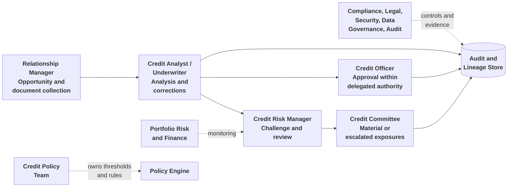

## 3.2 Business Requirements and Success Metrics

**Candidate:** Before I propose requirements, what does the credit team consider a complete first-pass assessment? What does the analyst need in front of them to stop copying numbers into a separate spreadsheet?

**Interviewer:** They want a multi-period standardized financial dataset with material line items linked back to the original source pages and labels. Ratios covering leverage, liquidity, profitability, debt-service capacity, cash-flow quality, and operating efficiency. Sector benchmark comparisons and trend classifications such as improving, stable, deteriorating, or volatile. Qualitative findings: audit opinion, going-concern language, litigation, contingent liabilities, related-party items, covenant breaches, and management commentary. Factor-by-factor scorecard results, the internal rating grade, risk band, probability of default, loss-given-default assumption, expected loss, pricing indication, and lending recommendation. A grounded, editable credit memo, plus trace, audit, version history, review, and rerun information.

**Candidate:** That is a complete deliverable, not a summary. I would treat every one of those as a required field on the output record rather than optional narrative, since a missing ratio or an unlinked citation is exactly the kind of gap a reviewer sends back.

**Interviewer:** What are the non-negotiable requirements?

**Candidate:** Reproducibility, explainability, grounding, human accountability, data provenance, graceful degradation, versioning, and security.

**Interviewer:** The extraction step is probabilistic. How can the rating be reproducible?

**Candidate:** Reproducibility applies to the rating given the same validated inputs and configuration. Ratio calculation, benchmark classification, trend analysis, scorecard logic, probability-of-default mapping, loss-given-default mapping, expected-loss calculation, and recommendation logic must be deterministic. The extraction candidate can vary, which is why the system must preserve the actual validated facts used by each run, along with document hashes, model versions, prompt versions, and reference-data versions.

**Interviewer:** Does the current implementation already have every production control?

**Candidate:** No. The supplied implementation includes the deterministic calculation path and versioned assessment records, and stores documents, page chunks, line items, ratios, rating factors, credit memos, reviews, and raw JSON by assessment version. Production gaps remain in independent citation validation, complete prompt-version persistence, immutable reference-data snapshots, a complete audit-event table, and a formal blocking validation gate. I would state that explicitly in an interview.

**Interviewer:** Which metrics would you use?

**Candidate:** I would use business, quality, control, and model-performance metrics:

| Metric                                 | What it measures                                                                |
| -------------------------------------- | ------------------------------------------------------------------------------- |
| Time to first-pass assessment          | Time from submission to reviewed draft                                          |
| Time to committee-ready memo           | End-to-end business value                                                       |
| Assessments per analyst per week       | Analyst throughput                                                              |
| First-pass memo acceptance rate        | Practical usefulness of generated output                                        |
| Material correction rate               | Quality of extracted facts and conclusions                                      |
| Rating reproducibility                 | Whether identical approved inputs produce identical ratings and recommendations |
| Early-warning hit rate                 | Whether flagged deterioration is confirmed by analysts                          |
| Committee override rate                | Weaknesses in policy, data, or scorecard logic                                  |
| Audit findings per hundred assessments | Control quality                                                                 |
| Default rate by rating band            | Whether rating bands rank-order risk                                            |
| Expected versus realized loss          | Quality of PD and LGD assumptions                                               |

**Interviewer:** Why not just track time to first-pass assessment? That is the number the business actually asked for.

**Candidate:** Because it can improve for the wrong reason. If the system gets faster by extracting less carefully or by skipping benchmark checks, the time metric goes down while the correction rate and the override rate go up. I would never report speed on its own. Material correction rate and committee override rate tell me whether the speed came from real automation or from cutting corners the reviewer then has to fix.

**Interviewer:** Why include default rate by rating band and expected versus realized loss? Those take months or years to show anything.

**Candidate:** They are lagging, but they are the only way to know whether the rating actually means what it claims. A scorecard can look internally consistent, well-scored, evidence-linked, and still rank-order risk badly if a factor weight is wrong. Without watching realized defaults against the assigned bands over time, a systematic bias in the model would only surface when a portfolio-risk review or a regulator asks why default rates and ratings do not line up.

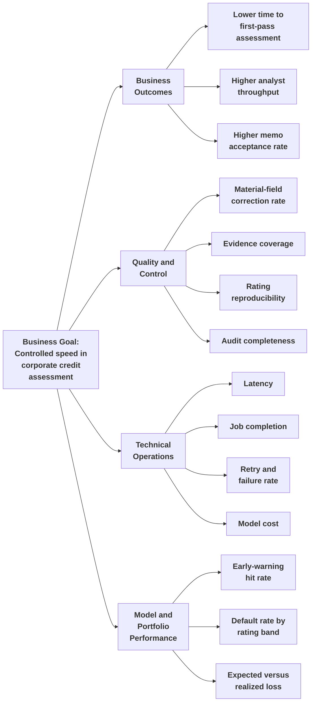

**Interviewer:** What constraints would you record before engineering starts?

**Candidate:** The AI cannot autonomously approve, reject, price, or disburse a facility. The LLM cannot perform decision-bearing arithmetic, assign the rating, or override the scorecard. Uploaded financial documents remain the primary source. Market data may fill permitted gaps but must not silently replace filing values. Web evidence is supplementary and lower weighted. Adverse or disclaimer audit opinions and auditor going-concern notes trigger hard-stop policy outcomes. Missing data, low-quality evidence, conflicts, and validation failures must remain visible. Corrections and reruns create new assessment versions, and scoring reference data must be versioned.

## 3.3 Data and Inputs

**Interviewer:** The business says, “The analyst will upload financials.” What more do you need to know?

**Candidate:** I need document types, formats, periods, source priority, facility details, external-data permissions, and the data allowed to influence the rating. Are the files text-based PDFs, scanned PDFs, spreadsheets, or mixed?

**Interviewer:** The current implementation supports text-based PDFs. A real credit pack may include audited accounts, management accounts, interim statements, and an information memorandum.

**Candidate:** Then the current product boundary must say text-based PDFs. OCR for scanned documents is a future enhancement, not an existing capability. What financial and facility data is required?

**Interviewer:** The assessment needs the borrower, facility request, financial history, debt, liquidity, qualitative risk information, and optional external context.

**Candidate:** I would organize the inputs as follows:

| Input category                 | Examples                                                                                     | Credit purpose                                                            |
| ------------------------------ | -------------------------------------------------------------------------------------------- | ------------------------------------------------------------------------- |
| Financial evidence             | Audited annual reports, interim statements, management accounts, cash-flow statements        | Financial position, performance, liquidity, leverage, and cash generation |
| Facility information           | Requested amount, currency, tenor, purpose, repayment structure                              | Defines exposure and expected repayment mechanism                         |
| Debt and covenant information  | Debt schedule, repayment schedule, covenant certificate, waiver history                      | Debt-service and refinancing analysis                                     |
| Borrower and relationship data | Legal name, industry, country, registration number, existing exposure, payment history       | Correct identity, benchmark selection, and relationship context           |
| Risk and supporting evidence   | Audit opinion, going-concern note, litigation, guarantees, related-party items, adverse news | Qualitative risk and hard-stop assessment                                 |

**Interviewer:** Should audited accounts and management accounts have equal authority?

**Candidate:** No. Audited financial statements normally have the highest authority for historical figures. Interim and management accounts may be more recent but must be marked with their source type. The system must not merge them blindly. Conflicting values remain visible with source priority and reconciliation status.

**Interviewer:** Which line items are needed?

**Candidate:** Revenue, EBITDA, EBIT, net income, cash, receivables, inventory, current assets, current liabilities, short- and long-term debt, total assets, total liabilities, equity, interest expense, operating cash flow, capital expenditure, principal repayments where available, and cost of goods sold where needed. Original labels remain stored while normalized labels support calculations.

**Interviewer:** Why not let the model decide the mapping each time?

**Candidate:** The model can propose a mapping, but the calculation engine needs a stable vocabulary. “Revenue,” “net sales,” and “turnover” may map to one standardized concept while preserving their original labels. Otherwise, formulas depend on document wording and become unreliable.

**Interviewer:** What is the role of market data and web evidence?

**Candidate:** The implementation can use optional ticker-based market data to fill permitted missing fields and cross-check values. Documents always win, and disagreements are flagged. Public web and news evidence can identify recent events such as regulatory actions, restructuring, or management changes, but it is supplementary. Low company-match confidence caps its effect, one finding cannot create the highest severity alone, and audited financial evidence dominates.

**Interviewer:** yfinance and a filing describe the same fiscal year differently. How do you avoid splitting one year of data across two period buckets?

**Candidate:** That is a real problem, not a hypothetical one. yfinance always labels a period `FY2023`, while a filing might say “2023,” “FY23,” or “Year ended 31 March 2023.” If I matched periods by exact string, the merge would treat those as two different periods and I would end up with a document row for 2023 and a separate yfinance row for the same fiscal year, which corrupts every ratio and trend calculation downstream. The merge logic pulls the four-digit year out of each period label with a regex instead, and only fills a cell when the document has no value for that year. When it does fill a gap, it relabels the yfinance item with the document’s own period string, so both sources land in the same bucket and the document label is what survives in the output. If the ticker is wrong or yfinance returns nothing, the merge is a no-op and the assessment runs on documents alone.

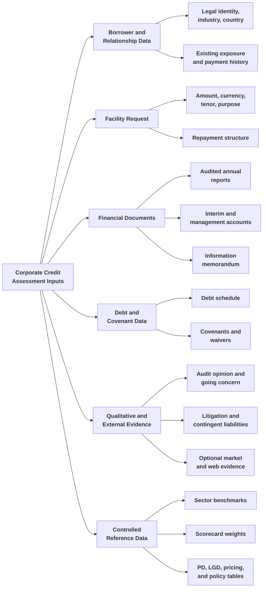

### Fact and evidence lifecycle

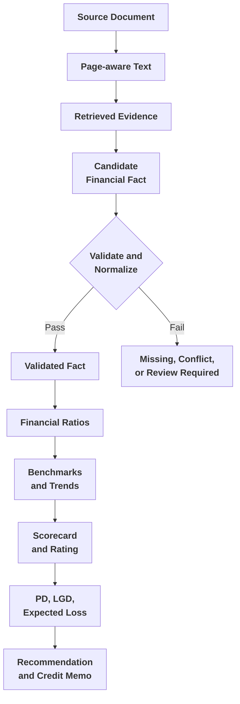

## 3.4 Solution Strategy and Pipeline Logic

**Interviewer:** Give me the one-sentence design.

**Candidate:** The agent reads and organizes corporate-credit evidence, deterministic services calculate and score the borrower’s credit profile, and authorized credit professionals make the final lending decision.

**Interviewer:** Why not use one capable model to read reports, calculate ratios, assign the rating, and write the memo?

**Candidate:** It is simpler only at the prompt level. Credit arithmetic must be repeatable. A reviewer needs the formula, input values, benchmark, factor weight, severity, and contribution. Hard-stop rules cannot be negotiated through language. A separate deterministic core also permits policy test cases that always produce the same result.

### End-to-end pipeline

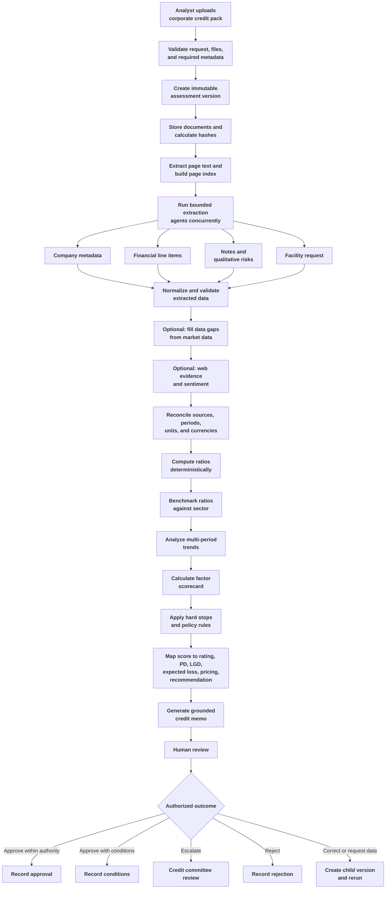

### Document ingestion and agent tools

**Interviewer:** Why not send the complete PDF directly to the model?

**Candidate:** Corporate credit packs contain several files and hundreds of pages. Sending entire documents repeatedly is expensive and weakens grounding. The implementation extracts text page by page and builds a semantic search index. When an agent needs total debt, it searches balance-sheet, borrowings, debt, liabilities, and finance-cost evidence. When it needs going-concern language, it searches audit and note sections. The model sees task-relevant evidence.

**Interviewer:** Why use an agent with tools rather than one fixed retrieval query?

**Candidate:** A fixed query makes one retrieval decision before knowing whether the evidence is sufficient. A bounded tool-using agent can search, read a page, identify a terminology mismatch, and search again. The implementation exposes page-search and page-read tools. The loop is limited to prevent uncontrolled cost and latency.

**Interviewer:** Tools that hold retrieval state are a common place for concurrency bugs. Did you hit one here?

**Candidate:** We did, early on, and it is worth walking through because it is a general lesson, not just a credit-risk detail. An earlier version of the tool layer kept the page index as a single module-level object, set once through a `set_page_index()` call. That is fine as long as exactly one assessment is running. The moment this sits behind a multi-request API server, two assessments processing concurrently would both be calling into the same module-level index, and one request's retrieval context would silently clobber the other's. An analyst on case A could get search results built from case B's documents, which is a correctness problem that would not throw an exception. It would just quietly return the wrong evidence. The fix was to stop treating the index as shared state at all: `make_tools(page_index)` is a factory that builds a fresh pair of `search_pages` and `get_page` tools bound to one specific index through a closure, and every assessment run constructs its own tools from its own index. There is nothing to lock because there is nothing shared. That is a case where the right concurrency fix was to remove the shared mutable state, not to add a lock around it.

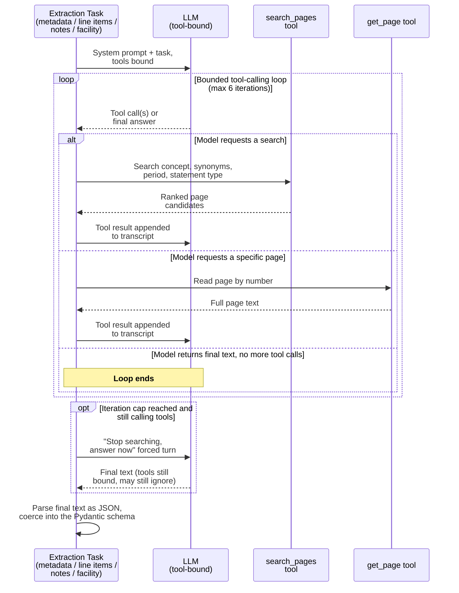

### Narrow extraction responsibilities

**Interviewer:** How many agents should the system use?

**Candidate:** The supplied design separates company metadata, financial line items, notes and qualitative risks, facility details, optional web evidence, and credit-memo generation. The first extraction tasks can run concurrently because they read the same completed page index and do not depend on each other. Multi-agent design is not automatically better; each extra agent adds cost, latency, and failure paths. The boundaries are justified by different evidence types and output contracts.

### Validation boundary

**Interviewer:** What prevents wrong extracted values from contaminating the rating?

**Candidate:** Four validation layers:

1. **Schema validation:** Required labels, standardized concepts, values, units, currencies, periods, statement types, pages, and snippets.
2. **Citation validation:** The cited page must exist in the submitted pack and contain the claimed evidence.
3. **Grounding validation:** Unsupported values are recorded as missing rather than guessed or derived without approved inputs.
4. **Financial consistency validation:** Units, currencies, periods, duplicates, restatements, missing inputs, impossible values, and ratio recomputation are checked.

The current build has structured models, normalization, missing-input reporting, and document-versus-market-data cross-checking. Independent citation verification, complete grounding checks, and a formal blocking validation gate remain production enhancements.

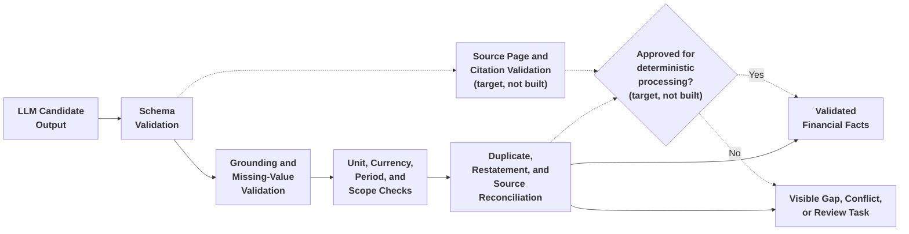

### Deterministic credit core

**Candidate:** The deterministic core normalizes units, derives permitted inputs, computes ratios, compares results against sector benchmarks, classifies trends, applies scorecard factors, maps the result to a rating, and calculates expected loss.

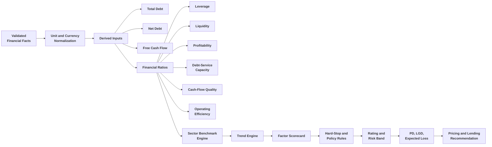

**Interviewer:** Could the LLM calculate ratios accurately enough?

**Candidate:** It can produce a plausible calculation, but it should not own the authoritative result. Deterministic Python handles unit conversion, missing denominators, negative equity, precision, rounding, and formula versioning. Examples include:

\[
\text{Net Debt} = \text{Total Debt} - \text{Cash and Cash Equivalents}
\]

\[
\text{Free Cash Flow} = \text{Operating Cash Flow} - \text{Capital Expenditure}
\]

\[
\text{Net Debt to EBITDA} = \frac{\text{Net Debt}}{\text{EBITDA}}
\]

\[
\text{Interest Coverage} = \frac{\text{EBITDA}}{\text{Interest Expense}}
\]

\[
\text{Expected Loss} = \text{Probability of Default} \times \text{Loss Given Default}
\]

**Interviewer:** What are the hard stops?

**Candidate:** The current design explicitly treats an adverse or disclaimer audit opinion and an auditor going-concern note as hard-stop conditions. They force the configured worst-case rating or decline outcome regardless of the ordinary scorecard. The final case still requires authorized human review.

**Interviewer:** Why include web evidence?

**Candidate:** Audited statements describe history and may not capture a recent regulatory action, restructuring, fraud allegation, management resignation, or downgrade. Web evidence can provide timely context, but it is discounted, and the discount is deterministic rather than left to the model's judgment. Every adverse finding a web search returns is dropped one severity notch before it reaches the scorecard, on the reasoning that a name turning up next to “lawsuit” in a search is often a false positive, a same-name company, or the firm commenting on someone else's dispute rather than being a party to it. A single finding, even a severe one, is capped at “medium” after that discount. The only way the factor reaches “high” is at least two independently corroborating high-severity findings, and if the disambiguation step has low confidence that the company found on the web is actually the borrower, the whole factor is capped at “medium” regardless of how many findings there are. Audited financial factors carry higher weight than this in the scorecard, so this is deliberately a secondary signal, not a competing one.

### Grounded credit memo

**Candidate:** The memo generator receives the completed scorecard, validated ratios, trends, benchmark results, rating factors, rating, PD, LGD, expected loss, recommendation, and approved evidence summaries. It explains those outputs; it does not recalculate them or change the rating. A production enhancement is an independent validator that checks each numerical claim against the authoritative scorecard.

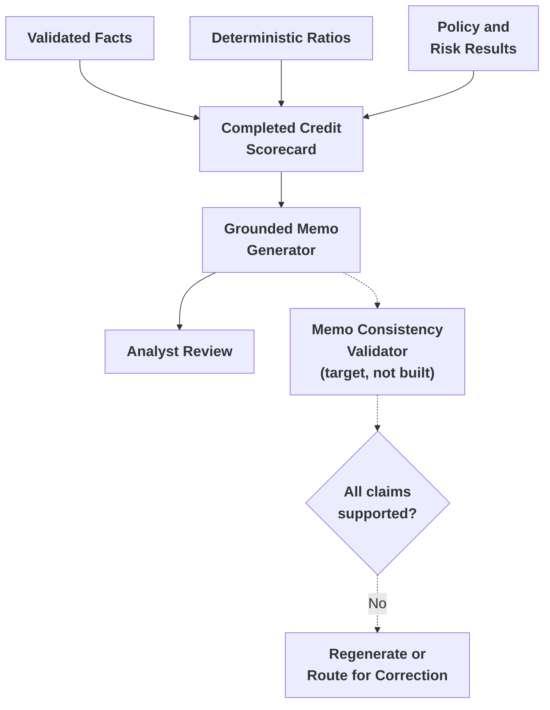

## 3.5 High-Level Design

**Interviewer:** Show the major architecture components.

**Candidate:** The system has five zones: analyst workspace; API and orchestration; document and agent processing; deterministic credit services; and persistent storage with auditability.

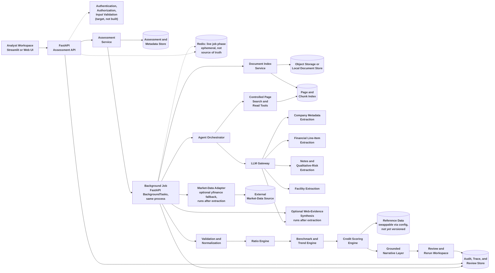

**Interviewer:** Why a modular service instead of many microservices?

**Candidate:** For the current target scale—an internal credit organization with tens of analysts and tens to low hundreds of assessments per day—a modular service is more honest. The modules have clear responsibilities and can be independently tested. A microservice split can come later if separate scaling, security, ownership, or release requirements justify it. Starting with many services would add operational complexity without immediate business value.

**Interviewer:** Which calls are synchronous and which are asynchronous?

**Candidate:** Creation or rerun is synchronous only for validation, upload metadata, version creation, and returning an assessment ID. Text extraction, page indexing, LLM extraction, optional enrichment, ratios, benchmarks, trends, scoring, memo generation, and persistence run asynchronously. The client polls status and retrieves the completed version.

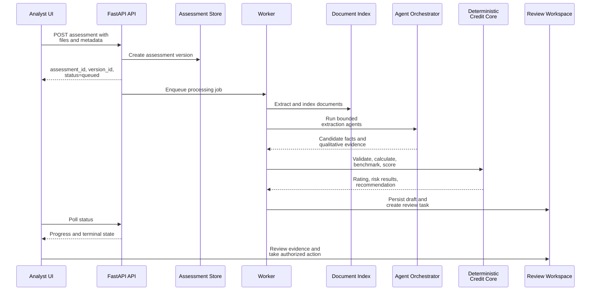

**Interviewer:** The code uses FastAPI `BackgroundTasks`. Is that production-ready?

**Candidate:** It is suitable for a proof of concept or constrained internal use, but not a durable production worker model. If the API process restarts, an in-process task can be lost; multiple replicas also make ownership and recovery unclear. Production should use a durable queue and dedicated workers, such as a managed queue or a worker system appropriate to the bank’s platform.

### What the analyst actually sees

**Interviewer:** Walk me through what comes back once a case finishes — what does the analyst actually see, and what information does the tool expose?

**Candidate:** The proof-of-concept workspace renders one finished assessment as a set of tabs, each surfacing a different slice of the same underlying `CreditAssessment` record — nothing shown is computed separately from what the pipeline already produced.

*Decision tab.* The header line shows the rating grade, risk band, score out of 100, lending decision, and expected loss, with status, version, company, industry (and the sector it was benchmarked against), covered periods, PD, LGD, suggested pricing, LLM-call count, and latency underneath. Below that sits the full scorecard table — one row per rating factor, with whether it fired, its severity, weight, contribution, and the specific evidence line that drove it — which is exactly the `RatingFactorResult` list `scoring.score_case` returns, rendered without alteration.

*Trend tab.* Shows `benchmarks.analyse_trends`'s output directly: overall trajectory, the deterministic keyword-based management-commentary signal, and a per-ratio table of direction, magnitude, percentage change, and the value in every period — so an analyst can see not just that leverage improved, but by how much and across which fiscal years.

*Credit Memo tab.* The LLM-written memo — executive summary, financial-analysis narrative, strengths, risks, mitigants, covenants, and monitoring triggers — every figure it cites (net margin, DSCR, current ratio) is quoted from the scorecard and ratio table already shown on the other tabs, not recomputed here.

*Benchmark tab.* `benchmarks.benchmark_ratios`'s sector comparison: each ratio against the sector's 25th percentile, median, and 75th percentile, a top-quartile/above-median/bottom-quartile classification, and a callout of which ratios are material gaps (bottom-quartile on a ratio the policy treats as material) — here, the current ratio.

The system also exposes Ratios, Web Sentiment, Extracted Data, Trace, Review & Rerun, and Audit Trail tabs over the same record, matching the API contracts in §3.6.

## 3.6 Low-Level Design

**Interviewer:** Break the system into implementable modules.

**Candidate:** The current implementation has the following responsibility boundaries:

| Module                     | Responsibility                                                            | Implementation reference                                                          |
| -------------------------- | ------------------------------------------------------------------------- | --------------------------------------------------------------------------------- |
| Analyst workspace          | Upload, start, view, review, rerun, inspect audit                         | `app_streamlit/ui.py`                                                           |
| Assessment API             | Create versions, accept requests, schedule work, serve results            | `credit_risk/api/routes.py`, `credit_risk/api/main.py`                        |
| Background job runner      | Execute pipeline outside request-response path                            | `_run_assessment_job` in `credit_risk/api/routes.py`                          |
| Status tracker             | Publish processing phase                                                  | `credit_risk/status_tracker.py`, Redis integration                              |
| Configuration              | Load model, embedder, and environment configuration                       | `credit_risk/config.py`                                                         |
| Document index             | Extract page text and build per-assessment semantic index                 | `credit_risk/doc_index.py`, `credit_risk/db/page_index.py`                    |
| Tool layer                 | Expose page-search and page-read actions                                  | `credit_risk/tools.py`, `credit_risk/tool_loop.py`                            |
| Extraction layer           | Extract metadata, line items, notes, and facility details                 | `credit_risk/extraction.py`                                                     |
| Market-data adapter        | Fill permitted gaps and cross-check values                                | `credit_risk/marketdata.py`                                                     |
| Web-evidence service       | Collect and synthesize supplementary public evidence                      | `credit_risk/osint/` (package: `collect.py`, `search.py`, `sentiment.py`) |
| Ratio engine               | Compute financial ratios deterministically                                | `credit_risk/ratios.py`                                                         |
| Benchmark and trend engine | Compare ratios and classify trends                                        | `credit_risk/benchmarks.py`                                                     |
| Scoring engine             | Produce factors, score, rating, PD, LGD, expected loss, decision, pricing | `credit_risk/scoring.py`                                                        |
| Narrative layer            | Generate grounded memo and answer questions                               | `credit_risk/narrative.py`, `credit_risk/agent_graph.py`                      |
| Repository layer           | Persist assessment versions and child records                             | `credit_risk/db/models.py`, `credit_risk/db/persist.py`                       |
| Reference-data layer       | Supply benchmarks, mappings, thresholds, and assumptions                  | `credit_risk/reference.py`                                                      |

### Internal processing sequence

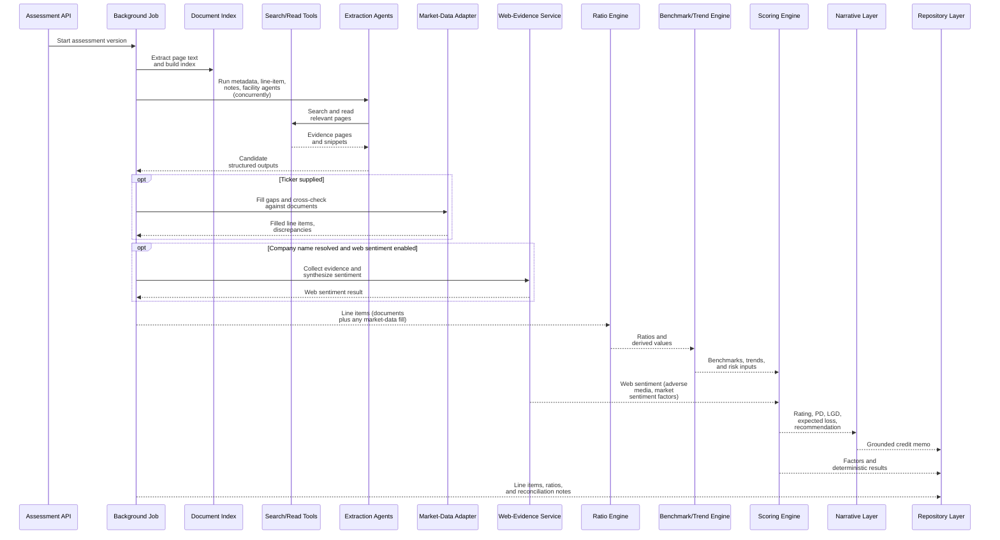

**Interviewer:** What API contracts are required?

**Candidate:** The API needs separate contracts for creation, status, retrieval, review, rerun, grounded questions, and audit views.

| Endpoint                            | Purpose                                                              |
| ----------------------------------- | -------------------------------------------------------------------- |
| `POST /assessments`               | Create an assessment version and submit files and metadata           |
| `GET /assessments/{id}`           | Retrieve stored result, ratios, factors, memo, and review status     |
| `GET /assessments/{id}/status`    | Retrieve processing phase and failure information                    |
| `POST /assessments/{id}/rerun`    | Create a child version after corrections or updated instructions     |
| `POST /assessments/{id}/review`   | Record approval, rejection, correction, or escalation                |
| `POST /assessments/{id}/question` | Ask a grounded question over the completed assessment                |
| `GET /assessments/{id}/audit`     | Retrieve source, calculation, version, review, and audit composition |

**Interviewer:** Why must rerun create a new version?

**Candidate:** A correction to cash can change net debt, leverage, liquidity, benchmarks, trends, scorecard factors, rating, expected loss, recommendation, and memo. Editing one display field creates an inconsistent assessment. A rerun stores the correction, actor, time, reason, and parent version, then recalculates the dependent outputs while preserving the original result.

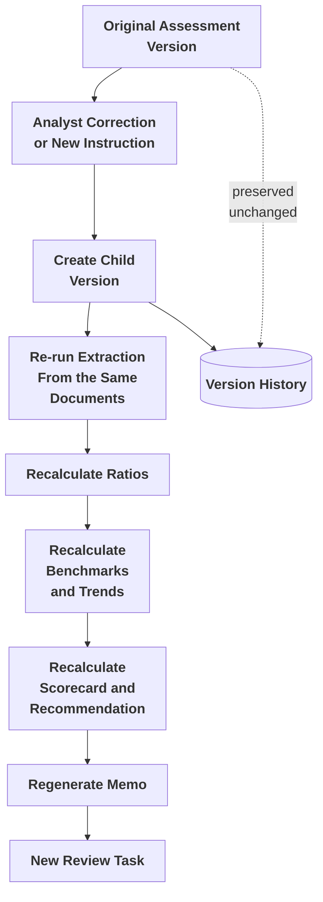

The current build always re-extracts from the parent version's stored documents on a rerun — an analyst's correction is recorded as a review action but is not yet automatically fed into the rerun as an override; wiring that through is a near-term enhancement, not today's behavior.

## 3.7 Data and Database Schema Design

**Interviewer:** Show the schema needed for source evidence, credit calculations, review, and reruns.

**Candidate:** The current implementation centers everything on one table, `assessment_versions` — the audit anchor a rerun's `parent_version_id` self-joins onto — with normalized child tables for whatever benefits from being queried or joined directly (documents, page embeddings, line items, ratios, rating factors, the memo, reviews). The rating grade, band, decision, PD, LGD, and expected loss live as columns directly on the version row rather than a separate decision table. Notes, the sector benchmark, the multi-period trend, web sentiment, and the yfinance reconciliation are still fully captured, but today they live inside one `raw_result` jsonb snapshot on the version rather than their own normalized tables — a deliberate, pragmatic middle path rather than a table per nested field before any of them has a real cross-case query need. There is no separate audit-event table: the audit trail is a read composed from these same tables, not a separately maintained store.

### Entity relationship diagram

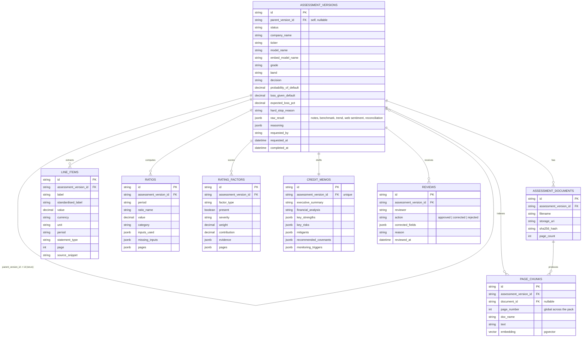

### Data lineage

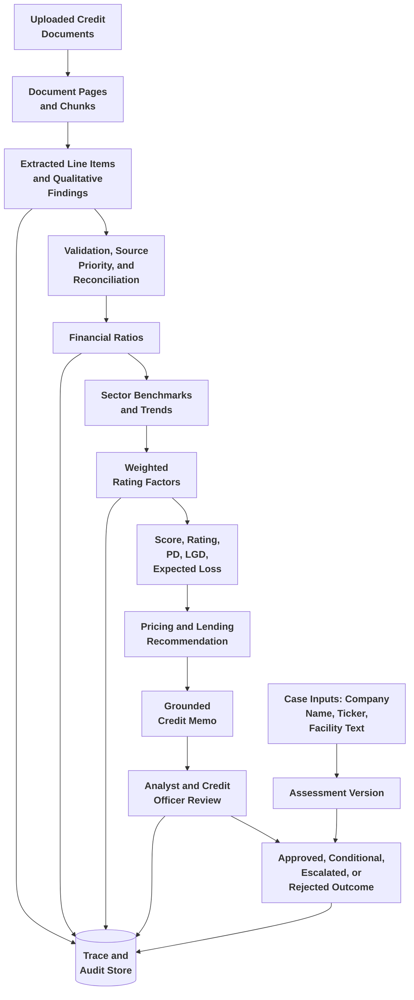

**Interviewer:** Why not overwrite a corrected line item?

**Candidate:** Overwriting removes the history of the model output, analyst correction, and reason for change. A correction should create a new line-item version or append-only review action, mark the previous value as superseded, and invalidate dependent ratios and memo content until the child assessment version is recalculated.

**Interviewer:** What data is illustrative rather than production-approved?

**Candidate:** The bundled sector benchmarks, probability-of-default mappings, loss-given-default assumptions, pricing ranges, and scorecard weights are illustrative for demonstrating the workflow. They must be replaced with approved internal or licensed reference data before the system supports real credit decisions.

**Interviewer:** What is the final implementation statement?

**Candidate:** The implementation is an agentic corporate-credit assessment assistant. It uses bounded agents to read and organize credit-pack evidence, deterministic Python to calculate and score credit risk, and human review to make the lending decision. It is not a generic document-intelligence agent and not an autonomous lender.

## Repository

[Open the Agentic Credit Risk Assessment implementation on GitHub](https://github.com/GSaiDheeraj/Finance-and-Banking-AI-Usecases/tree/main/Credit_Risk_Assesment_Agent)
