# Chapter 4: Financial Document Data Extraction Agent

> **Implementation repository:** [Financial Document Intelligence Agent](https://github.com/GSaiDheeraj/Finance-and-Banking-AI-Usecases/tree/main/FinDoc_IIntelligence_Agent)
>
> **Chapter focus:** This chapter describes an agent that reads financial documents and turns them into structured, traceable information for analysts, credit teams, finance teams, and investment professionals. It is not the credit decision system from Chapter 3. It focuses on extracting and organizing evidence. A downstream user or system may use the extracted data for credit assessment, research, reporting, or financial analysis.
>
> **Implementation honesty:** The repository link is the concrete implementation reference. The real system is a single FastAPI service with a synchronous upload endpoint and an in-process background task, a sequential PDF-to-Markdown-to-table-extraction pipeline, and five deterministic structural validators. It has no distributed queue, no analyst correction workflow, no export endpoint, and no audit-event table. OCR is real and does run for scanned pages and fully scanned documents, but a real ordering bug in the current code keeps it unreachable for one specific case, described later in this chapter. The interview conversation is written against the system as it exists, not against an idealized target architecture, and calls out target-design items explicitly where they come up.

## 3.1 Business Context and Stakeholders

**Interviewer:** A financial-services team spends too much time reading reports and copying values into spreadsheets. They want an AI solution. What do you ask first?

**Candidate:** I need to understand what kind of documents the team processes and what they do with the extracted information. Are these annual reports, quarterly filings, bank statements, loan documents, research reports, or a mixture? Which users consume the result, and is the output used for analysis, reporting, credit, compliance, or a customer-facing decision?

**Interviewer:** The team mainly reviews company annual reports and financial statements. Analysts want important values and notes in a structured form.

**Candidate:** What does “important values” mean in this workflow? Are we extracting revenue, profit, debt, cash, equity, operating cash flow, ratios, risks, or every line item? Do analysts need page references and the original labels? What happens when two documents show different values for the same period?

**Interviewer:** The first release should extract financial line items, company information, reporting periods, and qualitative notes. The analyst should be able to see where each result came from.

**Candidate:** That makes the system a financial-document data-extraction assistant. Its primary responsibility is to find, extract, normalize, and present evidence. It should not silently make a credit decision or produce an authoritative financial statement. It should give downstream users structured facts with source pages, confidence, and clear unresolved cases.

**Interviewer:** Why use an agent? A document parser and a few extraction prompts might be enough.

**Candidate:** A fixed parser works well when documents share a stable layout. Financial reports do not. One company may use “revenue,” another “net sales,” and another “turnover.” Important information may appear in a note rather than the primary statement. Tables may use different periods, units, currencies, and column layouts. A bounded agent can search with alternate terms, inspect the relevant page, notice that the first result is incomplete, and try another approved retrieval step. The process still needs a fixed schema and validation layer.

**Candidate:** Before I go further, who actually consumes the extracted output, and who is responsible for the pipeline that produces it?

**Interviewer:** Financial analysts are the main users, they need structured facts, page citations, and a quick way to correct errors. Credit analysts may use the extracted data as an input to a credit assessment, but they need a clear line between reported facts and anything calculated from them. Investment researchers need company performance, trends, risks, and source evidence. Finance and reporting teams need consistent definitions, period handling, and versioned source data. Data and platform teams own ingestion, indexing, storage, model access, and reliability. Data governance, security, legal, and audit teams care about confidentiality, retention, access, lineage, and reproducibility.

**Candidate:** That tells me this system has to satisfy two different kinds of correctness at once. The analysts and researchers need the facts to be complete and easy to verify against the source page. The governance and platform side needs the pipeline itself to be reliable, access-controlled, and reproducible after the fact. I would keep the extraction output and its citation trail as the one shared artifact all of those roles look at, rather than each downstream team building its own copy.

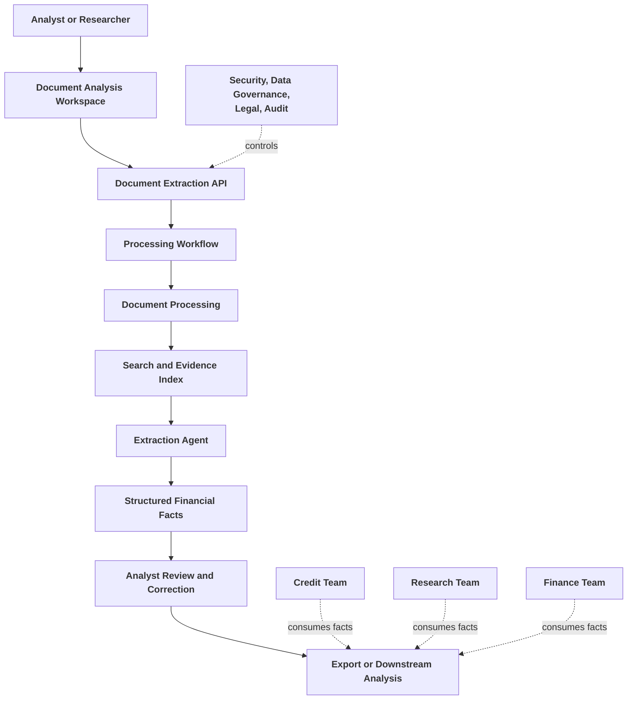

**Interviewer:** Is the extraction agent responsible for calculating ratios?

**Candidate:** It can identify the inputs needed for a ratio, but the authoritative calculation should be performed by deterministic code. For example, the agent can extract revenue, EBITDA, debt, and equity. A calculation service can then compute margins or leverage consistently. This chapter is primarily about extraction, but the boundary matters because extracted facts and derived metrics should not be mixed together.

## 3.2 Business Requirements and Success Metrics

**Interviewer:** The business wants the extraction process to be faster and more accurate. Define the requirements.

**Candidate:** I need baseline information first. How long does an analyst currently spend on one document? Which fields cause the most corrections? How many document formats are in scope? Are scanned PDFs included? What percentage of documents are restated or amended? How important are citations for review and audit?

**Interviewer:** The first release targets text-based annual reports and financial statements. Analysts currently copy values manually and need source pages.

**Candidate:** Given that scope, what should the first release actually do end to end?

**Interviewer:** It should accept an authorized financial document and capture its metadata, detect duplicate files, and preserve document versions. It should extract page-aware text into a searchable index, identify company name, reporting periods, statement type, currency, and unit scale, and then extract the configured financial concepts while preserving the original labels. Every material fact needs page, section, table, or snippet evidence attached. Values need to be normalized in concept, unit, currency, and period without losing the source representation, and missing or conflicting values need to be flagged rather than guessed. An analyst has to be able to review and correct candidate facts, and the result needs to export for downstream analysis.

**Candidate:** That is a complete pipeline, from ingestion through analyst correction to export. I would build it in roughly that order, since the export and correction workflow only matters once the extraction and evidence-attachment steps are trustworthy.

**Interviewer:** Should the system extract every number in the document?

**Candidate:** Not in the first release. Extracting every number increases noise and makes validation harder. I would begin with a defined concept catalogue and allow the workflow to expand. The system can also preserve searchable text so analysts can inspect other values without treating every number as a trusted fact.

**Interviewer:** What would success look like?

**Candidate:** I would measure the following:

| Metric | What it tells us |
|---|---|
| Time to analyst-ready dataset | Whether the workflow reduces manual effort |
| Material-field precision | How often extracted fields are correct when present |
| Material-field recall | How often required values are found |
| Citation validity | Whether the cited page or snippet supports the fact |
| Period and unit accuracy | Whether the value is attached to the correct period and scale |
| Analyst correction rate | How much manual repair is still needed |
| Missing-data visibility | Whether unresolved facts are clearly surfaced |
| Duplicate-document rate | Whether repeated submissions are handled safely |
| Processing latency | Time spent in extraction, retrieval, and model calls |
| Cost per document | Whether the design is economically practical |

**Interviewer:** Why not just track time to analyst-ready dataset? That is the metric the business asked for.

**Candidate:** Because it hides how the time was saved. If the extraction skips citations or guesses at ambiguous values, the dataset appears faster to produce but the analyst correction rate climbs, and the time saved on extraction gets spent again on verification. I would report time alongside correction rate and citation validity so a faster pipeline is only counted as a win if accuracy held.

**Interviewer:** If you could monitor only one quality measure in the pilot, which would you choose?

**Candidate:** Citation-backed material-field accuracy. A value that looks correct but cannot be traced to the source is not dependable enough for downstream financial analysis. I would monitor correction rate alongside it because a system can cite the right page and still select the wrong column or unit.

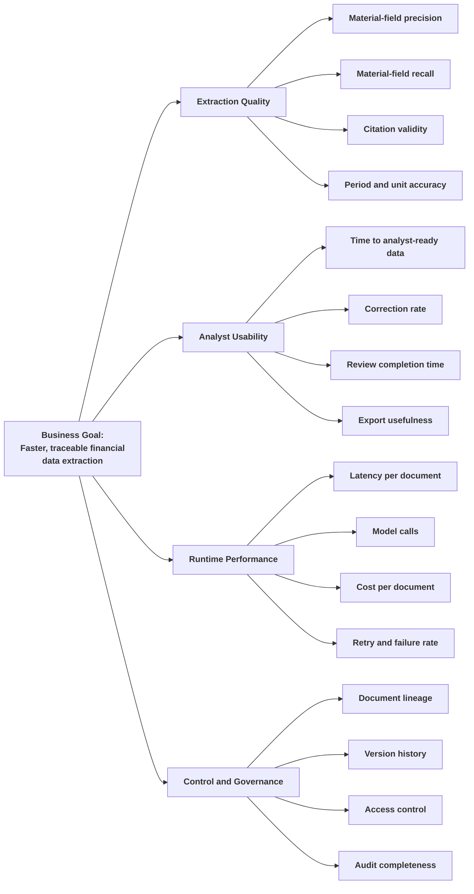

**Interviewer:** What should the system do when it cannot find a value?

**Candidate:** It should return an explicit not-found or review-required result. It must not turn a missing value into zero, copy a nearby value from another period, or ask the model to guess. Downstream calculations should know that the input is missing and either avoid computing the metric or show a clear incomplete status.

## 3.3 Data and Inputs

**Interviewer:** The user uploads a financial report. What data do you need besides the file?

**Candidate:** I need to know the document type, company or entity, reporting period if known, statement scope, language, source, and access scope. Is the document a consolidated annual report, a standalone statement, an interim report, an earnings presentation, or a research document? Is the PDF text-based or scanned? What currencies and unit scales are expected?

**Interviewer:** The analyst may provide company name and document type. The system should infer the reporting period and other details from the document.

**Candidate:** Then supplied metadata and extracted metadata should be compared. If the analyst says the document belongs to Company A but the cover page identifies Company B, the workflow should stop or request review. Metadata should guide retrieval, but it should not override conflicting evidence silently.

**Interviewer:** Which concepts should be extracted first?

**Candidate:** For a general financial-document dataset, I would begin with:

- Company name and legal entity.
- Reporting period and comparative period.
- Statement type and consolidation scope.
- Currency and unit scale.
- Revenue or net sales.
- Operating profit, EBITDA, and EBIT where reported.
- Net income.
- Cash and cash equivalents.
- Receivables and inventory.
- Current assets and current liabilities.
- Short-term and long-term debt.
- Total assets, liabilities, and equity.
- Operating cash flow and capital expenditure.
- Interest expense.
- Audit opinion and going-concern language.
- Litigation, contingent liabilities, related-party transactions, and other qualitative risks.

**Interviewer:** Why preserve the original label if the system already normalizes it?

**Candidate:** The normalized label is useful for querying and downstream calculations. The original label is essential for review. It lets an analyst see whether “turnover,” “net sales,” or “revenue” was used in the source and decide whether the mapping is appropriate.

### Input categories

| Input category | Examples | Purpose |
|---|---|---|
| Document file | PDF, text-based report, filing, statement | Primary evidence |
| User metadata | Company, document type, reporting period, scope | Initial routing and reconciliation |
| Document metadata | Filename, hash, source, upload time, access scope | Versioning and control |
| Concept configuration | Required fields, aliases, statement types | Extraction task definition |
| Reference mappings | Units, currencies, period formats, concept mappings | Normalization |
| Optional external data | Public filing metadata or permitted reference data | Cross-checking, not silent replacement |
| Execution metadata | Job ID, model version, prompt version, retrieval settings | Reproducibility and audit |

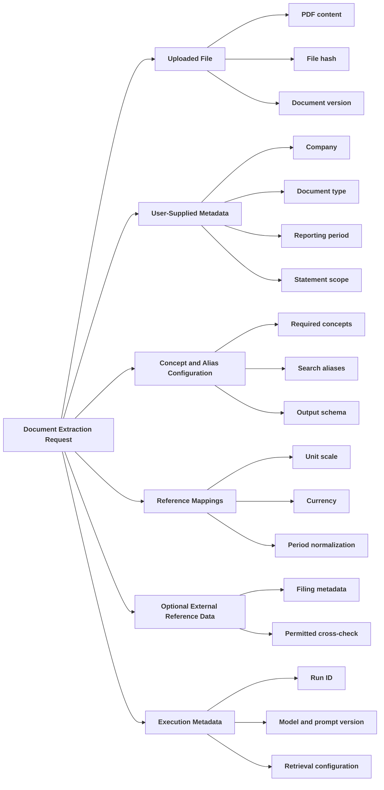

### Document and evidence lifecycle


**Interviewer:** What if two documents report different values for the same period?

**Candidate:** The system should preserve both values and compare their source dates, statement scope, unit scale, currency, adjusted-versus-reported definition, and restatement status. It may identify a later restatement or a scope difference. If it cannot resolve the conflict through deterministic rules, it should create a review item rather than choose silently.

**Interviewer:** Does the extraction agent need access to the whole document?

**Candidate:** It needs a controlled way to retrieve relevant pages. Giving the full document to every task increases cost and makes source attribution less precise. The index should preserve page and section boundaries, and the agent should receive only the evidence needed for the current extraction task.

## 3.4 Solution Strategy and Pipeline Logic

**Interviewer:** Give me the design in one sentence.

**Candidate:** The system turns a financial document into Markdown with its tables preserved, runs a fixed pipeline that finds and classifies those tables, extracts every line item with a bounded validate-and-retry loop, and persists the result so an analyst can browse it next to the source PDF.

**Interviewer:** Why not use one large prompt to extract everything?

**Candidate:** It is easy to demonstrate but difficult to control. A long report may contain multiple periods, units, tables, notes, and repeated terms. A single prompt can select the wrong column or miss a footnote. Smaller extraction tasks allow focused retrieval, task-specific schemas, targeted retries, and easier evaluation. The number of tasks should still be kept reasonable.

### End-to-end workflow

**Interviewer:** Walk me through what actually happens between upload and a finished document.

**Candidate:** It is a single sequential pipeline, not four tasks running side by side. Nothing in this system runs concurrently, I checked that directly against `fundamentals_pipeline/graph.py` and `extraction.py` before I'd claim otherwise.

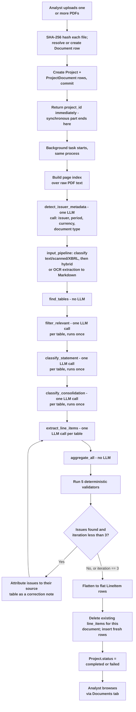

**Interviewer:** Why classify the tables once but let extraction retry up to three times?

**Candidate:** Because they fail for different reasons. Whether a table is a balance sheet, and which of its columns are consolidated, doesn't depend on how well the model transcribed the numbers inside it. If `classify_statement` got the bucket right the first time, running it again on retry two would spend three more LLM calls per table for the identical answer. Numeric transcription is the part that actually varies attempt to attempt: a model can misread a bracketed negative, or let a bucket label stand in for a real row header, or repeat one column's value under a period it doesn't belong to. Those are exactly the failure modes the five validators check for, so extraction and aggregation are the only two steps inside the retry loop. Classification runs once, upstream of it.

**Interviewer:** So could you parallelize the tables within one document, at least, since they're independent of each other?

**Candidate:** Technically yes, and it's a real, available improvement. `run_and_persist` processes every document in a batch with a plain `for` loop, one document fully finishing before the next starts, and inside `fundamentals_pipeline`, every LLM-backed node loops over its candidate tables the same way, one call at a time. Those are genuinely independent units of I/O-bound work, separate documents, separate tables within a document, so a bounded thread pool that maps each future back to its document or table would cut wall-clock time without touching any of the LLM call sites. It just isn't built today. At the volume this handles, uploads in the tens per day rather than per second, the team didn't see the win as worth the added complexity yet.

### Document ingestion

**Interviewer:** Why not send the PDF directly to a multimodal model?

**Candidate:** We partly do, just scoped narrowly rather than for the whole document. A page with a detected table or a large image area goes through OCR with a local vision-language model instead of plain text extraction, and a fully scanned document with no usable text layer at all goes through OCR on every page. But most pages in a normal annual report have a clean text layer, and those go straight through PyMuPDF and `pymupdf4llm`, which is faster and doesn't need a vision model's help. Running every page through a multimodal model regardless of whether it needs one would cost more for no benefit on the pages that already parse cleanly.

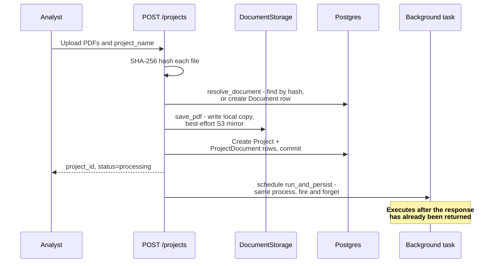

**Interviewer:** What happens when the PDF is scanned?

**Candidate:** OCR genuinely exists and works here, that part isn't a gap. `input_pipeline` uses a local vision-language model, LightOnOCR-2-1B, for a fully scanned document or for individual table and image pages inside an otherwise text-based one. But there's a real ordering bug I'd rather flag than gloss over: `run_and_persist` calls `detect_issuer_metadata` before it calls the extraction pipeline, and `detect_issuer_metadata` builds its page index with `load_pdf_as_pages`, which reads the PDF's raw text layer directly and raises an error immediately if there isn't one. So a genuinely scanned document, one with zero pages of extractable text, fails at the metadata-detection step and the whole document gets marked `"failed"` before the OCR-capable code is ever reached. OCR support is present in the repository and works for the pages that do reach it. It's just unreachable end to end for that specific case today.

### Extraction task design

**Interviewer:** Walk me through what actually happens to the Markdown once you have it.

**Candidate:** It goes through a six-node pipeline, ported from an internal fundamentals-extraction module. The first four nodes classify, and they run exactly once per document:

1. `find_tables`: no LLM call. Regex plus BeautifulSoup pulls every `<table>` block out of the Markdown, captures its nearest heading, a scale annotation like "(in € millions)," and the page it came from.
2. `filter_relevant`: one LLM call per candidate table, on the small model tier. Drops tables that don't contribute to fundamentals analysis, narrative-only prose, a glossary, an investor-relations contact page. Keeps segment tables, breakdown tables, KPI dashboards, and ratio-only tables that have no absolute amount at all.
3. `classify_statement`: one LLM call per surviving table, small model. Buckets each table into `balance_sheet`, `income_statement`, `cash_flow`, `changes_in_equity`, or `other`. "Other" is a keep bucket for KPIs and ratios, not a discard pile.
4. `classify_consolidation`: one LLM call per surviving table, small model. Classifies each column as consolidated, unconsolidated, a segment's own column, or a variance or percent column to skip. A table is dropped only if it has zero consolidated columns and isn't a segment table.

The remaining two nodes are the ones that run inside the bounded retry loop, up to three times:

5. `extract_line_items`: one LLM call per surviving table, large model tier, restricted to the columns already flagged consolidated. On a retry, the prompt gets a correction note naming the specific issue found in the prior attempt.
6. `aggregate_all`: no LLM call. Buckets every extracted item by statement type, and tags each cell with which table and page it came from.

One more LLM call runs per document, not per table: `detect_issuer_metadata` reads the top few pages, retrieved from a page index built over the raw PDF, and asks for issuer, period, currency, and document type in a single call rather than four separate ones.

**Interviewer:** Where's the qualitative-note extraction, or the separate statement-and-table-context task?

**Candidate:** They don't exist in this build. There was an earlier design with four extraction tasks meant to run after indexing: company and period metadata, financial line items, qualitative notes and risk language, and statement and table context. What's actually built collapses to the six nodes above plus one metadata call. There's no separate pass for audit opinions, going-concern language, litigation, or related-party disclosures, and no dedicated table-context extractor. `classify_statement`'s "other" bucket does keep KPI and ratio tables rather than throwing them away, but that's not the qualitative-note extraction that was originally proposed. If a document's qualitative disclosures need to become structured facts, that's an unbuilt task, not a simplified version of one.

**Interviewer:** What should the structured result look like?

**Candidate:** One row per fact, matching the shape the API and the database actually use:

```json
{
  "statement": "income_statement",
  "label": "Net sales",
  "section_path": ["Consolidated Statements of Income"],
  "value": 5200.0,
  "unit": null,
  "currency": "USD",
  "period": "2025-12-31",
  "period_end_date": "2025-12-31",
  "period_length_months": 12,
  "scale": "millions",
  "consolidated": true,
  "page": 47,
  "source_snippet": "page 47",
  "validation_errors": []
}
```

Two things worth being honest about here. `unit` exists on the schema for something like "USD k," but the extraction path never actually populates it; currency and scale carry that information instead, so in practice it's always null. And `source_snippet` doesn't hold quoted source text the way the name suggests. It's populated with the coordinate naming which table the value came from, something like "page 35," not an excerpt an analyst could read to independently confirm the figure. There's also no confidence score anywhere in this schema. The closest signal to confidence is whether `validation_errors` came back empty.

### Agent tools and retrieval

**Interviewer:** How does the extraction step decide which page or table to read for a given fact?

**Candidate:** It doesn't decide, in the sense of an agent reasoning about where to look. That was the original plan. `tools.py` still defines two LangChain tools, `search_pages` for semantic retrieval over the document and `get_page` for reading a specific page by number, and the intent behind them was a bounded agent loop: search for a concept, read the page, decide if the evidence is sufficient, try an alternate query if not, then submit a structured fact or mark it unresolved.

**Interviewer:** Is that what actually runs in production?

**Candidate:** No. Nothing in the current codebase calls into `tools.py`. No API route, no pipeline node, and no test references `set_page_index`, `TOOLS`, or `TOOL_MAP`. It's dead code left over from a design that never got wired into the extraction path.

**Interviewer:** Why did the team drop it in favor of what's there now?

**Candidate:** Financial statements have a much more regular shape once you've found the table than an open retrieval loop assumes. A fixed pipeline, find the tables, classify what kind of statement each one is, classify which columns are consolidated, then extract, is easier to test and easier to reason about than a loop where the model decides its own next action. Each node has one job and a fixed input and output shape, so you can unit-test `check_bracket_sign` or `classify_statement`'s prompt in isolation. An open-ended search-and-retry loop makes the total LLM call count per document unpredictable and makes it much harder to say with confidence what the system will do on a document it hasn't seen before. For this specific document shape, tables inside a bounded, page-numbered PDF, a deterministic table-classification-then-extraction pipeline gave more predictable behavior for less engineering effort than a general retrieval agent would have.

**Interviewer:** So is there any search index over the document at all?

**Candidate:** A narrow one. `pdf_index.py` builds an in-memory cosine-similarity index over the raw PDF's per-page text, but its only caller is `detect_issuer_metadata`, pulling the two or three most relevant pages for one metadata-detection call. It's rebuilt from scratch on every run, it's never persisted, and it plays no role in line-item extraction, which works entirely off the Markdown that `input_pipeline` produces, not off this index.

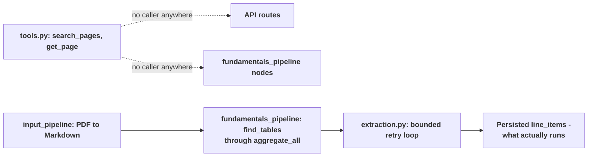

### Validation and normalization

**Interviewer:** A valid JSON response should be enough, should it not?

**Candidate:** No, for the reason we already touched on. A schema check proves the shape of the response, not that the number is right. The model can return well-formed JSON with the wrong period's column, or drop the parentheses off a negative figure, and a schema validator would pass it either way.

**Interviewer:** So what actually checks that?

**Candidate:** Five deterministic functions, pure Python, no LLM call, run against the aggregated output after every extraction pass:

- `check_bracket_sign` compares the model's normalized value against a `raw_text` field the extraction prompt is required to echo back. If the source table showed "(1,234)" next to a row, `raw_text` should read "(1,234)" and `value` should be `-1234`. If the model dropped the parentheses and returned `1234`, or flipped a positive figure negative, this catches the mismatch against that literal source token, not by re-parsing the table.
- `check_numeric_label` flags a label that's just a number, like "12,450," or a bare range like "100-150." That's almost always a misread column, where a bucket or header value stood in for the real row label.
- `check_duplicate_value_across_periods` flags two cells of the same line item, different periods, but an identical value, currency, and scale. Real figures essentially never repeat exactly across periods, so an exact match is a signal the same column got read twice.
- `check_ambiguous_duplicate_label` is the mirror image: the same label, same period, but multiple cells with genuinely different values.
- `check_period_type_consistency` checks the extractor followed its own contract: a balance-sheet cell has to be a point-in-time fact, and a flow-statement cell has to carry a period length of 3, 6, 9, or 12 months.

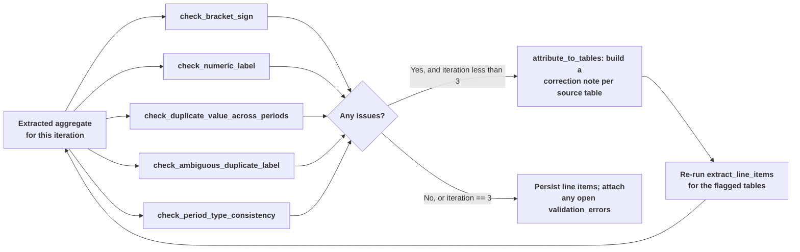

**Interviewer:** That ambiguous-duplicate check sounds oddly specific. What was the actual case?

**Candidate:** A Basel Pillar-3 disclosure, a probability-of-default table. Rows were bucketed by PD range: "0.50 to < 2.00," "2.00 to < 10.00," and so on. Each bucket row had roughly ten columns underneath it, original exposure, exposure at default, average LGD, average maturity, number of obligors. The model extracted every column under the same label, because the only text it saw printed against the row was the PD bucket itself. So the pipeline ended up with ten cells all claiming to be "0.50 to < 2.00" for the same period, with ten different values and no way to tell which cell was which metric. `check_ambiguous_duplicate_label` catches exactly that shape, same identity, genuinely different values, and the retry prompt tells the model to append the column header to the label, so it comes back as "0.50 to < 2.00, Original exposure" instead of ten indistinguishable rows.

**Interviewer:** Do any of these check the value against the actual page image or text?

**Candidate:** No, and I want to be direct about that limit. All five are structural checks against the model's own output. They catch a sign that contradicts its own raw text, a label that's obviously a misread, a value that repeats suspiciously, a value that's ambiguous, a period type that violates its own contract. None of them re-read the source page to confirm the number is actually correct. A value that's internally consistent, plausible sign, real-looking label, no duplicate, correct period type, but simply misread from the table, passes every check clean. There's also no cross-document check anywhere in this build. Each document is processed on its own, so a restatement or a conflicting figure across two filings for the same company isn't something this pipeline notices at all.

**Interviewer:** What happens to a table that's still flagged after three attempts?

**Candidate:** Whatever the third attempt produced gets persisted, with the still-open issues attached to the specific rows as a `validation_errors` list. The loop is hard-bounded at three, so it can't hang. Nothing gets silently dropped, and nothing gets silently trusted either. The analyst sees a flagged count on the document and can go find those exact rows.

### Derived metrics and downstream use

**Interviewer:** Should this agent calculate financial ratios?

**Candidate:** Not in this build, and I want to be clear that's a statement about what exists today, not a hedge. There's no ratio engine, no YoY or CAGR computation, anywhere in this codebase. If one were added, I'd keep it separate from extraction: the extraction pipeline produces validated inputs, revenue, operating profit, debt, equity, and a deterministic calculation service consumes them to compute margins or leverage. That way a wrong ratio is traceable to either a bad extracted input or a bad formula, never both at once.

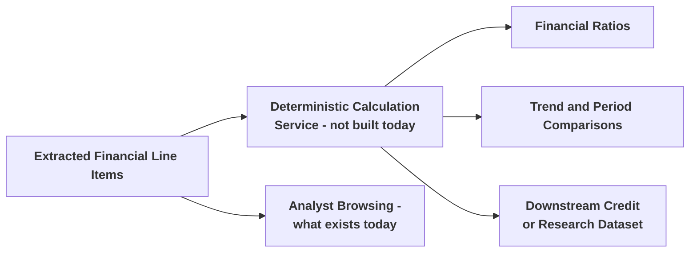

### Failure handling

**Interviewer:** What happens when a model call fails or a page can't be parsed?

**Candidate:** It depends on which layer fails. Inside `fundamentals_pipeline`, every LLM-backed node loops over its candidate tables one at a time and catches exceptions per candidate, so one bad table's failure gets logged to diagnostics and the rest of the document keeps going. At the document-batch level it's less forgiving: `run_and_persist` processes a whole upload batch inside one try block with a single commit at the end. If document two of three in a batch raises an unhandled exception, whatever got extracted for document one in that same batch is rolled back too, and the whole project's status goes to `"failed"` with the exception message stored in `raw_result`. There's no partial-success state for a batch.

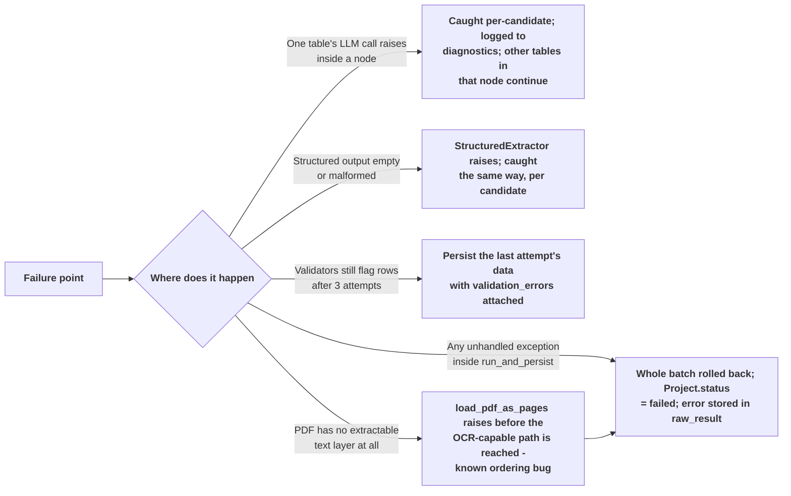

**Interviewer:** And a scanned document, specifically?

**Candidate:** That's the ordering bug I mentioned earlier. `input_pipeline` genuinely can OCR a fully scanned PDF, but `run_and_persist` calls `detect_issuer_metadata` first, which reads the raw text layer directly and has no OCR fallback of its own. So a fully scanned document fails there, before the OCR-capable extraction code ever runs. It's a real bug in the current build, not a documented limitation, and the fix is straightforward: either run the OCR-aware extraction before metadata detection, or give metadata detection the same OCR fallback the rest of the pipeline already has.

## 3.5 High-Level Design

**Interviewer:** Show the main architecture.

**Candidate:** It's smaller than people usually expect once you say it out loud. One FastAPI service, one Postgres database, local disk for the PDFs, and an optional S3 mirror. There's no separate queue, no workflow orchestrator, and no independent review or export service.

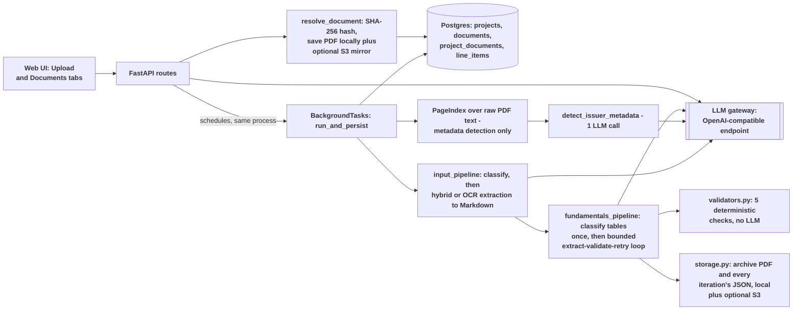

**Interviewer:** Where's the queue? Most document pipelines I've seen use one.

**Candidate:** There isn't one. `POST /projects` does the fast synchronous part, hash the upload, write the file, create the `Project` and `Document` rows, commit, and returns in well under a second. The actual extraction work is handed to FastAPI's `BackgroundTasks`, which runs it in the same process, right after the response has already gone out. That's not a durable job queue. If the process restarts while a background task is mid-run, that job is simply gone; there's no persisted queue entry for anything to pick back up. For the traffic this handles today, uploads in the tens per day, not per second, that trade-off is defensible. It stops being defensible the moment two people submit large batches at the same time, or the service needs to survive a restart without losing in-flight work.

**Interviewer:** I notice a Redis configuration block in the code.

**Candidate:** Right, and it's worth calling out because it looks like real infrastructure that isn't actually there. `redis` is a declared dependency in `requirements.txt` and `pyproject.toml`, and `config.py` wires up `redis_host`, `redis_port`, `redis_password`, and `redis_db` from environment variables. But nothing in `fin_doc_intel/` ever imports the `redis` package or opens a connection. It's vestigial, most likely left over from an earlier design that would have used it for job status or caching, and it should either be removed or actually wired up. Today it does nothing.

**Interviewer:** What about the review workspace and the export endpoint?

**Candidate:** Neither exists. The web UI's Documents tab is read-only: an analyst can browse a document's extracted line items next to the source PDF, but there is no control anywhere to correct a value, accept or reject a flagged row, or export the result to a file. `api/main.py` has no `/review`, `/rerun`, `/export`, or `/audit` route. If an analyst disagrees with a value today, the only path is outside this tool entirely.

**Interviewer:** What's the actual failure mode if the process dies mid-extraction?

**Candidate:** The `Project` row stays at `status = "processing"` indefinitely, because nothing else updates it. There's no heartbeat and no timeout that would flip it to `failed` on its own. An analyst polling `GET /projects/{id}/status` would see it stuck at 0.5 progress forever. That's a real gap. Somebody has to notice and either manually mark it failed or re-run the upload.

**Interviewer:** Which requests are synchronous, and which are asynchronous?

**Candidate:** `POST /projects` is synchronous through the database commit, then it hands off to the background task. Every read endpoint, `GET /projects/{id}`, `GET /projects/{id}/status`, `GET /documents`, `GET /documents/{id}`, `GET /documents/{id}/file`, is a plain synchronous database read. There's no async orchestration anywhere in the request path; `async def` on the FastAPI routes is what the framework expects, not a sign of concurrent work happening underneath.

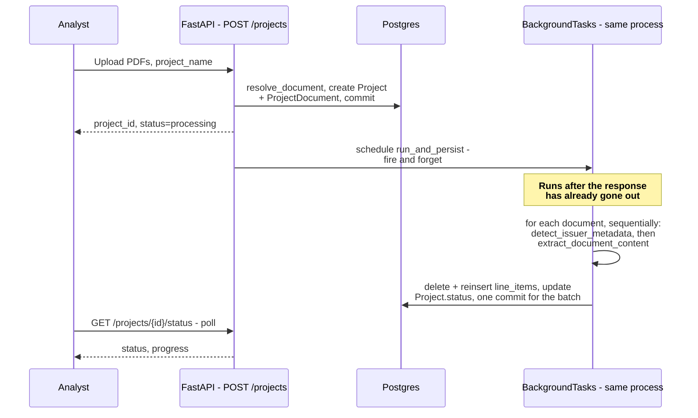

### What the analyst actually sees

**Interviewer:** Walk me through what the analyst is actually looking at once an upload finishes.

**Candidate:** There are exactly two tabs, and neither does anything beyond browsing what the pipeline already produced.


*Upload tab.* A drop zone for one or more PDFs, a "Select Files" button, and an "Analyze Documents" button that fires `POST /projects` with a hardcoded project name. There's no field to name the project or add a description, even though the API accepts both. Once submitted, the UI polls `GET /projects/{id}/status` every ten seconds and shows elapsed time until the batch completes or fails.


*Documents tab.* The left rail lists every document ever uploaded, each with its detected company name or a "Processing…" placeholder, and a flagged-count badge once validation has run. Selecting one shows four metadata cards (document name, company name, period end, document type), a validation card, "130 flagged · iteration 3/3" in this run, the source PDF rendered directly in an embedded viewer, and the extracted line items on the right, grouped into collapsible sections by statement type: "Balance Sheet (529 items)," "KPIs, Ratios & Other (44 items)," and so on for whichever statement types the document actually produced. Clicking a row with a page number jumps the embedded PDF to that page.

**Interviewer:** Can the analyst correct a value from here, or export the result?

**Candidate:** No. This is a read-only browsing surface. There's no accept-or-reject control on a flagged row, no inline edit, and no export button anywhere in this screen or in the API behind it. If a number needs fixing, the only lever available today is re-uploading the same file, which replaces every line item for that document from scratch, not just the one row that was wrong.

**Interviewer:** What does "130 flagged" actually tell the analyst?

**Candidate:** It's the count of line items whose `validation_errors` list was still non-empty after the third and final extraction attempt on this document, a dense Pillar-3 disclosure with hundreds of small table rows. "Iteration 3/3" means the retry loop used its full budget and still had open issues when it stopped. It doesn't mean 130 values are wrong; it means 130 values tripped one of the five structural checks and weren't cleared by the last retry. The analyst has to open those specific rows and judge them individually. There's no severity rollup or priority order beyond what each row's own flag list already says.

## 3.6 Low-Level Design

**Interviewer:** Break the design into modules that an engineer can implement.

**Candidate:** I'd describe the real modules as they exist, rather than as a cleaner set I might have designed from scratch.

| Module | Responsibility |
|---|---|
| Configuration | Environment-driven LLM and embedder clients, SSL bootstrap, storage and S3 settings |
| Schema | Flat, DB- and API-facing line-item shape (`schemas.LineItem`, `StatementType`) |
| Metadata index | In-memory, per-request cosine-similarity index over raw PDF text, used only for issuer, period, currency, and document-type detection, not for line-item extraction |
| Storage | Local-disk PDF and iteration-artifact storage, with a best-effort write-only S3 mirror when configured; S3 is never read back |
| Agent tools (dead code) | `search_pages`/`get_page` LangChain tools; no route, pipeline node, or test calls them |
| Pipeline boundary | Runs `input_pipeline`, then the fundamentals pipeline's classify-once stages, then the bounded extract/validate/retry loop; flattens cell-based output into flat `LineItem` rows |
| Document classification and extraction | Classifies text, scanned, or XBRL; hybrid text-plus-OCR extraction to Markdown; a local vision-language model handles table/image pages and fully scanned documents |
| Table extraction engine | Six-node table discovery, classification, and extraction pipeline, plus five deterministic post-extraction validators |
| Persistence | SQLAlchemy models, session and engine setup (`create_all` only, no migrations), and the orchestration that resolves documents, runs the pipeline, and deletes and reinserts line items |
| API | FastAPI routes for upload, status, document listing and detail, and file streaming |

**Implementation reference:** `config.py`, `schemas.py`, `pdf_index.py`, `storage.py`, `tools.py`, `extraction.py`, `input_pipeline/`, `fundamentals_pipeline/`, `db/`, `api/main.py`.

**Interviewer:** You mentioned an ordering bug in the input pipeline earlier. Where does that actually sit in this module breakdown?

**Candidate:** Between the metadata index and the pipeline boundary. `pdf_index.py`'s `load_pdf_as_pages` raises when a PDF has no extractable text layer, and `extraction.py`'s caller (`db/persistence.py::run_and_persist`) calls that before it calls into `input_pipeline`'s OCR-capable extraction. So the module doing OCR is fine on its own; the problem is purely in call order at the orchestration layer.

### Service contracts

**Interviewer:** Show me the service contracts, the interfaces between these modules.

**Candidate:** There aren't formal interfaces here, and I'd rather say that plainly than sketch ones that don't exist. There's no `Protocol`-based abstraction anywhere in this codebase for a document repository, a retriever, or an extractor. The real extractor is a concrete class, `StructuredExtractor`, in `fundamentals_pipeline/structured_llm.py`. It binds a Pydantic schema to a chat model with `llm.with_structured_output(schema, method="function_calling")` and raises if the model returns nothing.

**Interviewer:** Why not build that interface? Isn't that just good practice, so you can swap providers or mock it out for tests?

**Candidate:** The reference implementation this was ported from did have that abstraction, because it supported two providers, an Azure OpenAI client and a local HuggingFace model. This codebase has exactly one provider; everything goes through `config.get_llm()` against a single OpenAI-compatible gateway. Keeping a provider-selection interface around for one real implementation is indirection with nothing behind it, a reader has to go through the `Protocol` to find the one class that actually runs. The team's own documentation says this directly: that layer was deliberately dropped as dead code rather than carried forward out of habit. If a second provider shows up, that's when the interface earns its keep, not before.

**Interviewer:** How do you test the extraction node in isolation today, without that interface?

**Candidate:** You'd construct a `StructuredExtractor` against a fake or recorded LLM response, since it's a plain class, not a hardcoded call into a live gateway inside the node function. The five validators are the easiest part of this to test well, they're pure functions over a plain dict, no LLM and no network call at all; `tests/test_validators.py` already does that against synthetic data.

### Processing state

**Interviewer:** Walk me through the state machine.

**Candidate:** It's three states, all on `Project.status`: `processing`, `completed`, `failed`. `create_project_and_documents` sets it to `processing` the moment the row is created, so `completed` and `failed` are the only transitions that ever actually happen at runtime.

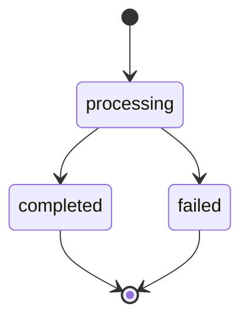

**Interviewer:** The column comment I've seen references `created, processing, completed, failed`. Where does `created` show up?

**Candidate:** Nowhere in practice. The column's default value is the string `"created"`, but `create_project_and_documents` always sets `status="processing"` explicitly at insert time, in the same call that creates the row. So the schema technically allows a fourth value the running code never actually produces. There's also no per-document status column at all. `Document` has no status field, so a document with zero line items looks identical whether it's still being processed or its extraction run failed outright; the only way to tell is to check whether its parent project has finished.

**Interviewer:** What about a richer state machine, submitted, validating, extracting text, OCR required, review required, exported? I've seen that shape in similar systems.

**Candidate:** That's target design, not what's built. A richer per-document machine along those lines would genuinely help, especially separating "extraction succeeded with zero flags" from "extraction ran but everything is still flagged" from "extraction never started." None of those states exist as real column values anywhere in `db/models.py` today. If I were prioritizing what to add next, a per-document status column would rank above almost everything else here, because right now a stuck job and a cleanly finished job can look identical from the outside for any single document, and that's a real operational blind spot.

**Interviewer:** What happens today when an analyst notices a value is wrong?

**Candidate:** They can't fix it in the tool. There's no correction UI and no endpoint that accepts a correction. The only lever is re-uploading the same file, and because `resolve_document` matches by content hash, that only reprocesses anything if the source bytes actually changed; uploading the identical file just reruns extraction on the same document and produces a broadly similar, not necessarily identical, result, since the model isn't perfectly deterministic even at temperature zero.

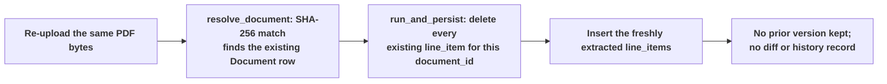

**Interviewer:** If you were going to add a real correction workflow, what would it take?

**Candidate:** More than a new endpoint. A document's line items get deleted and reinserted wholesale on every reprocess today, so there's no place for a correction to attach to that would survive the next run. At minimum you'd need a source flag distinguishing an analyst-entered value from a model-extracted one, and probably a separate table for corrections so a reprocess doesn't wipe out someone's manual fix. None of that exists today.

### API contracts

| Method and path | Purpose |
|---|---|
| `GET /` | Serves the web UI |
| `GET /health` | Liveness and readiness check, no database touch |
| `POST /projects` | Upload one or more PDFs plus a project name; resolves and dedupes each document, creates `Project` and `ProjectDocument` rows, schedules the background extraction job, returns immediately |
| `GET /projects/{project_id}` | Project status plus every linked document's summary and line-item/flagged counts |
| `GET /projects/{project_id}/status` | `{project_id, status, progress}`, where progress is a coarse map: `processing` → 0.5, `completed`/`failed` → 1.0 |
| `GET /documents` | Every document ever uploaded, globally, newest first |
| `GET /documents/{document_id}` | One document's metadata plus every extracted line item, including any open validation flags |
| `GET /documents/{document_id}/file` | Streams the original PDF for the embedded viewer |

**Interviewer:** Where's the review endpoint? The rerun endpoint? Export?

**Candidate:** They don't exist. There's no `POST /documents/{id}/review`, no `/rerun`, no `/export`, no `/audit`. If those were added later, rerun is probably the easiest, since re-uploading the same bytes today already triggers `resolve_document` to find the existing row and `run_and_persist` to delete and reinsert its line items; a rerun endpoint would mostly be a thin wrapper that skips the upload step and calls the same background function against an existing `document_id`. Review and export are bigger, they need both a UI affordance and a data-model change, since today's schema has no way to distinguish a corrected value from an extracted one, so I wouldn't describe them as "almost there."

## 3.7 Data and Database Schema Design

**Interviewer:** Show how you'd store documents, facts, and their relationships.

**Candidate:** Four tables, and I want to be precise about them because the real schema is much flatter than a system like this usually ends up being.

### Entity relationship diagram

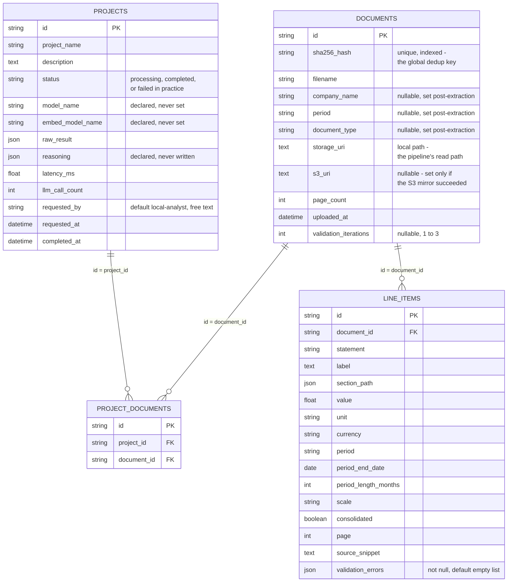

**Interviewer:** Why is `Document` not a child of `Project`?

**Candidate:** Because documents are deduplicated globally, not per project. `documents.sha256_hash` carries a unique constraint across the whole table, not scoped to any one project. If the same PDF is uploaded in two different batches, `resolve_document` finds the existing row by hash and reuses it instead of creating a second copy. `project_documents` is a pure join table, two foreign keys and nothing else, no status or metadata of its own. A `Document` owns its storage path, its detected metadata, and every line item extracted from it, independent of which project or projects ever referenced it.

**Interviewer:** What happens to a document's line items when it's reprocessed?

**Candidate:** They're deleted and reinserted, not preserved. `run_and_persist` runs a delete against `LineItemRecord` filtered on that `document_id`, then inserts every freshly extracted row, all inside the same transaction as the rest of that batch's commit. I want to correct myself if I've implied otherwise earlier: this is not preserved for historical reconstruction. The moment a document is reprocessed, the prior extraction is gone. There's no document-version table, no run history, and no way today to diff what changed between this run and the last one for the same document. For a restated filing, that would matter, and it's a real gap, not a hedge.

**Interviewer:** How do you know that's a genuine operational issue and not just a design opinion?

**Candidate:** Because it already caused an incident, and it's the kind of thing that's easy to underestimate until it happens. There's no Alembic in this repository, no migration tooling of any kind. `init_db()` just calls `Base.metadata.create_all()` on startup, which only creates tables that don't exist yet; it doesn't alter ones that do. When the validation-loop and document-type columns were added to the models, the first upload against an existing development database raised a live `psycopg2.errors.UndefinedColumn`, because the running Postgres instance still had the old table shape. Fixing it meant a manual `ALTER TABLE ... ADD COLUMN IF NOT EXISTS` against the live database. That's a runbook step today, not something the code handles for you.

### Data lineage

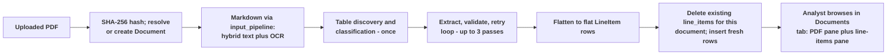

**Interviewer:** What's the most important design decision in this system?

**Candidate:** Keeping a hard line between what the model produced and what's been independently verified, even though today that line is thinner than I'd like it to be. Every line item carries its statement type, its section path, its source page, and whatever validation issues are still open on it. But I'd be overstating this system if I called any of that "verified." The five checks are structural, they catch a model contradicting its own output, not a model being wrong about the source document. Nothing here re-reads the page image or the literal source text to confirm a value. That's the real gap between what this build does today and what it would take to call the output trustworthy without a human spot-check.

## Repository

[Open the Financial Document Intelligence Agent implementation on GitHub](https://github.com/GSaiDheeraj/Finance-and-Banking-AI-Usecases/tree/main/FinDoc_IIntelligence_Agent)
