# Chapter 5: HNI Customer Onboarding Risk Assessment Agent

> **Implementation repository:** [Fraud Detection Agent repository](https://github.com/GSaiDheeraj/Finance-and-Banking-AI-Usecases/tree/main/Fraud_Detection_Agent)
>
> **Naming correction:** In this chapter, the repository is used as the implementation reference, but the business problem is HNI Customer Onboarding Risk Assessment. This is a KYC and Enhanced Due Diligence workflow, not a generic transaction-fraud detection system.
>
> **System boundary:** The agent helps collect and organize onboarding evidence, understand ownership and control, review source of wealth and source of funds, screen relevant people and entities, identify risk factors, and prepare a case for compliance review. It does not make the final onboarding decision or replace a compliance officer or MLRO.

## 3.1 Business Context and Stakeholders

**Interviewer:** A private bank wants to reduce the time needed to onboard high-net-worth customers. Design an AI solution.

**Candidate:** Before I propose anything, I need to understand what makes the onboarding process slow. Is the delay caused by identity-document collection, ownership analysis, source-of-wealth review, sanctions screening, adverse-media review, manual case preparation, or approval queues?

**Interviewer:** The bank says the cases are complex and reviewers spend too much time reading documents and assembling the file.

**Candidate:** Are we onboarding individuals only, or also family offices, trusts, foundations, holding companies, partnerships, and operating companies? Does one customer often involve several connected entities and jurisdictions?

**Interviewer:** The bank handles wealthy individuals and family structures. Some relationships include companies, trusts, foundations, and several countries.

**Candidate:** Then this is not a simple identity-verification workflow. The system needs to understand the customer, connected entities, ownership and control, source of wealth, source of funds, purpose of the relationship, screening results, and unresolved questions. What is the final output expected from the system?

**Interviewer:** Compliance analysts want a case package with a risk score and a recommendation. A senior reviewer makes the final decision.

**Candidate:** I would define the product as a decision-support and case-preparation system. It can gather evidence, extract facts, construct an ownership graph, summarize screening results, calculate a configured risk score, and recommend approve, request more information, escalate, or reject. The final action must remain with an authorized compliance officer or MLRO.

**Interviewer:** Why not let the AI approve low-risk customers automatically?

**Candidate:** That depends on the bank’s policy and approval framework, but I would not assume it is safe. Even a case that appears low risk may contain a hidden ownership issue, a false negative in screening, or a mismatch in the source-of-wealth evidence. If the bank later permits straight-through processing for a narrow low-risk population, it should be a separately approved workflow with clear eligibility rules, monitoring, and human escalation. The general agent should not make that decision by itself.

**Interviewer:** How many onboarding cases are we actually talking about?

**Candidate:** That matters for the design. Are we looking at a handful of cases a week or a few hundred a month? And is there a document management system, a sanctions screening vendor, or a case management tool already in place, or does the agent need to be the system of record?

**Interviewer:** It is a few hundred cases a month across the private bank. They already use a licensed screening vendor for sanctions and PEP checks, and a case management tool where analysts currently log their notes manually. There is no dedicated document repository beyond shared drives.

**Candidate:** Then the agent should call the existing screening vendor rather than build a second screening capability, and it should write into the existing case management tool rather than replace it. At a few hundred cases a month, I would not assume we need high-throughput batch processing. I would design for one case at a time, reviewed carefully, rather than a queue built for volume the business does not have yet.

**Interviewer:** What regulatory constraints apply here?

**Candidate:** I would want to know the specific regime, but for a private bank doing HNI onboarding this is almost always an AML and CFT framework with enhanced due diligence requirements for higher-risk customers, plus local regulator expectations on record-keeping and suspicious-activity reporting. Which regulator governs this book, and is there an existing EDD policy that defines what triggers escalation to the MLRO versus what a compliance officer can clear alone?

**Interviewer:** The bank is regulated locally with FATF-aligned AML obligations. Anything with a confirmed sanctions hit, a PEP with adverse media, or a source-of-wealth explanation the analyst cannot verify goes to the MLRO. Everything else stays with the compliance officer.

**Candidate:** That gives me a concrete routing rule I can encode as policy rather than something the model decides case by case. I also want to understand the asymmetry in errors. If the system lets a case through that should have escalated, that is a regulatory exposure and a potential finding in an audit. If it over-escalates a clean case, that is wasted MLRO time and a slower onboarding for a legitimate customer. Those are not equally bad, so I would bias the design toward escalating when evidence is incomplete or a match is uncertain, rather than trying to force a clean decision out of ambiguous evidence.

**Candidate:** I would want to map out who actually touches a case before I design the workflow. Who brings the customer in, who does the day-to-day review, who can approve or escalate, and who else needs oversight of the process?

**Interviewer:** Relationship managers and private bankers gather information and manage the customer relationship. KYC analysts review documents, ownership, and screening results. Compliance officers assess risk and approve, reject, or set conditions. The MLRO handles serious or unresolved financial-crime concerns and senior escalations. Legal and tax specialists advise on complex structures, trusts, foundations, and jurisdictional issues when needed. Operations and onboarding teams track document completeness and customer communication. Model-risk, data-governance, information-security, internal-audit, and regulatory teams need explainability, access control, lineage, retention, and reproducibility.

**Candidate:** That is a wide group with different responsibilities over the same case. The relationship manager and operations team care about completeness and speed, the analyst and compliance officer own the actual assessment, the MLRO owns the hardest cases, and the governance functions need the same evidence trail to stay intact regardless of who is looking at it. I would design the case record so all of those roles are reading from one consistent version of the evidence rather than separate summaries that can drift apart.

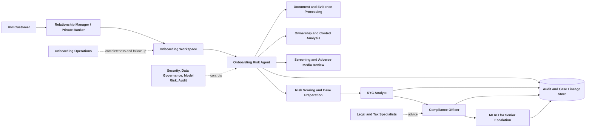

**Interviewer:** What is the biggest difference between this system and a fraud detector?

**Candidate:** A fraud detector usually looks for suspicious activity around transactions, accounts, or events. This system assesses a customer relationship before or during onboarding. It focuses on identity, ownership, control, source of wealth, source of funds, purpose, screening, jurisdiction, and enhanced due diligence. Some financial-crime risks overlap, but the workflow, evidence, reviewers, and decision point are different.

## 3.2 Business Requirements and Success Metrics

**Interviewer:** The business wants faster onboarding.

**Candidate:** Before I define requirements, I need the current baseline. How long does a normal HNI onboarding case take? How long does an EDD case take? Which document types create the most manual work? What percentage of cases are returned for missing documents? How many screening alerts become false positives? Which cases must go to an MLRO?

**Interviewer:** There is no hard baseline yet, but reviewers say case preparation and document chasing are the biggest time sinks, not the final compliance decision itself. Assume the bank wants a structured case package for compliance analysts, and the first release should support individual customers and common family structures.

**Candidate:** Given that, what functions does the first release need to cover, concretely?

**Interviewer:** It needs to create an onboarding case that records the customer, relationship, purpose, and jurisdiction context. Upload and classify identity, address, corporate, trust, foundation, source-of-wealth, and source-of-funds documents. Extract names, dates, identifiers, ownership percentages, roles, addresses, countries, wealth sources, fund sources, and document validity dates. Construct a reviewable ownership and control graph. Run approved sanctions, PEP, and adverse-media checks, matching results to the correct person or entity rather than relying on name similarity alone. Calculate a versioned risk score using controlled factors and weights, identify missing evidence, conflicting information, false-positive concerns, and escalation triggers, and generate a case summary with citations and open questions. Route the case to a KYC analyst, compliance officer, or MLRO, and preserve every important action and version.

**Candidate:** That maps cleanly onto the case lifecycle: intake, evidence extraction, ownership analysis, screening, scoring, summarization, and routing. I would build and test each stage against its own evidence rather than treating the case as one opaque step, since that is the only way an analyst can tell which stage produced a wrong answer.

**Interviewer:** Should the system automatically reject a customer when it finds adverse media?

**Candidate:** No. Adverse media is evidence for review, not an automatic conclusion. The system should check whether the result concerns the same person or entity, assess source reliability and relevance, identify the type and date of the allegation, and show the evidence to the reviewer. A confirmed sanctions match may trigger a policy hard stop, but even then the process should record the screening source, match rationale, and authorized decision.

**Interviewer:** What metrics should we use?

**Candidate:** I would measure speed, completeness, screening quality, review effort, and control quality:

| Metric | What it measures |
|---|---|
| Time to complete initial case pack | Reduction in analyst preparation time |
| Time to compliance decision | End-to-end onboarding improvement |
| Document completeness rate | Whether required evidence is collected early |
| Extraction correction rate | Quality of document understanding |
| Ownership-graph correction rate | Quality of relationship and control extraction |
| Screening precision | Share of alerts that are relevant matches |
| Screening recall | Share of known relevant matches detected |
| False-positive review time | Operational burden on compliance |
| Escalation quality | Whether the right cases reach senior review |
| Risk-score reproducibility | Whether the same approved inputs produce the same result |
| Audit completeness | Ability to reconstruct the case |
| Customer abandonment rate | Impact on customer experience |

**Interviewer:** Why not just track time to complete the initial case pack? That is the number the private bank actually cares about.

**Candidate:** Because it can hit target for the wrong reason. If the agent prepares a faster case pack by loosening screening or skipping ownership detail, the time metric improves while the false-positive review burden or a missed match risk climbs. I would never report case-pack time without screening precision and recall next to it, since those tell me whether the speed came from real automation or from cutting the review shallower.

**Interviewer:** If the system reduces onboarding time but increases false positives, is that success?

**Candidate:** No. It may simply move the cost from onboarding operations to compliance. The useful goal is controlled speed: faster document processing and case preparation without reducing screening quality or creating an unmanageable review queue.

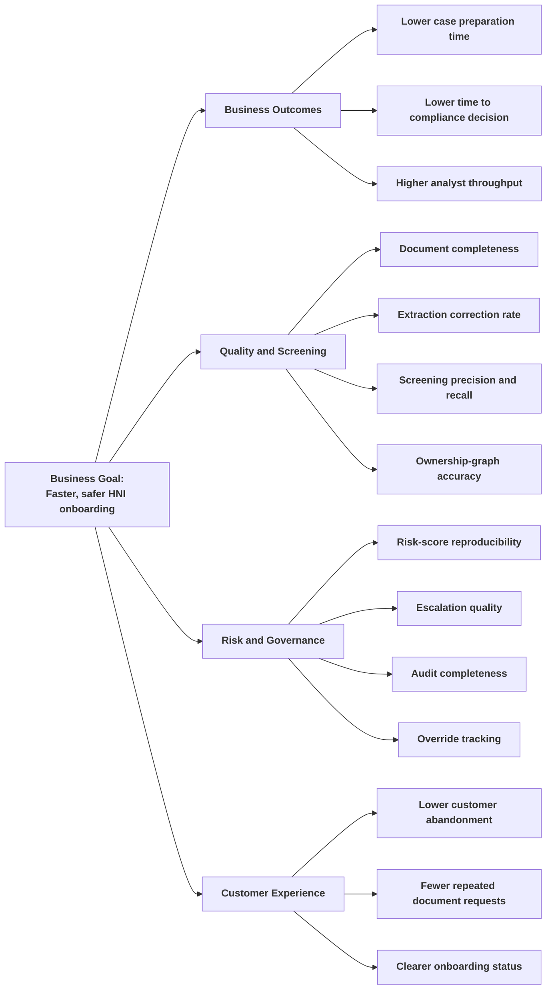

**Interviewer:** What must the agent never do?

**Candidate:** It must not hide a missing document, convert an uncertain identity match into a confirmed match, infer beneficial ownership without evidence, treat a politically exposed person as automatically suspicious, allow a customer to bypass required review, or approve a high-risk relationship without an authorized decision-maker.

## 3.3 Data and Inputs

**Interviewer:** The relationship manager will upload customer documents. What else do you need?

**Candidate:** I need the customer’s legal identity, relationship purpose, expected activity, countries of residence and operation, involved people and entities, ownership structure, source of wealth, source of funds, and relevant account or product information. I also need to know which screening providers and policy repositories are approved.

**Interviewer:** The first release supports individuals, companies, trusts, and foundations. The customer may have several countries and connected parties.

**Candidate:** Then the data model must represent people, legal entities, relationships, ownership percentages, control rights, roles, jurisdictions, and evidence separately. A flat customer table will not be enough. We need a graph or graph-like relational model for ownership and control.

**Interviewer:** What documents are normally involved?

**Candidate:** The exact list depends on the bank’s policy, but typical inputs include:

- Identity documents and proof of address.
- Incorporation certificates and company registers.
- Shareholder and director records.
- Trust deeds, trustee records, protector details, and beneficiary information.
- Foundation charters and council or board records.
- Ownership charts.
- Bank statements and investment statements.
- Tax records, sale agreements, inheritance documents, or audited accounts supporting source of wealth.
- Transfer records or account statements supporting source of funds.
- Relationship-purpose and expected-activity information.
- Screening results from approved sanctions, PEP, and adverse-media sources.

**Interviewer:** Why separate source of wealth from source of funds?

**Candidate:** Source of wealth explains how the customer accumulated wealth over time. Source of funds explains where the money for a particular account, investment, or transaction came from. A customer may have a credible business-sale history but still need to explain the specific transfer funding the relationship. The system should not treat one as proof of the other.

### Input categories

| Category | Examples | Purpose |
|---|---|---|
| Customer identity | Name, date of birth, nationality, address, identity number | Verify the individual |
| Entity identity | Legal name, registration number, registered address, directors | Verify connected entities |
| Ownership and control | Shareholders, ownership percentages, voting rights, trustees, protectors, beneficiaries | Identify UBOs and controllers |
| Source of wealth | Business sale, employment, inheritance, investments, property sale | Understand accumulated wealth |
| Source of funds | Bank statements, transfer records, sale proceeds, account history | Understand money used for the relationship |
| Relationship purpose | Products requested, expected activity, countries, counterparties | Assess whether intended use is plausible |
| Screening data | Sanctions, PEP, adverse media, watchlists | Identify relevant financial-crime concerns |
| Reference data | Country risk, customer-risk factors, policy thresholds | Apply controlled scoring and escalation |
| Execution metadata | Case ID, document hash, provider, timestamp, model and rule version | Reproduce and audit the case |

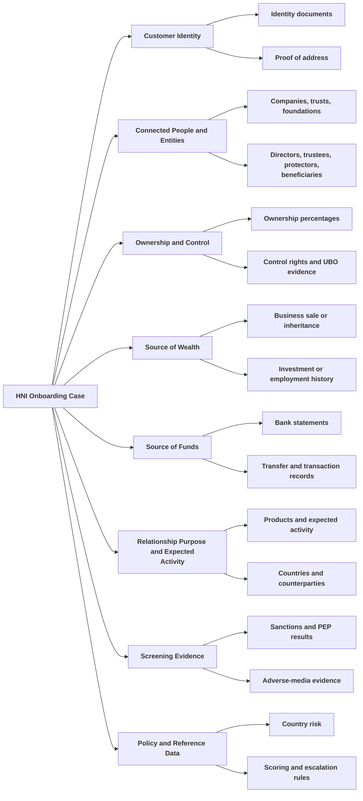

### Data and evidence lifecycle

```mermaid
%%{init: {'themeVariables': {'fontSize': '16px'}}}%%
flowchart LR
    classDef default font-weight:bold;
    A[Customer and Case Metadata] --> B[Uploaded Documents]
    B --> C[Document Classification and<br/>Extraction]
    C --> D[Candidate Identity, Ownership, and<br/>Wealth Facts]
    D --> E[Evidence and Consistency Validation]
    E --> F[Ownership and Control Graph]
    F --> G[Screening and Match Assessment]
    G --> H[Risk Factors and Score]
    H --> I[Compliance Case Package]
    I --> J[Human Review and Decision]
```

**Interviewer:** What if the customer’s name matches a sanctioned person in the screening results?

**Candidate:** A name match is not enough. The system should compare date of birth, nationality, residence, employer, entity affiliation, known associates, and other permitted identifiers. It should present the match confidence and source evidence. The case should be held for review when identity cannot be resolved.

**Interviewer:** Should public web search be allowed?

**Candidate:** Only through approved sources and policy. Public information can help identify relevant adverse media, but it may be outdated, incomplete, sensational, or about another person with the same name. The source, retrieval time, entity match, and reviewer assessment should be stored. Web evidence should not silently override authoritative identity or corporate records.

**Interviewer:** What if there is no document at all? Say a relationship manager wants to pre-screen a prospect before the customer has handed over anything, and all they have is a name.

**Candidate:** That is a genuinely different input shape, not a degraded version of the document case. Instead of a pack of PDFs, the input becomes a small seed record: the person's full name, and whatever else the relationship manager happens to know already, such as an approximate age, a location, a nationality, prior employers, or companies they are known to be associated with. Everything past the name is optional. The agent then has to go find the evidence itself instead of reading it out of an uploaded file.

**Interviewer:** Find it where?

**Candidate:** Public web sources: general search, news search, and an encyclopedia lookup, none of which require a paid data license or an API key. That changes the shape of the whole pipeline downstream of intake, so I would rather walk through it properly as its own strategy in the next section rather than compress it into one answer here. The short version: it researches the person across a fixed set of angles, has a model turn what it found into a structured profile, and then converts that profile into the same party and relationship records the document path would have produced, so it can be scored by the identical deterministic engine.

**Interviewer:** Is that a future capability, or does it exist today?

**Candidate:** It exists today. It is not a stub or a slide. I would still flag its limits honestly when we get there, but the collection, the profile synthesis, and the conversion into scoring inputs are real, working code paths, and the product UI already treats it as a first-class entry point, not an afterthought bolted onto the document flow.

### Input categories, extended

| Category | Examples | Purpose |
|---|---|---|
| Name-only seed | Full name, aliases, approximate age or date of birth, location, nationality, education, prior employers, known companies | Starting point for public-record research when no documents exist |

The seed record deliberately does not ask for a document count or a file type, because there may be zero files. It asks only for what a relationship manager could plausibly already know from a first conversation.

## 3.4 Solution Strategy and Pipeline Logic

**Interviewer:** Give me the design in one sentence.

**Candidate:** The agent builds an evidence-backed picture of the HNI customer and connected structure, deterministic services apply screening and risk rules, and authorized compliance professionals decide whether to approve, request more information, escalate, or reject the relationship.

**Interviewer:** Why not ask one LLM to read the entire case and assign a high, medium, or low risk rating?

**Candidate:** That would hide the most important parts of the process. The bank needs to know which facts produced the risk result, whether the identity matched, who controls the entities, which documents support source of wealth and source of funds, which screening rules were applied, and why escalation occurred. The LLM can interpret documents and summarize evidence. A controlled risk engine should apply the score and routing rules.

### End-to-end pipeline

**Candidate:** There are two entry points that converge on the same core. The document path reads an uploaded pack; the name-only path researches a person from scratch. Both hand off to the identical UBO resolution, screening, and scoring engine, which is the part I actually want the bank to trust.

```mermaid
%%{init: {'themeVariables': {'fontSize': '16px'}}}%%
flowchart LR
    classDef default font-weight:bold;
    A1[Path A: Relationship Manager uploads<br/>KYC pack] --> B[Index pages and extract identity,<br/>ownership, wealth, and funds facts]
    A2[Path B: Relationship Manager supplies<br/>a name and a few known details] --> C[Collect public evidence across 8<br/>research angles]
    C --> D[Synthesize a 360-degree profile with<br/>a disambiguation-confidence score]
    D --> E[Convert the profile into the same<br/>party and relationship records]
    B --> F[Build ownership and control graph]
    E --> F
    F --> G[Identify UBOs and relevant connected<br/>parties]
    G --> H[Run approved sanctions, PEP, and<br/>adverse-media screening]
    H --> I[Resolve identity matches and assess<br/>source quality]
    I --> J[Calculate controlled customer-risk<br/>factors]
    J --> K[Apply escalation and hard-stop rules]
    K --> L[Generate evidence-backed case summary]
    L --> M[KYC Analyst Review]
    M --> N{Review outcome}
    N -->|Complete| O[Compliance Officer Decision]
    N -->|More evidence| P[Request documents or clarification]
    N -->|Concern unresolved| Q[Escalate to MLRO]
    N -->|Potential match or hard stop| R[Specialist or senior review]
```

### Document processing and extraction

**Interviewer:** Why not ask the relationship manager to enter all fields manually?

**Candidate:** Manual forms are still useful for information that only the relationship manager knows, such as relationship purpose and expected activity. But copying names, dates, registration numbers, ownership percentages, and source-of-wealth details from documents creates avoidable errors. The agent can extract candidate facts and let the analyst verify them against the source.

**Interviewer:** What happens with an ownership chart?

**Candidate:** Today, honestly, less than I would like. The current build extracts text only, using PyMuPDF to read each page and hand it to the grounded extraction step as plain text. There is no OCR and no layout-aware or multimodal parsing of the chart itself. If a page has selectable text, for example a shareholder table or a chart where the boxes and percentages are real text objects in the PDF, the LLM can read that text and propose the ownership edges from it. If the ownership chart is actually a scanned image or a picture pasted into the document, with no extractable text layer at all, the current build cannot read it.

**Interviewer:** What happens then? Does it skip that document and process the rest?

**Candidate:** No, and this is a real limitation I would flag rather than gloss over. If a page produces no extractable text, the loader raises an exception and the whole assessment for that pack aborts, it does not degrade gracefully to "process what we can." In production I would want the failure to be scoped to the offending document, with the rest of the pack still processed and the image-only page flagged for manual entry or an OCR add-on, but that is not what the code does today. This is squarely a production gap, not a design choice I am defending.

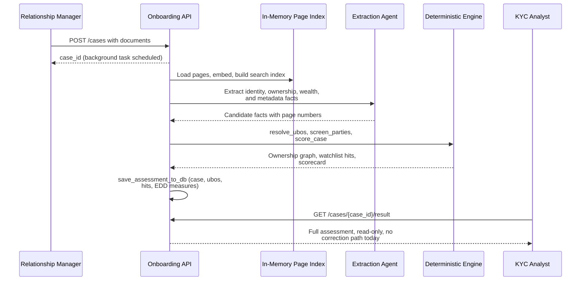

### Name-only research mode

**Interviewer:** Go back to the name-only path you mentioned earlier. Walk me through it properly this time.

**Candidate:** The seed is a `SubjectSeed`: a full name, plus whatever optional details are known, such as aliases, an approximate age, a location, a nationality, prior employers, and companies the person is known to be associated with. From there the pipeline runs three stages before it ever touches the deterministic engine.

First, evidence collection. The system researches the person across eight fixed angles: biography, professional history, company performance, adverse media, political exposure, social and behavioral signals, relationships, and wealth. For each angle it builds a handful of plain-language search queries out of whatever seed details exist, for example combining the name with "director OR founder OR partner OR CEO" for the professional angle, or "fraud OR investigation OR lawsuit OR scandal" for adverse media. Every query runs against free search backends: DuckDuckGo is the primary and most reliable one, a free Google-results scrape tops it up only if DuckDuckGo comes up short, and Wikipedia is queried once for a biography summary if a page exists. None of these need an API key or a paid subscription. Adverse media and company-performance queries additionally run a DuckDuckGo news search, since a fresh news hit is often more relevant than a stale web result. Results are deduplicated by URL or by the first chunk of the snippet, so the same finding surfacing under two queries only counts once.

**Interviewer:** That sounds like it could return a lot of noise for a common name.

**Candidate:** It can, and the second stage exists specifically to manage that. The collected evidence, usually somewhere between eighty and a hundred and twenty snippets in practice, gets handed to an LLM in one call. Its job is language work only: read the snippets, and produce a structured profile with a biography, a professional summary, every company affiliation it can find, every named relationship such as a spouse or business partner, any adverse-media findings with a category and severity, any political-exposure indicators, a wealth summary, and a plain-language behavioral read. Critically, it also has to output a `disambiguation_confidence` of low, medium, or high: is this actually the same person as the seed, given the name, location, and job all have to line up, or did half these hits belong to someone else who happens to share a name? The prompt is explicit that low confidence does not mean the model should return nothing; it should still extract what the evidence says and just flag the uncertainty, because a reviewer needs to see what was found even when the match is shaky.

**Interviewer:** And then that profile becomes risk-scoring input how?

**Candidate:** That is the third stage, and it is the part that makes this whole path worth building rather than being a separate toy feature: `profile_to_parties` converts the synthesized profile into exactly the same `Party` and `Relationship` records the document path produces. The subject becomes party S1 with the applicant role. Every named relationship becomes its own party, tagged as a spouse or an authorized person depending on the relation word the evidence used, and if the profile flagged that relative as politically exposed, that turns into a watchlist hit right there. Every company affiliation becomes a party too, with a director, partner, or shareholder role depending on what the evidence said. Adverse-media and PEP findings from the web become their own watchlist hits, separate from whatever the static list screening finds. From that point on, it is indistinguishable to the deterministic engine whether the parties came from a PDF or from a name search: the same `resolve_ubos`, the same `screen_parties`, the same `score_case` run over them, and the same EDD narrative gets written at the end.

**Interviewer:** Is the risk score from this path reproducible the same way the document path's score is?

**Candidate:** The scoring math is, given a fixed set of findings, exactly reproducible; that part does not change based on which path fed it. What is not reproducible is the collection step, because it depends on the live web. Run the same name search two days apart and DuckDuckGo may return different results, a news story may have appeared or disappeared, a page may have been taken down. That is inherent to open-source research, not a flaw I can engineer away, so the honest framing is that the assessment is deterministic given its evidence, but the evidence itself is a snapshot in time, and the trace records exactly what was collected and used so a reviewer can see why two runs might disagree.

**Interviewer:** How does a web-sourced adverse-media hit compare in severity to a hit from a proper screening list?

**Candidate:** Deliberately not the same. I will go through the exact mechanics when we get to risk scoring, but the short version is that web findings are trusted less than curated-list hits by construction, so a single vague news mention cannot on its own push the case into the worst band.

### Ownership and control graph

**Candidate:** The graph should represent people, entities, trusts, foundations, ownership links, control links, and roles. Ownership and control are not always identical. Someone may have significant control through voting rights, trustee powers, protector rights, or contractual arrangements even without the largest ownership percentage.

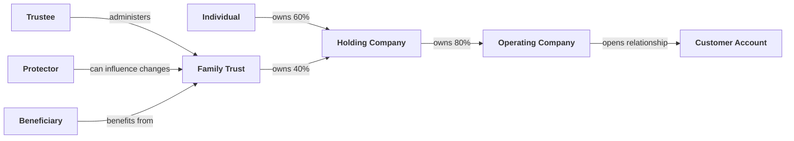

**Interviewer:** Why not infer the UBO from the largest shareholding only?

**Candidate:** That misses indirect ownership and control rights, and it is not just a theoretical objection, it is exactly what the resolution algorithm underneath this graph is built to avoid. The engine does a depth-first traversal from every natural person, following every ownership edge that leads toward the applicant, and it sums the ownership fraction across every path it finds, not just the largest one.

**Interviewer:** Give me a concrete case where that matters.

**Candidate:** Say a person owns 60 percent of Company A directly, and Company A owns the applicant entity. If that were the whole structure, their effective ownership would be a straightforward 60 percent. Now add a second path: the same person also owns 100 percent of Company B, and Company B owns the remaining 40 percent of the applicant. Looking at either path alone, you might report 60 percent or you might report 40 percent, and either number understates reality. The traversal walks both paths, multiplies the percentages along each one, 60 percent for the direct path and 100 percent times 40 percent for the indirect one, and sums them: 60 plus 40 is 100 percent effective ownership. That person owns the entire applicant, just split across two vehicles, and a single-largest-path rule would have missed that they own it outright.

**Interviewer:** How does someone actually qualify as a UBO once you have that number?

**Candidate:** There are three ways, and they are checked in a specific order. The first is the ownership basis: effective ownership at or above a configured threshold, 25 percent by default, which matches the FATF-style convention most banks already use. The second is a control basis that does not require crossing any ownership percentage at all: holding a role like settlor, trustee, protector, director, or sole signatory makes someone a UBO on control grounds even if their ownership share is small or zero, because those roles can direct the entity regardless of who technically holds the equity. The third is a fallback for the case where nobody clears either bar: if no party meets the ownership threshold and nobody holds a qualifying control role, the system names the most senior director on record as UBO on a control basis anyway, with a note explaining why. The reasoning is that a bank should never end up with zero named UBOs just because a structure was designed to obscure who is really in charge; someone has to be named as the accountable natural person, even if the honest answer is "the senior managing official, for lack of a clearer candidate."

**Interviewer:** Does the graph also catch nominee arrangements or circular ownership?

**Candidate:** Yes, as separate opacity signals rather than folded into the ownership percentage itself. A nominee party type or role, or the word "nominee" turning up in the extracted structure notes, sets a flag. A cycle detected during the traversal, meaning the algorithm walks back into a node it already visited on the same path, sets a circular-ownership flag instead of looping forever. Both feed the risk scorecard as their own factors later, they are not silently absorbed into the ownership number.

### Screening and match resolution

**Interviewer:** Walk me through screening.

**Candidate:** I should be precise about what the current build actually does here, because it is simpler than a full match-resolution workflow. Every party, whether it came from a document or from the name-search path, is compared against the configured sanctions, PEP, and adverse-media lists using a normalized name-similarity score: lowercase, punctuation stripped, common suffixes like "Ltd" or "Trust" removed, then a token-overlap score between the two name's word sets. If that score clears a fixed threshold, currently 0.85, it produces a watchlist hit; below the threshold, nothing is recorded. There is no separate multi-stage disposition workflow classifying a hit as likely match, possible match, or unresolved inside the code today. It is a single pass, deterministic threshold, hit or no hit.

**Interviewer:** So who decides whether a hit is actually the same person?

**Candidate:** That is still a human judgment, and I would not want to imply otherwise. The system's job stops at surfacing the hit with its match score, the matched name, the source list, and whatever detail the list entry carries, for example a sanctions program or a PEP position. A reviewer looking at the case still has to assess whether "Robert Mensah" the applicant is the same "Robert Mensah" on the PEP list, using whatever other context the case has, country, date of birth, employer. The policy framing holds even though the mechanism underneath it is simpler than a full resolution engine: the system never auto-clears or auto-confirms a hit, it just decides whether to raise one, and a compliance reviewer owns what happens next.

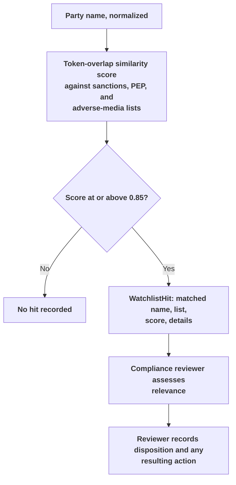

**Interviewer:** Why not let the model decide that a screening hit is a false positive?

**Candidate:** Because that decision has legal weight and I do not want it resting on a sampling draw from a language model, and there are concrete mechanics in the scoring layer that already build in some skepticism rather than trusting any single hit at face value. Adverse-media findings specifically are weighted by where they came from. A hit from a curated, vetted list is trusted at whatever severity the list assigns it. A hit that came from the free-text web search on the name-only path is discounted one severity notch automatically, and a single web-sourced finding is capped so it cannot reach "high" severity on its own, it takes at least two independent high-severity web findings to restore that ceiling. The reasoning is that a name turning up near the word "fraud" in a search result is frequently a false positive, someone commenting on fraud, a namesake, an old settled matter, so one soft web hit should not carry the same weight as a properly sourced list entry. None of that removes the reviewer. It just means the number the reviewer sees already reflects source quality rather than treating every hit as equally damning.

### Source of wealth and source of funds

**Interviewer:** How would the agent assess the customer’s wealth explanation?

**Candidate:** It should break the explanation into claims and required evidence. If the customer says wealth came from selling a business, the system can look for prior ownership, sale documents, sale proceeds, and the path by which the proceeds reached the customer. If the source is inheritance, it may look for probate or estate documentation. The agent organizes the evidence, but it should not declare the wealth legitimate solely because a document exists.

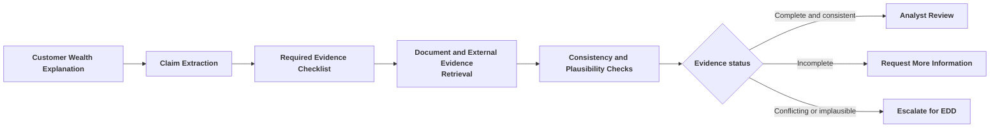

**Interviewer:** How does the scorecard actually decide a declared source of wealth is opaque?

**Candidate:** By a small, checkable rule rather than a judgment call: if the declared source, once trimmed and lowercased, is blank, "unknown," "n/a," "not stated," "undisclosed," "private," or "other," or if the corroborating-evidence flag was explicitly set to false, it counts as opaque source of wealth. That is a narrow definition on purpose. It catches the customer who wrote nothing meaningful in the field, but it does not try to second-guess a properly narrated and corroborated explanation just because the wealth amount looks large.

### Risk scoring and routing

**Interviewer:** What factors should contribute to the risk score?

**Candidate:** In the current implementation, the factors are fixed rather than bank-configurable through a UI, though the weights live in one place and could be tuned there: sanctions, PEP, adverse media, opaque source of wealth, nominee arrangements, bearer shares, high-risk geography, complex structure, layering depth, ID-verification gaps, and offshore jurisdiction. Each has a base weight in points, and each fired factor also carries a severity of low, medium, or high that multiplies the weight before it is added to the raw score. Sanctions carries the highest weight by a wide margin, a hundred points, precisely because it is also wired as a hard stop, so the weight almost never matters on its own, the hard stop fires first.

**Interviewer:** What do you mean by hard stop specifically?

**Candidate:** Two conditions bypass the numeric score entirely and force the worst outcome regardless of what the rest of the case looks like: a confirmed sanctions-list match on any party, or any party located in a jurisdiction tagged prohibited rather than merely high-risk, for example Iran, North Korea, or Syria in the bundled reference data. If either condition is true, the band is forced to prohibited and the decision is forced to decline, independent of the accumulated score from every other factor. A case with an otherwise clean structure and a sanctioned name on it does not get averaged into a medium risk band, it gets stopped outright.

**Interviewer:** Why not let the LLM combine all of those factors into a risk label?

**Candidate:** Because I want the same inputs to always produce the same score, and a model call does not guarantee that even at temperature zero across provider updates. A deterministic rule shows the input factors, weights, severities, and the specific evidence line behind each one. An LLM can explain in plain language why the case landed where it did, and in this system that is literally what the EDD-narrative step does, it is handed the already-computed scorecard and told explicitly not to re-rate the case, only to narrate it. It should not silently change a factor or invent a policy exception.

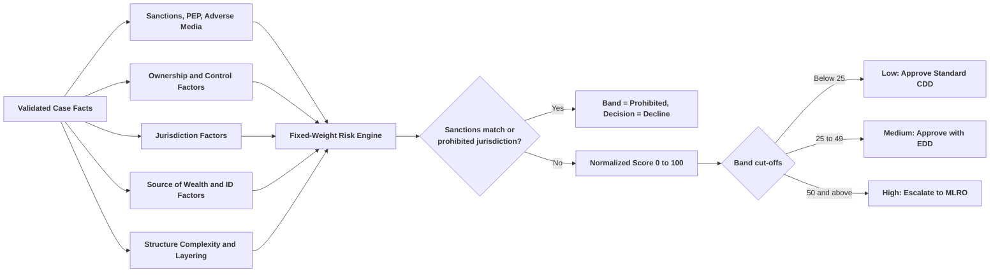

### Case summary and human review

**Candidate:** The case summary should include the customer profile, connected parties, ownership graph, source-of-wealth and source-of-funds findings, screening results, risk factors, score, missing evidence, and recommended route. Every important statement should point to a source document, screening result, rule, or reviewer action.

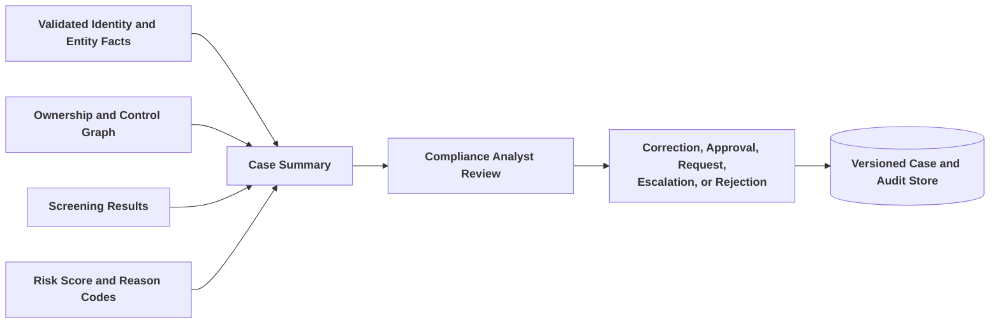

**Interviewer:** What happens when evidence is incomplete?

**Candidate:** The system should show the missing evidence and prevent the case from appearing complete. It can create a document request for the relationship manager, assign an analyst task, or escalate based on policy. It should not lower the score simply because information is missing unless the approved policy explicitly defines missingness as a risk factor.

### Failure handling

**Interviewer:** What if a screening provider is unavailable?

**Candidate:** In production that should hold the case in a pending-screening state rather than let it look cleared. I want to be careful not to overstate what the current build does here, though, since the bundled screening lists are local sample data read from disk rather than a live provider call, so a network-style outage of that specific dependency is not really the failure mode this build has today. The failure mode it does have, and a serious one, is on the database-write side, and it is worth walking through concretely rather than in the abstract.

**Interviewer:** Go on.

**Candidate:** The background task that finishes an assessment does the pipeline run first, then writes the case, its UBOs, its watchlist hits, and its EDD measures to Postgres in one transaction, committed at the very end. That whole write is wrapped in a broad exception handler that logs the error and returns normally instead of re-raising it. So if Postgres happens to be unreachable at the exact moment that commit runs, the pipeline itself may have completed successfully, the assessment files may already be sitting on disk in the analysis-storage folder, and none of that is lost. But no case row is ever created. From the API's point of view, a case with no row looks exactly like a case that is still processing, because that is genuinely the only state a case can be in before it finishes: there is no persisted "in progress" row at all, only "no row yet" and then "completed" or "failed." A silently swallowed commit failure and a case that is still five minutes from finishing are indistinguishable to anyone polling the status endpoint. That is a real gap I would fix before this went anywhere near production, not by adding more retries, but by making that outer handler re-raise so the failure actually surfaces as a failed case instead of vanishing.

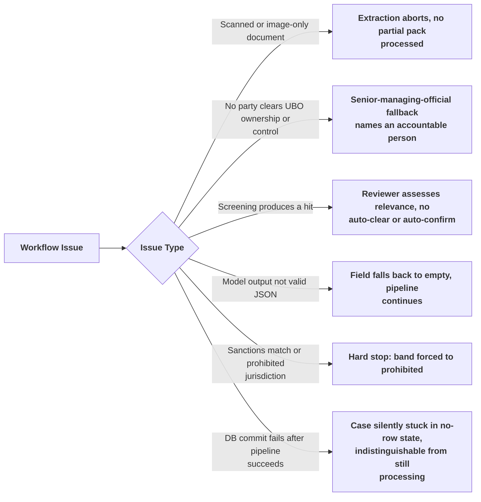

## 3.5 High-Level Design

**Interviewer:** Show the major architecture.

**Candidate:** I want to draw what actually runs, not a target platform, so let me be upfront about what is missing before I show the diagram: there is no authentication or authorization anywhere in the code, no queue or workflow orchestrator, no cloud object storage, and no persisted document index. It is a single FastAPI process. Uploaded files land on local disk. Background work runs via FastAPI's own `BackgroundTasks`, in the same process and the same Python interpreter that served the HTTP request, not a separate worker fleet. The page index that both extraction paths search against is an in-memory numpy array, rebuilt from scratch on every request and discarded when the request finishes, nothing about it survives to the next case.

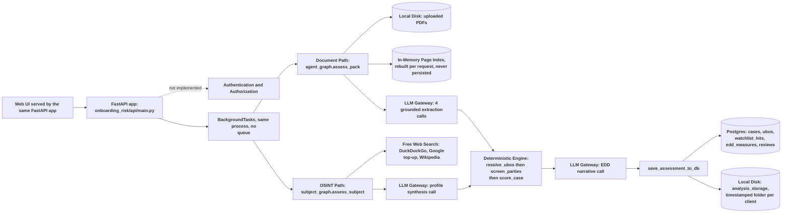

**Interviewer:** Why not put screening, scoring, and document extraction inside one agent?

**Candidate:** Even without a queue or microservices between them, they stay separate Python modules with no LLM call in three of them. Document extraction is probabilistic and evidence-focused, so it is the only place an LLM touches the numbers indirectly, through what it reads off a page. `ownership.py`, `screening.py`, and `scoring.py` have zero LLM calls between them; they are plain deterministic functions over the Pydantic objects the extraction step produced. Keeping that boundary sharp, even inside one process, is what lets me say the same case facts always produce the same score. Folding them into one prompt would not just blur accountability, it would make the reproducibility guarantee false.

**Interviewer:** Which parts are synchronous and which are asynchronous?

**Candidate:** `POST /cases` itself is synchronous and fast: it mints a case id, optionally writes uploaded files to disk, schedules the background task, and returns immediately, before any LLM call or web search has happened. Everything downstream of that, document indexing or OSINT collection, every extraction call, the deterministic engine, the EDD narrative, and the database write, all runs inside that one `BackgroundTasks` callback, in-process, after the HTTP response has already gone back to the caller. There genuinely is no separate worker process, and I would call that out as a real ceiling rather than a deliberate simplicity choice, because it means an API-process restart mid-assessment loses that assessment with no way to resume it, and a second replica of this service would not share the uploaded files the first replica wrote to its own local disk.

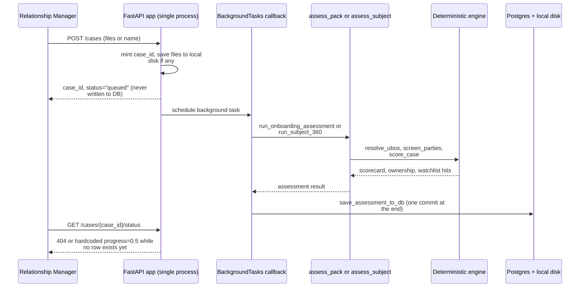

**Interviewer:** How do you keep the model from seeing a customer’s unrelated documents?

**Candidate:** In the target design, yes, every document, chunk, graph edge, and screening result should carry case and access metadata, and retrieval should filter by the authorized case before content reaches the model. I need to be direct about where the current build stands relative to that: there is no authentication, no authorization, and no per-case access control anywhere in the code today. Anyone who can reach the API can create a case, read any case by id, and list every client's history. The in-memory page index is scoped to one request's pack by construction, since it is rebuilt fresh each time and never shared across concurrent requests, so a case cannot accidentally search another case's documents purely because of how that object's lifetime works, but that is a side effect of the current implementation, not an access-control feature I would defend as adequate for production.

### What the analyst actually sees

**Interviewer:** Walk me through what a relationship manager or analyst actually sees when they open this thing, and what it exposes.

**Candidate:** It is a fairly bare-bones web UI, served directly by the same FastAPI app, with three tabs, and I think the tab layout itself makes an argument worth noticing.

*Document Upload tab.* This is the pack-based path: a dropzone for KYC forms, trust deeds, ownership charts, and ID documents, a client name field, and a Start Assessment button. Nothing here is more elaborate than a file picker and a text field, and there is no field for jurisdiction, product, or relationship purpose beyond the name, which lines up with `CaseCreateRequest` in `api/main.py`, whose only required fields are `client_name` and `case_type`.

*Name Search tab.* This is the entry point for the name-only research mode I walked through earlier. Client name, an optional approximate age, an optional location, and a Start OSINT Search button. What I want to draw out here is that this tab sits at the same level as Document Upload, not behind an "advanced" toggle or a separate tool. The product is telling the relationship manager, correctly, that these are two equally valid ways to start a case, not a primary path with a fallback bolted on. I would flag one thing I checked rather than assumed: the age and location fields shown here are not actually wired up. The page's submit handler only ever puts the client name into the request; age and location are captured in the form but never appended to the payload sent to `POST /cases`, so today they are visual only. The `SubjectSeed` schema underneath genuinely supports age, location, nationality, education, work history, and known companies, the seed collection logic in `osint/collect.py` uses them to build better-targeted search queries, but this particular UI does not yet pass them through. That is a small, concrete gap between what the form implies and what the request actually carries, worth fixing before calling this feature complete.

*Historical KYC tab.* A client dropdown, here showing "Bill Gates (3 analysis)," and a history list underneath it. This is a direct render of `GET /clients` and `GET /clients/{client_name}/history`: each entry shows the case type in capitals, a version badge, a timestamp or "In progress" when `completed_at` is still null, the status string the database actually holds, and, once a case has a score, the risk score, band, and decision. The two entries reading "In progress | Status: processing" in that screenshot are exactly the no-row state from the case-state diagram earlier, the UI is inferring "in progress" purely from the absence of a completed timestamp, not from any real progress signal, because none exists yet to read. There is no button anywhere on this tab to correct a value, override a UBO, or record a reviewer's disposition. What you see is what the pipeline produced, full stop, which is consistent with there being no review endpoint in the API today.

## 3.6 Low-Level Design

**Interviewer:** Break the system into the modules that actually exist.

**Candidate:** I would rather map this to the real files than describe a target module boundary that does not exist yet.

| Module | Responsibility | Implementation reference |
|---|---|---|
| API | All endpoints, background-task scheduling, every DB read and write, serves the web UI as static files | `onboarding_risk/api/main.py` |
| Document orchestration | Builds the page index, runs the four extraction calls, calls the deterministic engine, then the EDD narrative | `agent_graph.py` |
| OSINT orchestration | Collects web evidence, synthesizes the profile, converts it to parties, calls the same deterministic engine | `subject_graph.py` |
| Page index | PDF to per-page text via PyMuPDF, text only, no OCR; in-memory cosine-similarity search; rebuilt per request | `doc_index.py` |
| Extraction agents | Four grounded LLM calls: structure, source of wealth, identity, case metadata | `extraction.py` |
| OSINT collection | Free-web query building across 8 angles, DuckDuckGo/Google/Wikipedia/news backends, dedup by URL | `osint/collect.py`, `osint/search.py` |
| OSINT profile synthesis | One grounded LLM call turning evidence into a `Profile360` | `osint/profile.py` |
| Deterministic engine | UBO resolution, screening, scoring; zero LLM calls in any of these three files | `ownership.py`, `screening.py`, `scoring.py` |
| Reference data | Illustrative sample PEP, sanctions, adverse-media, and jurisdiction lists; swappable via env-configured file paths | `reference.py` |
| EDD narrative | One grounded LLM call explaining the already-computed scorecard, instructed never to re-rate | `edd.py` |
| File storage | Timestamped-folder storage per client analysis on local disk | `storage.py` |
| Data model | Declared SQLAlchemy tables; five are actually written to, four are dead code (see 3.7) | `db/models.py`, `db/session.py` |
| Agent tool scaffold | `search_pages`/`get_page` LangChain tools plus a page-index setter; real code, never bound to an LLM for tool-calling | `tools.py` |

**Interviewer:** That last one is odd. Why does unused tool-calling code exist at all?

**Candidate:** It looks like scaffolding for a future agentic retrieval loop, where the model would call `search_pages` itself instead of the orchestration code deciding up front which query to run for which extraction step. Today `extraction.py` calls `index.search()` directly with a fixed query per extraction type, it does not hand the model a tool and let it decide. I would not build on top of `tools.py` without first confirming whether it is intentional unfinished work or leftover from an earlier design, because right now it is dead code that happens to still import cleanly.

### Case state

**Interviewer:** Walk me through how a case actually moves through its lifecycle.

**Candidate:** This is simpler, and honestly stranger, than I would like it to be. There is no persisted "in progress" state at all. No `Case` row exists in Postgres until the background task finishes, one way or the other.

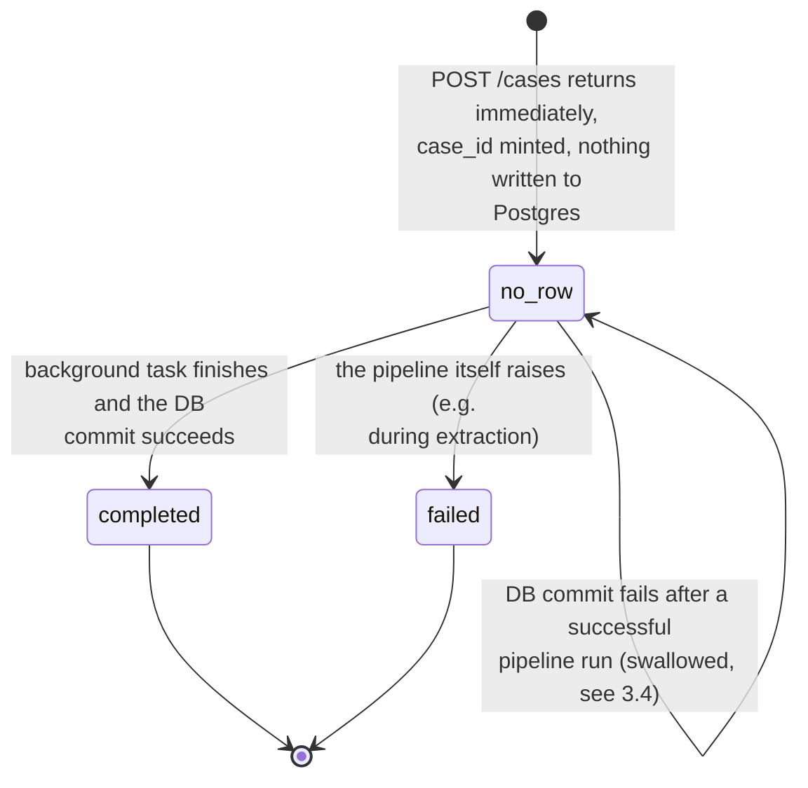

While a case is in `no_row`, `GET /cases/{case_id}` returns a 404, and `GET /cases/{case_id}/status` returns a hardcoded `{"status": "processing", "progress": 0.5}` rather than a real phase, because there is no row to read a phase from. The `"queued"` status that `POST /cases` returns in its response body is never written anywhere; it only ever exists in that one response.

**Interviewer:** What about analyst review and correction? Where does a KYC analyst push back on a UBO or a risk factor?

**Candidate:** That is a real gap, not something I can point to in the code and explain away. There is no review or correction endpoint today. A `reviews` table exists and gets one row written automatically for every completed case, but that row is generated by the system itself from the decision, "approved," "rejected," or "corrected" depending on the outcome, not by a human clicking anything. An analyst can look at a completed case through the API or the UI, but there is no way to submit a correction, override a UBO, or record a manual disposition on a screening hit through the API as it exists today. If I were prioritizing what to build next, this is close to the top of the list, because a system that computes a risk score but gives a compliance officer no way to record their own judgment against it is not yet a decision-support tool, it is a read-only report.

### API surface

**Interviewer:** What does the UI actually call, under the hood?

**Candidate:** Eight endpoints, and I want to be precise that this is the complete list, not a representative sample.

| Endpoint | Method | Purpose |
|---|---|---|
| `/` | GET | Serves the web UI |
| `/health` | GET | Liveness and readiness probe |
| `/cases` | POST | Create a case, documents or name search; writes nothing to Postgres, schedules the background task |
| `/cases/{case_id}` | GET | Case status and basic info; 404 while the case is in the no-row state |
| `/cases/{case_id}/result` | GET | Full assessment result for a completed case |
| `/cases/{case_id}/status` | GET | Cheap poll target; hardcoded progress guess while no-row, real terminal value once the row exists |
| `/clients` | GET | Every unique client name with its latest analysis summary |
| `/clients/{client_name}/history` | GET | All analyses for one client, newest version first |

**Interviewer:** No `/graph`, no `/screening`, no `/review`, no `/rerun`?

**Candidate:** No. None of those exist. There is no dedicated endpoint to fetch just the ownership graph or just the screening results separately from the full result payload, no endpoint to submit a review action, and no endpoint to trigger a rerun. If I described those as present I would be describing a target API, not this one.

### Versioning by client name

**Interviewer:** If there's no rerun endpoint, how does the system handle a second assessment for the same client?

**Candidate:** This is one of the more distinctive choices in the codebase, and I think it is worth walking through carefully because it is unusual rather than obviously correct. There is no explicit "create a new version of case X" action. Instead, every time `save_assessment_to_db` runs, it looks up the existing case row for that `client_name` string that is flagged `is_latest = True`. If one exists, it gets flagged `is_latest = False` and the new row's `analysis_version` is incremented from it. If none exists, the new row starts at version 1. Versioning is keyed entirely on an exact match of the client-name string, not on any stable client identifier.

**Interviewer:** What happens if the relationship manager types the name slightly differently the second time, or two different people happen to share a name?

**Candidate:** Both are real failure modes with this design, and I would flag them rather than pretend the string match is a stand-in for a proper identity key. A name typed as "Robert Mensah" the first time and "Robert  Mensah" with an extra space, or "R. Mensah," the second time will not match the existing row at all; it silently starts a brand-new version-1 history under what the system treats as a different client, and the analyst has to notice the split by inspecting the client list rather than being warned about it. The opposite failure is worse: two different people who happen to share an exact name would be silently merged into the same version history, with the second person's assessment marked as the latest version of what looks like the first person's case. Given the earlier point about disambiguation confidence on the OSINT path, that is a meaningful gap, since a low-confidence name match feeding into a `client_name`-keyed version history compounds the identity risk rather than isolating it. A production fix would key versioning on a stable client id assigned at first contact, with the name kept as a searchable display field, not the join key.

## 3.7 Data and Database Schema Design

**Interviewer:** Show how you would store the onboarding case.

**Candidate:** Let me show the schema as it is declared first, and then be precise about which parts of it a request actually touches, because those are two different pictures.

### Entity relationship diagram

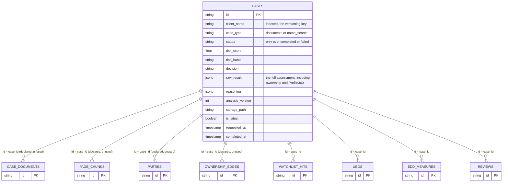

**Interviewer:** Why not store everything in one JSON document instead of nine tables?

**Candidate:** That is close to what actually happened here, which is exactly why I want to walk through it. Nine tables are declared in `db/models.py`: `cases`, `case_documents`, `page_chunks`, `parties`, `ownership_edges`, `watchlist_hits`, `ubos`, `edd_measures`, and `reviews`. Only five of them are ever written to. `case_documents`, `page_chunks`, `parties`, and `ownership_edges` are declared, have relationships wired up in the ORM, and are never once instantiated by any code path, there is no `db.add(Party(...))` or `db.add(OwnershipEdge(...))` anywhere in the codebase. The extraction output those four tables were clearly built to hold, the parties, the ownership edges, the page-level index, the source documents, lives only inside the `raw_result` JSON blob on the `cases` row and in the timestamped files under local disk storage, never in normalized relational form.

**Interviewer:** So why keep five tables at all instead of going fully to one JSON blob, if that is where most of the interesting data already ends up?

**Candidate:** Because the five that are live earn their place by supporting a real access pattern the blob cannot serve directly: `watchlist_hits` needs to be scanned across cases if a watchlist entry gets updated and the bank wants to know who was screened against the old version, `ubos` and `edd_measures` support the client-history list and result views without deserializing the whole blob for every row in a table, and `reviews` is where a human disposition would eventually live even though nothing writes to it manually today. The ownership graph and the ingested documents genuinely are blob-shaped in the current build, they are read and written as one unit and never queried by a sub-field, so I would not force them into relational tables just for symmetry. I would, however, flag `case_documents`, `page_chunks`, `parties`, and `ownership_edges` as either dead code to remove or a half-finished migration to finish, because leaving them declared and silently unused is worse than picking one side.

**Interviewer:** What data in the implementation should be treated as illustrative rather than production-ready?

**Candidate:** The bundled PEP, sanctions, and adverse-media lists in `reference.py` are explicitly labeled illustrative sample data, four or five entries each, meant to make the system runnable end to end without a paid feed. The high-risk and prohibited jurisdiction list is similarly a small bundled sample. All four load from a JSON file at a configured path if one exists, falling back to the sample otherwise, so swapping in a licensed World-Check or OFAC feed does not require touching `screening.py`'s matching logic at all. The UBO ownership threshold and the risk-factor weights in `scoring.py` are real constants driving real math today, not placeholders, but they are still values a bank's own policy team would need to review and own before this ran on live cases.

**Interviewer:** How would you close this interview?

**Candidate:** This is an HNI onboarding risk-assessment assistant with two ways in, a document pack or a name and a few details, that converge on one deterministic core: resolve the ownership graph, screen every party, score the case, and decide a route. The LLM does the reading and the writing, the extraction and the narrative, never the arithmetic. What I would not want to overstate is how far the surrounding system has come: no auth, no queue, no persisted document index, a database write that can silently fail and strand a completed case, and no way today for a compliance officer to record a correction through the API. The scoring core is the part I would defend as production-grade reasoning. Everything wrapped around it is still a prototype, and I would say so plainly to whoever is deciding whether to pilot this.

## Repository

[Open the HNI Customer Onboarding Risk Assessment implementation reference](https://github.com/GSaiDheeraj/Finance-and-Banking-AI-Usecases/tree/main/Fraud_Detection_Agent)
