# Chapter 6: Portfolio Research and Construction Copilot

> **Implementation repository:** [Investment Research Copilot](https://github.com/GSaiDheeraj/Finance-and-Banking-AI-Usecases/tree/main/Investment_Research_Copilot)
>
> **Chapter focus:** This chapter presents a portfolio research and construction copilot for wealth managers, portfolio managers, investment analysts, and advisors. It supports two related workflows: monitoring an existing portfolio and constructing a new portfolio from a client mandate.
>
> **System boundary:** The copilot can analyze holdings, calculate portfolio metrics, identify drift, surface emerging risks, propose rebalancing, construct a constraint-aware portfolio, and explain the result. It does not execute trades, change account mandates, or replace the portfolio manager’s investment judgment.
>
> **Implementation honesty:** The repository is the implementation reference. The chapter distinguishes between the current proof-of-concept capabilities and production additions such as institutional market-data feeds, durable workers, enterprise authorization, stronger validation, and order-management integration.

## 3.1 Business Context and Stakeholders

**Interviewer:** A wealth-management firm wants an AI investment research copilot. That is all the detail you get. What do you ask first?

**Candidate:** “Investment research copilot” could mean several different products. Is the main problem monitoring existing portfolios, preparing research notes, constructing portfolios for new clients, checking mandate compliance, or recommending trades? Is the system allowed to execute anything?

**Interviewer:** The firm manages advisory and discretionary portfolios. Portfolio managers and advisors want to monitor holdings, check drift and risk limits, investigate news, and construct portfolios for new clients.

**Candidate:** Then there are two core workflows. Monitor mode starts with an existing portfolio. Construct mode starts with a client mandate and an investable amount. I would keep those modes connected but separate because their inputs and outputs are different. What does the team do manually today?

**Interviewer:** They export holdings from a custodian or portfolio-management system, calculate market values and weights, compare them with target allocation, review risk, search for news, and prepare a briefing. For new portfolios, they select securities and decide position sizes in spreadsheets.

**Candidate:** The system should reduce the spreadsheet work without hiding the investment decision. Monitoring can calculate allocation, drift, income differences, exposure, risk measures, and alerts. Construction can produce a portfolio proposal with holdings, weights, assumptions, constraints, and reasons. The portfolio manager or advisor remains responsible for deciding whether the proposal fits the client.

**Interviewer:** Why not give a holdings CSV to an LLM and ask what to buy or sell?

**Candidate:** The key outputs are numerical and policy-sensitive. A rebalance depends on current market values, target weights, tolerance bands, portfolio size, transaction costs, and mandate limits. A construction proposal depends on security eligibility, position caps, sector limits, diversification, liquidity, and the client’s objectives. Those values need deterministic calculations. The LLM can explain the proposal, but it should not be the source of the numbers.

**Interviewer:** How many portfolios are we talking about, and how often does this run?

**Candidate:** That shapes the design quite a bit. Is a portfolio manager watching a few dozen relationships or several hundred? Is monitoring something advisors trigger when they want a check, or does it need to run daily on a schedule? And what already exists, a custodian feed, a portfolio management system, any rebalancing tool the firm has today?

**Interviewer:** Advisors each cover somewhere between fifty and a hundred client portfolios. There is no scheduled daily run today. Advisors pull a holdings export from the custodian and open it when they want to check something. There is no existing rebalancing tool, just spreadsheets.

**Candidate:** Then I would build this as an on-demand analysis the advisor requests, not a scheduled batch job watching hundreds of portfolios continuously. The custodian export is the input I would standardize around first, since that is already how the data reaches the firm. Spreadsheets are what this replaces for the calculation and drift work. I would hold off on always-on monitoring until there is a reason for it, since running continuous checks on data that is only refreshed when someone pulls an export would not add anything.

**Interviewer:** What about suitability and mandate obligations?

**Candidate:** For advisory and discretionary accounts there is usually a suitability obligation tied to the client's risk profile and the mandate they agreed to, and a discretionary account manager can be held to a higher standard for staying within agreed limits. I would want to know what specifically forces something to the investment committee rather than the advisor handling it alone, is it a breach past a certain size, a new asset class, a concentration limit.

**Interviewer:** A drift beyond the tolerance band on a discretionary account needs investment committee sign-off if the position exceeds a set percentage of the portfolio. Advisory accounts only need the advisor's own review since the client makes the final call.

**Candidate:** That is a clean rule to route on: discretionary breaches above the threshold escalate, advisory proposals stay with the advisor as a recommendation. I would also weigh the two failure directions differently. A proposal that quietly breaches a mandate limit is the more serious problem, since it can sit undetected until a client or regulator notices. A proposal that is overly conservative just under-serves the client's return objective, which is a worse outcome commercially but not a compliance one. I would rather the system flag a borderline mandate check than let it pass silently.

**Candidate:** I would want to confirm the organization's actual roles rather than assume, but who reviews a proposal, who owns the investment decision, and who else needs to see the result before I design the workflow?

**Interviewer:** Portfolio managers review portfolios and own the investment decision, approving rebalancing and construction proposals. Financial advisors and wealth managers explain proposals to clients and make sure the portfolio reflects the agreed mandate. Investment analysts research securities, sectors, countries, catalysts, and risks. Risk and compliance teams monitor limits, concentration, suitability, and exceptions. The investment committee reviews larger allocations, mandate changes, and material exceptions. Operations and custody teams reconcile holdings, dividends, coupons, fees, taxes, and cash movements.

**Candidate:** So the portfolio manager and advisor are the primary consumers of a proposal, the analyst feeds research into it, risk and compliance need to see the same limits the system checked, and the committee only gets involved once something crosses a threshold. Operations sits slightly apart since they are reconciling the underlying data rather than acting on the proposal itself. I would keep all of those views reading from the same calculated numbers so a compliance check and what the advisor shows the client never disagree.

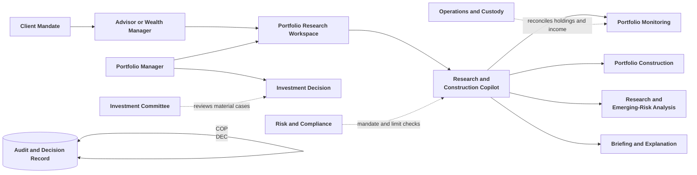

**Interviewer:** Does the client’s mandate matter more than the return objective?

**Candidate:** The mandate is the primary constraint. It may define risk profile, target allocation, tolerance bands, benchmark, volatility ceiling, investment horizon, permitted countries, asset classes, exclusions, liquidity requirements, and concentration limits. The system is not trying to maximize a generic return number. It is trying to produce analysis or a proposal that fits the client’s agreed policy.

## 3.2 Business Requirements and Success Metrics

**Interviewer:** The business wants monitoring and from-scratch portfolio construction. What do you need to clarify?

**Candidate:** For monitoring, I need the holdings format, pricing source, target allocation, tolerance bands, transaction history, frequency, risk limits, and alert policy. For construction, I need the client’s mandate, investment amount, asset-class mix, geography, style, instrument preferences, exclusions, investment horizon, return objective, and the permitted security universe.

**Interviewer:** The firm wants conservative, balanced, growth, and aggressive mandates. It wants deterministic and LLM-assisted construction modes that can be compared.

**Candidate:** I would define two explicit modes.

### Monitor mode

- Accept holdings in CSV or JSON, with optional text-based PDF statement extraction.
- Enrich holdings with market data.
- Calculate market values, allocation, drift, concentration, income, and risk measures.
- Compare the portfolio with targets, tolerance bands, and mandate limits.
- Propose rebalancing only for material breaches.
- Reconcile expected income with dividends, coupons, interest, fees, taxes, and withdrawals.
- Search public sources for emerging risks in major holdings and concentrated sectors.
- Produce prioritized alerts, a portfolio health view, and a briefing.

### Construct mode

- Accept an investable amount and client mandate.
- Build a candidate universe from a curated or user-supplied list.
- Enrich the candidates with price, history, sector, geography, market capitalization, and yield data.
- Construct a portfolio deterministically, with LLM assistance, or through both paths for comparison.
- Enforce exclusions, minimum position size, single-name limits, sector limits, cash rules, and other hard constraints.
- Explain every holding, weight, assumption, and guardrail adjustment.

**Interviewer:** What are the most important safety requirements?

**Candidate:** The system must not execute trades, introduce an unapproved ticker, produce a portfolio that violates a hard constraint, use unsupported market numbers in a rationale, or present a public-news item as a confirmed investment fact without showing its source and uncertainty.

**Interviewer:** What metrics would you track?

**Candidate:** I would use separate measures for monitoring and construction:

| Area                  | Metrics                                                                                                   |
| --------------------- | --------------------------------------------------------------------------------------------------------- |
| Monitoring            | Time to complete assessment, breach-catch rate, alert precision, drift classification accuracy            |
| Rebalancing           | Plan adoption rate, trade-sizing accuracy, turnover estimate accuracy, transaction-cost estimate accuracy |
| Income reconciliation | Cash-flow exception hit rate and unexplained variance                                                     |
| Construction          | Portfolio acceptance rate, constraint-safety rate, diversification quality, cash residual accuracy        |
| Data quality          | Market-value coverage, price freshness, missing-history rate, symbol-resolution accuracy                  |
| Research quality      | News disambiguation precision, grounded-briefing error rate, unsupported-claim rate                       |
| Operations            | Job success, latency, model-call count, cost, external-provider failure rate                              |

**Interviewer:** Why not just track time to complete assessment? That is what advisors keep asking for.

**Candidate:** Because a faster assessment is worthless if it misses a real breach or fires alerts nobody trusts. If the system gets faster by skipping the emerging-risk search or loosening the drift threshold, time improves while breach-catch rate and alert precision quietly get worse. I would report time next to breach-catch rate and alert precision, not on its own, so a speed gain is only counted once accuracy is confirmed to have held.

**Interviewer:** Which single measure would you watch first?

**Candidate:** Constraint-safety rate for construction and monitoring reproducibility for existing portfolios. If a constructed portfolio violates a sector or single-name cap after guardrails run, the system’s central safety promise has failed. If identical fixed inputs produce different drift or alerts, the monitoring output cannot be trusted in an investment-review process.

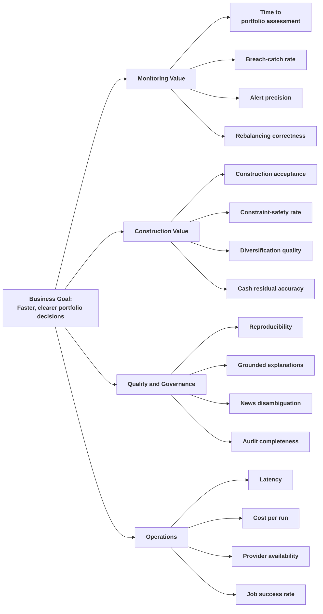

## 3.3 Data and Inputs

**Interviewer:** What does the system need from the user?

**Candidate:** In monitor mode, it needs a holdings snapshot and preferably a transaction ledger. It may also receive a text-based brokerage or custody statement. In construct mode, it needs the client’s mandate and investable amount. The input format and authority of each field should be explicit.

**Interviewer:** What belongs in a holdings snapshot?

**Candidate:** At minimum:

| Field             | Purpose                                             |
| ----------------- | --------------------------------------------------- |
| Symbol or ticker  | Identifies the instrument                           |
| Security name     | Makes the portfolio readable                        |
| Asset class       | Supports allocation and risk analysis               |
| Sector            | Supports diversification and sector-cap checks      |
| Region or country | Supports geographic exposure and research           |
| Currency          | Supports reporting and future FX normalization      |
| Quantity          | Supports market-value calculation                   |
| Cost basis        | Fallback when price data is unavailable             |
| Manual price      | Approved user-supplied price with explicit priority |

**Interviewer:** Why allow both a manual price and a market-data price?

**Candidate:** I would define a priority order: manual price supplied by the user, then live market-data price, then cost basis as a clearly labelled proxy, then unpriceable. The system records the price source and coverage. It should not silently assign a cost basis as if it were current market value.

**Interviewer:** What is the transaction ledger used for?

**Candidate:** It supports income and cash-flow reconciliation. It can contain dividends, coupons, interest, contributions, withdrawals, fees, taxes, and trades. The system compares expected income with actual ledger entries and flags shortfalls, excess receipts, missing payments, or unexpected flows.

**Interviewer:** Is a PDF statement a primary input?

**Candidate:** Structured CSV or JSON should be primary because it is easier to validate. A text-based PDF can be a fallback. An extraction step can copy holdings, quantities, prices, and printed market values into the same structured model. It must not perform hidden arithmetic. Scanned PDF support would need OCR and separate quality controls.

**Interviewer:** What external data does the implementation use?

**Candidate:** The implementation reference uses market-data retrieval for prices, history, dividends, sector, quote classification, and market capitalization. It also uses public news search for emerging-risk scans and country research. Those sources are suitable for demonstrating the workflow, but production use would require licensed or approved data with defined coverage, entitlements, freshness, and service levels.

### Input categories

| Input category          | Examples                                                                | Use                                       |
| ----------------------- | ----------------------------------------------------------------------- | ----------------------------------------- |
| Holdings                | Symbol, quantity, asset class, sector, country, currency, cost basis    | Portfolio valuation and exposure          |
| Transaction ledger      | Dividends, coupons, interest, contributions, withdrawals, fees, taxes   | Cash-flow and income reconciliation       |
| Mandate                 | Risk profile, target allocation, tolerance bands, benchmark, exclusions | Monitoring and construction constraints   |
| Client preferences      | Geography, style, instruments, horizon, objectives                      | Candidate selection and suitability       |
| Market data             | Price, price history, yield, sector, market cap                         | Valuation and risk metrics                |
| Research data           | Filings, company information, country research, public news             | Briefings and emerging-risk context       |
| Reference configuration | Risk limits, costs, asset-class assumptions, construction rules         | Deterministic calculations and guardrails |
| Execution metadata      | Run ID, input hashes, timestamps, provider versions, model versions     | Reproducibility and audit                 |

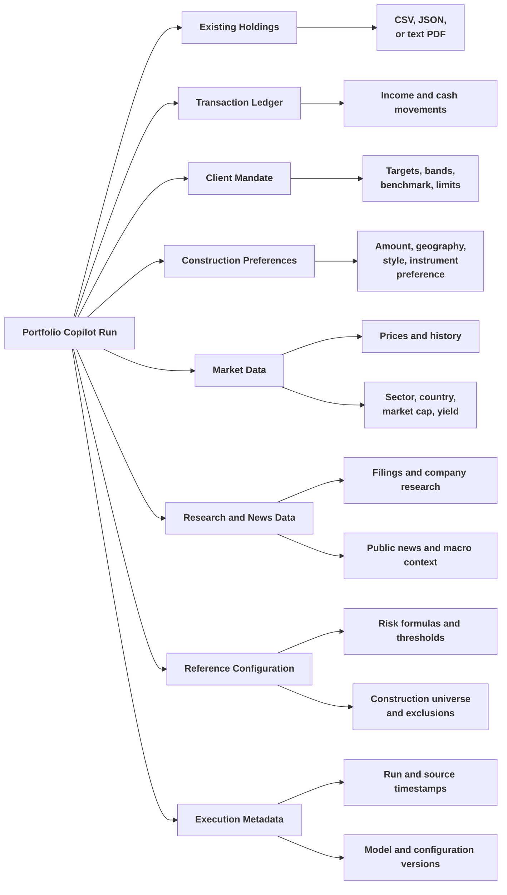

### Data flow from input to output

```mermaid
%%{init: {'themeVariables': {'fontSize': '16px'}}}%%
flowchart LR
    classDef default font-weight:bold;
    A[Holdings and Mandate Inputs] --> B[Normalize Symbols<br/>and Fields]
    B --> C[Enrich with Market<br/>and Research Data]
    C --> D[Calculate Values, Weights,<br/>Risk, and Income]
    D --> E[Check Drift, Concentration,<br/>and Mandate Limits]
    E --> F[Generate Alerts or<br/>Construction Candidates]
    F --> G[Apply Deterministic Guardrails]
    G --> H[Generate Briefing and Explanation]
    H --> I[Portfolio Manager Review]
```

**Interviewer:** What if market data is missing?

**Candidate:** The system should report coverage and degrade carefully. A holding without a usable price may still appear in the holdings list, but it should be excluded from calculations that require market value or clearly marked as estimated. The run should not quietly treat missing data as zero.

## 3.4 Solution Strategy and Pipeline Logic

**Interviewer:** Give me the design in one sentence.

**Candidate:** The copilot combines portfolio and mandate data with market and research evidence, uses deterministic services for valuation, risk, drift, and constraints, and uses an agent to explain findings and support portfolio-manager decisions without executing trades.

**Interviewer:** Why not let the LLM decide what to buy and sell?

**Candidate:** It would make the most important part of the system difficult to reproduce. A trade proposal must show the actual weight, target, tolerance band, portfolio value, trade-sizing formula, constraints, and cost estimate. In construction, every holding must pass eligibility and concentration rules. The LLM can propose a rationale or select from a controlled universe, but deterministic guardrails must validate the proposal before it reaches the manager.

**Interviewer:** You've described Monitor and Construct as two separate modes. Do they ever actually call into each other?

**Candidate:** In two specific cases, yes, and it's worth being precise about which. First, if someone calls `run_monitoring` with a mandate and no holdings at all, the pipeline treats that as "build me a book from scratch for this mandate" and internally calls the construction path, then monitors the resulting book against the same mandate it was just built for. That's a convenience so a single entry point can both construct and immediately show how the fresh book looks against its own policy, rather than needing a second round trip. Second, when someone uploads real holdings and also supplies a construction request in the same call, that's a different feature entirely: a transition plan. The system builds a fresh deterministic target for that mandate, diffs it instrument by instrument against the holdings that were actually uploaded, and returns a buy/sell list moving the current book toward the target, alongside the normal drift-based rebalancing. That path always uses the deterministic constructor, never the LLM one, because a transition plan is exactly the kind of trade-sizing output that has to be reproducible.

### End-to-end workflow

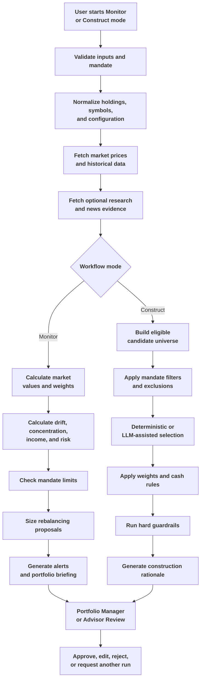

### Monitor mode

**Interviewer:** Explain how drift and rebalancing work.

**Candidate:** First, the system values each position using the selected price source. It calculates portfolio weights and compares them with target weights and tolerance bands. Only material band breaches should create trades. If a sleeve is slightly away from target but inside the permitted band, the system should not recommend unnecessary turnover.

For a sleeve, the basic trade value is:

\[
\text{Trade Value} = (\text{Target Weight} - \text{Actual Weight}) \times \text{Portfolio Value}
\]

A positive value means buy and a negative value means sell. The output should also include one-way turnover, estimated transaction cost, and the reason for the trade.

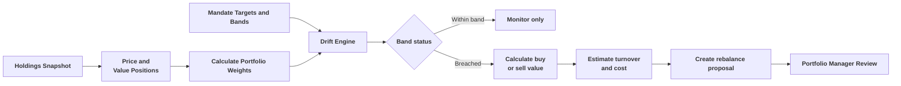

**Interviewer:** What risk measures should the system calculate?

**Candidate:** The implementation can calculate historical measures such as annualized volatility, maximum drawdown, one-day historical 95% VaR, beta, tracking error, dividend yield, concentration, effective number of holdings, largest position weight, and top-five weight. It can compare these with configured limits. These measures describe the portfolio using recorded data. They are not promises about future returns.

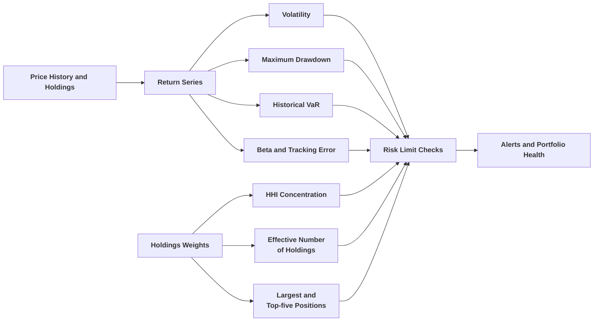

### Income reconciliation

**Interviewer:** Why include the transaction ledger?

**Candidate:** A portfolio can look correctly allocated while operations still have a cash-flow problem. Expected dividends or coupons may not arrive. A fee or tax may be unexpected. A withdrawal may explain a cash difference. The ledger helps separate investment performance from operational exceptions.

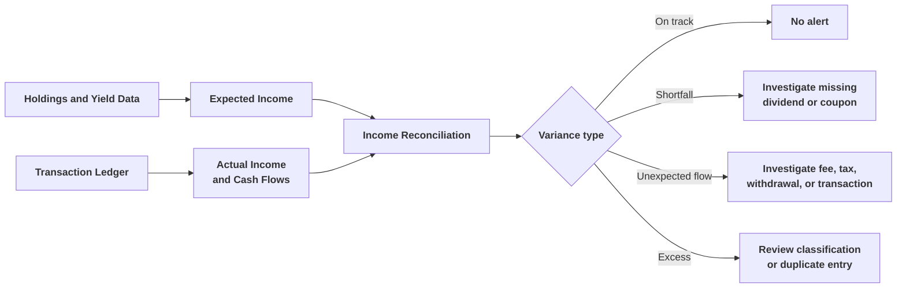

### Emerging-risk research

**Interviewer:** What does the news component do?

**Candidate:** It searches public information about the largest holdings, concentrated sectors, and relevant macro or country conditions. The agent summarizes the retrieved snippets into findings with a subject, category, severity, summary, and source. The finding remains supplementary evidence. It cannot override a hard portfolio limit or independently generate a trade, and that isn't just a design intention: the alert engine hard-caps any LLM-classified "high" severity finding down to "medium" before it becomes an alert, every time, so a piece of public news can never reach the top severity tier on its own. Only a deterministic breach, like a drift band or a risk limit, can produce a high-severity alert.

**Interviewer:** How do you avoid a news article about the wrong company? Is there a confidence score on the match?

**Candidate:** No, and I want to be precise about what actually happens instead of describing something more sophisticated than what's built. The implementation does not score match confidence or route anything to manual review. What it does is simpler: before a query goes to DuckDuckGo, the code builds a symbol-to-company-name map from the holdings (or from the construction universe) and searches on the company name rather than the ticker. That matters more than it sounds. Searching "RELIANCE.NS stock risk" returns almost nothing useful; searching "Reliance Industries stock risk" returns real results. There's also a small cleanup step that strips exchange suffixes like `.NS`, `.L`, or `.T` from any ticker that has to be used as a fallback search term, and a skip-list for broad index and ETF tickers where a company-risk search would not make sense in the first place.

**Interviewer:** So how does a mismatch actually get caught, if not through a confidence score?

**Candidate:** It mostly doesn't get caught at the individual-article level. What limits the damage is downstream, not at the matching step. Each finding still carries the ticker it was searched for (`related_symbol`) and the source URL, so a reviewer can always trace a claim back to what was searched and what came back. And the severity discount I mentioned earlier means even a clean match to genuine bad news can only push an alert to medium, never to the top tier, on its own. If the business needs a harder guarantee that a story is actually about the right company, that would mean building real entity resolution against the sector, country, and possibly a knowledge-base lookup, then attaching a confidence field to the finding and deciding a threshold below which it gets held for review. That's a real gap today, not a hidden feature.

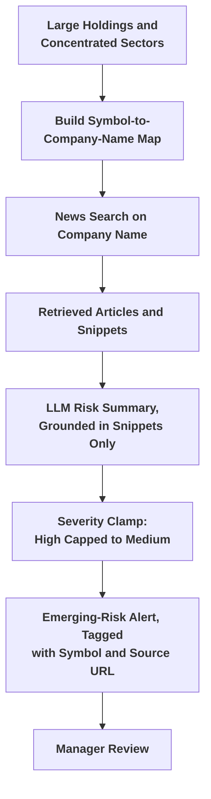

### Construct mode

**Interviewer:** Explain how the from-scratch portfolio is constructed.

**Candidate:** The user supplies an investable amount and mandate. The system builds an eligible universe from curated seed data or a user-provided list. It enriches candidates with market data and classification. It filters by asset class, region, style, market capitalization, instrument preference, exclusions, and liquidity. Then it either uses a deterministic constructor, an LLM-assisted selector, or both.

The LLM-assisted path receives the same candidate universe and precomputed statistics. It may select a subset and propose weights with reasons. It cannot introduce a new ticker, use unsupported numbers, or bypass the deterministic guardrails that run after its proposal.

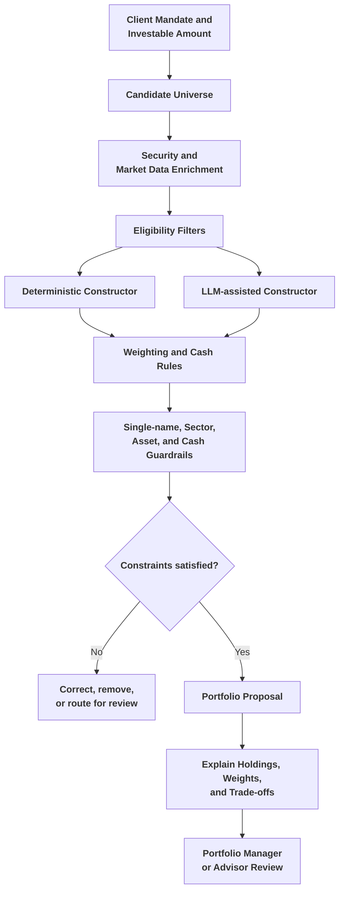

**Interviewer:** Why compare deterministic and LLM-assisted construction?

**Candidate:** The comparison is useful for evaluating whether language-model selection adds value beyond a transparent baseline. Both methods should receive the same eligible universe and constraints. We can compare expected metrics, diversification, constraint corrections, explanation quality, stability, cost, and manager acceptance. The LLM path should not be accepted simply because its rationale sounds better.

**Interviewer:** Ranking candidates by expected return sounds like it would just load the book up with whatever sector happened to run hottest in the lookback window. How do you stop that?

**Candidate:** The deterministic constructor's stock selection (`construct/deterministic.py`) runs in two phases specifically to prevent that. Phase one takes the single best-return stock from every sector represented in the tier, regardless of how that sector's absolute return compares to others, so Technology, Energy, FMCG, Financials, and so on each get at least one guaranteed slot before anything else is picked. Phase two only then fills the remaining slots by pure return ranking, still respecting a per-sector cap so no sector can dominate the fill either. Concretely: if Infrastructure names had the best trailing returns in a given run but the book also needs Technology, Financials, and Pharma exposure for a genuinely diversified large-cap sleeve, phase one guarantees a Technology pick, a Financials pick, and a Pharma pick get in before phase two starts stacking more Infrastructure names on top of what already made the cut. Without that first phase, a pure return ranking would happily hand the entire sleeve to whichever one or two sectors performed best over the lookback window, which isn't diversification, it's a concentrated bet dressed up as a multi-cap fund.

**Interviewer:** And if a client sets a return target that's just not realistic for the universe you're picking from?

**Candidate:** That's a separate deterministic check, `feasibility.py`, that runs after the book is built. It resolves the investor's stated objective, either an annualized percent or a target end value over the horizon, into a single annualized number, then compares it against two things: the best single-asset historical return anywhere in the candidate universe, and an absolute sanity ceiling on annualized return. If the target exceeds either, it comes back flagged unrealistic, with the message naming the actual ceiling ("the best single holding only delivered ~X% p.a. historically"). If the target is above the constructed book's own expected return but still under the universe ceiling, it comes back ambitious rather than unrealistic, meaning it's reachable only by concentrating more than the current diversified pick would. Otherwise it's on track, with a projected value over the stated horizon. This is a distinct module from the guardrail engine. Guardrails police the portfolio's structure; feasibility is about being honest with the client that a number they wrote down on a form might not be achievable with the securities actually available, before the advisor is the one who has to explain that gap in the client meeting.

### Guardrails

**Interviewer:** Walk me through what the guardrail layer actually checks. Does it look at liquidity too?

**Candidate:** In the implementation it does not. The guardrail engine (`construct/guardrails.py`) runs the same sequence for both constructors: drop excluded symbols or sectors, drop any position under the minimum weight, enforce the single-name cap, enforce the sector cap, then renormalize so the surviving weights sum to one, with any weight that cannot be placed left as cash residual. There is no liquidity check in that module today. If the business needs one, I would add it as an explicit constraint next to the sector cap, probably gated on average daily volume or a curated "liquid" flag on the candidate, rather than assuming it is already covered.

**Interviewer:** How does it actually correct a portfolio that breaches a cap, rather than just rejecting it?

**Candidate:** It is not a one-shot clip. The single-name and sector caps are enforced by an iterative water-filling pass: any name over its cap is pulled down to the cap, and the excess weight is redistributed only to names that are still strictly under their own cap, never pushing a receiver over. That repeats, capping and sector-scaling in alternation, until nothing is left over cap or an iteration ceiling is hit. If the total simply cannot fit under the caps (say every eligible name in a thin sector is already at its ceiling), the shortfall is left as cash residual instead of being forced somewhere it would create a new breach. Every capping or scaling action is logged once, with the original pre-guardrail weight, so the correction list reads as "capped X from 14% to 10%" rather than one line per solver iteration.

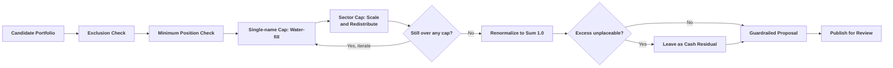

### Failure handling

**Interviewer:** What happens when the market-data provider is unavailable?

**Candidate:** The system should show which holdings or candidates lack usable data. It may use a manually supplied price where permitted, but it should not hide missing coverage. Metrics that require history should be marked unavailable. A news failure should not prevent portfolio valuation, and an LLM failure should not prevent deterministic monitoring.

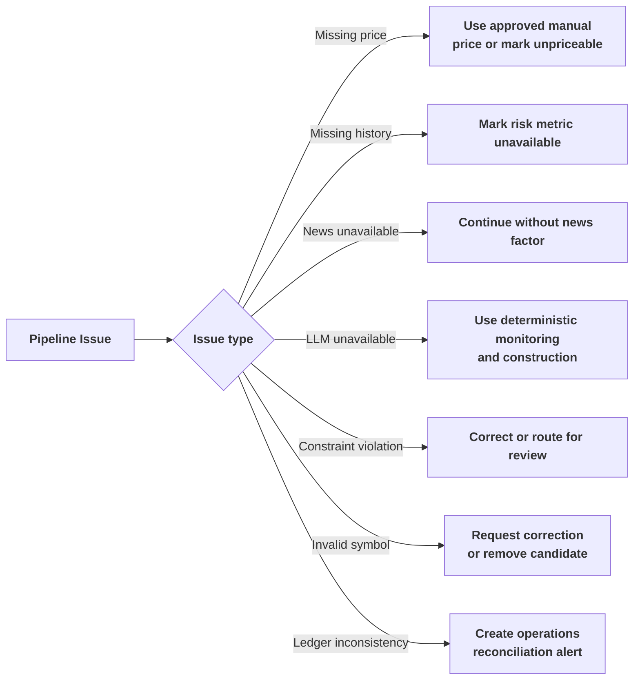

## 3.5 High-Level Design

**Interviewer:** Show the major architecture.

**Candidate:** One FastAPI service is the backend for everything. It mounts a static web UI at the same origin, so there is no separate frontend deployment to reason about. The design separates portfolio inputs, market-data enrichment, deterministic analytics, the research workflow, construction, guardrails, explanation, and review. There is no order-execution connection anywhere in it.

**Interviewer:** Where's authentication and authorization in this picture?

**Candidate:** Honestly, it isn't built. There's no login, no token check, no per-mandate access control anywhere in the API today. Every route is open to whoever can reach the service. For a proof of concept running on a single advisor's machine or a shared internal box behind a VPN, that's a defensible corner to cut deliberately rather than by accident, but it would have to be closed before this touched real client accounts. I'd draw that as a target layer, not something already standing guard.

**Interviewer:** And the price and security reference data. Is that persisted, or fetched fresh each time?

**Candidate:** Fetched fresh, every run, from Yahoo Finance, and cached only in a process-local dictionary with no expiry and no database backing. Restart the API process and the cache is gone; the next run just refetches. There's no price-history table and no security-reference table in Postgres. What is persisted is a normalized `holdings` row per position at the time of that run, plus the full result as a JSON snapshot, so a past run's numbers are still inspectable even though the underlying live prices are not stored on their own.

**Interviewer:** What about the audit trail? Is that written as the pipeline runs, or built when someone asks for it?

**Candidate:** Built when someone asks for it. The audit endpoint doesn't read from a dedicated event log; it queries the run's already-existing documents, holdings, alerts, and reviews and assembles them into one response at read time. That's fine for "show me what happened on this run," which is the only thing it's asked to do today, but it isn't an independent, tamper-evident log of what the system did, and I wouldn't describe it as one.

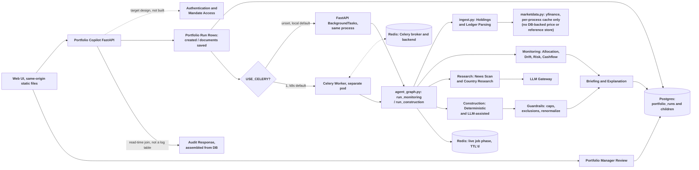

**Interviewer:** Why use one modular service instead of several microservices?

**Candidate:** Scale and team boundaries don't justify splitting this up. One advisor or a small desk running occasional monitoring and construction jobs doesn't need independently scalable services for market data, analytics, and construction. A modular monolith keeps the calculation and review flow easy to test end to end, and the module boundaries inside it (market data, analytics, construction, research, persistence) are already clean enough that any one of them could become a separate service later if a real scaling or security-isolation need showed up. I wouldn't build that split ahead of the need.

**Interviewer:** Which requests are asynchronous, and how does that actually work under the hood?

**Candidate:** This is the part I'd want to be precise about, because "background job" can mean two very different things here. `POST /portfolios` always does the fast, synchronous part: save the uploaded files, hash them, create the run row, commit, and mark the job phase "queued" in Redis. That returns in well under a second regardless of what happens next. What actually executes the pipeline is chosen by one environment variable, `USE_CELERY`. If it's unset, which is the default in `.env.example`, the job runs through FastAPI's own `BackgroundTasks`, in the same process and pod that took the request. If `USE_CELERY=1`, the identical job function is instead handed to a real Celery worker over a Redis broker, running as its own deployment. The Kubernetes manifests flip that switch on: the ConfigMap ships `USE_CELERY: "1"` and there's a separate `celery-worker.yaml` deployment, so the target production posture genuinely is a durable queue.

**Interviewer:** Why does the distinction matter in practice?

**Candidate:** Because `BackgroundTasks` doesn't survive the process it's running in. If the API pod restarts, gets redeployed, or crashes mid-job, whatever was running as a `BackgroundTask` is just gone, with no retry and no record that it was interrupted, beyond the run sitting forever in "processing." A Celery worker, backed by Redis as a broker, keeps the task durable across a restart and retries it automatically. The task definitions already have `max_retries=2` with a 30-second backoff wired in. So local development and a quick demo run in-process for simplicity, and the moment this needs to survive a redeploy without silently losing a job, the same code path runs behind a real queue instead. Nothing about the pipeline logic changes between the two, only who calls it.

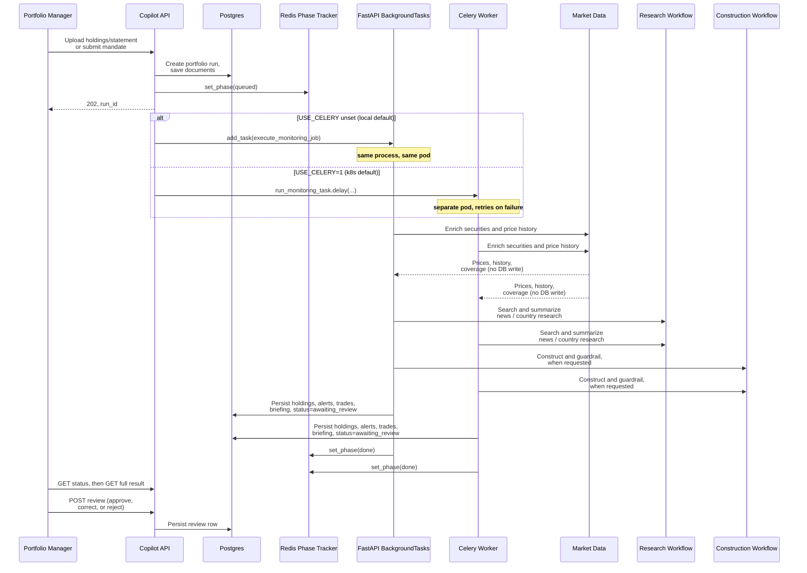

**Interviewer:** Where does the human decision happen?

**Candidate:** After monitoring or construction completes and before any investment action. The reviewer sees holdings, prices and sources, drift, proposed trades, risk metrics, news evidence, candidate selections, guardrail corrections, assumptions, and mandate checks. The system records whether the manager accepted, changed, or rejected the proposal, and I'll get into exactly which status values that maps to in the next section, because the naming there is a little confusing.

### What the advisor actually sees

**Interviewer:** Walk me through what actually loads once a run finishes. What does the advisor see on screen?

**Candidate:** The workspace renders one run as a set of tabs over that same `raw_result` snapshot; nothing on any tab is computed separately from what the pipeline already produced.


*Overview tab.* On the left, a picker to reopen a past run, an upload panel for the holdings file, an optional transactions ledger, and an optional PDF statement, and a "Target portfolio" panel with investable amount, base currency, and countries, the same fields that drive `ConstructionRequest`. On the right, the header line shows the portfolio name, the construction method, the amount invested, and the run's status straight from `PortfolioRun.status`, here `awaiting_review`. The Summary text below it is the deterministic constructor's own narrative string: mandate, fund category, weighting method, the actual sleeve targets it computed, how many holdings it selected, how many guardrail corrections it applied, and the feasibility verdict on the stated return objective, all generated in `_narrative()` in `construct/deterministic.py`, not paraphrased afterward by an LLM.


*Positions tab.* One row per selected security: symbol, sector, country, weight, amount, expected return, and a Reason column. That Reason column is the per-position rationale string the sector-diverse selection logic builds as it picks: "equity sleeve, large cap (50% of tier), sector: Financial Services, sector-diverse selection by expected return, equal-weight across 8 names." That phrasing is a direct trace of the phase-one-then-phase-two selection I described earlier, one guaranteed name per sector before the remaining slots fill by return ranking, so a reviewer can see for any single holding exactly why it's in the book and not just that it is.


*Country research tab.* One card per researched country: an overall risk badge (here, India at "elevated"), the FD/deposit rate and bond credit-rating context the research graph resolved, and a findings table with Category, Severity, and Summary columns. Every visible severity here reads "medium" or "low", never "high", which is exactly what the severity clamp in `alerts.py` guarantees: whatever the LLM classified from the news snippets, nothing coming out of the news or country-research path can surface as the top tier on its own. The system also exposes a Trace tab over the same run's reasoning log, matching the module boundaries in 3.6.

## 3.6 Low-Level Design

**Interviewer:** Break the system into its real modules, not an idealized layering.

**Candidate:** There are two pipelines, monitoring and construction, sharing a deterministic core, plus the API and persistence wrapping both.

| Module | Real file(s) | Responsibility |
| --- | --- | --- |
| Portfolio API | `api/routes.py`, `api/main.py`, `api/schemas.py` | Create runs, list/retrieve results, status polling, rerun, question, review, audit. |
| Job dispatch | `jobs.py`, `celery_app.py`, `tasks.py` | `celery_enabled()` gate; the shared `execute_monitoring_job`/`execute_construction_job` functions called by either dispatch path. |
| Live status | `status_tracker.py` | Redis-backed job phase, independent of Postgres and of Celery's own result backend. |
| Persistence | `db/models.py`, `persist.py`, `session.py` | 7 tables, detailed in 3.7; `init_schema()` is `create_all()`, no migrations. |
| Ingestion | `ingest.py` | Holdings **and** the transaction ledger both load through this one module, with tolerant column-alias mapping (`ticker`/`symbol`, `qty`/`quantity`, and so on) inline in the same file. There is no separate ledger parser. |
| Statement fallback | `statement_extract.py` | LLM transcribes a PDF statement's holdings table into the same `Holding` shape; no computation. |
| Market data | `marketdata.py` | Free `yfinance` quotes and history, fails soft, cached per process only. |
| Allocation / drift / cashflow / risk / alerts / scoring | `allocation.py`, `drift.py`, `cashflow.py`, `risk.py`, `alerts.py`, `scoring.py` | The deterministic monitoring core. Rebalance trade-sizing lives inside `drift.py` itself (`build_rebalance_plan`), not a separate rebalance module. |
| Emerging-risk scan | `osint/search.py`, `collect.py`, `scan.py` | Free DuckDuckGo news, LLM-classified with a deterministic keyword fallback. |
| Country research | `research/graph.py`, `research/nodes.py`, `research/collect.py` | A genuine LangGraph `StateGraph`, covered separately below. |
| Construction universe | `universe.py` | Live-enriched candidate pool from curated seed tables in `reference.py`. Ticker-to-name and alias handling for the universe lives here and in `ingest.py`; there's no standalone symbol-resolver module. |
| Feasibility | `feasibility.py` | Deterministic return-objective check, detailed below. No LLM. |
| Construction (deterministic) | `construct/deterministic.py` | Sleeve targets, cap-tier and sector-diverse selection, four weighting methods. No LLM. |
| Construction (LLM) | `construct/llm_advisor.py` | Free-form security and weight proposal, ticker-whitelisted, then guardrailed identically to the deterministic path. |
| Guardrails | `construct/guardrails.py` | The single hard-constraint gate both constructors pass through. |
| Position annotation | `construct/annotate.py` | Per-position pros/cons, with a deterministic fallback if the LLM is unavailable. |
| Comparison | `compare.py` | Diffs deterministic vs. LLM books. |
| Briefing | `monitor/deterministic.py`, `monitor/llm_briefing.py` | Templated vs. grounded-LLM briefing and Q&A over the same result. |
| Orchestration | `agent_graph.py` | Sequential Python functions, `run_monitoring` and `run_construction`, plus a CLI. Despite the filename, this is not a LangGraph graph. |
| Reference data | `reference.py` | IPS targets, tolerance bands, risk limits, fund taxonomy, construction universe seed. |

There is no dedicated audit-service module. The `/portfolios/{id}/audit` endpoint is a handful of lines in `routes.py` that queries the run's documents, holdings, alerts, and reviews and assembles them into a response; it doesn't read from an independently maintained log.

**Interviewer:** You called `agent_graph.py` an orchestrator earlier. Is it actually orchestrating anything, or is that just a name?

**Candidate:** Fair to push on that, because the two pipelines are not architecturally the same thing and I don't want to blur them. `agent_graph.py` is plain sequential Python: `run_monitoring` calls price, then allocate, then drift, then cashflow, then risk, then optionally the news scan, then optionally country research, then alerts and scoring, each step a normal function call. Nothing there is a graph. The one place a real graph-based orchestrator exists is `research/graph.py`, the country-research subsystem. That's a genuine LangGraph `StateGraph`: for each requested country, it fans out five parallel analysis nodes (geopolitical, sectoral, bond risk, FD rates, market risk, plus a sixth for growth outlook), using LangGraph's `Send` primitive to run them as independent concurrent invocations rather than a sequential loop or a hand-rolled thread pool, then merges their findings into one country profile deterministically. So when I say "orchestration" in this system, I mean two different things depending on which module I'm in: mostly it's a fixed sequential pipeline, and in exactly one subsystem it's genuine concurrent graph execution. I'd rather say that plainly than let the name `agent_graph.py` imply more than the file does.

**Interviewer:** Are there any formal interfaces between these modules, like a `Protocol` for the market-data adapter or the constructor, so you could swap implementations?

**Candidate:** No, and I'd rather say that directly than sketch an interface that doesn't exist in the code. `marketdata.py` exposes plain functions (`get_quote`, `get_history`), not a class implementing a `Protocol`; the two constructors are two separate modules called directly by name from `agent_graph.py`, not two classes registered behind a common interface. If I were pushing this toward a real production posture with, say, a licensed market-data vendor swapped in for `yfinance`, or a second constructor strategy added later, I would introduce something like:

```python
class MarketDataProvider(Protocol):
    def get_quote(self, symbol: str) -> Quote | None: ...
    def get_history(self, symbol: str, period: str) -> list[float]: ...

class PortfolioConstructor(Protocol):
    def construct(
        self, request: ConstructionRequest, universe: list[Candidate],
    ) -> ConstructedPortfolio: ...
```

That's target design, not a description of what's in the repository today. The reason it isn't built yet is that there's exactly one market-data source and exactly two constructors, both called directly by name; introducing a `Protocol` before there's a second real implementation to swap in would be the kind of abstraction the codebase would carry around for no immediate benefit. I'd add it the day a second data vendor or a third constructor strategy actually shows up, not before.

### Run state

**Interviewer:** Walk me through the actual states a run moves through, not an idealized state machine.

**Candidate:** It's much flatter than the tempting version I could have drawn. The literal values written to `PortfolioRun.status` are `created`, `processing`, `awaiting_review`, `validation_review`, `approved`, and `rejected`. `created` is set at insert. `processing` is set the moment the job starts, whether that's a `BackgroundTask` or a Celery worker picking it up. If the pipeline finishes cleanly, persistence sets `awaiting_review`. `approved` and `rejected` only ever come from a reviewer's `POST /review` call.

**Interviewer:** What happens if the pipeline throws an exception halfway through?

**Candidate:** This is the one thing I'd flag as a genuinely awkward naming choice rather than defend it. There is no status literally called `failed` in the database. When the job's except block catches an unhandled exception, it sets `status="validation_review"`, the same status a reviewer would see for a portfolio that finished cleanly and is just waiting on a human look. A `failed` string does exist, but only as a Redis phase value with a one-hour TTL, a completely separate, non-authoritative channel from the Postgres column. So a dashboard or a colleague reading the database directly would see a crashed run sitting in `validation_review` and reasonably assume it's a normal pending review, not a pipeline error. I'd want a real `failed` status before this went anywhere near production reviewers, precisely so "the pipeline broke" and "this needs your judgment" aren't the same word in the one column people actually query.

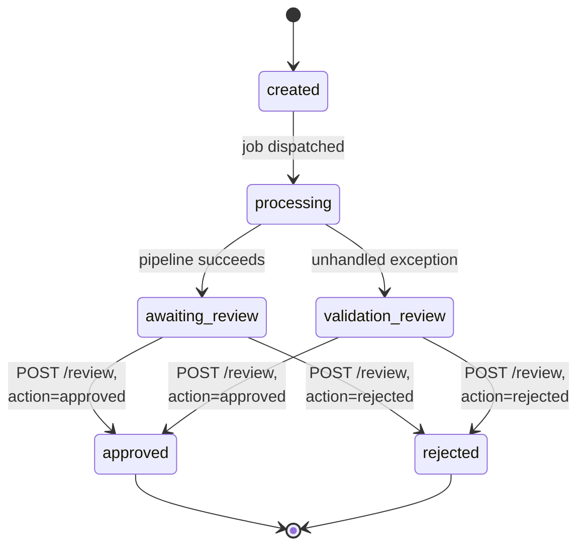

A `POST /review` with `action="corrected"` still writes a review row, but only `approved`/`rejected` move the `status` column. And `completed_at` is only ever set on the success path, so a run stuck in `validation_review` has a permanently null `completed_at`, which is one more reason a naive "is this done" check would misread a crashed run as still in flight.

### API contracts

**Interviewer:** What are the actual routes?

**Candidate:** The resource is `/portfolios`, not `/portfolio-runs`, and it's noticeably flatter than a REST purist might design from scratch.

| Endpoint | Purpose |
| --- | --- |
| `GET /health` | Liveness/readiness probe. |
| `GET /reference/fund-categories` | The fund taxonomy, filtered to categories with real tickers for the given countries. |
| `GET /portfolios` | Every run, newest first, no pagination. |
| `POST /portfolios` | One multipart call: holdings file, transactions file, and PDF statement all as optional file fields, plus mandate/mode/currency/`construction_params` as form fields. Returns 202 and dispatches the job. |
| `GET /portfolios/{id}` | The full result: status, metrics, the entire `raw_result` JSON, and reasoning trace, all in one response. |
| `GET /portfolios/{id}/status` | Cheap poll target; reads the Redis phase while non-terminal, falls back to the DB row once it settles. |
| `POST /portfolios/{id}/rerun` | New `PortfolioRun` row with `parent_run_id` set, re-linking the parent's stored documents, re-dispatched through the same Celery/BackgroundTasks fork. |
| `POST /portfolios/{id}/question` | Q&A grounded in the stored `raw_result`; 409 if the run has no result yet. |
| `POST /portfolios/{id}/review` | Records a reviewer action; only `approved`/`rejected` move `status`. |
| `GET /portfolios/{id}/audit` | Assembles documents, holdings, alerts, and reviews for the run at read time. |

**Interviewer:** So holdings and the transaction ledger don't get their own upload endpoints?

**Candidate:** No. They're both optional file fields on the same `POST /portfolios` multipart call, alongside the PDF statement. There's also no separate `.../analytics`, `.../alerts`, or `.../proposal` endpoint. All of that, allocation, drift, risk, cashflow, alerts, and the construction proposal, comes back bundled inside the one `GET /portfolios/{id}` response, because it's all part of the same `raw_result` JSON snapshot the pipeline wrote when the run finished. I'd only split that into narrower endpoints if a caller genuinely needed to fetch, say, just the alerts on a schedule without pulling the rest of the payload; nothing in the current UI needs that yet.

**Interviewer:** Why does a rerun get a whole new run row instead of updating the existing one?

**Candidate:** A correction to a price, a quantity, a target weight, or the mandate can change the entire downstream result, allocation, drift, proposed trades, risk metrics, alerts, the briefing. Overwriting the original run in place would throw away the record of what was actually reviewed the first time. A new row with `parent_run_id` pointing at the original keeps both: the reviewer can still see what was flagged before the correction, and the new run is a clean, independently auditable result.

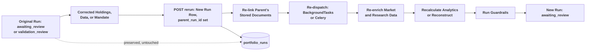

**Interviewer:** What if a portfolio manager wants to override a guardrail, say keep an overweight position on purpose?

**Candidate:** There's no built-in exception workflow for that today, no authority level, no required-approver field, nothing that records "this breach was deliberately accepted." A reviewer can leave a note in the `reason` field on a review action, and that's genuinely useful context, but it doesn't change the guardrailed weights or mark the proposal as an approved exception the way a real override workflow would. If the business needs managers to be able to knowingly keep a position outside a cap, I'd build that as its own reviewed action, an explicit `override` type distinct from approve/reject, carrying the breached rule, the affected position, and the reviewer's justification, rather than trying to read that intent out of a free-text reason field after the fact. That's a real gap, not a hidden capability.

## 3.7 Data and Database Schema Design

**Interviewer:** What does the database actually remember? Walk me through the real schema, not an idealized one.

**Candidate:** It's smaller than I'd have guessed going in, and I want to describe it as it is rather than as a textbook portfolio schema might look. There are 7 tables, all Postgres, all keyed off `portfolio_run_id`, and there is no `CLIENT`, `MANDATE`, `MANDATE_VERSION`, or `SECURITY` table anywhere. `portfolio_runs` is the anchor every other table hangs off of, with `cascade="all, delete-orphan"` on each child relationship. Mandate isn't a normalized, versioned entity at all; it's a plain string column (`mandate`, one of `conservative`/`balanced`/`growth`/`aggressive`) directly on the run row, and the full `ConstructionRequest`, including the countries, caps, exclusions, and return target, is stored as a `construction_params` JSONB blob on that same row rather than as its own set of tables.

**Interviewer:** Why not normalize the mandate and the construction request the way I'd expect from a real portfolio system?

**Candidate:** Because there's no versioning or independent-querying need for it yet in this system. Nothing here reuses a mandate across multiple clients or needs to compare "mandate version 3" against "mandate version 4" independent of a specific run. A mandate string plus a JSON snapshot of the request that drove one run is what a `MANDATE_VERSION` table would give you at this scale, just without the extra tables and joins. If this became a multi-client platform where the same mandate genuinely gets reused, revised, and needs its own change history independent of any one run, I'd pull it out into its own versioned table then. Right now that would be schema built ahead of the need.

**Interviewer:** And the rest of the detail, drift lines, cashflow variances, the construction proposal, country research: where does that live?

**Candidate:** Mostly inside one `raw_result` JSONB column on `portfolio_runs`, which is the full `MonitoringResult` or `ConstructionResult` dumped as JSON when the run finishes. Only a slice of that gets normalized out into its own tables: holdings, alerts, and rebalancing trades, because those are the pieces worth querying or joining without deserializing the whole blob. Everything else, the full drift-line detail, cashflow variance detail, risk metrics, country research, the construction proposal's per-position rationale, and the feasibility verdict, lives only inside that JSON snapshot. It's the same trade-off as Chapter 3's credit-risk schema: normalize what benefits from being queried directly, and don't build a table per nested field before there's a real cross-run query need for it.

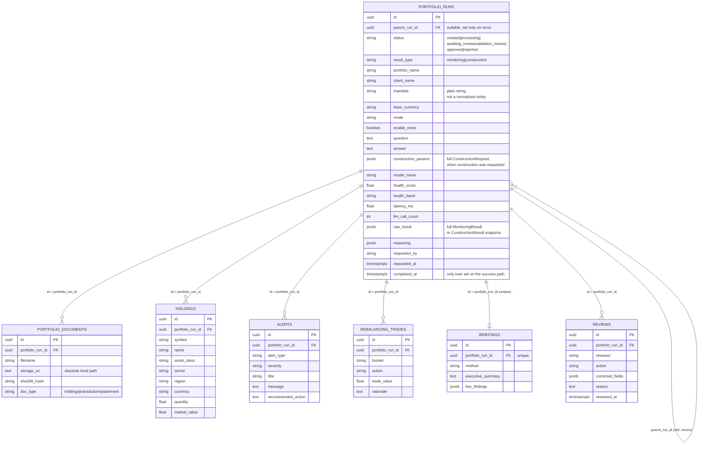

Every child row carries `portfolio_run_id` and nothing else ties it to its siblings; a holding, an alert, and a rebalancing trade from the same run share no identity beyond that foreign key, which is fine because none of them are ever queried independent of a run.

### Data lineage

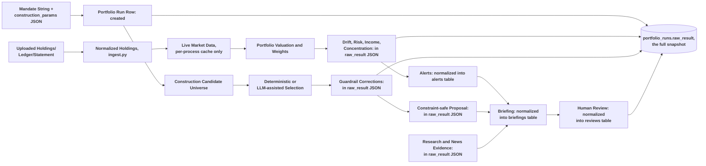

**Interviewer:** Why not persist prices and history in Postgres instead of refetching live every run?

**Candidate:** For reproducibility, refetching is actually the weaker choice, and I'd flag that honestly rather than defend it as intentional. Because prices come from `yfinance` live and are cached only in an in-process dictionary with no expiry, re-running an old portfolio later will price it at today's market, not the price it saw originally. What's preserved instead is the normalized `holdings` row (symbol, quantity, and the `market_value` computed at that run's time) and the full JSON snapshot, so you can see what the run concluded, but you can't independently re-derive it from a stored historical price table, because there isn't one. Adding a `price_history` table keyed by symbol and observation date would close that gap; it just isn't built today.

**Interviewer:** How is research evidence stored, given there's no `RESEARCH_EVIDENCE` table either?

**Candidate:** It's part of the same `raw_result` blob, not a queryable table of its own. Each finding inside it carries a subject, category, severity, one-line summary, and source URL, but there's no `confidence` column and nothing marks a finding as reviewer-confirmed versus just collected. If evidence review became a real workflow, that's exactly the kind of field I'd want to add, but today the news evidence lives and dies inside the JSON snapshot for that run.

**Interviewer:** How do you store a manager's override or correction?

**Candidate:** The `reviews` table: reviewer, action, an optional `corrected_fields` JSON blob, a free-text reason, and a timestamp, all tied to the run. `approved` and `rejected` actions move the run's `status` column; a `corrected` action is recorded but leaves `status` untouched. What it does not give you is a structured way to say "this specific single-name cap breach was knowingly accepted, and here's who authorized it", which is the exception-workflow gap I flagged in 3.6.

**Interviewer:** What is the final design principle?

**Candidate:** The copilot turns portfolio data and research into a clear, constraint-aware proposal. Deterministic services own valuation, risk, drift, income, and guardrails. The LLM helps with research, selection rationale, and explanation. The portfolio manager remains responsible for the investment decision, and no trade is executed automatically.

## Repository

[Open the Portfolio Research and Construction Copilot implementation](https://github.com/GSaiDheeraj/Finance-and-Banking-AI-Usecases/tree/main/Investment_Research_Copilot)
