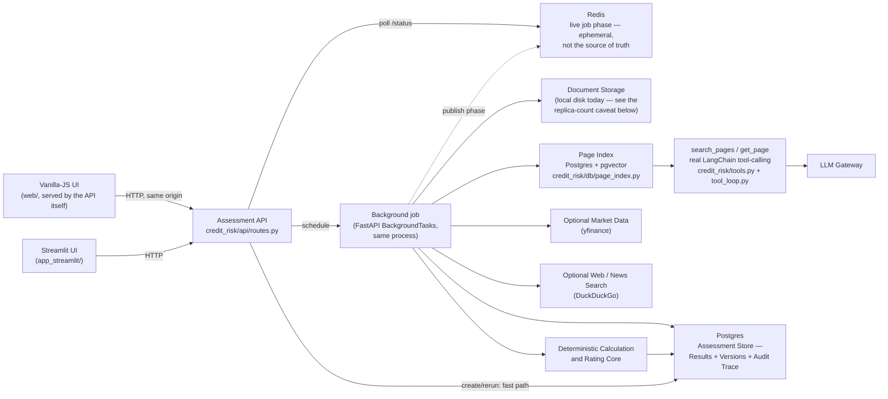
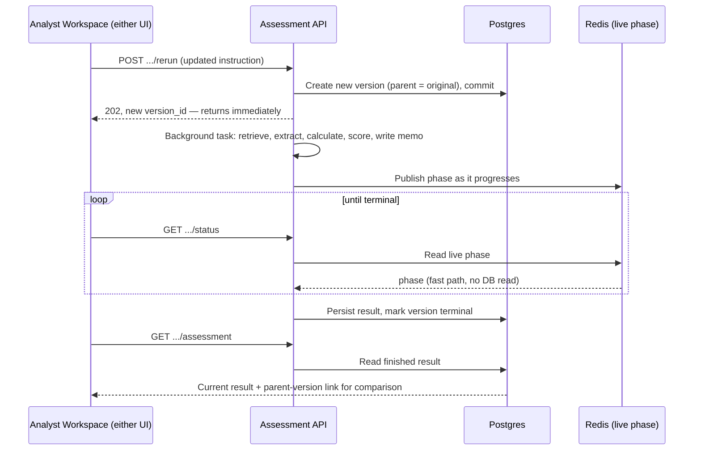
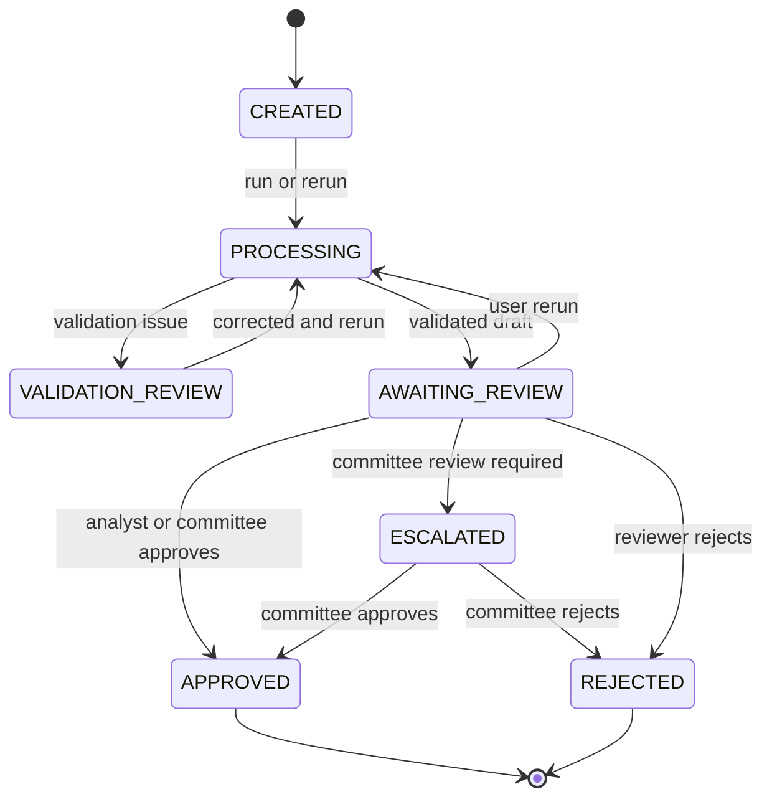
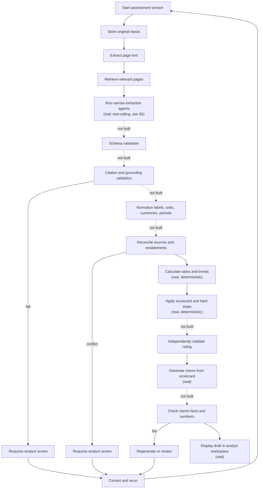
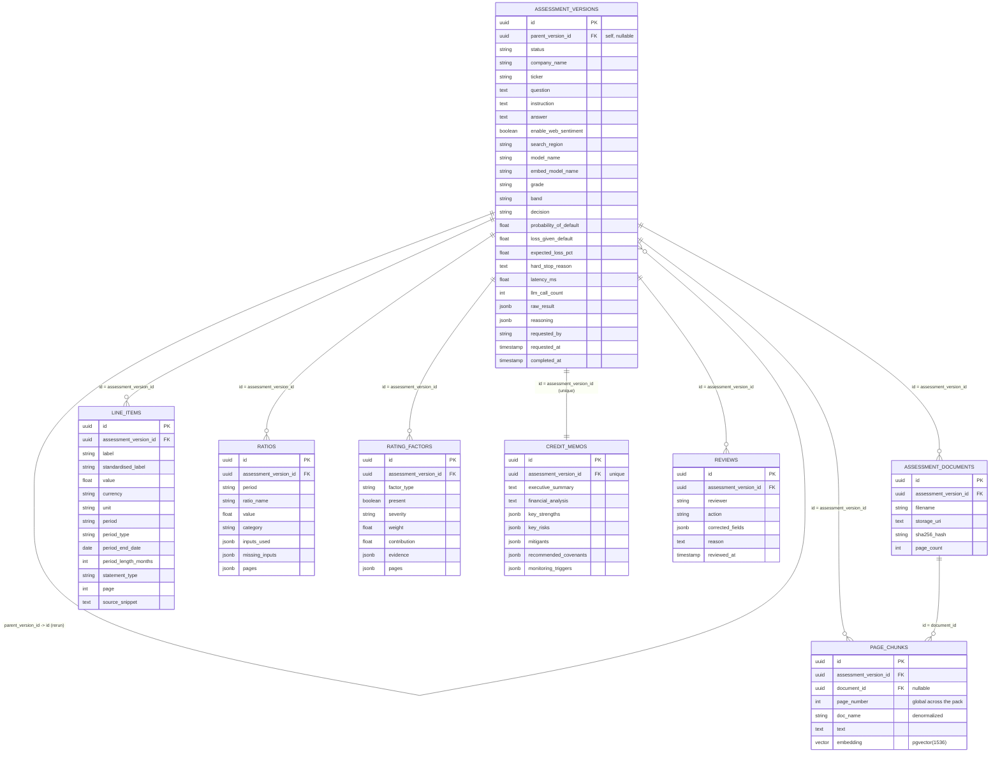

# Credit Risk Assessment Agent — Case Study (Interview Format)

> A mock case-study interview in which a candidate walks an interviewer through a
> production-style agentic AI system for corporate credit risk assessment. §§1–6 describe
> the business problem and requirements in illustrative terms, as originally written.
> **§7 (System Design) has since been updated to describe the actual implementation** —
> the module, file, and endpoint names there are literal references to this codebase
> (`credit_risk/`, `web/`, `Dockerfile`, `k8s/`), not illustrative ones. Where something
> in §7 is still aspirational rather than built, that's called out explicitly rather than
> left ambiguous — see particularly "What's still incomplete" at the end.

---

## 1. Context & Business Narrative

**Interviewer:** Let's start broad. What problem were you actually solving, and who was it for?

**Candidate:** When a company — anywhere from a small business to a large corporate —
applies for a loan, a credit line, or a debt facility, a bank has to judge two things:
how likely is this borrower to repay, and if they don't, how much would the bank lose?
Today a credit analyst does that by hand. They read three to five years of audited
financial statements — often 50 to 300 pages each — compute a few dozen ratios, compare
those ratios to sector peers, dig through the small print for red flags like going-concern
language or covenant breaches, check the news for anything the filings wouldn't show, and
then write a formal credit memo. That's a multi-day process per case, and it doesn't scale
well when a mid-market lending team has a queue of applications waiting.

**Interviewer:** So what did you actually build?

**Candidate:** An agent that does that whole read-analyze-write cycle for the analyst,
but with a very deliberate split of responsibility. The AI only ever reads documents and
writes explanations. Every number that actually matters — the ratios, the benchmark
comparison, the score, the rating, the probability of default, the recommendation — comes
out of plain, deterministic calculation. The agent doesn't autonomously approve, decline,
or disburse anything. It hands the analyst a fully worked draft — figures, evidence,
score, memo — and the analyst reviews and signs off.

**Interviewer:** Why split it that way instead of just letting the model do more of the
reasoning?

**Candidate:** Because a credit rating has to be defensible to a credit committee, to
internal audit, and potentially to a regulator. If the number came out of a language
model's judgment, you can't guarantee that running the exact same financials twice gives
the exact same answer, and you can't point to a rule that produced it. A deterministic
scoring engine gives you both of those for free. The AI's value is entirely upstream of
that — turning unstructured, inconsistently worded filings into the structured facts the
calculation layer needs, and downstream of it — turning a finished scorecard into
readable prose. It never sits in the decision path itself.

---

## 2. Business Requirement

**Interviewer:** From the business side, what did the bank actually ask for?

**Candidate:** Fundamentally: turn a multi-year financial pack into a rated, documented
credit case in minutes instead of days, without losing consistency or auditability. Three
things mattered most to them. First, speed — obviously. Second, consistency — the same
financials, run twice, must produce the same rating, regardless of which analyst or
office ran it. Third, a defensible audit trail — every number in the output has to trace
back to where it came from.

**Interviewer:** What does the analyst actually get out of a run?

**Candidate:** A standardized multi-year financial dataset, computed ratios, historical
trend analysis, sector benchmark comparisons, qualitative risk findings pulled from the
notes and commentary, a credit scorecard with an internal rating, probability-of-default
and loss-given-default estimates with an expected loss, a lending recommendation, and a
draft credit memo with citations back to the evidence. All of that from uploading the
filing pack and, optionally, a ticker and company name.

**Interviewer:** And the reproducibility point — how strict is that in practice?

**Candidate:** Very strict, by design. The same source documents, the same reference
data, the same rule set, and the same model version have to produce the same rating,
every time. That's not a nice-to-have; it's the thing that makes the whole system usable
in a regulated context.

---

## 3. Requirements

**Interviewer:** Let's get concrete. Walk me through the functional requirements.

**Candidate:** At minimum, the system has to:

- Accept one or more financial documents, plus optional company, ticker, industry, and
  facility details.
- Parse each document page by page and keep page references throughout, so nothing loses
  its source.
- Retrieve only the pages relevant to a given extraction task, rather than feeding whole
  documents to a model repeatedly.
- Extract company metadata, financial line items, facility information, audit language,
  and qualitative risk notes as separate, narrow tasks.
- Normalize inconsistent financial labels into one standard vocabulary while keeping the
  original wording for traceability.
- Optionally backfill missing values for public companies from market data, without ever
  letting that override what a document actually says.
- Optionally search public web and news sources for supporting or adverse evidence.
- Calculate ratios, multi-period trends, and sector comparisons.
- Apply a configurable scorecard with hard-stop rules that can force a decline regardless
  of score.
- Produce a rating, PD, LGD, expected loss, a lending recommendation, and a credit memo.
- Let the analyst ask a follow-up question, or supply a correction, and rerun the
  assessment on updated input.
- Surface evidence, warnings, and validation results in the analyst's own workspace.
- Keep a trace of the run and of every reviewer action taken on it.

**Interviewer:** And the non-functional side — what actually constrains the design?

**Candidate:** This is the table I'd put in front of a reviewer:

| Area            | Requirement                                                                                                                           |
| --------------- | ------------------------------------------------------------------------------------------------------------------------------------- |
| Reproducibility | The same inputs, configuration, reference data, and model version must produce the same rating.                                       |
| Explainability  | Every material value, ratio, score contribution, and memo claim must have an evidence or calculation reference.                       |
| Grounding       | The AI may only use the evidence it was given and must never invent or calculate a financial value itself.                            |
| Security        | Financial documents and results must be encrypted in transit and at rest.                                                             |
| Access control  | Enterprise SSO and role-based access must protect the analyst workspace.                                                              |
| Auditability    | Inputs, outputs, validation results, model and configuration versions, and rerun history must all be retained.                        |
| Availability    | Optional market-data or web-search failures must never stop the core assessment from completing.                                      |
| Scalability     | Independent cases should be able to run in parallel; cost should grow roughly linearly with document volume, not spike unpredictably. |
| Maintainability | Prompts, models, embeddings, scorecard rules, and reference tables must all be versioned independently.                               |
| Human control   | A result stays a draft until an authorized analyst or credit committee approves it.                                                   |

Explainability and grounding are the two I'd call load-bearing — almost everything else
in the design exists to satisfy those two.

---

## 4. Data Requirement

**Interviewer:** What actually feeds this system?

**Candidate:** Every extracted or derived value carries its source document, page,
period, currency, unit, whether it came from a document or a fallback source, and its
review status. On top of that scaffolding, four broad categories of data flow in.

**Interviewer:** Start with the documents themselves.

**Candidate:**

| Data point                               | Why it's needed                                                                            |
| ---------------------------------------- | ------------------------------------------------------------------------------------------ |
| Audited annual reports                   | Primary evidence for financial position, performance, cash flow, audit opinion, and notes. |
| Interim statements / management accounts | Fill in more recent performance where the annual filing is stale.                          |
| Information memorandum                   | Explains the business model, ownership, and the purpose of the facility.                   |
| Facility application                     | Defines the amount, type, tenor, purpose, and repayment profile being requested.           |
| Debt schedule                            | Short- and long-term debt, maturities, interest cost, and any security given.              |
| Covenant certificate                     | Covenant thresholds, actual performance against them, and any breaches or waivers.         |
| Historical bank exposure                 | Existing limits and utilization with this borrower.                                        |
| Repayment history                        | Direct evidence of payment behavior — delays, restructuring, past stress.                 |
| Collateral and guarantees                | Feeds the loss-given-default estimate and shapes lending conditions.                       |

**Interviewer:** And the financial figures you actually calculate against?

**Candidate:** Revenue, EBITDA and EBIT, net income, cash and equivalents, receivables,
inventory, current assets and liabilities, short- and long-term debt, interest expense,
total assets/liabilities/equity, operating cash flow, capital expenditure, and principal
repayments. Every one of those feeds a specific downstream calculation — EBITDA and
interest expense drive coverage ratios, cash and debt drive net debt and leverage,
receivables and inventory drive the efficiency ratios, and so on.

**Interviewer:** What about the things that aren't numbers?

**Candidate:** That's the qualitative layer, and it matters just as much: the audit
opinion itself, going-concern language, contingent liabilities and guarantees,
litigation and regulatory matters, related-party transactions, covenant breaches and
waivers, refinancing requirements, customer or supplier concentration, and management's
own commentary. Some of these — an adverse audit opinion, a going-concern flag — are
strong enough to override everything else the scorecard would otherwise say.

**Interviewer:** And reference data — what does the system need that isn't specific to
one case?

**Candidate:** Sector benchmarks, a PD table mapping rating grades to default
probabilities, an LGD table mapping facility and industry characteristics to loss
assumptions, market data to fill permitted gaps for public companies, public web and news
evidence at a deliberately lower weight, and company-identity information — because
without some way to disambiguate, a web search for a fairly common company name will
happily return results about a completely different company.

---

## 5. Agentic AI Solution

**Interviewer:** Let's get into the design itself. What's the one-sentence version?

**Candidate:** The AI reads documents and writes explanations. Deterministic services
calculate, validate, score, and route the case. I held that line everywhere in the
design, not just as a principle but as an actual architectural boundary — no AI-produced
value crosses into the calculation layer without being treated as evidence to be checked,
never as a number to trust outright.

**Interviewer:** Walk me through what actually happens when an analyst starts a case.

**Candidate:** The analyst uploads the filing pack, optionally adds a ticker and company
name, and starts the run. The system reads every document page by page and builds a
semantic index over the whole pack — so instead of feeding a 300-page filing to a
language model every time it needs one number, each extraction task retrieves only the
handful of pages actually relevant to it. That keeps every model call small, fast, and
tightly grounded.

**Interviewer:** And extraction itself — is that one model call, or several?

**Candidate:** Several, deliberately narrow ones. Separate agents handle company
metadata, the financial statements and line items, the notes and risk disclosures, and
the facility request details — and each is a real tool-calling agent, not a fixed
retrieve-then-prompt step: the model is given `search_pages`/`get_page` tools
(`credit_risk/tools.py`) and decides for itself what to search for and when it has
enough evidence, inside a small bounded loop (`credit_risk/tool_loop.py`, capped at a
fixed number of turns so a model that won't stop searching can't spin forever). That's a
genuine grounding improvement over committing to one fixed query's top-k pages up front —
the balance sheet and the cash-flow statement are often dozens of pages apart, and the
model can issue a second, different search instead of missing whichever one its first
query didn't surface. If enabled, a fifth step folds in public web evidence the same
narrow way. Each agent only ever sees what it retrieved for its own task and returns a
structured result with a source page for every field; none of them is asked to compute
anything — they transcribe and classify, nothing more.

**Interviewer:** What happens once the figures exist — how do you actually get from raw
line items to a rating?

**Candidate:** A deterministic engine takes over completely at that point. It normalizes
units and maps every label onto one standard vocabulary, computes leverage, liquidity,
profitability, coverage, cash-flow, and efficiency ratios, compares each one to sector
benchmarks, classifies the trend of each key ratio over time, and — if a company name was
given — folds in a web-evidence synthesis at a reduced, capped weight. All of that rolls
into a weighted scorecard with hard-stop rules: an adverse or disclaimer audit opinion, or
a going-concern note, forces the case straight to the worst grade and a decline
recommendation, no matter what the rest of the scorecard says. From the score you get a
grade, a risk band, PD and LGD estimates, an expected loss figure, and a lending
recommendation. A final, separate model call is then given that finished scorecard —
nothing else — and asked only to explain it in prose.

**Interviewer:** That's a lot of trust being placed in model output before it ever
reaches the calculation layer. How do you validate it?

**Candidate:** You don't trust an LLM response just because it sounds confident, so
nothing from a model call is used until it passes several checks. Schema validation
first — a financial line item, say, has to arrive with its original label, its
standardized label, a value, a currency, a unit, a period, a statement type, and a source
page; anything malformed gets rejected or sent for review rather than silently used.
Citation validation checks that every material value cites a real page, and that the
value and label actually appear on that page. Grounding validation goes further — the
model is explicitly prohibited from calculating or inferring a missing value; if the
evidence doesn't support a clean answer, it has to say "not found," "uncertain," or
"requires review" instead of guessing. On top of that sits deterministic financial
consistency checking — statement relationships, units, currencies, periods, duplicate
values, restated figures, and anything that would produce a nonsensical ratio.

**Interviewer:** And the external data — market data, web evidence — do those get the
same scrutiny?

**Candidate:** Market-data values are always clearly labeled as such and never silently
override a document value — if they disagree by more than a couple of percentage points,
that's flagged rather than resolved automatically, because it usually means a units error
in extraction, not a real discrepancy. Web evidence has to carry a source URL, a date, a
company-match confidence score, and a severity rating, and its influence is deliberately
capped and discounted — one article can't outweigh three years of clean audited
financials. A single web finding can only ever nudge the score by a small, capped amount;
reaching a genuinely serious severity requires multiple corroborating high-severity
findings, and low company-match confidence caps the whole factor regardless of what was
found.

**Interviewer:** What about the scorecard itself, and the memo — do those get validated
too, or is that where you finally trust the output?

**Candidate:** No — if anything those get the strictest checks, because they're the
output the analyst actually acts on. The system independently recomputes the score from
the stored inputs and confirms every component is present, the weights and thresholds
match the configured version, the hard-stop rules were actually applied, and every
material contribution has evidence behind it. The memo-writing agent only ever receives
the already-finalized scorecard and an approved evidence summary — never the raw
documents — and a validator checks the memo for unsupported numbers, contradictions,
wrong-company claims, invented conclusions, or quietly omitted data gaps. A memo that
fails that check gets regenerated or routed to a human rather than shown to the analyst.

**Interviewer:** And the human in the loop — what does that actually look like day to
day?

**Candidate:** The analyst reviews the extracted facts, the evidence pages behind them,
any flagged discrepancies, the ratios, the scorecard factors, the rating, and the memo.
Any correction they make is retained alongside the original value — what it was, what it
became, who changed it, when, and why — so the correction itself becomes part of the
audit trail rather than silently replacing history. And before production, and after any
material change to the model, the prompts, the rules, or the reference data, the bank
should re-run a fixed evaluation: extraction accuracy against labeled examples, page
attribution accuracy, unit and period accuracy, ratio correctness against an independent
calculator, scorecard behavior against known policy test cases, hard-stop behavior, memo
grounding and contradiction rate, and how often analysts are actually overriding the
system's output. That last one especially tells you where the model is weakest.

---

## 6. Business and Technical Metrics

**Interviewer:** How would you know if this was actually working, from the business
side?

**Candidate:**

| Metric                                 | Why it matters                                                               |
| -------------------------------------- | ---------------------------------------------------------------------------- |
| Time to first-pass assessment          | Direct measure of analyst turnaround improvement.                            |
| Time to committee-ready memo           | End-to-end business value, not just the calculation step.                    |
| Assessments per analyst per week       | Productivity.                                                                |
| First-pass memo acceptance rate        | Whether the generated output is actually useful as-is.                       |
| Material correction rate               | Quality of first-pass extraction and analysis.                               |
| Rating consistency across reruns       | Confirms the reproducibility guarantee holds in practice, not just on paper. |
| Early-risk detection rate              | Whether deterioration is being surfaced earlier than before.                 |
| Audit findings per hundred assessments | Control quality.                                                             |
| Committee override rate                | Where the scorecard logic itself might need revisiting.                      |
| Default rate by rating band            | Tests whether the rating actually discriminates risk.                        |
| Expected versus realized loss          | Tests the PD and LGD assumptions against reality.                            |

**Interviewer:** And on the engineering side?

**Candidate:**

| Metric                                  | Why it matters                                                 |
| --------------------------------------- | -------------------------------------------------------------- |
| Line-item precision, recall, F1         | Core extraction accuracy.                                      |
| Source-page attribution accuracy        | Traceability, not just correctness.                            |
| Unit, currency, and period accuracy     | These are the errors that silently wreck a ratio.              |
| Evidence-grounding pass rate            | Whether claims are actually supported by the retrieved text.   |
| Missing-field / ratio-gap rate          | Extraction completeness.                                       |
| Company-match accuracy                  | Guards specifically against same-name-company mistakes.        |
| Ratio and rating reproducibility        | Should be effectively 100% by construction; any drop is a bug. |
| Unsupported-fact rate in approved memos | Target is zero.                                                |
| Memo contradiction rate                 | Agreement with the authoritative scorecard.                    |
| Validation-block rate                   | How often the safety checks are actually catching something.   |
| Human correction rate                   | Identifies the weakest extraction tasks.                       |
| Model latency, token usage, cost        | Operational planning.                                          |
| Job success rate, end-to-end latency    | Production reliability.                                        |

**Interviewer:** If you had to pick the one metric you'd watch most closely, which would
it be?

**Candidate:** Rating reproducibility. Everything else can degrade gracefully — a slightly
lower extraction recall just means more analyst correction — but if two runs of the same
financials ever produce different ratings, that's not a quality issue, it's a trust
issue, and it undermines the entire premise of the system.

---

## 7. System Design

### 7.1 High-Level Design

**Interviewer:** Sketch the architecture for me.

**Candidate:** One FastAPI service (`credit_risk/api/`) is the whole backend — no mesh
of microservices, for the same reason as before: a few dozen analysts don't justify that
complexity. The one deliberate split within that single process is *accept* vs *execute*:
a request that starts or reruns an assessment does the fast, synchronous part (save the
uploads, create the version row, commit) and returns in well under a second; the actual
multi-minute pipeline runs as a background task in the same process
(`fastapi.BackgroundTasks`), not a separate worker process. That's not a shortcut I'd
call load-bearing forever — if this needed to survive an API restart mid-job, or run on a
second replica, that's exactly the point where a real queue (Celery+Redis, or the
managed equivalent) would replace it. For the load this actually runs at, it isn't
needed yet, and I'd rather say that plainly than build a queue nothing requires.



**Interviewer:** Walk me through that flow step by step.

**Candidate:**

1. The analyst uploads the filing pack, from either UI — they're two independent HTTP
   clients of the same API, kept deliberately thin (no business logic lives in either
   one).
2. `POST /assessments` saves the uploads to disk, creates the assessment-version row
   (`status="created"`), commits, and returns the version id immediately — that response
   time is measured in milliseconds, not minutes, on purpose (see the note on why below).
3. The actual pipeline, in the background task: extracts page text and builds the
   semantic index over the pack directly in Postgres (pgvector), not an in-memory
   structure — a rerun or the audit view can read those embeddings back without
   re-embedding.
4. The four extraction agents run concurrently (a bounded thread pool — they're
   independent reads of the same already-built index) and retrieve their own evidence
   via real tool calls, not a pre-fetched block of text.
5. Optional market and web enrichment runs, with provenance kept explicit throughout.
6. The deterministic core computes ratios, trends, the scorecard, the rating, PD, LGD,
   and expected loss.
7. The memo agent writes from that finished scorecard.
8. Meanwhile, the client polls a cheap `/status` endpoint — Redis-backed, no database
   read in the common case — for a live phase label ("extracting financials", "writing
   the memo", ...); once the job reaches a terminal state, the client fetches the full
   result.
9. The analyst sees the draft result and every piece of supporting evidence.
10. A follow-up question, a review, or a correction-and-rerun each go through their own
    endpoint; a rerun creates a new version and repeats the same controlled flow — it
    never mutates the original.
11. Both the previous and current versions stay available (the parent-version link is
    part of the stored record) for side-by-side comparison.

**Interviewer:** Why would a request that just creates a row need to be fast — what's
actually driving that?

**Candidate:** The pipeline itself takes minutes — several sequential and parallel LLM
and embedding calls, real measured runs on this system have taken anywhere from under a
minute to several minutes depending on document size. Holding one HTTP connection open
for that long is exactly what a browser's own idle-connection limit, and any reverse
proxy or load balancer in front of a service like this (nginx, an ALB, Cloudflare — all
commonly default well under a minute), are built to kill. The backend would keep working
in that scenario, but the client would never receive the version id it needs to check on
anything. Splitting accept from execute — respond fast, poll for the rest — means no
single request ever needs to survive longer than a client's patience for one poll tick,
regardless of how long the job underneath actually takes.

**Interviewer:** Tell me more about that rerun behavior — why version instead of just
overwrite?

**Candidate:** Because overwriting would destroy exactly the audit trail the whole system
exists to provide. A rerun is treated as new evidence or a new instruction layered onto
the case, not as permission to discard what came before.



If the analyst corrects a figure, that correction is recorded explicitly, and everything
downstream of it — ratios, benchmark position, score, memo — gets recomputed rather than
patched. Half-updated numbers are worse than no update at all.

**Interviewer:** What about the audit trail itself — is that a separate system?

**Candidate:** Not a separate *system* — there's no separate database or service behind
it, and no compliance platform or external reporting tool consuming it independently, so
that reasoning still holds. It is, in the current build, a dedicated endpoint
(`GET /assessments/{id}/audit`) rather than something reused from in-process code the way
it would be if the workspace and the backend shared a runtime — the workspace is now a
genuinely separate HTTP client (two of them, actually), so exposing this as a thin,
read-only composition of the same tables is how "populated from the same store" actually
looks once the UI isn't in the same process. It shows the source documents and their
hashes, the extracted values and source pages, which model produced them, the ratio
inputs, the scorecard weights and contributions, and the review history — every field
pulled from tables the assessment result already lives in, nothing separately
maintained.

### 7.2 Low-Level Design

**Interviewer:** Break the system down into its actual modules.

**Candidate:**

| Module                                | Real file(s)                                                  | Responsibility                                                                                          |
| ------------------------------------- | ------------------------------------------------------------- | ------------------------------------------------------------------------------------------------------- |
| Analyst workspace (×2)               | `app_streamlit/ui.py`, `web/`                             | Upload, run, rerun, question, review, and audit views — two independent HTTP clients of the same API.  |
| Assessment API                        | `credit_risk/api/routes.py`, `main.py`                    | Accepts requests, creates versions, schedules background jobs, serves every read.                       |
| Background job runner                 | `credit_risk/api/routes.py::_run_assessment_job`            | Executes the pipeline in-process (`fastapi.BackgroundTasks`), in its own DB session.                  |
| Live status tracker                   | `credit_risk/status_tracker.py`                             | Publishes/reads the job's current phase in Redis — ephemeral, not the source of truth.                 |
| Document indexing / page index        | `credit_risk/doc_index.py`, `db/page_index.py`            | Extracts page text; Postgres+pgvector semantic retrieval, scoped per assessment version.                |
| Extraction agents + tool-calling loop | `credit_risk/extraction.py`, `tools.py`, `tool_loop.py` | Grounded metadata/line-item/notes/facility extraction via real`search_pages`/`get_page` tool calls. |
| Market-data adapter                   | `credit_risk/marketdata.py`                                 | Optional yfinance fallback plus document-versus-market cross-check.                                     |
| Web-evidence service                  | `credit_risk/osint/`                                        | Optional public search, evidence collection, and grounded sentiment synthesis.                          |
| Ratio engine                          | `credit_risk/ratios.py`                                     | Deterministic ratio calculation.                                                                        |
| Benchmarking module                   | `credit_risk/benchmarks.py`                                 | Deterministic sector comparison and trend classification.                                               |
| Scoring engine                        | `credit_risk/scoring.py`                                    | Deterministic scorecard, rating, PD, LGD, and decision logic.                                           |
| Memo-writing agent                    | `credit_risk/narrative.py`                                  | Grounded credit memo generation from the finished scorecard.                                            |
| Assessment repository                 | `credit_risk/db/models.py`, `persist.py`                  | Persists versions, line items, ratios, factors, memos, and reviews.                                     |
| **Validation layer**            | *(not built)*                                               | Schema/citation/grounding/consistency/scorecard/memo checks — see "What's still incomplete."           |

The workspace and API rows are the two genuinely new things versus the original sketch:
what was drawn as "one application service" is now a real, separately-deployable FastAPI
service two different frontends actually call over HTTP, and "the worker" turned out not
to need its own process — a background task in the same one does the job at this scale.

**Interviewer:** How does one case actually move through its lifecycle?

**Candidate:**



What's actually real today: `CREATED`, `PROCESSING`, `AWAITING_REVIEW` (a finished draft),
`VALIDATION_REVIEW` (an unhandled exception during the pipeline — the version and
whatever pages/documents it managed to persist are kept, not discarded), `APPROVED` and
`REJECTED` — all literal values of `AssessmentVersion.status`
(`credit_risk/db/models.py`), set by `run_credit_assessment` and
`api/routes.py::submit_review`. `ESCALATED`, and `VALIDATION_REVIEW → PROCESSING` as an
automatic transition, are not — a `"corrected"` review action is recorded (with the
original values kept alongside it) but doesn't itself trigger anything; turning a
correction into a rerun today is a second, explicit `POST .../rerun` call from the
analyst, not an automatic one.

**Interviewer:** And inside "processing" — what's actually happening?

**Candidate:** This is the target shape — extraction and the deterministic core are real,
the validation gates around them are not (see the gates table just after this). I'd
rather show the intended shape and be explicit about the gap than quietly narrow the
diagram to only what exists.



**Interviewer:** Could you sketch what the orchestration actually looks like, at a high
level?

**Candidate:** This one I can show closer to the real thing — it's genuinely close to
`agent_graph.py::run_credit_assessment` / `assess_pack`:

```python
def run_credit_assessment(pdf_paths, question="", ticker="", company_name="",
                           session=None, parent_version_id=None, version=None):
    version = version or create_version(session, parent_version_id, ...)  # status="processing"

    documents = persist_documents(session, version.id, pdf_paths)
    pages = load_pack_as_pages(pdf_paths)
    ingest_into_page_index(session, version.id, pages)   # Postgres + pgvector
    session.commit()                                      # visible to the parallel step below

    # Four independent, I/O-bound reads of the same index — a bounded thread pool,
    # not because it's fancy, but because there's no reason to run them one at a time.
    company, line_items, notes, facility = run_extraction_agents_in_parallel(version.id)

    line_items = apply_yfinance_fallback(line_items, ticker)          # optional, fails soft
    web_sentiment = run_web_sentiment(company_name) if enabled else None  # optional, fails soft

    ratios = compute_ratios(line_items)
    benchmark = benchmark_ratios(ratios, company.industry)
    trend = analyse_trends(ratios, company.management_commentary)
    scorecard = score_case(ratios, benchmark, trend, company, notes, web_sentiment)

    memo = synthesize_credit_memo(scorecard, ...)

    persist_line_items_ratios_factors_memo(session, version.id, ...)
    version.status = "awaiting_review"
    version.raw_result = full_result_as_json()
    return assessment
```

The point of showing it this way is what's *missing* compared to the target shape I'd
still design toward: every deterministic stage is a real, already-shipped plain function
call with no model involved — that part matches the target exactly. What isn't there yet
is any `require_...` gate. Nothing currently stops between extraction and calculation to
check that a citation is real, that the evidence actually supports the value, or that the
memo doesn't contradict the scorecard it was handed. The two enrichment steps (yfinance,
web sentiment) are the one place failure handling for external calls is real — both are
wrapped and degrade to "skip it" rather than fail the run, which is the closest thing
today to the gate discipline described below.

**Interviewer:** Talk me through those gates specifically.

**Candidate:** Framing this honestly: this table is still the target, not an inventory of
what runs today.

| Gate | Check                                                   | Result if failed                                              | Built?                                                                                                                                                                                                                                                                                                 |
| ---- | ------------------------------------------------------- | ------------------------------------------------------------- | ------------------------------------------------------------------------------------------------------------------------------------------------------------------------------------------------------------------------------------------------------------------------------------------------------ |
| G1   | JSON and schema validity                                | Reject the response, or retry once against the same evidence. | Partial — a malformed field is silently dropped/defaulted (Pydantic coercion), not rejected-and-retried.                                                                                                                                                                                              |
| G2   | Required citation and page existence                    | Mark the field for review; never use it as authoritative.     | No                                                                                                                                                                                                                                                                                                     |
| G3   | Evidence actually supports the extracted value          | Block the field, or mark it uncertain.                        | No                                                                                                                                                                                                                                                                                                     |
| G4   | Units, currencies, periods, duplicates, restatements    | Raise a reconciliation issue.                                 | Partial — the yfinance cross-check (`agent_graph.py::_cross_check`) does exactly this, but only against yfinance, not across the documents themselves.                                                                                                                                              |
| G5   | Ratios and trends are reproducible                      | Block the affected ratio, or the whole assessment.            | Yes, by construction —`ratios.py`/`benchmarks.py`/`scoring.py` are pure functions of their inputs; nothing non-deterministic sits between input and output. Not independently re-verified at runtime, though — reproducibility is a property of the code, not something a gate checks per run. |
| G6   | Score weights, thresholds, hard stops applied correctly | Block rating finalization.                                    | No separate check — the scoring code itself applies hard stops (`scoring.py`), but nothing independently re-derives the score to confirm it.                                                                                                                                                        |
| G7   | Memo numbers and claims match the approved record       | Regenerate, or route to review.                               | No                                                                                                                                                                                                                                                                                                     |
| G8   | Human approval exists                                   | Never mark the assessment final without it.                   | Partial —`POST .../review` records an approval/rejection and sets a terminal status, but nothing downstream actually checks for that before treating a result as usable; a client can read `AWAITING_REVIEW` results freely.                                                                      |

**Interviewer:** What actually gets persisted, and why relational rather than a document
store?

**Candidate:** What's built is a deliberately pragmatic subset of the full entity list I'd
still want eventually — normalized tables for what genuinely benefits from being queried
or joined directly, plus one `jsonb` snapshot column for everything else, rather than a
dedicated table per nested concept before any of them has a real query need behind it.

| Entity                                                    | Real table                                              | Purpose                                                                                                                                                                                                                   |
| --------------------------------------------------------- | ------------------------------------------------------- | ------------------------------------------------------------------------------------------------------------------------------------------------------------------------------------------------------------------------- |
| Assessment versions                                       | `assessment_versions`                                 | Every original run and rerun — parent version, status, model/embedding model name, PD/LGD/grade/decision, and the full result as`raw_result` jsonb.                                                                    |
| Assessment documents                                      | `assessment_documents`                                | Filename, storage URI, SHA-256 hash, page count.                                                                                                                                                                          |
| Page chunks                                               | `page_chunks`                                         | Page text, page number, document ID, and a pgvector embedding — the semantic index itself lives here, not in memory.                                                                                                     |
| Line items                                                | `line_items`                                          | Original and standardized labels, values, units, periods (including period-end date and length in months), source pages.                                                                                                  |
| Ratios                                                    | `ratios`                                              | Values, inputs used, missing inputs, page lineage.                                                                                                                                                                        |
| Rating factors                                            | `rating_factors`                                      | Factor, severity, weight, contribution, evidence.                                                                                                                                                                         |
| Credit memos                                              | `credit_memos`                                        | The generated memo text, one row per version.                                                                                                                                                                             |
| Review records                                            | `reviews`                                             | Reviewer, action, corrected fields, reason, timestamp.                                                                                                                                                                    |
| Notes, benchmarks, trends, web evidence, reconciliation   | *(inside `raw_result` jsonb, not a separate table)* | Every field the domain model computes for these is still captured — just not yet normalized into its own queryable table, since nothing today needs to filter or join across them independently of their parent version. |
| Validation results, audit events, reference-data versions | *(not built)*                                         | No gate system exists yet to produce results to store (see the gates table above); reference-data versioning still relies on`reference.py`'s file-based `*_PATH` overrides, not a tracked table.                      |

I picked a relational store on purpose, and that reasoning held up in practice: the
access pattern really is write-once records, read-by-case, with joins that matter (a
reviewer's correction back to the exact line item and factor it affected). The one
adjustment building it surfaced was realizing *when* to stop normalizing — every one of
those un-normalized fields is still fully captured, in the one jsonb column, and
promoting any of them to its own table is a mechanical, low-risk change to make the day
an actual cross-case query need shows up for it — not a redesign.

### 7.3 Database Schema — Full Reference

**Interviewer:** Let's go one level deeper — every table, every column, exactly when
each one gets written, and how you'd actually join them back together.

**Candidate:** Happy to. This is a literal reference to `credit_risk/db/models.py`, not a
sketch — I'll flag the couple of places where the real behavior surprised me while
building it.

#### Entity-relationship shape



Every child table's only foreign key is `assessment_version_id`, always joined against
`assessment_versions.id` — a flat, one-hop-from-the-anchor shape on purpose. The two
exceptions are `assessment_versions.parent_version_id`, which self-joins onto
`assessment_versions.id` to walk rerun lineage, and `page_chunks.document_id`, which joins
onto `assessment_documents.id` to attribute a page back to the PDF it came from. Nothing
points at `line_items`/`ratios`/etc. from anywhere except the version they belong to, so
there's never a question of which version a row "really" belongs to, and every child row
disappears cleanly (`cascade="all, delete-orphan"`) if its version is ever deleted — safe
because a version is only ever deleted in a genuinely rare admin cleanup, never as part of
normal flow; a soft-delete flag would be solving a problem that doesn't exist here.

#### Every table, column by column

**`assessment_versions`** — the audit anchor everything else hangs off of.

| Column                                                                    | Type                                  | Written                                                                                         | Notes                                                                                                                                                                |
| ------------------------------------------------------------------------- | ------------------------------------- | ----------------------------------------------------------------------------------------------- | -------------------------------------------------------------------------------------------------------------------------------------------------------------------- |
| `id`                                                                    | `uuid`, PK                          | at creation                                                                                     | Python-side`uuid.uuid4()`, not a DB sequence — lets the app know the id before the first insert.                                                                  |
| `parent_version_id`                                                     | `uuid`, FK → self, nullable        | at creation (rerun only)                                                                        | Null for an original run; set once, never changed.                                                                                                                   |
| `status`                                                                | `varchar(32)`                       | at creation, then on every phase transition                                                     | `created → processing → awaiting_review \| validation_review`, or `→ approved \| rejected` via a review.                                                        |
| `company_name`                                                          | `varchar(255)`, nullable            | at creation (caller's input);**overwritten** once extraction resolves the real filed name | e.g. a caller-typed`"Acme Manufacturing"` becomes `"ACME MANUFACTURING LTD."` once the filing says so.                                                           |
| `ticker`                                                                | `varchar(16)`, nullable             | at creation                                                                                     | Never changed after.                                                                                                                                                 |
| `question`                                                              | `text`, nullable                    | at creation                                                                                     | The original upfront question, if any (the new web UI no longer collects one — see below).                                                                          |
| `instruction`                                                           | `text`, nullable                    | on rerun only                                                                                   | The analyst's stated correction; never set on an original run.                                                                                                       |
| `answer`                                                                | `text`, nullable                    | at creation (if a question was asked)**and** on every later `POST .../question`         | The*latest* answer only — asking a second question overwrites the first; there's no answer history table.                                                         |
| `enable_web_sentiment`                                                  | `boolean`                           | at creation                                                                                     | The actual request flag, not inferred from whether sentiment ended up populated.                                                                                     |
| `search_region`                                                         | `varchar(16)`, nullable             | at creation                                                                                     | Same reasoning as above.                                                                                                                                             |
| `model_name`, `embed_model_name`                                      | `varchar(128)`, nullable            | at creation                                                                                     | Snapshot of`config.py`'s `LLM_MODEL_NAME`/`EMBED_MODEL_NAME` *at run time* — if the env var changes later, old rows still show what actually produced them. |
| `grade`, `band`, `decision`                                         | `varchar`, nullable                 | on completion                                                                                   | Null until the pipeline finishes; a client polling mid-run sees these as absent, not as a stale prior value.                                                         |
| `probability_of_default`, `loss_given_default`, `expected_loss_pct` | `float`, nullable                   | on completion                                                                                   |                                                                                                                                                                      |
| `hard_stop_reason`                                                      | `text`, nullable                    | on completion                                                                                   | Null unless a hard stop fired.                                                                                                                                       |
| `latency_ms`, `llm_call_count`                                        | `float`/`int`, nullable           | on completion                                                                                   | The per-run`metrics` — the one piece of real observability data that exists today (see the earlier note on per-call cost tracking still being a gap).             |
| `raw_result`                                                            | `jsonb`, nullable                   | on completion                                                                                   | The full`CreditAssessment.model_dump(mode="json")` — every ratio, the benchmark, the trend, web sentiment, reconciliation, all of it, in one column.              |
| `reasoning`                                                             | `jsonb` (list of strings), nullable | on completion                                                                                   | The human-readable step trace, so a later`GET` reproduces exactly what the original `POST` returned.                                                             |
| `requested_by`                                                          | `varchar(128)`                      | at creation                                                                                     | Defaults to`"local-analyst"` — there's no real auth yet (see "What's still incomplete"), so this is a free-text field, not a verified identity.                   |
| `requested_at`                                                          | `timestamptz`                       | at creation                                                                                     |                                                                                                                                                                      |
| `completed_at`                                                          | `timestamptz`, nullable             | on completion                                                                                   | Null while`status` is `created`/`processing`.                                                                                                                  |

**`assessment_documents`** — one row per uploaded PDF.

| Column                    | Type             | Notes                                                                                                                                    |
| ------------------------- | ---------------- | ---------------------------------------------------------------------------------------------------------------------------------------- |
| `id`                    | `uuid`, PK     |                                                                                                                                          |
| `assessment_version_id` | `uuid`, FK     |                                                                                                                                          |
| `filename`              | `varchar(255)` | The original upload name.                                                                                                                |
| `storage_uri`           | `text`         | Absolute path on local disk today — see the Kubernetes`replicas: 1` caveat earlier for why this doesn't survive horizontal scale yet. |
| `sha256_hash`           | `varchar(64)`  | Computed once at ingest, over the raw file bytes.                                                                                        |
| `page_count`            | `int`          | Filled in right after paging, same write as the row's creation.                                                                          |

**`page_chunks`** — one row per page; the semantic index itself.

| Column                    | Type                   | Notes                                                                                                                                                                                                                                                                                                                         |
| ------------------------- | ---------------------- | ----------------------------------------------------------------------------------------------------------------------------------------------------------------------------------------------------------------------------------------------------------------------------------------------------------------------------- |
| `id`                    | `uuid`, PK           |                                                                                                                                                                                                                                                                                                                               |
| `assessment_version_id` | `uuid`, FK           |                                                                                                                                                                                                                                                                                                                               |
| `document_id`           | `uuid`, FK, nullable | Which document this page came from.                                                                                                                                                                                                                                                                                           |
| `page_number`           | `int`                | 1-based,**global across the whole pack** — page 47 might be document 2's page 12 if document 1 had 35 pages. This is deliberate: citations elsewhere (`line_items.page`, etc.) reference this same global numbering, so "page 47" always means the same physical page regardless of which document it's actually in. |
| `doc_name`              | `varchar(255)`       | Denormalized copy of the parent document's filename, so a page can be displayed without a join.                                                                                                                                                                                                                               |
| `text`                  | `text`               | Full page text.                                                                                                                                                                                                                                                                                                               |
| `embedding`             | `vector(1536)`       | pgvector's native type — dimension must match`EMBED_DIM`/whatever `EMBED_MODEL_NAME` actually resolves to; a mismatch would fail the insert, not silently corrupt data.                                                                                                                                                  |

**`line_items`**, **`ratios`**, **`rating_factors`** — the three "many small rows per
version" tables, all written in one batch right after scoring finishes.

| Table              | Key columns beyond`id`/`assessment_version_id`                                                                                                                                                 |
| ------------------ | -------------------------------------------------------------------------------------------------------------------------------------------------------------------------------------------------- |
| `line_items`     | `label`, `standardised_label`, `value`, `currency`, `unit`, `period`, `period_type`, `period_end_date`, `period_length_months`, `statement_type`, `page`, `source_snippet` |
| `ratios`         | `period`, `ratio_name`, `value`, `category`, `inputs_used` (jsonb list), `missing_inputs` (jsonb list), `pages` (jsonb list)                                                         |
| `rating_factors` | `factor_type`, `present`, `severity`, `weight`, `contribution`, `evidence` (jsonb list), `pages` (jsonb list)                                                                        |

**`credit_memos`** — exactly one row per version, enforced by a real DB constraint
(`UNIQUE (assessment_version_id)`), not just an application-level convention — a second
`persist_memo()` call for the same version would fail at the database, not silently
create a duplicate.

| Column                                                                                              | Type              |
| --------------------------------------------------------------------------------------------------- | ----------------- |
| `executive_summary`, `financial_analysis`                                                       | `text`          |
| `key_strengths`, `key_risks`, `mitigants`, `recommended_covenants`, `monitoring_triggers` | `jsonb` (lists) |

**`reviews`** — one row per review action; never updated or replaced, only appended to.

| Column               | Type                | Notes                                                                                                                                                                 |
| -------------------- | ------------------- | --------------------------------------------------------------------------------------------------------------------------------------------------------------------- |
| `reviewer`         | `varchar(128)`    | Free text, same caveat as`requested_by`.                                                                                                                            |
| `action`           | `varchar(16)`     | `approved \| corrected \| rejected`.                                                                                                                                  |
| `corrected_fields` | `jsonb`, nullable | What the reviewer says should change — recorded, not automatically applied (see "What's still incomplete": turning this into a rerun is still a manual second step). |
| `reason`           | `text`, nullable  |                                                                                                                                                                       |
| `reviewed_at`      | `timestamptz`     |                                                                                                                                                                       |

#### The write timeline — what happens, in order, for each operation

**`POST /assessments` (and `POST .../rerun`, identically, just starting from a new
version row with `parent_version_id` set):**

| # | What runs                                                                   | Table(s) touched                                                                                                                                                                           | Committed?                                                                                                                                                                                                                                                                                                                                                                                                  |
| - | --------------------------------------------------------------------------- | ------------------------------------------------------------------------------------------------------------------------------------------------------------------------------------------ | ----------------------------------------------------------------------------------------------------------------------------------------------------------------------------------------------------------------------------------------------------------------------------------------------------------------------------------------------------------------------------------------------------------- |
| 1 | Route handler creates the version row                                       | `assessment_versions` INSERT (`status="created"`)                                                                                                                                      | Yes — the route commits before returning 202, so the client's`version_id` is guaranteed durable the instant it's handed back.                                                                                                                                                                                                                                                                            |
| 2 | *(response sent; background task starts)*                                 | —                                                                                                                                                                                         | —                                                                                                                                                                                                                                                                                                                                                                                                          |
| 3 | Documents persisted, pages extracted and embedded                           | `assessment_documents` INSERT ×N, `page_chunks` INSERT ×(total pages)                                                                                                                | Yes — committed here specifically,*before* the parallel extraction step, because those four extractors each open their own session/connection and can only see rows another transaction has actually committed, not merely flushed. `assessment_versions.status` flips to `"processing"` in this same commit (it was set on the object earlier, this is just the first point anything gets flushed). |
| 4 | Four extractors run concurrently, each read-only                            | *(reads `page_chunks` only)*                                                                                                                                                           | —                                                                                                                                                                                                                                                                                                                                                                                                          |
| 5 | yfinance fallback, web sentiment, ratios, benchmark, trend, scorecard, memo | *(all in-memory — no writes yet)*                                                                                                                                                       | —                                                                                                                                                                                                                                                                                                                                                                                                          |
| 6 | Results persisted                                                           | `line_items`, `ratios`, `rating_factors`, `credit_memos` INSERT                                                                                                                    | Not yet — added to the session, not committed.                                                                                                                                                                                                                                                                                                                                                             |
| 7 | Version finalized                                                           | `assessment_versions` UPDATE (`status="awaiting_review"`, grade/band/decision/PD/LGD/EL, `raw_result`, `reasoning`, `completed_at`, and the **resolved** `company_name`) | **This commit is what actually persists steps 6 and 7 together** — one transaction, so a client never observes line items/ratios without the version row that explains what they produced, or vice versa.                                                                                                                                                                                            |

On an unhandled exception anywhere in steps 4–6: `assessment_versions.status` becomes
`"validation_review"` and *that* gets committed — but whatever hadn't been persisted yet
(typically the line items/ratios/factors/memo, since they're the last thing written) is
simply never inserted. What survives a failed run is always the version row plus
whatever documents/pages made it through step 3, never a half-written scorecard.

**One thing worth being honest about**: a rerun re-does step 3 in full — it re-reads the
same PDFs from disk and re-embeds every page into a **new** set of `page_chunks` rows
scoped to the new version, rather than reusing the parent version's already-computed
embeddings. That's simple and correct (each version's data is fully self-contained,
nothing is shared or mutated across versions), but it is real, avoidable recomputation
cost for a rerun that didn't change the documents at all — a legitimate optimization to
make later, not one this build makes today.

**`POST /assessments/{id}/question`**: reads `assessment_versions.raw_result`, calls the
LLM once, `UPDATE assessment_versions SET answer = ...`. Nothing else.

**`POST /assessments/{id}/review`**: `INSERT INTO reviews`, and — only if the action is
`approved` or `rejected` — `UPDATE assessment_versions SET status = ...` in the *same*
commit. A `corrected` review inserts the row and stops there.

**`GET /assessments/{id}/status`**: no Postgres write, and usually no Postgres *read*
either — see `status_tracker.py`'s Redis-backed live phase.

#### How to actually merge the tables

The app itself never joins `line_items` and `ratios` and `rating_factors` together in one
SQL query — and deliberately so. All three are independent one-to-many children of the
same `assessment_versions` row; joining two or more of them directly multiplies rows (a
classic fan-out): a version with 24 line items and 84 ratios joined naively produces
24 × 84 = 2,016 rows, none of which mean anything. The correct pattern — and what
`_to_response`/`get_audit_trace` in `credit_risk/api/routes.py` actually do via SQLAlchemy
relationships — is **one query per child collection**, all filtered by the same
`assessment_version_id`:

```sql
-- The pattern behind every read in this app: one query per child table, not one
-- mega-join. This is exactly what accessing `version.line_items`, `version.ratios`, etc.
-- as separate SQLAlchemy relationship attributes compiles down to.
SELECT * FROM assessment_versions WHERE id = :version_id;
SELECT * FROM line_items          WHERE assessment_version_id = :version_id;
SELECT * FROM ratios              WHERE assessment_version_id = :version_id;
SELECT * FROM rating_factors      WHERE assessment_version_id = :version_id;
SELECT * FROM credit_memos        WHERE assessment_version_id = :version_id;  -- at most one row
SELECT * FROM reviews             WHERE assessment_version_id = :version_id ORDER BY reviewed_at;
```

If a single round trip genuinely matters (it doesn't yet, at this volume), the fan-out
problem has a real fix that doesn't require the naive join: aggregate each child
collection into its own JSON array with `json_agg` before joining, so each child table
still only contributes one row per version to the result:

```sql
SELECT
    v.*,
    (SELECT json_agg(li) FROM line_items li WHERE li.assessment_version_id = v.id) AS line_items,
    (SELECT json_agg(r)  FROM ratios r      WHERE r.assessment_version_id = v.id)  AS ratios
FROM assessment_versions v
WHERE v.id = :version_id;
```

A few other joins worth naming explicitly, since "how to merge the tables" really means
"what questions can you actually answer":

```sql
-- Full rerun lineage for a case (every version descended from the same original):
WITH RECURSIVE lineage AS (
    SELECT * FROM assessment_versions WHERE id = :original_id
    UNION ALL
    SELECT v.* FROM assessment_versions v JOIN lineage l ON v.parent_version_id = l.id
)
SELECT id, status, grade, requested_at FROM lineage ORDER BY requested_at;

-- Cross-case reporting (the exact "how many sub-investment-grade ratings this quarter"
-- example from earlier) — no join needed at all, which is the point of keeping this
-- table flat and queryable:
SELECT grade, count(*) FROM assessment_versions
WHERE status = 'awaiting_review' AND requested_at >= date_trunc('quarter', now())
GROUP BY grade ORDER BY grade;

-- Reviewer-to-figure traceability — a genuine two-hop join, but bounded to one version
-- so there's no fan-out risk:
SELECT r.reviewer, r.action, r.reason, li.label, li.value
FROM reviews r
JOIN line_items li ON li.assessment_version_id = r.assessment_version_id
WHERE r.assessment_version_id = :version_id;

-- The actual pgvector query PgPageIndex.search() issues under the hood (cosine distance,
-- ascending — pgvector's `<=>` operator, exposed in SQLAlchemy as `.cosine_distance()`):
SELECT page_number, doc_name, text
FROM page_chunks
WHERE assessment_version_id = :version_id
ORDER BY embedding <=> :query_embedding
LIMIT 5;
```

**Interviewer:** What does the workspace actually call, under the hood?

**Candidate:** These are real REST endpoints now, since the workspace is a genuinely
separate HTTP client rather than in-process code:

| Endpoint                            | Operation                                                                                               |
| ----------------------------------- | ------------------------------------------------------------------------------------------------------- |
| `POST /assessments`               | Start an assessment — returns immediately, runs in the background.                                     |
| `GET /assessments`                | List past assessments (the case-history picker).                                                        |
| `GET /assessments/{id}`           | Current status and, once finished, the full result.                                                     |
| `GET /assessments/{id}/status`    | Cheap poll target — live phase from Redis, falling back to Postgres's status once the job is terminal. |
| `POST /assessments/{id}/rerun`    | Rerun the same documents with a correction — also backgrounded.                                        |
| `POST /assessments/{id}/question` | Grounded follow-up Q&A — synchronous, since it's one LLM call.                                         |
| `POST /assessments/{id}/review`   | Submit an approval, correction, or rejection.                                                           |
| `GET /assessments/{id}/audit`     | The audit-tab read, composed from the same tables as everything else.                                   |

**Interviewer:** How does the system behave when something outside its control fails —
the language model, market data, web search?

**Candidate:** Unevenly, if I'm honest about exactly where today. Market-data and
web-search failures genuinely do degrade gracefully — both are wrapped and skip
themselves on any error, so a yfinance outage or a DuckDuckGo failure doesn't take the
rest of the assessment down with it; that part of the design held up in the actual code.
Retried-with-backoff, template-memo-on-failure, and idempotent version creation are all
still the target, not what's built: there's no retry/backoff around the core LLM calls
today, a failed memo generation fails the whole request rather than falling back to a
template, and two identical `POST /assessments` calls would create two separate version
rows, not be deduplicated. What *is* real is that a failure doesn't get silently
discarded — an unhandled exception mid-pipeline still commits the version at
`VALIDATION_REVIEW` with whatever documents and pages it managed to persist before
failing, so the case is inspectable rather than just vanishing. "Never reaches a
downstream user marked final without passing every gate" doesn't hold yet either, simply
because most of those gates don't exist yet (see the table above).

**Interviewer:** Last thing — security and observability. What's actually watching this
system in production?

**Candidate:** Also mostly still the target here, and worth being direct about that
rather than implying otherwise. What's real: structured logging with a consistent format
across the package (`credit_risk/logconf.py`), no secrets hardcoded in the codebase
(everything's read from environment variables, `credit_risk/config.py`, `db/session.py`),
and reasonably fine-grained log levels already used to distinguish routine tracing from
actual warnings. What's not built yet: enterprise SSO, role-based permissions separating
an analyst from a reviewer, a secrets manager (today it's environment variables — a real
improvement over hardcoding, but not the same as a managed vault with rotation), and any
systematic log redaction — nothing currently stops a stray log line from including a
figure or a name it shouldn't. The event schema I'd still want (assessment version ID,
parent version, acting user, component, event type, timestamp, duration, status, all in
one structured line per event) isn't there either; today's logs are useful for debugging
one run but not yet built as a queryable audit stream.

Operationally, the dashboard I'd actually want tracks page count and retrieval latency,
model call count, token usage, extraction failure rate, ratio-gap rate,
doc-vs-yfinance-discrepancy rate, memo regeneration rate, human correction rate, rerun
frequency, and end-to-end latency — none of that is wired into a real metrics backend
yet; the closest thing today is the per-run `metrics` dict (`llm_calls`, `latency_ms`,
`yfinance_discrepancies`, `ratio_gaps`) stored on each version row, which is exactly the
right data, just not yet aggregated anywhere. If I had to name the single most important
one to alert on once it exists, it's still the human correction rate on a specific
extraction task — a sudden spike there almost always means something upstream changed (a
new filing format, a model or prompt regression) before anyone would otherwise notice.

**Interviewer:** If you were being honest about what's still incomplete in this design,
what would you flag?

**Candidate:** More than I would have guessed before actually building it — which is
itself the point of building instead of just designing. In rough priority order:

1. **The validation-gate layer doesn't exist.** This is the biggest gap, and it's the one
   I'd fix first — it's what the whole "reproducible and defensible" pitch leans on.
   Extraction and the deterministic core are real and correctly separated; nothing sits
   between them checking a citation is real, that evidence actually supports a value, or
   that the memo agrees with the scorecard it was handed. Today that trust is implicit,
   not verified.
2. **No retry/backoff, and no idempotent version creation.** A transient LLM-gateway
   blip fails the run outright rather than retrying; a duplicated `POST /assessments`
   (a flaky client, a double-click) creates two full version rows, not one deduplicated
   run. Both are bounded, well-understood fixes — they're missing because they weren't
   the bottleneck yet, not because they're hard.
3. **The review workflow is partial.** A review is recorded and can set a terminal
   status, but nothing downstream actually enforces "don't treat this as final until
   reviewed" — a client reading `AWAITING_REVIEW` gets the same data it would after
   `APPROVED`. The gate exists as a state value, not as an enforced check.
4. **Auth, RBAC, and secrets management are all still the target, not the build.** No
   SSO, no role separating an analyst from a reviewer, and credentials live in
   environment variables rather than a managed vault — fine for a single local analyst,
   a real gap the moment this has more than one.
5. **Document storage doesn't survive horizontal scale.** Uploads land on local disk
   (`DOCUMENT_STORAGE_DIR`); the Kubernetes manifests deliberately pin `replicas: 1` and
   say why, rather than silently shipping a config that would lose uploads the moment a
   second pod or a rolling replacement landed on a different node.
6. **Per-call observability (latency, tokens, cost) isn't wired up**, same gap as
   before — the per-run `metrics` on each version row is the right data, just not yet
   broken out per LLM call or aggregated anywhere queryable.
7. **The CI/CD pipeline and Kubernetes deployment are real artifacts, not yet a real
   rollout.** `test` and `build-and-push` actually run (GHCR needs no extra secret to
   work); `deploy` is real `kubectl` logic gated behind a cluster kubeconfig that doesn't
   exist yet, so it's accurate to call it a reference pipeline, not a working one — I'd
   rather it visibly skip than silently claim success against nothing.

None of these are design disagreements — the target shape for all seven is already
decided, several sketched explicitly earlier in this document. They're the actual
distance between "the design is right" and "the system is done," and I'd rather name
that distance precisely than let it surface as a surprise later.
