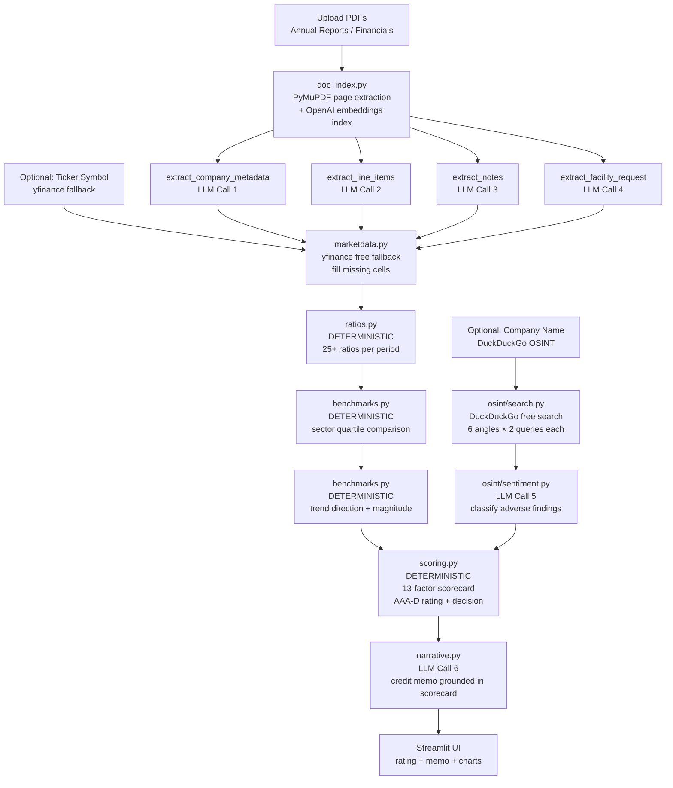
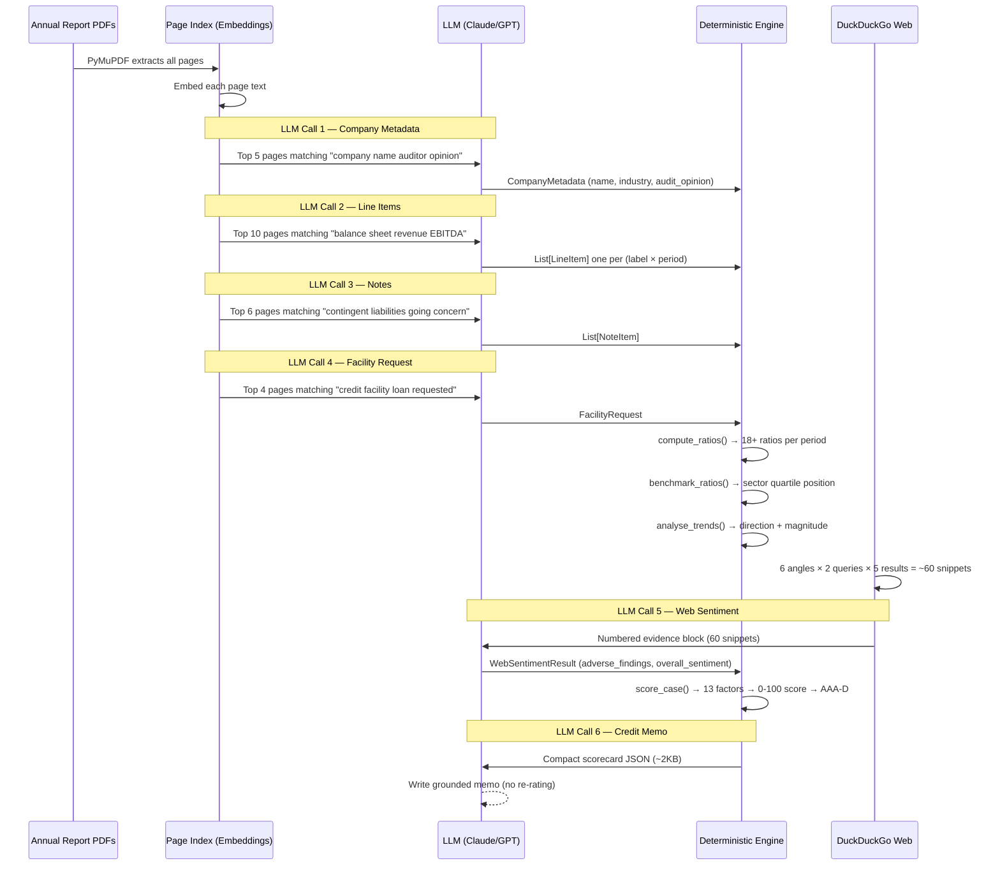
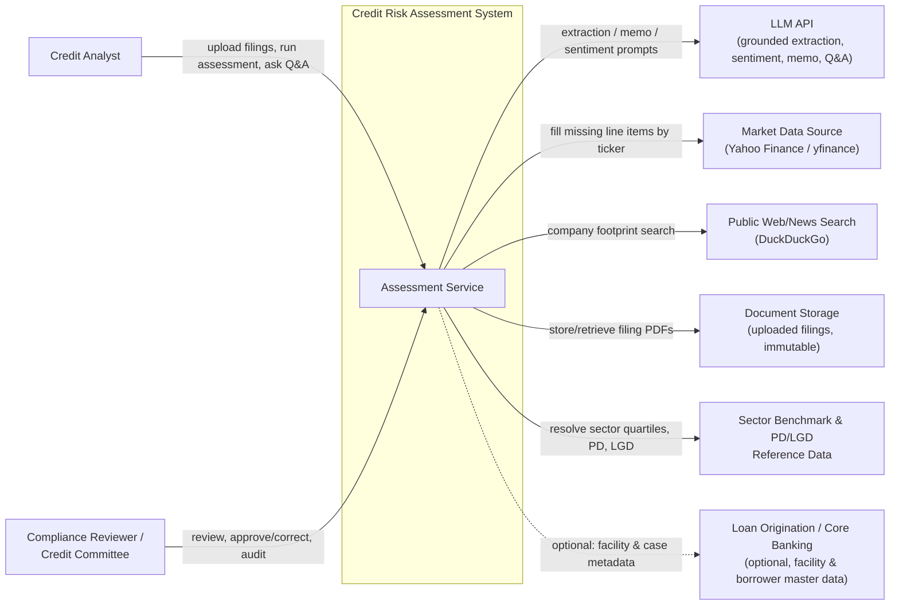
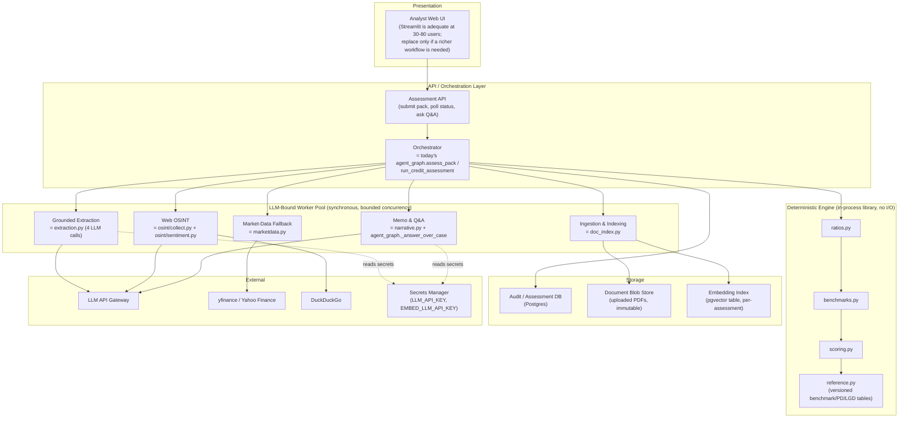
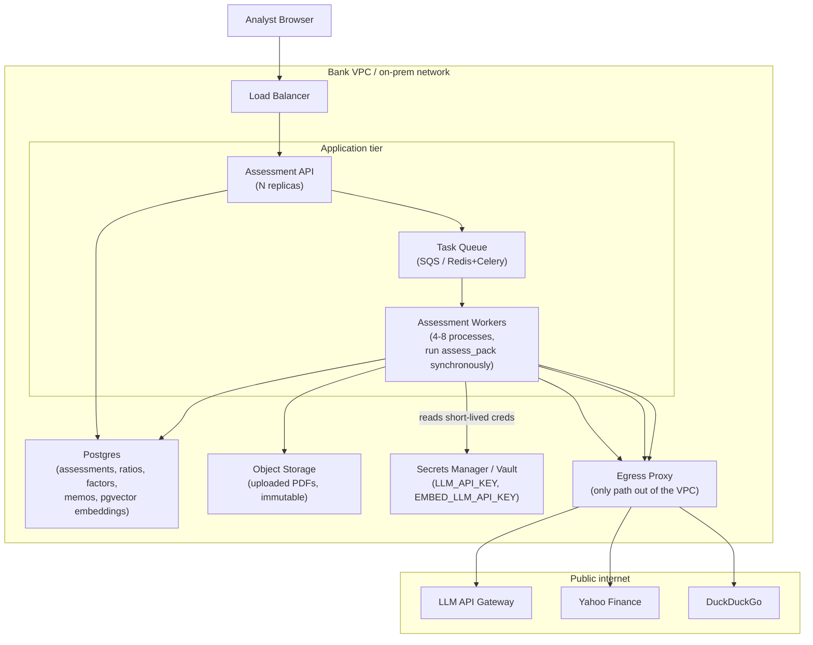
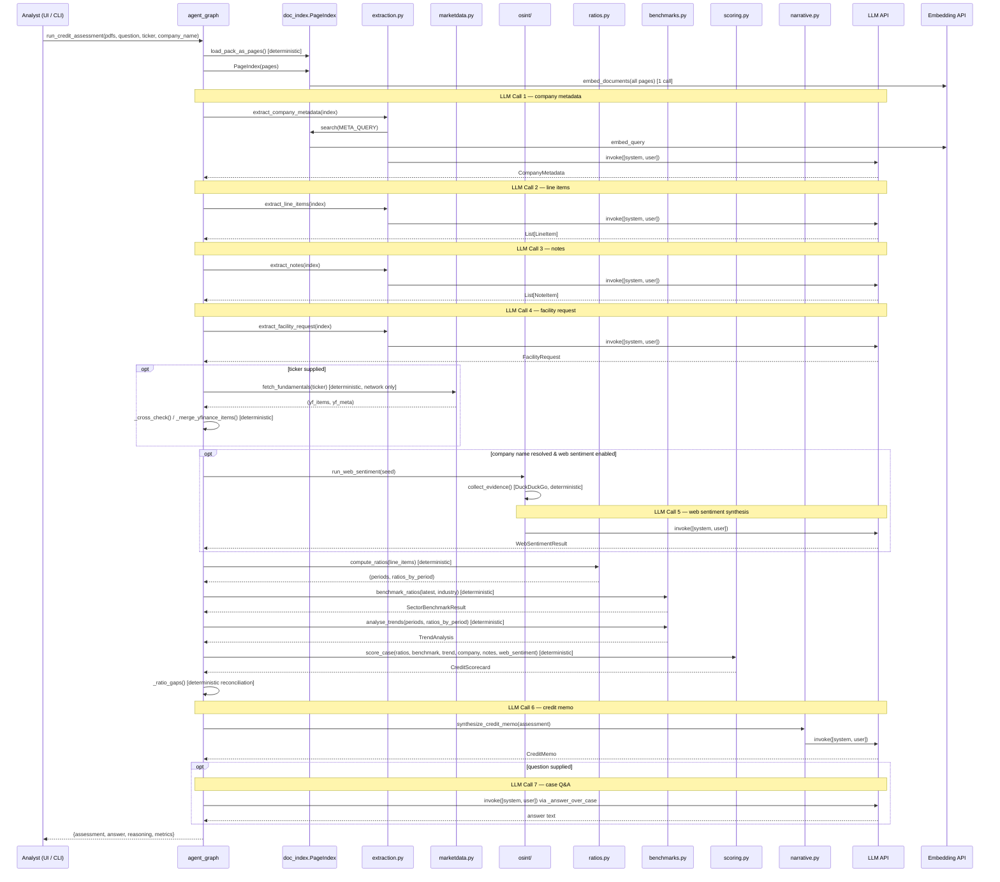

# Credit Risk Assessment Agent — Complete Documentation

## What This Project Does (Plain English)

Imagine a company goes to a bank and says "We need a $10 million loan." Before the bank says yes or no, a credit officer must read the company's audited financial statements (often 3 years of annual reports as PDFs), compute dozens of financial ratios, compare those ratios against industry peers, look for any red flags in the news, and then write a formal **credit memo** explaining the decision.

This agent automates that entire process. You upload the PDFs, optionally provide a stock ticker and company name, and the agent returns:

- An **internal credit rating** (AAA through D, same scale as Moody's/S&P)
- A **lending decision** (approve / approve with conditions / refer to credit committee / decline)
- **Probability of Default (PD)** and **Loss Given Default (LGD)**
- A full **credit memo** explaining every number
- An optional **web sentiment analysis** from public news

---

## Full Architecture Flow



---

## Module-by-Module Deep Dive

### `doc_index.py` — PDF Ingestion + Semantic Search

**What it does:** Loads every PDF page using PyMuPDF, extracts raw text, and creates an embedding-based search index.

**Why embeddings?** Annual reports are 50–300 pages. The balance sheet is on pages 40–45, the cash-flow statement on pages 50–55, the notes on pages 70–120. Rather than sending all 300 pages to the LLM, the agent uses **semantic search**: it embeds a query like `"revenue EBITDA total debt"` and retrieves the 5–10 most relevant pages. This is called **Retrieval-Augmented Generation (RAG)**.

**Business analogy:** Before writing a report, an analyst reads the whole filing and bookmarks the relevant sections. The embedding index is that bookmark system.

```
Embedding = a list of ~1500 numbers that represents the "meaning" of a piece of text.
Two pieces of text with similar meaning produce similar numbers (high cosine similarity).
```

---

### `extraction.py` — Grounded LLM Extraction (4 LLM Calls)

This is where the LLM does its only job in the pipeline: **reading financial language and transcribing numbers**.

#### How Data Gets Into Prompts

For each extraction call, the evidence pipeline is:

```
Query string → embedding search → top-k pages → concatenated text block → LLM prompt
```

**Example for line-item extraction:**

**Step 1 — Query:**

```python
_FINANCIALS_QUERY = (
    "consolidated balance sheet income statement profit and loss "
    "revenue EBITDA total debt total equity operating cash flow"
)
```

**Step 2 — Semantic Search:**
The embedding model converts this query to a vector. The index returns the 10 most similar pages (by cosine similarity).

**Step 3 — Evidence Block (what actually goes into the prompt):**

```
--- PAGE 42 (annual_report_2023.pdf) ---
CONSOLIDATED BALANCE SHEET
As at 31 December 2023  (USD millions)
                          2023    2022
Total assets             2,456   2,180
Current assets             890     760
Cash and equivalents       234     198
...

--- PAGE 47 (annual_report_2023.pdf) ---
INCOME STATEMENT
Revenue                  1,240   1,100
Operating expenses        (890)   (810)
EBIT                       350     290
...
```

**Step 4 — System Prompt (instruction to LLM):**

```
You are a financial-statement spreading analyst. From the provided page text ONLY,
transcribe every financial line item, for EVERY period (column) shown.
Rules:
1. Emit ONE record per (line item × period). If a row shows FY2023 and FY2022, emit two records.
2. Map each printed label to the single best standardised_label from the list.
   Common synonyms: Turnover/Net sales -> revenue; Borrowings -> short_term_debt or long_term_debt
3. Transcribe value EXACTLY as printed. Do NOT compute, sum, infer, or rescale.
4. Record unit as 'thousands' or 'millions' if stated, else 'absolute'.
5. Set statement_type to where the row appears.
Output ONLY a JSON array, no prose.
```

**Step 5 — LLM Output (what comes back):**

```json
[
  {"label": "Revenue", "standardised_label": "revenue", "value": 1240, "currency": "USD",
   "unit": "millions", "period": "FY2023", "period_type": "annual",
   "statement_type": "income_statement", "page": 47},
  {"label": "Revenue", "standardised_label": "revenue", "value": 1100, "currency": "USD",
   "unit": "millions", "period": "FY2022", "period_type": "annual",
   "statement_type": "income_statement", "page": 47}
]
```

The LLM never adds numbers, never computes ratios, never makes judgements. It is purely a **reading and mapping machine**.

#### `StandardLabel` Vocabulary — Why It Matters

Every company calls things slightly differently:

- "Turnover" = "Net sales" = "Revenue" → all map to `StandardLabel.REVENUE`
- "Shareholders' funds" = "Net assets" = "Equity" → all map to `StandardLabel.TOTAL_EQUITY`
- "Borrowings" = "Bank debt" → map to `short_term_debt` or `long_term_debt` by maturity

This standardization is the **join key** that lets the deterministic ratio engine find the right numbers regardless of the company's specific vocabulary.

---

### `ratios.py` — Deterministic Ratio Engine (No LLM)

**What it does:** Takes the standardized line items and computes 18+ financial ratios per period. Same inputs → same ratios, always.

#### Unit Normalization

Before computing any ratio, all values are normalized to absolute units:

- "millions" × 1,000,000 → absolute
- "thousands" × 1,000 → absolute

So $1,240 millions becomes $1,240,000,000 — all ratios are computed on absolute numbers.

#### Derived Inputs

Some key inputs are constructed from parts:

```python
# EBITDA: prefer reported figure, else derive
EBITDA = EBIT + Depreciation & Amortization

# Total Debt: prefer reported total, else sum parts
Total Debt = Short-term Debt + Long-term Debt

# Net Debt: Total Debt minus Cash (how much debt would remain after using all cash)
Net Debt = Total Debt - Cash and Equivalents

# Free Cash Flow
FCF = Operating Cash Flow - Capital Expenditure
```

#### Every Ratio Computed

**Leverage Ratios** — How much debt does the company carry?

| Ratio                              | Formula                     | What it tells you                                                                                  |
| ---------------------------------- | --------------------------- | -------------------------------------------------------------------------------------------------- |
| **Debt/Equity**              | Total Debt ÷ Total Equity  | For every $1 of owner money, how much borrowed money exists?                                       |
| **Debt/Assets**              | Total Debt ÷ Total Assets  | What fraction of all assets is financed by debt?                                                   |
| **Net Debt/EBITDA**          | Net Debt ÷ EBITDA          | How many years of earnings would it take to pay off all debt? (2× = comfortable, 5× = stretched) |
| **Total Liabilities/Equity** | Total Liabilities ÷ Equity | Similar to D/E but includes trade payables and all obligations                                     |

**Liquidity Ratios** — Can the company pay bills in the next 12 months?

| Ratio                   | Formula                                              | Healthy range                                                           |
| ----------------------- | ---------------------------------------------------- | ----------------------------------------------------------------------- |
| **Current Ratio** | Current Assets ÷ Current Liabilities                | >1.5× is comfortable; <1.0× means current bills exceed current assets |
| **Quick Ratio**   | (Current Assets − Inventory) ÷ Current Liabilities | Excludes inventory since it can't always be sold quickly                |
| **Cash Ratio**    | Cash ÷ Current Liabilities                          | Most conservative: only counts actual cash                              |

**Profitability Ratios** — Is the business making money?

| Ratio                   | Formula                                       | What it tells you                                                                    |
| ----------------------- | --------------------------------------------- | ------------------------------------------------------------------------------------ |
| **EBITDA Margin** | EBITDA ÷ Revenue                             | What % of every dollar of sales becomes operating cash profit before financing costs |
| **EBIT Margin**   | EBIT ÷ Revenue                               | Operating profit margin (before tax and interest)                                    |
| **Net Margin**    | Net Income ÷ Revenue                         | Bottom line: what % of sales stays as profit after everything                        |
| **ROE**           | Net Income ÷ Total Equity                    | Return on shareholders' investment                                                   |
| **ROA**           | Net Income ÷ Total Assets                    | How efficiently assets generate profit                                               |
| **ROCE**          | EBIT ÷ (Total Assets − Current Liabilities) | Return on Capital Employed: how efficiently long-term capital is deployed            |

**Coverage Ratios** — Can the company service its debt?

| Ratio                       | Formula                                     | Healthy range                                                                                     |
| --------------------------- | ------------------------------------------- | ------------------------------------------------------------------------------------------------- |
| **Interest Coverage** | EBITDA ÷ Interest Expense                  | 3× = safe; below 1.5× = distress signal (earnings barely cover interest)                        |
| **DSCR**              | (EBITDA − Capex) ÷ (Interest + Principal) | Debt Service Coverage Ratio: full debt payment coverage. <1.0× = can't pay debts from operations |
| **OCF/Total Debt**    | Operating Cash Flow ÷ Total Debt           | How many years of operating cash flow to repay all debt                                           |

**Cash Flow Quality Ratios**

| Ratio                     | Formula                   | What it tells you                                                                                   |
| ------------------------- | ------------------------- | --------------------------------------------------------------------------------------------------- |
| **Cash Conversion** | OCF ÷ Net Income         | Is reported profit turning into actual cash? >0.9 is healthy; <0.5 suggests earnings quality issues |
| **FCF Margin**      | (OCF − Capex) ÷ Revenue | Free cash flow as % of revenue: genuine cash available after maintaining/growing assets             |

**Efficiency Ratios**

| Ratio                    | Formula                         | What it tells you                                      |
| ------------------------ | ------------------------------- | ------------------------------------------------------ |
| **Asset Turnover** | Revenue ÷ Total Assets         | Revenue generated per dollar of assets                 |
| **Inventory Days** | (Inventory ÷ COGS) × 365      | How many days of sales sit in inventory                |
| **DSO**            | (Receivables ÷ Revenue) × 365 | Days Sales Outstanding: how long customers take to pay |

---

### `benchmarks.py` — Sector Benchmarking + Trend Analysis (No LLM)

#### Sector Benchmarking

**Business context:** A 15% EBITDA margin means different things in different industries. In supermarkets (thin margins), 5% is healthy. In software (fat margins), 15% is mediocre. The benchmark engine compares each ratio against sector quartiles stored in `reference.py`.

**Classification logic:**

```
above_75th → Strong performer (top quartile)
above_median → Above average
below_median → Below average
below_25th → Weak (bottom quartile) → triggers "material gap"
```

`higher_is_better` flips for leverage ratios: for Debt/Equity, being in the "bottom quartile" (very low leverage) is actually strong, not weak.

**Overall position:**

- **strong**: ≥60% of ratios in upper half AND no material gaps
- **weak**: ≥50% of ratios in lower half OR ≥2 material gaps
- **average**: everything else

#### Multi-Period Trend Analysis

For each key ratio (`net_debt_to_ebitda`, `interest_coverage`, `dscr`, `ebitda_margin`, `net_margin`, `current_ratio`, `ocf_to_total_debt`), the engine:

1. Takes the oldest-to-newest time series of values
2. Calculates percentage change from first to last period
3. Counts sign changes (volatility signal)

**Magnitude thresholds:**

- `< 10%` change → **minor**
- `10–25%` → **moderate**
- `> 25%` → **significant**

**Direction:**

- Increasing leverage → **deteriorating** (higher is worse)
- Increasing interest coverage → **improving** (higher is better)
- Volatile (multiple reversals) → **volatile**

**Management Commentary Signal (deterministic keyword scan):**
The agent reads the "Management Discussion & Analysis" text extracted from the PDF and counts risk words vs positive words:

Risk words: `"going concern", "loss", "decline", "impairment", "default", "covenant breach", "challenging", "shortfall"`

Positive words: `"growth", "record", "improved", "strong", "margin expansion", "outperform"`

Result is `"risk"`, `"neutral"`, or `"positive"` — no LLM needed.

---

### `osint/` — Free Web Sentiment (DuckDuckGo)

**Business context:** Audited financials tell you the past. But what if the company's CEO was arrested last week? The OSINT module searches public web and news sources for any recent developments.

#### How Web Search Data Flows Into the LLM

**Step 1 — Build search queries** (`collect.py`):
For a company named "Acme Ltd" in "UK" in "manufacturing":

```python
{
  GENERAL_NEWS: ["Acme Ltd UK manufacturing", "Acme Ltd news"],
  FINANCIAL_PERFORMANCE: ["Acme Ltd results OR revenue OR profit", "Acme Ltd earnings"],
  ADVERSE: ["Acme Ltd fraud OR investigation OR lawsuit OR scandal",
            "Acme Ltd regulatory OR penalty OR fine OR sanctions"],
  CREDIT_DISTRESS: ["Acme Ltd debt OR default OR restructuring OR covenant breach",
                    "Acme Ltd layoffs OR insolvency OR bankruptcy"],
  GOVERNANCE: ["Acme Ltd CEO OR board OR management resignation",
               "Acme Ltd accounting OR audit OR going concern"],
  MARKET_VIEW: ["Acme Ltd analyst OR rating OR downgrade",
                "Acme Ltd investor OR shares OR bond"],
}
```

**Step 2 — Execute searches** (`search.py`):
For each query, calls `ddgs.text(query, max_results=5)` (web) and `ddgs.news(query, max_results=5)` (news). Returns `{title, url, snippet}` tuples. Deduplicates by URL.

**Step 3 — Build evidence block** (`sentiment.py`):
All results are concatenated into a numbered evidence block:

```
[1] (adverse/news) Acme Ltd faces regulatory probe
    url: https://ft.com/...
    The Financial Conduct Authority has opened an investigation into...

[2] (general_news/web) Acme Ltd annual results
    url: https://acme.com/press/...
    Company reports 12% revenue growth in FY2024...
```

**Step 4 — LLM synthesis call:**
The entire evidence block (typically 2,000–5,000 characters) is sent to the LLM with this instruction:

```
You are a credit analyst reviewing the PUBLIC web/news footprint of a company.
Using ONLY the numbered evidence provided, do four things:
1. Judge disambiguation_confidence: are these results about THIS company?
2. Give overall_sentiment and a 3-sentence summary
3. Extract adverse_findings (fraud, litigation, default, regulatory action) with severity
4. List positive_highlights and data_gaps
Do NOT invent facts. Output ONLY JSON.
```

**Why `disambiguation_confidence` matters:** If you search for "Acme Ltd", you might find results about a completely different company called "Acme Limited" in another industry. The LLM is explicitly asked to judge whether the results are actually about the company being assessed. Low confidence → the ADVERSE_MEDIA factor is capped at "medium" severity regardless of findings.

#### Credibility Discounting in `scoring.py`

Web findings are weaker evidence than audited financial statements. The scoring module applies a deliberate discount:

```python
# Each web finding's severity is reduced by one notch
# "high" → treated as "medium" initially
# A single web finding can never produce more than "medium" severity
# To reach "high" requires at least 2 corroborating high-severity findings
# Low disambiguation confidence caps the whole factor at "medium"
```

This prevents a single tabloid article from overriding three years of clean audited financials.

---

### `scoring.py` — Deterministic Credit Scorecard

**This is the heart of the system.** No LLM — pure Python.

#### Factor Weights

```
LEVERAGE:               22 points max
DEBT_SERVICE_COVERAGE:  22 points max
LIQUIDITY:              16 points max
PROFITABILITY:          16 points max
CASH_FLOW_QUALITY:      14 points max
DETERIORATING_TREND:    16 points max
SECTOR_UNDERPERFORMANCE: 10 points max
SIZE_SCALE:              8 points max
JURISDICTION:            6 points max
AUDIT_QUALITY:          20 points max   ← biggest single factor
OFF_BALANCE_SHEET:      10 points max
ADVERSE_MEDIA:          14 points max   (web-sourced, lower weight)
MARKET_SENTIMENT:        8 points max   (web-sourced, lowest weight)
```

#### Severity Multipliers

```
"low"      → 0.0  (factor not present or acceptable)
"medium"   → 0.6  (factor present but not alarming)
"high"     → 1.0  (factor clearly adverse)
"critical" → 1.6  (near-default or hard stop)
```

**Example:** Leverage factor, weight=22, severity="high":

- Contribution = 22 × 1.0 = **22 points** added to risk score

#### Hard Stop

Two conditions immediately force the rating to **D / decline**, regardless of score:

1. **Adverse or Disclaimer audit opinion**: The auditor couldn't verify the accounts → non-reliance
2. **Going-concern note**: The auditor expressed doubt the company can survive the next 12 months

#### Score → Rating → Band → Decision

```
Score 0-20   → AAA/AA → Investment Grade Strong → "Reference + 80-130 bps"
Score 21-35  → A/BBB  → Investment Grade        → "Reference + 130-220 bps"
Score 36-50  → BB     → Sub-Investment Grade    → "Reference + 250-400 bps"
Score 51-65  → B/CCC  → Speculative             → "Reference + 450-700 bps"
Score 66-80  → CC/C   → Distressed              → "Bespoke / secured only"
Score 81+    → D      → Default                 → "n/a"
```

**Decision logic:**

```
DEFAULT band        → decline
DISTRESSED band     → decline
SPECULATIVE band    → refer to credit committee
SUB_INVESTMENT_GRADE or material benchmark gaps → approve with conditions
Otherwise           → approve
```

#### PD / LGD / Expected Loss

**Probability of Default (PD):** The statistical likelihood the borrower fails to repay within one year. Each rating grade carries a calibrated PD:

- AAA → 0.01% (near-zero)
- BBB → 0.25%
- BB  → 1.0%
- B   → 3.5%
- CCC → 12%
- D   → 100%

**Loss Given Default (LGD):** If the borrower defaults, what fraction of the loan is unrecoverable? Depends on collateral and industry. Typically 40–65%. E.g., `0.45` means you recover 55¢ per dollar lent.

**Expected Loss (EL) = PD × LGD:** The bank's average long-run credit loss per dollar lent. A BBB-rated loan: `0.0025 × 0.45 = 0.1125%` — the bank "charges" this into the loan pricing.

**Pricing suggestion:**

```
Investment Grade Strong → Reference Rate + 80-130 bps
```

"Reference rate" is the base rate (SOFR, LIBOR successor, etc.). "130 bps" means 1.30% added on top. So if the base rate is 5%, the loan charges 6.3%.

---

### `narrative.py` — Grounded Credit Memo (LLM Call 6)

The LLM writes the credit memo, but is given the **entire deterministic scorecard** and is told: do not recompute anything, do not change the grade, just explain what Python already decided.

**What goes into the prompt (compact scorecard):**

```json
{
  "company": "Acme Ltd",
  "industry": "Manufacturing",
  "rating_grade": "BB",
  "risk_band": "sub_investment_grade",
  "normalized_score": 44.2,
  "probability_of_default": 0.01,
  "loss_given_default": 0.45,
  "decision": "approve_with_conditions",
  "latest_ratios": {
    "net_debt_to_ebitda": 3.2,
    "interest_coverage": 4.1,
    "current_ratio": 1.8,
    "ebitda_margin": 0.14
  },
  "active_factors": [
    {"factor": "leverage", "severity": "high", "evidence": ["Net Debt/EBITDA = 3.2"]},
    {"factor": "deteriorating_trend", "severity": "medium", "evidence": ["trajectory: deteriorating"]}
  ],
  "sector_benchmark": {
    "overall_position": "average",
    "material_gaps": ["ocf_to_total_debt"]
  }
}
```

The LLM then writes: executive summary, financial analysis, key strengths, key risks, mitigants, recommended covenants, monitoring triggers — all grounded in the numbers above.

---

### `marketdata.py` — Yahoo Finance Fallback

If a PDF pack is incomplete (e.g., missing the cash-flow statement), and the user provides a stock ticker, the agent fetches that year's fundamentals from Yahoo Finance via `yfinance`. **Documents always win** — yfinance only fills gaps.

A discrepancy check flags when document and Yahoo Finance values differ by more than 2% (configurable via `YF_DISCREPANCY_TOL`). These mismatches often signal a units error in the PDF extraction.

---

## Data Flow Diagram — Prompts Detail



---

## Business Terms Glossary

| Term                                  | Explanation                                                                                                                                                                                                                                               |
| ------------------------------------- | --------------------------------------------------------------------------------------------------------------------------------------------------------------------------------------------------------------------------------------------------------- |
| **EBITDA**                      | Earnings Before Interest, Taxes, Depreciation, and Amortization. Measures cash profit from operations before financing costs and accounting adjustments. Used because it's harder to manipulate than net profit and comparable across capital structures. |
| **Net Debt**                    | Total debt minus cash. If a company has $100M debt but $30M cash, net debt = $70M. The logic: they could use that cash to immediately pay down debt.                                                                                                      |
| **Interest Coverage**           | EBITDA ÷ Interest Expense. "How many times can earnings cover the interest bill?" 3× means earnings are 3× the interest payment — comfortable. Below 1.5× is distress.                                                                               |
| **DSCR**                        | Debt Service Coverage Ratio. Like interest coverage but includes principal repayments too. Shows whether the company can actually repay the loan from operations.                                                                                         |
| **Investment Grade**            | AAA through BBB. Banks, pension funds, and insurance companies can lend to / hold these without heavy capital charges.                                                                                                                                    |
| **Sub-Investment Grade**        | BB and below. Also called "junk" or "high-yield." Higher return required to compensate for higher default risk.                                                                                                                                           |
| **PD (Probability of Default)** | Statistical chance the borrower fails to make a scheduled payment within 12 months.                                                                                                                                                                       |
| **LGD (Loss Given Default)**    | If default happens, what fraction of the loan principal is unrecoverable? Depends on collateral. Unsecured loans have high LGD (~65%); secured by property have low LGD (~30%).                                                                           |
| **EL (Expected Loss)**          | PD × LGD. The "average" loss per dollar lent over many similar loans. Banks price this into the spread.                                                                                                                                                  |
| **Bps (Basis Points)**          | 1 bps = 0.01%. "100 bps over SOFR" means the loan charges the base rate + 1%.                                                                                                                                                                             |
| **Covenant**                    | A contractual condition attached to the loan. E.g., "Net Debt/EBITDA must stay below 4×." If breached, the bank can demand early repayment.                                                                                                              |
| **Going Concern**               | An auditor's warning that the company may not survive the next 12 months. This is an immediate hard stop — no rational bank lends to a company the auditor doubts will survive.                                                                          |
| **Adverse Audit Opinion**       | Auditor says the financial statements do NOT fairly represent the company's position. Worse than qualified.                                                                                                                                               |
| **PEP**                         | Politically Exposed Person. Senior government officials, their family members, and close associates. Higher money-laundering risk by definition.                                                                                                          |
| **Off-Balance-Sheet**           | Obligations that don't appear on the balance sheet itself but represent real risk. Example: guarantees given to subsidiaries, operating lease commitments, litigation outcomes.                                                                           |
| **Credit Memo**                 | A formal bank document that summarizes a credit decision, explains the rationale, states the terms, and records conditions/covenants. Required before any credit committee approves a loan.                                                               |

---

## High-Level Design (HLD) — Ideal Production Architecture

Everything in this section describes a **target production redesign** — how this would be
built if it were promoted from the current Streamlit/CLI proof-of-concept into a real
internal bank system. It is not a description of what exists in `credit_risk/` today.

### Assumptions (illustrative — confirm with the business before committing engineering effort)

There is no production traffic to measure yet, so the numbers below are a starting
planning profile, not measured data:

- **Users.** An **internal enterprise tool** used by a bank's or NBFC's own credit /
  underwriting department — roughly **30–80 named internal analysts and credit-committee
  reviewers**, not an external or public-facing product.
- **Load.** **Tens to low hundreds of credit assessments per day**, concentrated in
  business hours — not per second, and not a public API under unpredictable load.
- **Payload size.** Each assessment ingests a **handful of PDF filings** (typically 1–5
  years of accounts), each **a few MB to tens of MB** — a submission pack rarely exceeds
  ~100 MB total.
- **Latency expectation.** Turnaround is **minutes, not sub-second** — each assessment
  makes multiple sequential grounded LLM calls (extraction, sentiment, memo) plus
  embedding calls, so the honest user-facing expectation is "come back in a few minutes,"
  not a live request/response.
- **Compliance.** Strong audit/reproducibility requirements: **every rating decision must
  be reconstructable** — which document, which extracted figures, which prompt text,
  which model version, who ran it, and when (this mirrors NFR-3/NFR-4 and FR-8.1–8.3 in
  `REQUIREMENTS.md`, which the current POC does not yet persist anywhere beyond
  in-session Streamlit state and stderr/log-file lines).

If actual measured volumes turn out to be materially different (e.g. thousands/day, or a
sub-second SLA), several choices below — the synchronous worker pool, the lack of a
message bus, the single Postgres instance — would need to be revisited.

### System context



**Reasoning.** The two actors map directly to the two personas already named in
`REQUIREMENTS.md` (§4 Impact & End Users): the **credit analyst** who runs assessments and
the **compliance reviewer / credit committee** who reviews and signs off (FR-8.2). The four
external systems are exactly the ones the current code already talks to — an LLM API
(`config.get_llm()`), Yahoo Finance (`marketdata.py`), DuckDuckGo (`osint/search.py`) — plus
two that exist today only as bundled sample data and must become real external systems in
production: document storage (PDFs are currently written to a local temp file by
`app_streamlit/ui.py._to_temp` and never persisted) and a sector-benchmark / PD-LGD feed
(currently `reference.py`'s illustrative JSON, which the module's own docstring already
flags as swappable via `SECTOR_BENCHMARKS_PATH` / `RATING_PD_TABLE_PATH` /
`INDUSTRY_LGD_TABLE_PATH`).

### Component / container architecture



**Mapping to the real modules.** Nothing in this diagram is invented: `doc_index.py`
already is the ingestion/indexing component (`PageIndex`), `extraction.py` already is the
grounded-extraction component, `marketdata.py` and `osint/*` are already isolated
adapters to the two free external data sources, `ratios.py` / `benchmarks.py` /
`scoring.py` are already pure functions with no I/O (the "Deterministic Engine" box is
literally these three modules, unchanged), and `narrative.py` plus
`agent_graph._answer_over_case` are already the only two call sites that write the final
LLM-generated text. The only genuinely new components are the **API/orchestration
layer** (today `agent_graph.run_credit_assessment` is called directly from
`app_streamlit/ui.py` and the CLI `__main__` block — there is no network API), and the
**storage layer** (today nothing is persisted — `CreditAssessment` lives only in the
Streamlit session's memory for the duration of one script run).

### Concurrency model

**Recommendation: stay synchronous, with a small bounded worker pool — no framework-wide
async rewrite, and a queue only for durability, not throughput.**

- **Where the time actually goes.** `agent_graph.assess_pack` makes up to **4 sequential
  extraction LLM calls** (`extract_company_metadata`, `extract_line_items`,
  `extract_notes`, `extract_facility_request`), **1 embedding batch call** to index every
  page (`PageIndex.__init__` → `embedder.embed_documents`) plus **1 embedding call per
  extractor query** (`PageIndex.search` → `embedder.embed_query`), an optional **1 LLM
  call** for web-sentiment synthesis, and a final **1 LLM call** for the credit memo —
  6–7 LLM/embedding round trips per assessment, each taking seconds. `ratios.py`,
  `benchmarks.py` and `scoring.py` run in milliseconds; they are not the bottleneck and
  gain nothing from concurrency.
- **Why not async end-to-end.** Rewriting the LangChain call sites
  (`config.get_llm().invoke(...)`) and the `yfinance`/`ddgs` calls to `asyncio` would only
  pay off if the service needed to hold many hundreds of requests in flight
  simultaneously waiting on I/O. At "tens to low hundreds of assessments per day," peak
  concurrent in-flight assessments is realistically single digits. An async rewrite adds
  an event loop, async-safe client variants, and a harder debugging model for zero
  measurable throughput gain here — it is complexity added on spec, not in response to a
  real bottleneck. Reject.
- **Why a bounded thread pool inside one assessment.** The 4 extraction calls in
  `assess_pack` all read the **same already-built `PageIndex`** and are independent of
  each other's output (`company`, `line_items`, `notes`, `facility` do not feed into one
  another) — today they run one after another for no structural reason. Because each
  call is I/O-bound (blocked on the LLM API, not on CPU), running them through a
  `ThreadPoolExecutor(max_workers=4)` and collecting results with `as_completed` (mapping
  each future back to which extractor it came from, per the repo's own concurrency
  convention) would cut roughly 4x sequential LLM latency down to roughly 1x for that
  stage, with no correctness risk since none of the four calls shares mutable state.
  This is the one concrete, load-justified concurrency change worth making.
- **Why a lightweight queue, and why not skip it.** A single assessment takes minutes.
  Holding an HTTP request open for minutes risks load-balancer/browser timeouts and loses
  the whole job if a worker process restarts mid-run (a deploy, an OOM, a crash). The fix
  is not more concurrency but **decoupling accept-from-execute**: the API accepts the
  pack, writes an `assessments` row with `status='queued'`, hands the job to a small
  durable queue (**AWS SQS** if on AWS, or **Celery with a Redis/RabbitMQ broker** if
  on-prem — pick whichever this bank's infra team already operates, since neither
  choice's message-ordering or throughput features matter at this volume), and a small
  fixed pool of **4–8 worker processes** each runs `assess_pack` synchronously exactly as
  it does today, then writes the result. The queue buys **durability and decoupled
  timing**, not horizontal scale — reject a queue sized or architected for
  high-throughput fan-out (e.g. per-assessment sharding, priority queues); reject no
  queue at all, since a bare synchronous HTTP call for a minutes-long job is exactly the
  kind of request most gateways are configured to kill.

### Data / persistence design

**What needs a database:** everything that must be reproducible and auditable later —
the assessment record itself, the extracted line items, the computed ratios, the
scorecard's factor-by-factor breakdown, the generated memo, the web-sentiment findings,
the reconciliation notes, and — critically for NFR-4/regulatory explainability — **which
model version, which prompt version, which reference-data version, and which analyst**
produced each of those. None of this is persisted today; `CreditAssessment` (already a
fully-nested Pydantic tree in `schemas.py`, `agent_graph.run_credit_assessment`'s
`metrics` dict, e.g. `llm_calls`, `latency_ms`) exists only for the lifetime of one
Streamlit run or one CLI invocation.

**What stays stateless / in-memory:** the deterministic computation itself. `ratios.py`,
`benchmarks.py` and `scoring.py` are pure functions of their inputs with no I/O — they
should remain an in-process library call, not a service, since there is nothing to scale
or persist about the computation step (only its *inputs and outputs* need to be
persisted). The per-assessment `PageIndex` embeddings are also disposable at read time —
they're cheap to regenerate from the stored PDF, so only the source PDF (in blob storage)
is the thing that must never be lost; the embeddings are a derived cache.

**Proposed schema shape (entities, not DDL):**

| Table                                | Purpose                                                | Key columns                                                                                                                                                                                                                                                                                                |
| ------------------------------------ | ------------------------------------------------------ | ---------------------------------------------------------------------------------------------------------------------------------------------------------------------------------------------------------------------------------------------------------------------------------------------------------- |
| `assessments`                      | one row per run — the audit anchor                    | `id`, `company_id`, `ticker`, `requested_by`, `requested_at`, `status`, `model_name`, `model_version`, `prompt_version`, `reference_data_version`, `llm_call_count`, `latency_ms`, `grade`, `band`, `decision`, `pd`, `lgd`, `expected_loss_pct`, `hard_stop_reason` |
| `assessment_documents`             | which PDFs fed the run                                 | `assessment_id`, `filename`, `storage_uri`, `sha256_hash`, `page_count`                                                                                                                                                                                                                          |
| `line_items`                       | extracted figures (`schemas.LineItem`)               | `assessment_id`, `label`, `standardised_label`, `value`, `currency`, `unit`, `period`, `statement_type`, `page`, `source` (`doc` \| `yfinance:<ticker>`)                                                                                                                           |
| `ratios`                           | computed ratios (`schemas.RatioValue`)               | `assessment_id`, `period`, `ratio_name`, `value`, `category`, `missing_inputs` (jsonb), `pages` (jsonb)                                                                                                                                                                                      |
| `benchmark_comparisons`            | (`schemas.BenchmarkComparison`)                      | `assessment_id`, `ratio_name`, `company_value`, `sector_p25/median/p75`, `classification`, `is_material_gap`                                                                                                                                                                                   |
| `rating_factors`                   | scorecard breakdown (`schemas.RatingFactorResult`)   | `assessment_id`, `factor_type`, `severity`, `weight`, `contribution`, `evidence` (jsonb)                                                                                                                                                                                                       |
| `credit_memos`                     | (`schemas.CreditMemo`), 1:1 with `assessments`     | `assessment_id`, `executive_summary`, `financial_analysis`, `key_strengths/risks/mitigants/covenants/triggers` (jsonb)                                                                                                                                                                             |
| `web_sentiment` / `web_evidence` | (`schemas.WebSentimentResult` / `WebEvidenceItem`) | `assessment_id`, `overall_sentiment`, `disambiguation_confidence`, findings & evidence (jsonb)                                                                                                                                                                                                       |
| `reconciliations`                  | (`schemas.DataReconciliation`)                       | `assessment_id`, `discrepancies`, `ratio_gaps`, `filled` (jsonb)                                                                                                                                                                                                                                   |
| `reviews`                          | human-in-the-loop sign-off (FR-8.2)                    | `assessment_id`, `reviewer_id`, `action` (`approved`\|`corrected`\|`rejected`), `corrected_fields` (jsonb), `reviewed_at`                                                                                                                                                                  |
| `reference_data_versions`          | which benchmark/PD/LGD snapshot was live               | `version_id`, `effective_from`, `sector_benchmarks` / `pd_table` / `lgd_table` (jsonb) — an `assessments.reference_data_version` foreign key pins each run to an immutable snapshot                                                                                                           |

**SQL vs NoSQL — and why SQL wins here.** The access pattern is (1) **write-once,
essentially immutable audit records** — one write per assessment, never updated except by
an explicit, separately-logged human review; (2) **read-by-assessment-id** — a single
analyst or reviewer pulling up one case; and (3) **occasional cross-assessment
aggregation** — "how many BB-and-below ratings this quarter," portfolio-level ICAAP/Basel
reporting (REQUIREMENTS §4, §5.1). That is a relational-shaped, well-understood, joinable
schema with a real reporting need, which is exactly what a SQL database (Postgres) is
built for; the nested bits that don't fit neatly into columns (`evidence`,
`missing_inputs`, memo lists) fit fine as `jsonb` columns without giving up the relational
core. **Reject a pure document store (e.g. MongoDB):** `CreditAssessment` genuinely *is*
document-shaped (it's already one nested Pydantic tree, and `model_dump()` would produce
a natural per-assessment document), so a document store is not a bad fit — but it makes
the regulatory aggregation queries and the human-review joins (matching a corrected line
item back to the ratio and factor it affected) more awkward, and at tens/day write volume
none of a document store's horizontal-write-scaling advantages apply. **Pragmatic
middle path:** keep the normalized tables above for anything that needs to be filtered,
joined or aggregated, and *additionally* store the full `CreditAssessment.model_dump()`
as one `jsonb` audit blob on the `assessments` row — an exact, cheap-to-produce
"as-computed" snapshot that sidesteps any risk of the normalized tables drifting from
what the Pydantic model actually produced.

### Deployment topology



**Reasoning.** REQUIREMENTS.md's NFR-5 explicitly calls for VPC-/on-prem-first
deployment and "no sensitive financial data leaving the customer boundary," so every
outbound call — to the LLM gateway, to Yahoo Finance, to DuckDuckGo — is routed through a
single egress proxy that can be monitored, allow-listed and, if compliance requires it,
switched off per data source (the code already supports this at the feature level:
`enable_web_sentiment` and the optional `ticker` are both already off-by-default-safe
toggles in `agent_graph.assess_pack`). The embedding index is kept in **Postgres with the
`pgvector` extension** rather than a standalone vector database (Pinecone/Weaviate/etc.):
each assessment embeds only a handful of PDF pages (`doc_index.PageIndex` embeds all pages
of a pack in one batch call), the corpus per assessment is tiny, and there is no
cross-assessment semantic search requirement — introducing a second specialized data store
for a workload this small would be unjustified operational overhead. Secrets
(`LLM_API_KEY`, `EMBED_LLM_API_KEY` in `config.py`) move out of the `.env` file the POC
reads today and into the bank's secrets manager, injected as short-lived credentials into
the worker containers only.

### Security & compliance

- **PII / financial-data handling.** Filings contain confidential business data
  (registration numbers, employee counts, management names in `CompanyMetadata`) and, via
  the OSINT step, the company's public identity is sent to a third-party search engine —
  that is a real data-boundary decision, not a technicality, and should be an explicit,
  auditable, compliance-approved toggle (the code already makes it a toggle —
  `enable_web_sentiment` — but production needs that decision logged per run, not just
  possible). Encrypt at rest (Postgres, object storage) and in transit (TLS to the LLM
  gateway and to `yfinance`/DuckDuckGo).
- **A concrete gap to fix before production:** `config.py`'s `setup_ssl_certificate()`
  downloads a CA bundle from a hardcoded internet URL on every cold start and only then
  sets `SSL_CERT_FILE`. In production this must become a certificate baked into the
  container image or delivered via the secrets manager — fetching a trust root over the
  network at startup is both a single point of failure and a supply-chain risk that has
  no place in a system whose own NFRs demand on-prem-first, no-sensitive-data-egress
  operation.
- **Access control (RBAC).** At minimum the two roles already implied by
  REQUIREMENTS §4: **Credit Analyst** (create/run assessments, view own cases, submit
  corrections) and **Compliance Reviewer / Credit Committee** (view all cases,
  approve/reject, cannot silently edit extracted figures — matches FR-8.2's "review,
  correct and approve" with the correction itself being a separately logged, attributed
  action). Enforce this in the API layer against the bank's SSO/OIDC identity, not in the
  UI — the current Streamlit POC has no auth at all.
- **Audit logging & model/prompt versioning.** Persist, per assessment: `LLM_MODEL_NAME`
  (from `config.py`), a version tag for each system prompt used (the prompts embedded in
  `extraction.py`, `narrative.py`, `osint/sentiment.py` and
  `agent_graph._answer_over_case` are currently plain string literals with no version
  identifier), and which `reference.py` snapshot (sector benchmarks / PD table / LGD
  table) was active. This is what actually makes a rating "reconstructable" per this
  section's own assumption — reproducing the deterministic math from stored line items is
  not enough if the prompt or the benchmark table has since changed underneath it.

### Observability

`logconf.py` already establishes the right pattern — a single named logger
(`credit_risk`) writing structured, human-readable lines to stderr and optionally to a
file — production should extend this pattern, not replace it, adding an `assessment_id`
correlation field to every line so a single run's events can be pulled together.

- **Ingestion (`doc_index.py`):** log page count and index-build latency at the
  ingestion boundary (currently `agent_graph._log.info` logs the extracted line-item
  count but not how long `PageIndex.__init__`'s embedding call took).
- **Every LLM call (the 4 extractors, the memo, the sentiment synthesis, the Q&A
  answer):** this is the single highest-value gap — `extraction.py`, `narrative.py` and
  `osint/sentiment.py` all call `get_llm().invoke(...)` directly today with **no latency
  or token/cost capture at all**. Wrap the shared `config.get_llm()` call site with a
  LangChain callback that records latency, token counts, and — if the gateway exposes
  pricing — a computed cost, tagged with `assessment_id` and which extractor fired it.
  This is also where `agent_graph`'s own `metrics["llm_calls"]` undercounts reality: it
  tallies chat completions but not the embedding calls `PageIndex` makes (1 batch call +
  1 per extractor query) — those cost money too and belong in the same metric.
  Cost and latency here matter because this is where essentially all of an assessment's
  wall-clock time and dollar cost lives; the deterministic stages are free by comparison.
- **Deterministic engine (`ratios.py`, `benchmarks.py`, `scoring.py`):** these are
  pure, millisecond-scale transforms — log one completion event per stage (already done
  via `agent_graph`'s reasoning trace), not a line per ratio; per the repo's own
  observability convention, instrumentation belongs at I/O boundaries and unit-of-work
  entry points, not inside pure helpers.
- **External data adapters (`marketdata.py`, `osint/search.py`):** already log
  meaningfully (`_log.warning` on discrepancies, `dbg()` trace lines in `osint/search.py`)
  — the one fix needed is that `osint/search.py`'s `dbg()` writes straight to `stderr`
  independently of `logconf.get_logger()`, so its verbosity and destination can't be
  controlled by `CREDIT_RISK_LOG_LEVEL`/`CREDIT_RISK_LOG_FILE` the way everything else is;
  route it through the same logger.
- **Extraction confidence.** No extractor returns a self-reported confidence score today
  (nor should it ask the LLM to — self-reported LLM confidence is unreliable). A more
  trustworthy, already-available proxy is **extraction completeness**: `ratios.py`'s
  `RatioValue.missing_inputs` and `agent_graph._ratio_gaps` already compute exactly which
  standardised labels were absent — surface that as a per-assessment "% of expected line
  items found" metric instead of inventing a new LLM-derived confidence number.

---

## Low-Level Design (LLD)

This section is structural — module responsibilities, schemas, function signatures, and
the actual call order — as a complement to the prose in "Module-by-Module Deep Dive"
above, grounded directly in the code in `credit_risk/` and `app_streamlit/ui.py`.

### Per-module responsibility table

| Module                  | Responsibility                                                                                            | Key functions / classes exported                                                                                                                                                                                                                                                                             |
| ----------------------- | --------------------------------------------------------------------------------------------------------- | ------------------------------------------------------------------------------------------------------------------------------------------------------------------------------------------------------------------------------------------------------------------------------------------------------------ |
| `config.py`           | LLM + embedding client configuration from environment variables; SSL bootstrap                            | `get_llm()`, `get_embedder()`, `setup_ssl_certificate()`                                                                                                                                                                                                                                               |
| `logconf.py`          | Single named (`credit_risk`) logger to stderr + optional file                                           | `get_logger()`                                                                                                                                                                                                                                                                                             |
| `schemas.py`          | Pydantic models/enums for every extraction and deterministic record in the pipeline                       | `LineItem`, `CompanyMetadata`, `NoteItem`, `FacilityRequest`, `RatioValue`, `FinancialRatios`, `SectorBenchmarkResult`, `TrendAnalysis`, `RatingFactorResult`, `CreditScorecard`, `CreditMemo`, `WebSentimentResult`, `DataReconciliation`, `CreditAssessment` (full list below) |
| `doc_index.py`        | PDF → per-page text chunks; in-memory cosine-similarity embedding index                                  | `PageChunk`, `load_pdf_as_pages()`, `load_pack_as_pages()`, `PageIndex` (`.search()`, `.get_page()`)                                                                                                                                                                                             |
| `tools.py`            | LangChain`@tool` wrappers exposing the page index to an agent-style caller                              | `set_page_index()`, `search_pages`, `get_page`, `TOOLS` / `TOOL_MAP`                                                                                                                                                                                                                               |
| `extraction.py`       | Grounded LLM extraction of company metadata, line items, notes, facility request                          | `extract_company_metadata()`, `extract_line_items()`, `extract_notes()`, `extract_facility_request()`                                                                                                                                                                                                |
| `marketdata.py`       | Deterministic Yahoo Finance fallback — fetch + map to`StandardLabel`, fill document gaps               | `yfinance_available()`, `fetch_fundamentals()`                                                                                                                                                                                                                                                           |
| `ratios.py`           | Deterministic ratio computation from line items — no LLM                                                 | `group_by_period()`, `order_periods()`, `compute_ratios_for_period()`, `compute_ratios()`                                                                                                                                                                                                            |
| `benchmarks.py`       | Deterministic sector benchmarking + multi-period trend classification — no LLM                           | `benchmark_ratios()`, `analyse_trends()`                                                                                                                                                                                                                                                                 |
| `scoring.py`          | Deterministic 13-factor scorecard → grade / band / PD / LGD / lending decision — no LLM                 | `score_case()`                                                                                                                                                                                                                                                                                             |
| `narrative.py`        | Grounded LLM credit-memo synthesis from the compacted scorecard                                           | `synthesize_credit_memo()`                                                                                                                                                                                                                                                                                 |
| `osint/search.py`     | Free DuckDuckGo web/news search wrappers + public page-text fetch                                         | `web_search()`, `news_search()`, `fetch_page_text()`, `search_available()`                                                                                                                                                                                                                           |
| `osint/collect.py`    | Build per-angle search queries and gather de-duplicated web evidence                                      | `collect_evidence()`                                                                                                                                                                                                                                                                                       |
| `osint/sentiment.py`  | Grounded LLM synthesis of web evidence into a`WebSentimentResult`                                       | `synthesize_sentiment()`, `run_web_sentiment()`                                                                                                                                                                                                                                                          |
| `agent_graph.py`      | Top-level orchestration: ingest → extract → yfinance fallback → web sentiment → score → memo         | `assess_pack()`, `run_credit_assessment()`, `_merge_yfinance_items()`, `_cross_check()`, `_ratio_gaps()`                                                                                                                                                                                           |
| `reference.py`        | Illustrative sector benchmarks, PD/LGD tables, scoring thresholds (JSON-file overridable)                 | `sector_benchmarks()`, `pd_table()`, `lgd_table()`, `lgd_for_industry()`, `resolve_industry_key()`, `HIGHER_IS_BETTER`, `MATERIAL_RATIOS`, `SCORE_TO_GRADE`, `GRADE_TO_BAND`                                                                                                               |
| `app_streamlit/ui.py` | Streamlit front end — upload, run, render decision/ratios/benchmark/trend/sentiment/memo/data/trace tabs | script entry point; calls`run_credit_assessment()`                                                                                                                                                                                                                                                         |

### Schema tables (`schemas.py`, plus `doc_index.PageChunk`)

**Controlled vocabularies (enums)**

| Enum                   | Values                                                                                                                                                                                                                                                                      |
| ---------------------- | --------------------------------------------------------------------------------------------------------------------------------------------------------------------------------------------------------------------------------------------------------------------------- |
| `StatementType`      | `balance_sheet`, `income_statement`, `cash_flow_statement`, `notes`, `other`                                                                                                                                                                                      |
| `AuditOpinion`       | `clean`, `qualified`, `adverse`, `disclaimer`, `unknown`                                                                                                                                                                                                          |
| `PeriodType`         | `annual`, `interim`, `quarterly`                                                                                                                                                                                                                                      |
| `RatingGrade`        | `AAA`, `AA`, `A`, `BBB`, `BB`, `B`, `CCC`, `CC`, `C`, `D`                                                                                                                                                                                               |
| `RiskBand`           | `investment_grade_strong`, `investment_grade`, `sub_investment_grade`, `speculative`, `distressed`, `default`                                                                                                                                                   |
| `LendingDecision`    | `approve`, `approve_with_conditions`, `refer_credit_committee`, `decline`                                                                                                                                                                                           |
| `RatingFactorType`   | `leverage`, `liquidity`, `profitability`, `debt_service_coverage`, `cash_flow_quality`, `deteriorating_trend`, `sector_underperformance`, `size_scale`, `jurisdiction`, `audit_quality`, `off_balance_sheet`, `adverse_media`, `market_sentiment` |
| `SentimentDimension` | `general_news`, `financial_performance`, `adverse`, `credit_distress`, `governance`, `market_view`                                                                                                                                                              |
| `StandardLabel`      | Fixed vocabulary the LLM maps every printed line-item label onto (28 values spanning income statement, balance sheet and cash-flow rows, plus`other`) — see `ratios.py`'s consumers for the subset that drives ratio computation.                                      |

**`CompanyMetadata`**

| Field                     | Type              | Description                                                                           |
| ------------------------- | ----------------- | ------------------------------------------------------------------------------------- |
| `company_name`          | `Optional[str]` | Legal/trading name                                                                    |
| `legal_entity_type`     | `Optional[str]` | e.g. "Private Limited", "PLC"                                                         |
| `industry`              | `Optional[str]` | Free text; resolved to a benchmark profile key by`reference.resolve_industry_key()` |
| `sub_industry`          | `Optional[str]` | Free text                                                                             |
| `country`               | `Optional[str]` | Country of incorporation / operation                                                  |
| `registration_number`   | `Optional[str]` | Company registry number                                                               |
| `years_in_operation`    | `Optional[int]` |                                                                                       |
| `employee_count`        | `Optional[int]` |                                                                                       |
| `auditor`               | `Optional[str]` | Name of the auditing firm                                                             |
| `audit_opinion`         | `AuditOpinion`  | Default`UNKNOWN`; drives the scorecard's hard-stop check                            |
| `reporting_currency`    | `Optional[str]` |                                                                                       |
| `management_commentary` | `Optional[str]` | Forward-looking/outlook text from MD&A, ≤600 chars                                   |
| `page`                  | `Optional[int]` | Source page                                                                           |

**`LineItem`**

| Field                  | Type                | Description                                                                 |
| ---------------------- | ------------------- | --------------------------------------------------------------------------- |
| `label`              | `str`             | Line-item label exactly as printed                                          |
| `standardised_label` | `StandardLabel`   | Default`OTHER`; the ratio engine's join key                               |
| `value`              | `Optional[float]` | Numeric value in`unit`s of `currency`; `None` if illegible            |
| `currency`           | `Optional[str]`   |                                                                             |
| `unit`               | `str`             | `"absolute"` \| `"thousands"` \| `"millions"`, default `"absolute"` |
| `period`             | `str`             | e.g.`"FY2023"`, `"Q2-2024"`                                             |
| `period_type`        | `PeriodType`      | Default`ANNUAL`                                                           |
| `statement_type`     | `StatementType`   | Default`OTHER`                                                            |
| `page`               | `Optional[int]`   | Source page                                                                 |
| `source_snippet`     | `Optional[str]`   | Original label text, or`"yfinance:<TICKER>"` provenance tag               |

**`NoteItem`**

| Field           | Type                | Description                                                                                                   |
| --------------- | ------------------- | ------------------------------------------------------------------------------------------------------------- |
| `category`    | `str`             | `operating_lease` \| `guarantee` \| `litigation` \| `related_party` \| `going_concern` \| `other` |
| `description` | `str`             |                                                                                                               |
| `amount`      | `Optional[float]` |                                                                                                               |
| `currency`    | `Optional[str]`   |                                                                                                               |
| `page`        | `Optional[int]`   |                                                                                                               |

**`FacilityRequest`**

| Field             | Type                | Description                                                  |
| ----------------- | ------------------- | ------------------------------------------------------------ |
| `facility_type` | `Optional[str]`   | e.g.`term_loan`, `revolving_credit`, `capex`, `bond` |
| `amount`        | `Optional[float]` |                                                              |
| `currency`      | `Optional[str]`   |                                                              |
| `purpose`       | `Optional[str]`   |                                                              |
| `tenor`         | `Optional[str]`   | e.g. "5 years"                                               |
| `page`          | `Optional[int]`   |                                                              |

**`RatioValue`**

| Field              | Type                | Description                                                                                           |
| ------------------ | ------------------- | ----------------------------------------------------------------------------------------------------- |
| `name`           | `str`             | e.g.`net_debt_to_ebitda`                                                                            |
| `value`          | `Optional[float]` | `None` when a required input was missing                                                            |
| `category`       | `str`             | `leverage` \| `liquidity` \| `profitability` \| `coverage` \| `cash_flow` \| `efficiency` |
| `inputs_used`    | `List[str]`       | Standardised labels consumed                                                                          |
| `missing_inputs` | `List[str]`       | Standardised labels that were absent                                                                  |
| `pages`          | `List[int]`       | Source pages for the inputs used                                                                      |

**`FinancialRatios`** — `period: str`, `ratios: Dict[str, RatioValue]`.

**`BenchmarkComparison`**

| Field                                               | Type                | Description                                                                                                 |
| --------------------------------------------------- | ------------------- | ----------------------------------------------------------------------------------------------------------- |
| `ratio_name`                                      | `str`             |                                                                                                             |
| `company_value`                                   | `Optional[float]` |                                                                                                             |
| `sector_median` / `sector_p25` / `sector_p75` | `Optional[float]` | Sector quartile boundaries                                                                                  |
| `classification`                                  | `str`             | `above_75th` \| `above_median` \| `median` \| `below_median` \| `below_25th` \| `not_available` |
| `higher_is_better`                                | `bool`            | Default`True`; from `reference.HIGHER_IS_BETTER`                                                        |
| `is_material_gap`                                 | `bool`            | Bottom-quartile on a`reference.MATERIAL_RATIOS` member                                                    |

**`SectorBenchmarkResult`** — `industry_used: Optional[str]`, `comparisons: List[BenchmarkComparison]`, `overall_position: str` (`strong`\|`average`\|`weak`), `material_gaps: List[str]`.

**`RatioTrend`**

| Field          | Type                      | Description                                                      |
| -------------- | ------------------------- | ---------------------------------------------------------------- |
| `ratio_name` | `str`                   |                                                                  |
| `series`     | `List[Optional[float]]` | Oldest → newest values                                          |
| `periods`    | `List[str]`             | Matching period labels                                           |
| `direction`  | `str`                   | `improving` \| `stable` \| `deteriorating` \| `volatile` |
| `magnitude`  | `str`                   | `minor` \| `moderate` \| `significant`                     |
| `pct_change` | `Optional[float]`       | Newest vs. oldest, as a fraction                                 |

**`TrendAnalysis`** — `trends: List[RatioTrend]`, `overall_trajectory: str` (`improving`\|`stable`\|`deteriorating`\|`mixed`), `commentary_signal: str` (`risk`\|`neutral`\|`positive`), `notes: List[str]`.

**`RatingFactorResult`**

| Field            | Type                 | Description                                       |
| ---------------- | -------------------- | ------------------------------------------------- |
| `factor`       | `RatingFactorType` |                                                   |
| `present`      | `bool`             | Whether this factor adds risk                     |
| `severity`     | `str`              | `low` \| `medium` \| `high` \| `critical` |
| `weight`       | `float`            | Points assigned to this factor                    |
| `contribution` | `float`            | `weight × severity multiplier`                 |
| `evidence`     | `List[str]`        | Human-readable evidence lines                     |
| `pages`        | `List[int]`        | Supporting pages                                  |

**`CreditScorecard`**

| Field                      | Type                         | Description                                            |
| -------------------------- | ---------------------------- | ------------------------------------------------------ |
| `factors`                | `List[RatingFactorResult]` |                                                        |
| `raw_score`              | `float`                    | Sum of all factor contributions                        |
| `normalized_score`       | `float`                    | `min(100, raw_score)`; 100 if a hard stop fired      |
| `grade`                  | `RatingGrade`              | Default`BBB`                                         |
| `band`                   | `RiskBand`                 | Default`INVESTMENT_GRADE`                            |
| `probability_of_default` | `float`                    | From`reference.pd_table()`                           |
| `loss_given_default`     | `float`                    | Default`0.45`; from `reference.lgd_for_industry()` |
| `expected_loss_pct`      | `float`                    | `PD × LGD`                                          |
| `decision`               | `LendingDecision`          | Default`APPROVE`                                     |
| `suggested_pricing`      | `Optional[str]`            | e.g.`"Reference + 130-220 bps"`                      |
| `conditions`             | `List[str]`                | Suggested covenants                                    |
| `hard_stop_reason`       | `Optional[str]`            | Set on disclaimer/adverse opinion or going concern     |

**`CreditMemo`** — `executive_summary: str`, `financial_analysis: str`, `key_strengths / key_risks / mitigants / recommended_covenants / monitoring_triggers: List[str]`.

**`CompanySeed`** — `company_name: str`, `aliases: List[str]`, `country / industry / ticker / search_region: Optional[str]`.

**`WebEvidenceItem`** — `dimension: SentimentDimension`, `query: str`, `title / url / snippet / published: Optional[str]`, `source: str` (`web`\|`news`).

**`WebAdverseFinding`** — `category: str`, `summary: str`, `severity: str` (default `medium`), `url: Optional[str]`.

**`WebSentimentResult`**

| Field                         | Type                        | Description                                                                   |
| ----------------------------- | --------------------------- | ----------------------------------------------------------------------------- |
| `seed`                      | `CompanySeed`             |                                                                               |
| `disambiguation_confidence` | `str`                     | `low` \| `medium` \| `high` — are these results about *this* company |
| `overall_sentiment`         | `str`                     | `positive` \| `neutral` \| `mixed` \| `negative`                      |
| `sentiment_summary`         | `str`                     | ≤3-sentence synthesis                                                        |
| `adverse_findings`          | `List[WebAdverseFinding]` |                                                                               |
| `positive_highlights`       | `List[str]`               |                                                                               |
| `evidence`                  | `List[WebEvidenceItem]`   | Raw collected evidence                                                        |
| `citations`                 | `List[str]`               | Up to 25 evidence URLs                                                        |
| `data_gaps`                 | `List[str]`               |                                                                               |

**`DataReconciliation`**

| Field                                                                         | Type              | Description                                                   |
| ----------------------------------------------------------------------------- | ----------------- | ------------------------------------------------------------- |
| `ticker`                                                                    | `Optional[str]` |                                                               |
| `yfinance_attempted` / `yfinance_available`                               | `bool`          | Whether a ticker was given / the library importable           |
| `doc_line_items` / `yfinance_line_items` / `cells_filled_from_yfinance` | `int`           | Counts                                                        |
| `filled`                                                                    | `List[str]`     | e.g.`"revenue [FY2022] = 450 (yfinance:X)"`                 |
| `discrepancies`                                                             | `List[str]`     | Doc-vs-yfinance value mismatches beyond`YF_DISCREPANCY_TOL` |
| `ratio_gaps`                                                                | `List[str]`     | Ratios still uncomputable, and why                            |
| `notes`                                                                     | `List[str]`     |                                                               |

**`CreditAssessment`** (top-level result) — `company: CompanyMetadata`, `facility: FacilityRequest`, `line_items: List[LineItem]`, `notes: List[NoteItem]`, `periods: List[str]`, `ratios_by_period: List[FinancialRatios]`, `benchmark: SectorBenchmarkResult`, `trend: TrendAnalysis`, `scorecard: CreditScorecard`, `memo: CreditMemo`, `web_sentiment: Optional[WebSentimentResult]`, `reconciliation: Optional[DataReconciliation]`.

**`PageChunk`** (`doc_index.py`) — `page_number: int`, `text: str`, `doc_name: str` (default `""`).

### Function signature tables — critical pipeline functions

**Extraction (`extraction.py`) — each makes exactly 1 LLM call**

| Function                     | Inputs                                | Output              | Key side effects                                    |
| ---------------------------- | ------------------------------------- | ------------------- | --------------------------------------------------- |
| `extract_company_metadata` | `index: PageIndex`                  | `CompanyMetadata` | 1 LLM call; 1 embedding query via`index.search()` |
| `extract_line_items`       | `index: PageIndex`, `k: int = 10` | `List[LineItem]`  | 1 LLM call; 1 embedding query                       |
| `extract_notes`            | `index: PageIndex`, `k: int = 6`  | `List[NoteItem]`  | 1 LLM call; 1 embedding query                       |
| `extract_facility_request` | `index: PageIndex`                  | `FacilityRequest` | 1 LLM call; 1 embedding query                       |

**Ingestion & indexing (`doc_index.py`)**

| Function / method      | Inputs                         | Output              | Key side effects                                           |
| ---------------------- | ------------------------------ | ------------------- | ---------------------------------------------------------- |
| `load_pack_as_pages` | `pdf_paths: List[str]`       | `List[PageChunk]` | Reads PDFs from disk via PyMuPDF; no network               |
| `PageIndex.__init__` | `pages: List[PageChunk]`     | `PageIndex`       | 1 embedding call (`embed_documents`, batches every page) |
| `PageIndex.search`   | `query: str`, `k: int = 5` | `List[PageChunk]` | 1 embedding call (`embed_query`) per invocation          |

**Market data & ratio/benchmark/trend (deterministic — no LLM, no embeddings)**

| Function               | Inputs                                                                                                    | Output                                      | Key side effects                              |
| ---------------------- | --------------------------------------------------------------------------------------------------------- | ------------------------------------------- | --------------------------------------------- |
| `fetch_fundamentals` | `ticker: str`, `max_years: int = 5`                                                                   | `Tuple[List[LineItem], CompanyMetadata]`  | Network call to Yahoo Finance via`yfinance` |
| `compute_ratios`     | `line_items: List[LineItem]`                                                                            | `Tuple[List[str], List[FinancialRatios]]` | Pure function                                 |
| `benchmark_ratios`   | `latest: FinancialRatios`, `industry: Optional[str]`                                                  | `SectorBenchmarkResult`                   | Pure function                                 |
| `analyse_trends`     | `periods: List[str]`, `ratios_by_period: List[FinancialRatios]`, `commentary: Optional[str] = None` | `TrendAnalysis`                           | Pure function                                 |

**Web OSINT (`osint/`)**

| Function                 | Inputs                                                     | Output                    | Key side effects                                                               |
| ------------------------ | ---------------------------------------------------------- | ------------------------- | ------------------------------------------------------------------------------ |
| `collect_evidence`     | `seed: CompanySeed`                                      | `List[WebEvidenceItem]` | Up to ~6 angles × 2 queries × 2 backends of DuckDuckGo network calls; no LLM |
| `synthesize_sentiment` | `seed: CompanySeed`, `evidence: List[WebEvidenceItem]` | `WebSentimentResult`    | 1 LLM call                                                                     |
| `run_web_sentiment`    | `seed: CompanySeed`                                      | `WebSentimentResult`    | Calls`collect_evidence` then `synthesize_sentiment` (network + 1 LLM call) |

**Scoring & narrative**

| Function                   | Inputs                                                                                                                                                                                                                                   | Output              | Key side effects      |
| -------------------------- | ---------------------------------------------------------------------------------------------------------------------------------------------------------------------------------------------------------------------------------------- | ------------------- | --------------------- |
| `score_case`             | `ratios_by_period: List[FinancialRatios]`, `benchmark: SectorBenchmarkResult`, `trend: TrendAnalysis`, `company: CompanyMetadata`, `notes: List[NoteItem]`, `latest_revenue: Optional[float] = None`, `web_sentiment=None` | `CreditScorecard` | Pure function, no I/O |
| `synthesize_credit_memo` | `assessment: CreditAssessment`                                                                                                                                                                                                         | `CreditMemo`      | 1 LLM call            |

**Orchestration (`agent_graph.py`)**

| Function                  | Inputs                                                                                                                                                     | Output                                                                      | Key side effects                                                                                                                                                                   |
| ------------------------- | ---------------------------------------------------------------------------------------------------------------------------------------------------------- | --------------------------------------------------------------------------- | ---------------------------------------------------------------------------------------------------------------------------------------------------------------------------------- |
| `assess_pack`           | `pdf_paths: List[str]`, `company_name: str = ""`, `ticker: str = ""`, `search_region: Optional[str] = None`, `enable_web_sentiment: bool = True` | `CreditAssessment`                                                        | Up to 4 extraction LLM calls + 1 embedding batch + 1 embedding query per extractor, optional yfinance network call, optional web-sentiment (network + 1 LLM call), 1 memo LLM call |
| `run_credit_assessment` | same as`assess_pack` plus `question: str = ""`                                                                                                         | `Dict[str, Any]` (`assessment`, `answer`, `reasoning`, `metrics`) | Wraps`assess_pack`; +1 LLM call if `question` is supplied (`_answer_over_case`)                                                                                              |

### Sequence diagram — actual call order through `agent_graph`



---

## Running the Agent

```bash
cd Credit_Risk_Assesment_Agent
pip install -r requirements.txt
cp .env.example .env  # fill in LLM_ENDPOINT, LLM_API_KEY, etc.
streamlit run app_streamlit/ui.py
```

Or from the command line:

```bash
python -m credit_risk.agent_graph report_2023.pdf report_2022.pdf \
    --company "Acme Manufacturing Ltd" \
    --ticker ACME \
    --region uk-en \
    -- "What is the main credit risk?"
```
