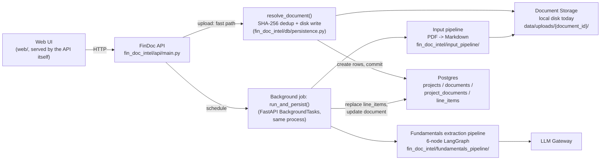
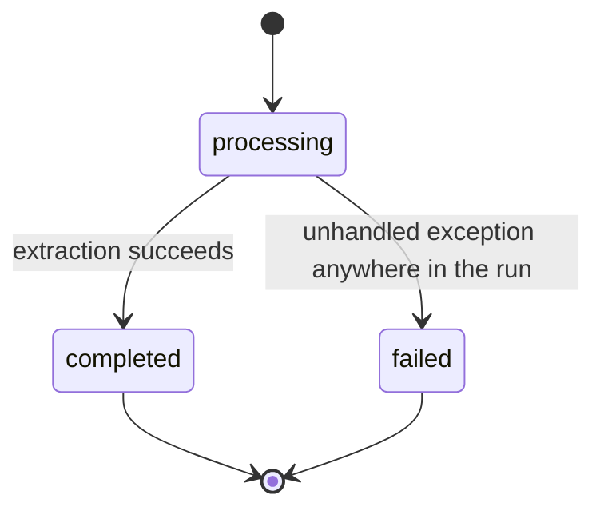
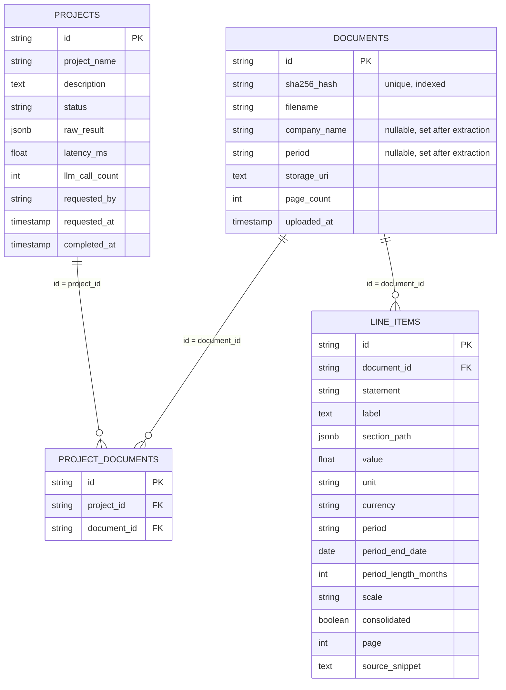

# FinDoc Intelligence Agent — Case Study (Interview Format)

> A mock case-study interview in which a candidate walks an interviewer through a
> production-style agentic AI system for financial document intelligence and investment research. §§1–6 describe
> the business problem and requirements in illustrative terms, as originally written — they
> sketch a broader multi-company, multi-year investment-research vision than what's actually
> been built, and are kept as the original framing rather than pared back to match today's scope.
> **§7 (System Design) is a literal reference to this codebase** — the module, file, and endpoint
> names there are real (`fin_doc_intel/`, `web/`, `Dockerfile`, `k8s/`), and describe the system
> as it actually exists today: single-document line-item extraction with global, content-hash-deduped
> document storage, not the multi-document time-series/ratio/screening/research-note pipeline §§1–6
> narrate. Where something is still a gap rather than built, that's called out explicitly — see
> particularly "What's still incomplete" at the end.

---

## 1. Context & Business Narrative

**Interviewer:** Let's start broad. What problem were you actually solving, and who was it for?

**Candidate:** When an equity research analyst covers a sector, they typically follow 15–20 companies. Every year, each company publishes an annual report — 100 to 250 pages of financial statements, management commentary, risk disclosures, and governance boilerplate. The analyst has to read every page, extract the key financial metrics, compare this year against last year, identify trends, compute ratios, and write a research note with a bull case, bear case, and key risks. For a single company, that's a full day's work. For 20 companies, it's a month.

**Interviewer:** So what did you actually build?

**Candidate:** An agent that automates the entire document-to-research workflow. The AI reads multiple annual reports — across multiple years and multiple companies — and extracts financial line items. Then deterministic Python code merges everything into chronological time series, computes year-over-year growth and CAGR, calculates ratios, and builds screening criteria. Finally, the AI writes a research note, but it only receives the already-computed numbers — it never calculates anything itself. The research note quotes actual computed figures, not hallucinated growth rates.

**Interviewer:** Why split it that way instead of just letting the model do the analysis?

**Candidate:** Because investment research has to be defensible. If a buy-side analyst questions a sell-side recommendation, the analyst needs to point to the exact number that drove the thesis. If the model calculated a 34% revenue growth rate that doesn't match the filing, there's no defense. A deterministic calculation layer guarantees that every number in the research note traces back to an actual extracted value. The AI's value is reading unstructured, inconsistently worded filings and turning them into structured data, then explaining the patterns in that data. It never sits in the calculation path itself.

**Interviewer:** And this is different from what's already out there?

**Candidate:** Most existing tools are either pure extraction (parsing tables from PDFs) or pure analysis (screening tools that need clean CSV inputs). What's missing is the end-to-end: raw PDFs → time series → analytics → research note. And specifically, the multi-document merge that handles restated comparative figures — when a company restates FY2022 numbers in their FY2023 filing, the system has to use the corrected value, not the original. That's a data integrity problem most tools don't solve.

---

## 2. Business Requirement

**Interviewer:** From the business side, what did the investment bank actually ask for?

**Candidate:** Fundamentally: turn a stack of annual reports into a ranked watchlist with research notes in hours instead of weeks. Three things mattered most to them. First, accuracy — every number has to match the filing exactly. Second, time-series integrity — restated figures must be handled correctly. Third, reproducibility — the same documents, run twice, must produce the same research note.

**Interviewer:** What does the analyst actually get out of a run?

**Candidate:** A chronological time series per company with every extracted financial metric, computed YoY growth rates and CAGR, ratios (leverage, coverage, profitability), sector benchmark comparisons, a screening ranking against custom criteria, and a research note with thesis summary, bull case, bear case, key trends, and watch items. All of that from uploading the annual reports — no manual data entry.

**Interviewer:** And the restatement handling — how strict is that in practice?

**Candidate:** Very strict. If a company restates revenue in the current year's filing, the time series must reflect the corrected value, not the original. That's not a nice-to-have; it's the difference between recommending a stock based on the wrong growth rate and the right one.

---

## 3. Requirements

**Interviewer:** Let's get concrete. Walk me through the functional requirements.

**Candidate:** At minimum, the system has to:

- Accept multiple annual report PDFs across multiple companies and multiple years.
- Parse each document page by page and keep page references throughout.
- Retrieve only the pages relevant to a given extraction task, rather than feeding whole documents to a model repeatedly.
- Extract balance sheet, income statement, cash flow statement, changes in equity, risk disclosures, and issuer metadata as separate, narrow tasks.
- Normalize inconsistent financial labels into one standard vocabulary while keeping the original wording for traceability.
- Merge snapshots from multiple documents into a chronological time series, with later documents overriding restated figures.
- Compute YoY growth rates and CAGR for every metric.
- Calculate leverage, coverage, profitability, and efficiency ratios.
- Build screening criteria to filter a universe of companies against custom thresholds.
- Apply deterministic ranking to screening results.
- Generate a research note with thesis, bull case, bear case, trends, and watch items.
- Let the analyst ask follow-up questions about specific metrics.
- Surface evidence pages and source references in the analyst's workspace.

**Interviewer:** And the non-functional side — what actually constrains the design?

**Candidate:** This is the table I'd put in front of a reviewer:

| Area            | Requirement                                                                                                                           |
| --------------- | ------------------------------------------------------------------------------------------------------------------------------------- |
| Reproducibility | The same documents must produce the same time series, ratios, and research note.                                                    |
| Explainability  | Every computed metric must have a source document and page reference.                                                                 |
| Grounding       | The AI may only use the evidence it was given and must never invent or calculate a financial value itself.                            |
| Data Integrity  | Restated figures from later documents must override earlier values.                                                                   |
| Security        | Financial documents and results must be encrypted in transit and at rest.                                                             |
| Access control  | Enterprise SSO and role-based access must protect the analyst workspace.                                                              |
| Auditability    | Inputs, outputs, source references, and model versions must all be retained.                                                         |
| Scalability     | Independent company analyses should be able to run in parallel; cost should grow roughly linearly with document volume.               |
| Maintainability | Prompts, models, embeddings, and screening criteria must all be versioned independently.                                             |
| Human control   | A research note stays a draft until an authorized analyst reviews and signs off.                                                      |

Explainability and data integrity are the two I'd call load-bearing — almost everything else in the design exists to satisfy those two.

---

## 4. Data Requirement

**Interviewer:** What actually feeds this system?

**Candidate:** Every extracted or derived value carries its source document, page, period, currency, unit, and whether it came from a document or a fallback source. On top of that scaffolding, three broad categories of data flow in.

**Interviewer:** Start with the documents themselves.

**Candidate:**

| Data point                               | Why it's needed                                                                            |
| ---------------------------------------- | ------------------------------------------------------------------------------------------ |
| Audited annual reports                   | Primary evidence for financial position, performance, cash flow, and risk disclosures.     |
| Interim statements / management accounts | Fill in more recent performance where the annual filing is stale.                          |
| ESG reports                              | Additional context on sustainability risks and opportunities.                               |
| Investor presentations                    | Management's own narrative on strategy and performance.                                     |

**Interviewer:** And the financial figures you actually calculate against?

**Candidate:** Revenue, EBITDA and EBIT, net income, cash and equivalents, receivables, inventory, current assets and liabilities, short- and long-term debt, interest expense, total assets/liabilities/equity, operating cash flow, capital expenditure, free cash flow, and dividends. Every one of those feeds a specific downstream calculation — revenue and EBITDA drive growth rates, cash and debt drive leverage ratios, free cash flow drives earnings quality measures.

**Interviewer:** What about the things that aren't numbers?

**Candidate:** That's the qualitative layer: management commentary and MD&A, risk disclosures, contingent liabilities, related-party transactions, going-concern language, and ESG factors. Some of these — a going-concern flag, major litigation — are strong enough to override everything else in the research note.

**Interviewer:** And reference data — what does the system need that isn't specific to one case?

**Candidate:** Sector benchmarks for ratio comparison, company-identity information for disambiguation, and screening criteria configuration — the thresholds and weights that define what makes a company "investment-worthy" under a given strategy.

---

## 5. Agentic AI Solution

**Interviewer:** Let's get into the design itself. What's the one-sentence version?

**Candidate:** The AI reads documents and writes explanations. Deterministic services merge, calculate, screen, and rank. I held that line everywhere in the design — no AI-produced value crosses into the calculation layer without being treated as evidence to be checked, never as a number to trust outright.

**Interviewer:** Walk me through what actually happens when an analyst starts a research project.

**Candidate:** The analyst uploads multiple annual reports — across multiple companies and multiple years. The system reads every document page by page and builds a semantic index over each document — so instead of feeding a 200-page filing to a language model every time it needs one number, each extraction task retrieves only the handful of pages actually relevant to it. That keeps every model call small, fast, and tightly grounded.

**Interviewer:** And extraction itself — is that one model call, or several?

**Candidate:** Six separate, deliberately narrow calls per document. Separate agents handle the balance sheet, income statement, cash flow statement, changes in equity, risk disclosures, and issuer metadata — and each is a real retrieval-based agent, not a fixed prompt. The model is given the embedding index and decides for itself what to search for and when it has enough evidence. That's a genuine grounding improvement over committing to one fixed query's top-k pages up front — the balance sheet and the cash-flow statement are often dozens of pages apart, and the model can issue a second, different search instead of missing whichever one its first query didn't surface. Each agent only ever sees what it retrieved for its own task and returns a structured result with a source page for every field; none of them is asked to compute anything — they transcribe and classify, nothing more.

**Interviewer:** What happens once the figures exist — how do you actually get from raw line items to a research note?

**Candidate:** A deterministic engine takes over completely at that point. It merges snapshots from multiple documents into a chronological time series, with later documents overriding restated figures. It computes YoY growth rates and CAGR for every metric. It calculates leverage, coverage, profitability, and efficiency ratios. It builds screening criteria and ranks companies against them. A final, separate model call is then given only the already-computed time series, ratios, and screening results — nothing else — and asked only to explain them in prose.

**Interviewer:** That's a lot of trust being placed in model output before it ever reaches the calculation layer. How do you validate it?

**Candidate:** You don't trust an LLM response just because it sounds confident, so nothing from a model call is used until it passes several checks. Schema validation first — a financial line item has to arrive with its original label, its standardized label, a value, a currency, a unit, a period, a statement type, and a source page; anything malformed gets rejected or sent for review rather than silently used. Citation validation checks that every material value cites a real page, and that the value and label actually appear on that page. Grounding validation goes further — the model is explicitly prohibited from calculating or inferring a missing value; if the evidence doesn't support a clean answer, it has to say "not found" or "uncertain" instead of guessing. On top of that sits deterministic financial consistency checking — statement relationships, units, currencies, periods, duplicate values, and restated figures.

**Interviewer:** And the time-series merge — how do you handle restatements?

**Candidate:** The merge logic is explicitly designed to favor later documents. When two documents both have a value for the same period, the later document's value wins. This is critical for handling restated comparative figures — if a company restates FY2022 revenue in their FY2023 filing, the merge uses the corrected value. The original value is discarded, not averaged. This is a data integrity guarantee that most financial systems don't enforce.

**Interviewer:** What about the screening and ranking — do those get validated too?

**Candidate:** Yes — the screening engine is entirely deterministic. Each criterion is evaluated with clear operators (>, <, =) and thresholds. The ranking algorithm is explicit: sort by `(all_passed DESC, weighted_score DESC, pass_count DESC)`. No model involvement, no judgment calls. The research note generation agent only ever receives the already-finalized screening results — never the raw documents — and a validator checks the note for unsupported numbers, contradictions, wrong-company claims, or invented conclusions. A note that fails that check gets regenerated or routed to a human rather than shown to the analyst.

**Interviewer:** And the human in the loop — what does that actually look like day to day?

**Candidate:** The analyst reviews the extracted facts, the evidence pages behind them, any flagged discrepancies, the time series, the ratios, the screening results, and the research note. Any correction they make is retained alongside the original value — what it was, what it became, who changed it, when, and why — so the correction itself becomes part of the audit trail rather than silently replacing history. And before production, and after any material change to the model, the prompts, or the screening criteria, the bank should re-run a fixed evaluation: extraction accuracy against labeled examples, page attribution accuracy, ratio correctness against an independent calculator, screening behavior against known policy test cases, and research note grounding and contradiction rate.

---

## 6. Business and Technical Metrics

**Interviewer:** How would you know if this was actually working, from the business side?

**Candidate:**

| Metric                                 | Why it matters                                                               |
| -------------------------------------- | ---------------------------------------------------------------------------- |
| Time to research note                  | Direct measure of analyst turnaround improvement.                            |
| Companies covered per analyst per week | Productivity.                                                                |
| Research note acceptance rate          | Whether the generated output is actually useful as-is.                       |
| Material correction rate               | Quality of first-pass extraction and analysis.                               |
| Time-series consistency across reruns  | Confirms the reproducibility guarantee holds in practice.                     |
| Screening hit rate                     | Whether the screening criteria actually surface the right companies.          |
| Investment performance of screened ideas | Tests whether the research quality translates to actual returns.             |
| Analyst override rate                 | Identifies the weakest extraction tasks.                                     |

**Interviewer:** And on the engineering side?

**Candidate:**

| Metric                                  | Why it matters                                                 |
| --------------------------------------- | -------------------------------------------------------------- |
| Line-item precision, recall, F1         | Core extraction accuracy.                                      |
| Source-page attribution accuracy        | Traceability, not just correctness.                            |
| Unit, currency, and period accuracy     | These are the errors that silently wreck a ratio.              |
| Evidence-grounding pass rate            | Whether claims are actually supported by the retrieved text.   |
| Restatement handling accuracy           | Data integrity — later documents must override earlier ones.  |
| Ratio and growth-rate reproducibility   | Should be effectively 100% by construction; any drop is a bug. |
| Unsupported-fact rate in approved notes | Target is zero.                                                |
| Research note contradiction rate        | Agreement with the authoritative time series and ratios.       |
| Validation-block rate                  | How often the safety checks are actually catching something.   |
| Human correction rate                   | Identifies the weakest extraction tasks.                       |
| Model latency, token usage, cost        | Operational planning.                                          |
| Job success rate, end-to-end latency    | Production reliability.                                        |

**Interviewer:** If you had to pick the one metric you'd watch most closely, which would it be?

**Candidate:** Time-series consistency across reruns. Everything else can degrade gracefully — a slightly lower extraction recall just means more analyst correction — but if two runs of the same documents ever produce different time series, that's not a quality issue, it's a trust issue, and it undermines the entire premise of the system.

---

## 7. System Design

### 7.1 High-Level Design

**Interviewer:** Sketch the architecture for me.

**Candidate:** One FastAPI service (`fin_doc_intel/api/main.py`) is the whole backend, with one vanilla-JS page (`web/`, served by the API's own `StaticFiles` mount — same origin, no separate frontend deployment) as its only client today. There used to be a second, Streamlit-based UI (`app_streamlit/ui.py`, and the Makefile still has a `run-streamlit` target for it), but that source file is gone from the tree — only a stale compiled `.pyc` remains — so I'd flag that target as currently broken rather than pretend it still works.

The one deliberate split within the single process is *accept* vs *execute*: `POST /projects` does the fast, synchronous part — resolve each upload's identity, save it to disk, create the DB rows, commit — and returns in well under a second; the actual extraction pipeline runs as a background task in the same process (`fastapi.BackgroundTasks`), not a separate worker. Same reasoning as before: a real queue (Celery+Redis, or managed equivalent) is the right answer the moment this needs to survive an API restart mid-job or run on more than one replica, and it isn't needed yet at this load.

The other decision that shapes everything downstream: **a document is not owned by a project.** Every upload is content-hash deduped (SHA-256) against every document ever seen, globally — re-uploading byte-identical bytes, even under a different project or filename, resolves to the same `document_id`, the same storage folder, and (once reprocessed) the same but freshly-replaced line items, instead of piling up duplicates. A `Project` is just "one upload event" — a lightweight record of which documents were submitted together in one `POST /projects` call — while `Document` is the durable, shared unit that owns storage, detected metadata, and every extracted fact.

**Interviewer:** Walk me through that flow step by step.

**Candidate:**

1. The analyst uploads one or more PDFs from the Upload tab.
2. `POST /projects` hashes each file's content and calls `resolve_document()`: a hash match reuses the existing `document_id`/folder (and overwrites the identical bytes — a deliberate no-op rather than a special-cased skip); a miss mints a new `document_id` and folder under `data/uploads/`. It creates the `Project` row and a `ProjectDocument` link row per document, commits, and returns the project id — milliseconds, not minutes, on purpose.
3. The background task (`run_and_persist`) runs per document: `input_pipeline` classifies the PDF (text vs. scanned) and writes a Markdown rendering (`{stem}.md`) into that same document folder — OCR only the pages that actually have a table or a significant image, plain `pymupdf4llm` text extraction for the rest.
4. A separate, small LLM call (`detect_issuer_metadata`, using an in-memory per-page cosine-similarity index over the raw PDF text — not the Markdown, and not Postgres/pgvector) identifies the issuer and fiscal period.
5. The fundamentals pipeline — `find_tables → filter_relevant → classify_statement → classify_consolidation → extract_line_items → aggregate_all` — runs over the Markdown, classifying every table into balance_sheet / income_statement / cash_flow / changes_in_equity / other (KPIs, ratios, operational metrics — kept, not dropped) and extracting every numeric row.
6. Any `LineItemRecord`s already stored for that `document_id` are deleted, then the freshly extracted ones are inserted — a full replace, which is what makes reprocessing the same document "update the results" rather than duplicate them.
7. The analyst switches to the Documents tab, picks a document from the list (`GET /documents`), and sees its extracted line items grouped by statement (`GET /documents/{document_id}`).

**Interviewer:** Why would a request that just creates a row need to be fast — what's actually driving that?

**Candidate:** The pipeline itself takes minutes — Markdown generation (OCR on table/image pages), the issuer-metadata call, and four LLM-backed nodes per table in the fundamentals pipeline. Holding one HTTP connection open for that long is exactly what a browser's own idle-connection limit, and any reverse proxy or load balancer in front of a service like this (nginx, an ALB, Cloudflare — all commonly default well under a minute), are built to kill. Splitting accept from execute — respond fast, poll `/projects/{id}/status` for the rest — means no single request ever needs to survive longer than a client's patience for one poll tick, regardless of how long the job underneath actually takes.

### 7.2 Low-Level Design

**Interviewer:** Break the system down into its actual modules.

**Candidate:**

| Module                            | Real file(s)                                          | Responsibility                                                                                                                     |
| ---------------------------------- | -------------------------------------------------------- | ------------------------------------------------------------------------------------------------------------------------------------ |
| Web UI                             | `web/index.html`                                        | Upload tab (create project, poll status) and Documents tab (browse/select a processed document) — one HTTP client of the API.       |
| API                                 | `fin_doc_intel/api/main.py`                              | Accepts uploads, resolves document identity, creates projects, schedules the background job, serves every read.                     |
| Document identity + storage        | `fin_doc_intel/db/persistence.py::resolve_document`      | SHA-256 content-hash dedup against every document ever uploaded; writes/overwrites the PDF under `data/uploads/{document_id}/`.      |
| Background job runner              | `fin_doc_intel/db/persistence.py::run_and_persist`       | Per document: Markdown generation, issuer/period detection, the fundamentals pipeline, and a full replace of that document's line items — one DB session, in-process (`fastapi.BackgroundTasks`). |
| Page index (metadata detection)    | `fin_doc_intel/pdf_index.py`                             | In-memory per-page embeddings + cosine search over the raw PDF — used only to find pages for issuer/period/currency detection, not for line-item extraction itself. |
| Input pipeline (PDF → Markdown)    | `fin_doc_intel/input_pipeline/`                          | Classifies text vs. scanned PDF; OCRs pages with a table or a significant image, `pymupdf4llm`-renders the rest; writes `{stem}.md` next to the PDF. |
| Fundamentals extraction pipeline   | `fin_doc_intel/fundamentals_pipeline/`                   | 6-node LangGraph over the Markdown: find tables → filter relevant → classify statement → classify consolidation → extract line items → aggregate. Every statement bucket, including `other` (KPIs/ratios/operational metrics), is kept. |
| Data model                         | `fin_doc_intel/db/models.py`, `session.py`               | 4 tables: `projects`, `documents` (global, deduped), `project_documents` (pure join), `line_items` (document-scoped).                |
| **Validation layer**                | *(not built)*                                            | No citation/grounding/consistency check exists — extraction output is trusted as-is. See "What's still incomplete."                  |

**Interviewer:** How does one project actually move through its lifecycle?

**Candidate:** Much simpler than the §§1–6 narrative implies — there's no review/versioning workflow today, just three states.

These are the literal values of `Project.status` (`fin_doc_intel/db/models.py`), set by `create_project_and_documents` (→ `"processing"`, at creation) and `run_and_persist`/`_mark_failed` (→ `"completed"` or `"failed"`, once the background job finishes). `GET /projects/{id}/status` maps each to a coarse `_STATUS_PROGRESS` fraction (0.5 / 1.0 / 1.0) for the UI's poll — there's no per-phase instrumentation, so that's genuinely the most granularity available, not a rounded-off version of something finer.

**Interviewer:** What actually gets persisted, and why relational rather than a document store?

**Candidate:** Four tables, deliberately flat. The distinctive choice is that `documents` isn't a child of `projects` — it's an independent, globally-deduped entity that `project_documents` links to, because the same physical file can legitimately show up under more than one upload event and I wanted "re-upload this exact PDF" to mean something.

| Entity              | Real table           | Purpose                                                                                                                       |
| -------------------- | ---------------------- | -------------------------------------------------------------------------------------------------------------------------------- |
| Projects             | `projects`            | One upload event — status, timing/LLM-call metrics.                                                                            |
| Documents            | `documents`           | One physical file, deduped by SHA-256 — filename, detected company name, detected fiscal period, storage path, page count.     |
| Project ↔ Document   | `project_documents`   | Pure join row (`project_id`, `document_id`) — no metadata of its own; a document's real attributes all live on `documents`.    |
| Line items           | `line_items`          | One row per extracted fact, scoped to `document_id` (not `project_id`) — replaced wholesale on every reprocess of that document. |

I picked a relational store for the same reason as the broader design intent in §§1–6: the access pattern is write-then-read-by-key with joins that matter (which documents does a project reference; which line items belong to a document), not ad hoc analytical queries across the whole corpus. There's no `jsonb` snapshot column in the real schema — `line_items` is normalized directly, since every one of its columns (`statement`, `label`, `value`, `period`, `page`, …) is something the UI actually filters or groups by.

### 7.3 Database Schema — Full Reference

**Interviewer:** Let's go one level deeper — every table, every column, exactly when each one gets written, and how you'd actually join them back together.

**Candidate:** Happy to. This is a literal reference to `fin_doc_intel/db/models.py`, not a sketch — I'll flag the couple of places where the real behavior surprised me while building it.

#### Entity-relationship shape

`documents` is deliberately **not** a child of `projects` — it has no `project_id` at all. `project_documents` is the only table that references both, and carries no columns of its own beyond the two foreign keys: it exists purely to record which documents a given upload event referenced, not to own any of their data. `line_items.document_id` is the only foreign key on the extraction output — a line item belongs to the document it was extracted from, full stop, regardless of which project(s) have ever referenced that document.

#### Every table, column by column

**`projects`** — one row per `POST /projects` call (one upload event).

| Column                         | Type                      | Written                     | Notes                                                                                                          |
| -------------------------------- | --------------------------- | ------------------------------ | ------------------------------------------------------------------------------------------------------------------ |
| `id`                            | `string`, PK               | at creation                   | Python-side `str(uuid.uuid4())`, not a DB sequence — lets the app know the id before the first insert.            |
| `project_name`, `description`   | `varchar(255)` / `text`    | at creation                   |                                                                                                                     |
| `status`                        | `varchar(32)`              | at creation, then on completion | `processing → completed \| failed` — three values total, see the lifecycle diagram above.                        |
| `raw_result`                    | `jsonb`, nullable          | on completion                 | Per-document summary (company name, line-item count, pipeline diagnostics) for this run — not the line items themselves, those live in `line_items`. |
| `latency_ms`, `llm_call_count`  | `float` / `int`, nullable  | on completion                 | The only observability data that exists today — no per-call breakdown.                                            |
| `requested_by`                  | `varchar(128)`             | at creation                   | Defaults to `"local-analyst"` — free text, no real auth (see "What's still incomplete").                          |
| `requested_at`, `completed_at`  | `timestamptz`              | at creation / on completion    | `completed_at` is null while `status` is `"processing"`.                                                          |

**`documents`** — one row per **unique file content**, not per upload.

| Column         | Type                            | Written                              | Notes                                                                                                                                    |
| ---------------- | ---------------------------------- | ---------------------------------------- | -------------------------------------------------------------------------------------------------------------------------------------------- |
| `id`           | `string`, PK                       | at creation (first time seen)           | Also the name of its storage folder: `data/uploads/{id}/`.                                                                                    |
| `sha256_hash`  | `varchar(64)`, unique, indexed     | at creation                             | The dedup key — `resolve_document()` looks up an existing row by this hash before minting a new id.                                          |
| `filename`     | `varchar(255)`                     | at creation                             | The filename from whichever upload first created this row; a later re-upload under a different filename doesn't overwrite it.                |
| `company_name` | `varchar(255)`, nullable           | on (re)processing                       | Detected issuer, from `detect_issuer_metadata`. Null until the first successful run.                                                          |
| `period`       | `varchar(64)`, nullable            | on (re)processing                       | Detected fiscal period (e.g. `"FY2024"`) — shown as "Document release date" in the Documents tab.                                             |
| `storage_uri`  | `text`                             | at creation, rewritten on every re-upload | Local disk path today — see "What's still incomplete" for the S3/ADLS target.                                                          |
| `page_count`   | `int`                              | at creation                             | Computed once from the bytes; never needs recomputing on a hash match, since identical bytes imply identical page count.                      |
| `uploaded_at`  | `timestamptz`                      | at creation                             |                                                                                                                                                |

**`project_documents`** — pure join row, no metadata of its own.

| Column         | Type         | Notes                                                                             |
| ---------------- | -------------- | -------------------------------------------------------------------------------------- |
| `id`           | `string`, PK | |
| `project_id`   | `string`, FK | |
| `document_id`  | `string`, FK | May already exist (a dedup hit) or be brand new — this table doesn't care which.        |

**`line_items`** — one row per extracted fact, scoped to the document, not the project.

| Column                                                | Type            | Notes                                                                                     |
| -------------------------------------------------------- | ----------------- | ---------------------------------------------------------------------------------------------- |
| `document_id`                                           | `string`, FK      | The only foreign key — no `project_id` column exists on this table.                            |
| `statement`                                             | `varchar(32)`     | `balance_sheet \| income_statement \| cash_flow \| changes_in_equity \| other` — `other` now includes KPIs/ratios/operational metrics, not just discarded noise. |
| `label`, `section_path`, `value`, `unit`, `currency`     | mixed             | Mirrors `fin_doc_intel.schemas.LineItem` 1:1. `section_path` is a flat list of enclosing headers, outermost first — no parent-child tree. |
| `period`, `period_end_date`, `period_length_months`      | mixed             | Per-cell period info — independent of `documents.period`, which is the document's own overall fiscal period. |
| `scale`, `consolidated`, `page`, `source_snippet`        | mixed             |                                                                                                 |

Every row for a given `document_id` is deleted and reinserted as a unit on every (re)processing run — see the write timeline below. There's no soft-delete or history of prior extractions; the latest run is the only one that exists.

#### The write timeline — what happens, in order, for each operation

**`POST /projects`:**

| # | What runs                                                        | Table(s) touched                                                                       | Committed?                                                                                                                       |
| - | ------------------------------------------------------------------- | ------------------------------------------------------------------------------------------ | -------------------------------------------------------------------------------------------------------------------------------- |
| 1 | `resolve_document()` per uploaded file: hash the content, look up an existing `documents` row by `sha256_hash`, write the PDF to `data/uploads/{document_id}/` | `documents` INSERT (miss) or field update on the existing row (`storage_uri` rewritten either way) | Not yet — added to the session. |
| 2 | Route handler creates the project row and one `project_documents` link per resolved document | `projects` INSERT (`status="processing"`), `project_documents` INSERT ×N                    | Yes — one commit covering steps 1 and 2 together, before the response is returned. |
| 3 | *(response sent with `project_id` and the resolved `documents`; background task starts)* | — | — |
| 4 | Per document: Markdown generation, issuer/period detection, fundamentals pipeline | *(reads only — no writes yet)* | — |
| 5 | Per document: delete that document's existing line items, insert the freshly extracted ones, update `company_name`/`period` | `line_items` DELETE + INSERT ×(items found), `documents` UPDATE | Not yet — added to the session, same transaction as step 6. |
| 6 | Project finalized | `projects` UPDATE (`status="completed"`, `raw_result`, `latency_ms`, `llm_call_count`, `completed_at`) | **One commit for every document processed in this run, plus the project row, together** — at the very end of the `for document_id in document_ids` loop. |

On an unhandled exception anywhere in step 4–5, for **any** document in the batch: the whole session rolls back and `projects.status` becomes `"failed"`. Because the commit in step 6 covers every document in the run as one transaction, a failure on document 2 of 3 discards document 1's freshly-extracted line items too, even though it succeeded — see "What's still incomplete" for why this is a real, not theoretical, gap.

**Interviewer:** What does the UI actually call, under the hood?

**Candidate:** These are the real endpoints — nothing else exists on this API today:

| Endpoint                        | Operation                                                                                          |
| ---------------------------------- | ------------------------------------------------------------------------------------------------------ |
| `POST /projects`                  | Upload one or more PDFs, resolve their document identity, start extraction in the background.          |
| `GET /projects/{id}`               | Project status plus the documents it uploaded (with their current line-item counts).                    |
| `GET /projects/{id}/status`        | Cheap poll target for the Upload tab — `{status, progress}`.                                            |
| `GET /documents`                   | List every document ever processed, newest first — the source for the Documents tab's picker.           |
| `GET /documents/{document_id}`     | One document's metadata (filename, company name, period) plus every line item extracted from it.        |

**Interviewer:** What about the CI/CD and deployment — what's actually automated?

**Candidate:** The CI/CD pipeline in `.github/workflows/ci-cd.yml` is real and runs on every push. It has three jobs:

1. **`test`**: Runs on every push and pull request. Installs dependencies, runs ruff linting (advisory for now), runs bandit security checks, and runs pytest tests.
2. **`build-and-push`**: Runs after test succeeds on main branch pushes. Logs into GHCR using the built-in `GITHUB_TOKEN`, builds the Docker image, and pushes it with both the commit SHA and `latest` tags.
3. **`deploy`**: Runs after build-and-push succeeds, but is gated behind a `KUBE_CONFIG` secret that doesn't exist yet. If the secret is set, it applies the Kubernetes manifests and does a rolling update. If not, it skips cleanly with a message explaining what's needed.

The Kubernetes manifests in `k8s/` are also real: a Deployment with a single replica (document storage caveat), a Service, a ConfigMap for non-sensitive configuration, and a Secret for sensitive values. The Deployment includes health probes, resource limits, and proper rolling update strategy.

**Interviewer:** And the development workflow — what tools are available?

**Candidate:** The Makefile provides convenient commands for common tasks:

- `make install`: Install dependencies
- `make test`: Run tests
- `make lint`: Run linting checks
- `make lint-fix`: Auto-fix linting issues
- `make security`: Run security checks with bandit
- `make build`: Build Docker image locally
- `make run`: Run the FastAPI application locally
- `make run-streamlit`: Run the Streamlit UI — **currently broken**: `app_streamlit/ui.py` no longer exists in the tree (only a stale compiled `.pyc` remains), so this target has nothing to run. The web UI (`web/`) is the only working client today.
- `make clean`: Clean up generated files
- `make init-db`: Initialize the database

The pyproject.toml includes ruff configuration for linting and formatting, plus pytest configuration for test discovery and async test support.

### 7.4 What's Still Incomplete

**Interviewer:** If you were being honest about what's still incomplete in this design, what would you flag?

**Candidate:** More than I would have guessed before actually building it — which is itself the point of building instead of just designing. In rough priority order:

1. **Document storage is local disk, not a real object store.** Uploads land under `DOCUMENT_STORAGE_DIR` (`./data/uploads/{document_id}/`) on whatever machine the API happens to be running on — it doesn't survive a pod restart on a different node, doesn't scale past `replicas: 1` (which the Kubernetes manifests deliberately pin, rather than silently shipping a config that would lose uploads), and isn't backed up. The target is a real data warehouse — S3 or ADLS — and the pieces for S3 specifically are already half-present: `.env` already carries live, unused `AWS_ACCESS_KEY_ID` / `AWS_SECRET_ACCESS_KEY` / `BUCKET_NAME` / `AWS_ROLE_ARN`, but `config.py` never reads them and no S3 client library (`boto3`, `s3fs`) is even a declared dependency yet. The real design question this raises — and the reason it's not implemented yet rather than just wired up — is that the extraction pipeline's own libraries (`fitz`/`pymupdf4llm`) need a real local file to operate on; moving the durable copy to S3 means downloading to a local scratch file for processing and uploading both the PDF and the generated Markdown back afterward, not simply swapping `open()` for a `boto3` call.
2. **A batch upload isn't isolated per document.** `run_and_persist` processes every document in one `POST /projects` call inside a single DB session with one commit at the very end. An unhandled exception on document 2 of 3 rolls back document 1's freshly-extracted line items too, even though it succeeded — the whole project is marked `"failed"` and nothing from that run survives. Per-document commits (or per-document status/error tracking) would fix this; it wasn't the bottleneck yet.
3. **No per-document processing status.** `documents` has no `status` column — the Documents tab's picker can only infer "still processing" vs. "extraction failed" from `line_item_count == 0`, which can't actually distinguish the two. A document stuck at zero items after a failed run looks identical to one whose background job simply hasn't finished yet.
4. **The validation/grounding layer doesn't exist.** Nothing checks that an extracted value's `source_snippet`/`page` actually supports it, or that the LLM didn't misread a table. Extraction output is trusted as returned.
5. **The Streamlit UI is gone, but the Makefile doesn't know that.** `app_streamlit/ui.py` no longer exists in the tree (only a stale compiled `.pyc` remains) — `make run-streamlit` currently has nothing to run. `web/` is the only functioning client.
6. **Auth is a placeholder.** `requested_by` defaults to `"local-analyst"` — a free-text field, not a verified identity; no SSO, no RBAC.
7. **The concurrent-duplicate-upload race isn't handled.** `documents.sha256_hash` has a real DB-level unique constraint, which is correct — but if two `POST /projects` calls for the exact same new file land close enough together, both can miss the pre-insert lookup and both attempt an insert; the second fails with an uncaught `IntegrityError` instead of gracefully falling back to "someone else just created this." Rare in practice at today's traffic, but a real gap, not a theoretical one.
8. **`tests/test_extraction.py` is stale.** It imports `extract_statement` and `extract_risk_disclosures`, neither of which exists in `extraction.py` anymore — a placeholder left over from an earlier version of the module that `pytest` would fail to even collect if run directly (`tests/test_api.py` passes cleanly; this file doesn't).
9. **The CI/CD pipeline and Kubernetes deployment are real artifacts, not yet a real rollout.** `test` and `build-and-push` actually run (GHCR needs no extra secret to work); `deploy` is real `kubectl` logic gated behind a cluster kubeconfig that doesn't exist yet, so it's accurate to call it a reference pipeline, not a working one — I'd rather it visibly skip than silently claim success against nothing.

None of these are design disagreements — they're the actual distance between "the design is right" and "the system is done," and I'd rather name that distance precisely than let it surface as a surprise later.
