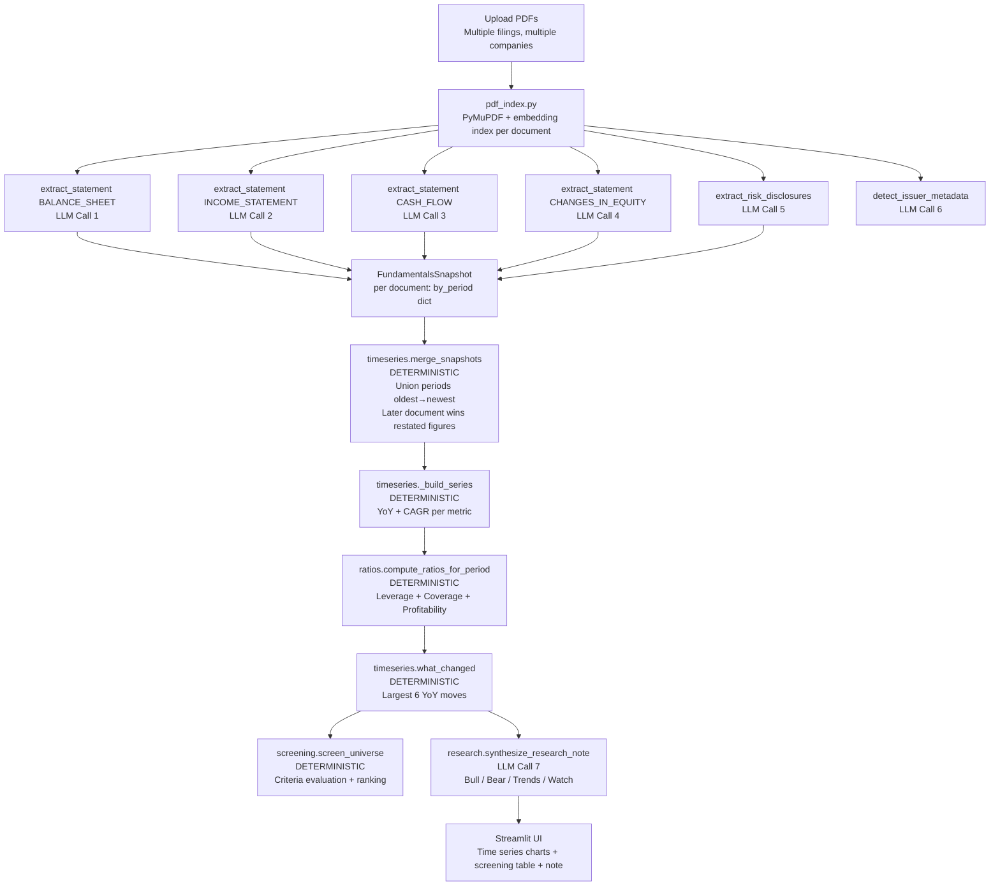
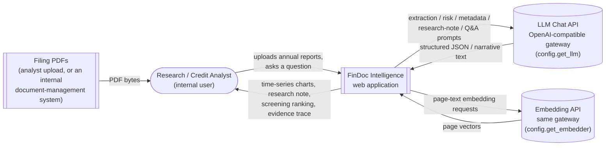
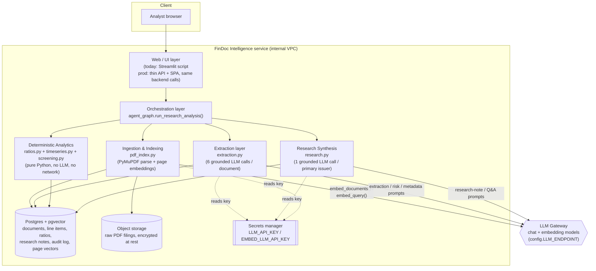
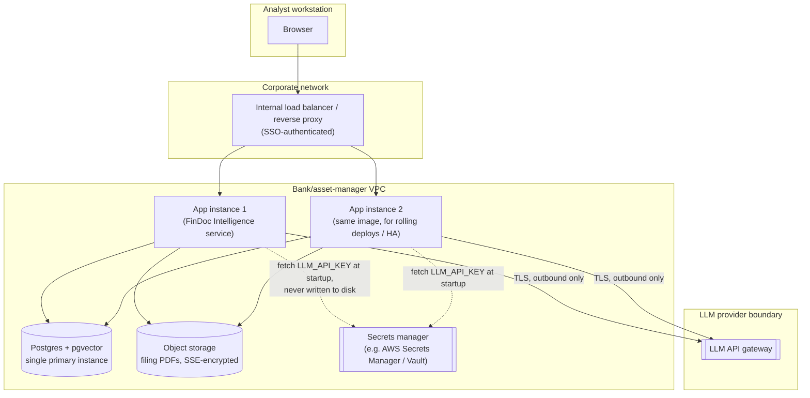

# FinDoc Intelligence Agent — Complete Documentation

## What This Project Does (Plain English)

A fund manager or research analyst at an investment bank covers 15–20 companies. Each year, every company publishes an annual report. The analyst must read each one, extract the key financial metrics, compare this year against last year, spot trends, write a research note, and build a screening watchlist.

This agent automates that workflow:

1. **Upload multiple annual reports** (across multiple years, multiple companies)
2. **Extraction**: The LLM reads each PDF and pulls out every financial line item
3. **Time Series**: All figures are merged into a chronological time series per company
4. **Analytics**: YoY growth, CAGR, ratio computation — all deterministic Python
5. **Screening**: Filter a universe of companies against custom criteria (e.g., "Net Debt/EBITDA < 2× AND ROE > 15%")
6. **Research Note**: The LLM writes a grounded bull/bear case, quoting actual computed numbers

**Business analogy:** Think of this as an automated financial analyst that reads filings faster than any human and produces a standardized fact-sheet with no hallucinated numbers.

---

## Full Architecture Flow



---

## Module-by-Module Deep Dive

### `pdf_index.py` — Per-Document Embedding Index

Each uploaded PDF gets its own `PageIndex`. This is important when multiple companies are uploaded: the extraction queries are scoped to one company's filing at a time.

**How it works:**
1. PyMuPDF extracts raw text page by page
2. Each page's text is embedded using the OpenAI-compatible embedding model
3. A cosine-similarity search returns the k most relevant pages for a query

**Why RAG (Retrieval-Augmented Generation)?**
A modern annual report is 100–250 pages. Sending the entire document to an LLM would be:
- Too expensive (hundreds of thousands of tokens)
- Likely to exceed context windows
- Mostly noise (director bios, governance disclosures, risk boilerplate)

Instead, each extraction call sends only the 5 most relevant pages. An income statement extraction query like `"revenue expenses net income profit loss"` retrieves exactly the P&L pages.

---

### `extraction.py` — Grounded LLM Extraction (6 LLM Calls per Document)

#### How Data Flows Into Each LLM Call

For each of the four financial statements:

**Step 1 — Statement-specific query:**
```python
_STATEMENT_QUERIES = {
    BALANCE_SHEET:       "consolidated balance sheet total assets liabilities equity",
    INCOME_STATEMENT:    "statement of profit and loss revenue expenses net income",
    CASH_FLOW:           "cash flow statement operating investing financing activities",
    CHANGES_IN_EQUITY:   "statement of changes in equity retained earnings dividends",
}
```

**Step 2 — Retrieve top 5 pages** from the document's embedding index.

**Step 3 — Build evidence block:**
```
--- PAGE 35 ---
CONSOLIDATED BALANCE SHEET
As at 31 March 2024    (₹ Crore)
                           2024      2023
Total assets             45,230    38,760
Current assets           12,450    10,230
  Cash & equivalents      3,200     2,100
  Trade receivables        5,400     4,800
...
```

**Step 4 — System prompt** instructs the LLM:
```
Rules:
1. Use ONLY numbers explicitly printed in the provided page text. Never invent.
2. Return a FLAT list of line items. Capture enclosing headers in `section_path`
   (outermost first) — do NOT nest items.
3. Map each item to one canonical_key from the allowed list, or null if none fits.
4. Record the page each value was read from and a short source_snippet.
5. When comparative columns exist (current vs prior year), emit one item per period.
Output ONLY a JSON array, no prose, no markdown.
```

**Step 5 — LLM returns:**
```json
[
  {"label": "Total assets", "section_path": ["CONSOLIDATED BALANCE SHEET"],
   "canonical_key": "total_assets", "value": 45230, "unit": "crore",
   "currency": "INR", "period": "FY2024", "consolidated": true, "page": 35,
   "source_snippet": "Total assets 45,230 38,760"},
  {"label": "Cash & equivalents", "section_path": ["CONSOLIDATED BALANCE SHEET", "Current assets"],
   "canonical_key": "cash", "value": 3200, "unit": "crore",
   "currency": "INR", "period": "FY2024", "consolidated": true, "page": 35,
   "source_snippet": "Cash & equivalents 3,200 2,100"}
]
```

#### `section_path` — The Flat-with-Context Design

Every line item is flat (not nested), but its position in the statement hierarchy is preserved in `section_path`. For example:
- `["Assets", "Current Assets", "Cash and Cash Equivalents"]`

This lets the UI display items in their original hierarchy and the ratio engine find items by `canonical_key` regardless of nesting.

#### `canonical_key` Vocabulary

The canonical key is the standard name every financial metric maps to. Different companies use different labels:

| What the filing says | canonical_key |
|----------------------|--------------|
| "Net sales" / "Turnover" / "Revenue from operations" | `revenue` |
| "Operating profit" / "Profit before interest and tax" | `ebit` |
| "EBITDA" / "Operating EBITDA" | `ebitda` |
| "Profit after tax" / "Profit for the year" | `net_income` |
| "Basic earnings per share" | `eps` |
| "Net cash from operating activities" | `cfo` (operating cash flow) |
| "Purchase of fixed assets" / "Capex" | `capex` |
| "Net borrowings" / "Total debt" | `total_debt` |

This is the join key that makes the multi-document time series work — `revenue` in one year's filing matches `revenue` in the next year's filing even if the label wording changed.

---

### `timeseries.py` — Multi-Document Merge & Analytics

#### `merge_snapshots()` — Deterministic

This function takes a list of `(filename, FundamentalsSnapshot)` pairs and builds one `IssuerTimeSeries`.

**Key behaviors:**
1. **Period sorting**: Periods like `"FY2024"`, `"31-Mar-2025"`, `"FY'23"` are sorted by extracting the year (regex) and month. Unknown formats sort last.
2. **Restatement handling**: If FY2022 appears in both the 2022 filing and the 2023 filing (as a comparative), the 2023 filing's value wins — it may be restated/corrected.
3. **Free cash flow derivation**: `FCF = Operating Cash Flow − CapEx` is computed per period after merge.

#### `_build_series()` — Time Series Analytics

For every metric (revenue, ebit, etc.) and every ratio, builds a `MetricSeries` with:

**YoY % (Year-over-Year):**
```
latest_yoy = (current_period_value − prior_period_value) / |prior_period_value| × 100
```

Example: Revenue FY2024 = ₹45,230, FY2023 = ₹38,760
→ YoY = (45,230 − 38,760) / 38,760 × 100 = **+16.7%**

**CAGR (Compound Annual Growth Rate):**
```
CAGR = (last_value / first_value)^(1 / number_of_periods) − 1
```
Example: Revenue FY2020 = ₹25,000, FY2024 = ₹45,230 over 4 periods
→ CAGR = (45230/25000)^(1/4) − 1 = **16.0%**

**Why CAGR matters to analysts:**
YoY can be misleading in one exceptional year. A company that grew 50% in year 1 then −20% in year 2 has YoY of −20%, but CAGR of +9.5%. Portfolio managers use CAGR to assess sustainable growth.

#### `what_changed()` — Deterministic Surveillance Signal

Finds the **6 largest YoY moves** across all fundamentals and ratios between the two most recent periods. This is pure Python — no LLM.

Example output:
```
["net_income: +34.2% YoY",
 "capex: +28.0% YoY",
 "Net Debt / EBITDA: -0.8x YoY (ratio)",
 "revenue: +16.7% YoY",
 "Interest Coverage (EBIT): +1.2x YoY (ratio)",
 "cfo: +12.3% YoY"]
```

This feeds directly into the research note as hard evidence. The LLM never recalculates these.

---

### `ratios.py` — Per-Period Financial Ratios (No LLM)

Computed the same way as in the Credit Risk Agent, but adapted for investment research context:

| Ratio Name | Formula | Investment Research Interpretation |
|------------|---------|-------------------------------------|
| **Net Margin %** | Net Income ÷ Revenue | Profitability after all costs. Expanding margins = improving efficiency |
| **EBITDA Margin %** | EBITDA ÷ Revenue | Operating cash profitability. Used to compare across capital structures |
| **ROE %** | Net Income ÷ Equity | Return on shareholders' money. >15% is considered good for most industries |
| **ROA %** | Net Income ÷ Assets | Asset efficiency. Higher = more profit per dollar of asset base |
| **Debt/Equity** | Total Debt ÷ Equity | Leverage. Rising D/E can signal aggressive expansion or financial stress |
| **Net Debt/EBITDA** | Net Debt ÷ EBITDA | How many years of EBITDA to repay net debt. Common covenant threshold |
| **Interest Coverage** | EBIT ÷ Interest Expense | Capacity to service debt from operations |

---

### `screening.py` — Cross-Issuer Screening Engine (No LLM)

**Business context:** A portfolio manager wants to find all companies in a universe where:
- Net Debt/EBITDA < 2×  AND
- ROE > 15%  AND
- Revenue growth > 10% YoY

This is **quantitative screening** — using financial metrics to filter a large universe down to investable candidates.

#### How It Works

The `ScreeningCriterion` schema:
```python
ScreeningCriterion(metric="Net Debt / EBITDA", op="<", threshold=2.0, weight=2.0)
ScreeningCriterion(metric="ROE %", op=">", threshold=15.0, weight=1.5)
ScreeningCriterion(metric="revenue", op=">", threshold=0, weight=1.0)
```

For each issuer in the universe, `screen_issuer()`:
1. Looks up the latest value of each metric (checks `fundamentals_series` first, then `ratio_series`)
2. Evaluates the operator (`>`, `>=`, `<`, `<=`, `==`)
3. Passes = criterion met; if passed, adds criterion's weight to the issuer's `weighted_score`

The universe is then sorted by:
1. `all_passed` (all criteria met) — True sorts first
2. `weighted_score` — higher is better
3. `pass_count` — number of criteria met

**This gives portfolio managers a ranked list.** A company that passes all 3 criteria scores highest; one that passes 2 scores second, etc.

---

### `research.py` — Grounded Research Note (LLM Call 7)

The final LLM call writes a research note. The key design principle: **the LLM receives a compact JSON of pre-computed numbers and is instructed to quote them, not recalculate them**.

#### What Goes Into the Research Note Prompt

**Compact time series (about 2–3KB):**
```json
{
  "issuer": "Tata Steel Ltd",
  "currency": "INR",
  "periods": ["FY2020", "FY2021", "FY2022", "FY2023", "FY2024"],
  "fundamentals": {
    "revenue": {
      "by_period": {"FY2020": 138000, "FY2021": 131000, ..., "FY2024": 245000},
      "latest": 245000,
      "latest_yoy_pct": 12.4,
      "cagr_pct": 15.4
    },
    "net_income": {"latest": 8900, "latest_yoy_pct": 34.2, "cagr_pct": 18.0}
  },
  "ratios": {
    "Net Margin %": {"latest": 3.6, "latest_yoy_pct": 18.5},
    "Debt / Equity": {"latest": 1.4, "latest_yoy_pct": -12.0}
  }
}
```

**Deterministic "what changed" list:**
```json
["net_income: +34.2% YoY", "capex: +28.0% YoY", "Net Debt / EBITDA: -0.8x YoY"]
```

**Risk disclosures (extracted by LLM Call 5):**
```json
[{"category": "debt_maturity", "severity": "medium", "text": "₹12,000 crore of debt due in 18 months", "page": 78}]
```

**System prompt to LLM:**
```
You are an equity/fixed-income research analyst. You are given a DETERMINISTICALLY
computed issuer fundamentals time series (values, YoY, CAGR — already correct,
do NOT recompute) plus a deterministic 'what changed' list and risk disclosures.
Write a research note. Ground every claim in the supplied numbers and quote them.
Separate durable trends from one-off moves. Be balanced (bull AND bear).
Output ONLY JSON:
{"thesis_summary": str, "bull_case": [str], "bear_case": [str],
 "key_trends": [str], "watch_items": [str]}
```

The research note's `what_changed` field is **never written by the LLM** — it is passed through verbatim from the deterministic computation. Only the narrative sentences (`bull_case`, `bear_case`, `key_trends`) are LLM-generated.

---

## Data Schemas

### `LineItem` (per extraction)
```
label          : "Cash & equivalents"  ← printed label, for audit trail
section_path   : ["Balance Sheet", "Current Assets"]  ← hierarchy context
canonical_key  : "cash"  ← join key for ratio computation
value          : 3200.0
unit           : "crore"  ← "absolute" | "thousands" | "millions" | "crore"
currency       : "INR"
period         : "FY2024"
page           : 35
```

### `IssuerTimeSeries` (merged)
```
issuer           : "Tata Steel Ltd"
currency         : "INR"
periods          : ["FY2020", "FY2021", "FY2022", "FY2023", "FY2024"]
by_period        : {period: {canonical_key: value}}
fundamentals_series : {canonical_key: MetricSeries}
ratio_series     : {ratio_name: MetricSeries}
provenance       : {period: {canonical_key: page_number}}
```

### `MetricSeries` (per metric)
```
metric          : "revenue"
points          : [TrendPoint(period="FY2020", value=138000), ...]
latest          : 245000
latest_yoy_pct  : +12.4
cagr_pct        : +15.4
```

---

## Business Terms Glossary

| Term | Explanation |
|------|-------------|
| **YoY (Year-over-Year)** | The percentage change from one year to the next. Analysts watch this because it isolates a single year's performance change. |
| **CAGR (Compound Annual Growth Rate)** | The smoothed annual growth rate over multiple years. A company that grew from ₹100 to ₹200 over 5 years has a 14.9% CAGR regardless of how bumpy the path was. |
| **Bull Case** | The reasons why a stock could perform well: strong earnings growth, improving margins, new products, market expansion. |
| **Bear Case** | The reasons why a stock could underperform: high debt, slowing demand, competition, regulatory risk. Balanced research presents both. |
| **Thesis** | An analyst's central investment argument. "We recommend buying because X, Y, Z outweighs A, B, C." |
| **Watch Item** | A metric or event that could change the thesis — either making the bull case stronger or triggering the bear case. |
| **Screening** | Filtering a large universe of stocks/bonds using quantitative criteria to find candidates worth deeper research. Like a search filter in finance. |
| **Weighted Score** | In screening, each passing criterion adds its weight to the score. A company passing the most important criteria scores highest. |
| **Risk Disclosure** | A formal statement in an annual report where management describes risks. E.g., "Our ₹12,000 crore debt matures in 18 months — refinancing risk." |
| **Going Concern** | An auditor's note that the company may not survive the next year. Severe warning. |
| **Restatement** | When a company corrects figures from a prior year in a later filing. The agent's merge logic handles this: later-filing values win. |
| **Free Cash Flow (FCF)** | Operating Cash Flow minus Capital Expenditure. The cash actually available to pay dividends, repay debt, or reinvest — the most honest measure of a business's cash generation. |

---

## High-Level Design (HLD) — Ideal Production Architecture

> **This section describes a target production redesign, not the current proof of concept.**
> The Streamlit app and CLI described elsewhere in this document are a working POC — one
> Python process, an in-memory vector index, no database, no auth. Everything below is
> what the same logic (`pdf_index.py`, `extraction.py`, `ratios.py`, `timeseries.py`,
> `screening.py`, `research.py`) would sit inside if this were operated as a real internal
> service.

### Assumptions (illustrative — confirm with the business before building any of this)

There is no production traffic to measure yet, so the numbers below are a starting
hypothesis for sizing the design, not measured data:

- **Deployment shape:** an **internal enterprise tool** used by one bank's or asset
  manager's research/credit analyst desk — not a multi-tenant SaaS product.
- **Users:** roughly **30–100 internal analysts** (equity research, credit research,
  screening/quant desks — see `REQUIREMENTS.md` §4).
- **Load:** **tens to low hundreds of document-intelligence requests per day**, not per
  second. A "request" is one `run_research_analysis()` call.
- **Request shape:** each request ingests **a handful of filing PDFs** (one issuer across
  a few years, per the existing `FundamentalsSnapshot` → `IssuerTimeSeries` merge design),
  then runs grounded extraction and research synthesis over them.
- **Latency tolerance:** **minutes per request** are acceptable — the pipeline already
  makes 6 LLM calls per document plus 2 more for the primary issuer's note and Q&A, so a
  3-document request is on the order of 20 sequential LLM round-trips today.
- **Audit requirements:** standard internal-audit expectations — **which document, which
  extracted figures, which model, who ran it, when** (this mirrors `REQUIREMENTS.md`
  FR-7.1–7.3 and NFR-3 almost exactly, so the HLD treats them as firm requirements, not
  guesses).

Everything that follows is sized to **tens–low hundreds of requests/day**, not to
web-scale traffic. Every design choice below states what it would take to invalidate it —
so the business can correct the sizing before it gets built.

### 1. System Context



**Note on scope — no market-data feed exists today.** The task brief asked this diagram
to show "any market-data or reference source `research.py`/`timeseries.py` pulls from."
Reading both files: neither calls out to a market-data or reference-data system.
`timeseries.py` only merges the fundamentals the agent itself extracted from the uploaded
PDFs, and `research.py` only reads that merged series plus the risk disclosures from the
same documents. So the only two external systems in the real dependency graph are the LLM
chat API and the embedding API — both served by the single OpenAI-compatible gateway
`config.py` already targets. A market-data integration (e.g. for live share price, credit
spreads, or peer multiples) would be a genuinely new capability, not a wiring change — it
is called out as a future extension point in §"Deployment Topology" but is not assumed
here.

### 2. Component / Container Architecture



This mapping is a direct rename of the existing modules into service boundaries, not a
redesign of the logic:

- **Ingestion & Indexing** = `pdf_index.py` (`load_pdf_as_pages`, `PageIndex`) unchanged,
  except the index is now persisted (see §4) instead of living only in the Python
  process's memory for the duration of one Streamlit run.
- **Extraction** = `extraction.py` unchanged — still 4 statement calls + 1 risk call + 1
  metadata call per document, still grounded only in retrieved page text.
- **Deterministic Analytics** = `ratios.py` + `timeseries.py` + `screening.py`, still zero
  LLM calls, still pure functions over Pydantic models. This layer needs no service of its
  own — it is cheap enough (dict arithmetic over a few dozen periods × canonical keys) to
  run in-process wherever the orchestrator runs, so splitting it into a separate
  microservice would add a network hop for no throughput or isolation benefit.
- **Research Synthesis** = `research.py`, still 1 LLM call per primary issuer, still fed
  only the deterministic `what_changed()` output plus the compact time series.

**Why keep this as one deployable service (a "modular monolith"), not four
microservices.** Splitting ingestion/extraction/analytics/research into independently
deployed services would add REST/gRPC serialization, service discovery, and independent
failure modes — useful when different components scale at different rates or are owned by
different teams. At tens–low-hundreds of requests/day, none of that is true: every request
flows through all four stages in the same order, and the analytics stage is a rounding
error in latency next to the LLM calls either side of it. A modular monolith — the exact
module boundaries already in `fin_doc_intel/`, deployed as one container, scaled
horizontally by adding replicas of the whole thing — gets the same audit/observability
seams with none of the distributed-systems tax. Revisit this only if one stage (e.g.
extraction) needs to scale or fail independently of the others at meaningfully higher load.

### 3. Concurrency Model

**The bottleneck is LLM API latency and PDF parsing, not CPU**, so the concurrency
question is entirely "how much I/O can we overlap," not "how many cores do we need."
Tracing the actual call graph in `agent_graph.py`:

- `_extract_document()` makes 6 sequential LLM calls per PDF (1 metadata + 4 statements +
  1 risk) plus 1 embedding call for the whole document — all network-bound, not CPU-bound.
- `run_research_analysis()` builds `extracted` with a **plain list comprehension**:
  `extracted = [_extract_document(p) for p in pdf_paths]` — this is sequential today, one
  document fully finishes its 6 LLM calls before the next one starts. `REQUIREMENTS.md`
  NFR-4 states document extraction is "embarrassingly parallel" — that's true of the
  *logic* (each document's extraction is independent), but the *current code does not
  exploit it*. This is the one concrete change the HLD recommends to the concurrency
  model, not a hypothetical.
- The deterministic layer (`ratios.py`, `timeseries.py`, `screening.py`) is pure,
  in-memory Python over small dicts (periods × canonical keys, typically well under 100
  cells per issuer) — negligible CPU, no reason to parallelize it.

**Recommended model: synchronous request handling, with a small bounded thread pool used
only around the per-document extraction fan-out.**

- Each analyst request runs on a normal synchronous request thread/process (e.g. a
  standard WSGI/ASGI worker) — no `asyncio` rewrite of the pipeline. The stack
  (`langchain_openai.ChatOpenAI`, PyMuPDF, Streamlit) is synchronous end-to-end today;
  forcing it onto `asyncio` would mean wrapping every LLM/embedding call in
  `asyncio.to_thread` or swapping to async clients for zero real concurrency gain, because
  the only place we actually want overlap is the independent-document fan-out inside one
  request.
- Inside `_extract_document`'s caller, replace the list comprehension with a
  `concurrent.futures.ThreadPoolExecutor` (context-managed, bounded to roughly 4–8
  workers) and process results with `as_completed`, mapping each future back to its PDF
  path so a failure names the document that caused it. Threads are the right primitive
  here — the work released to the OS while waiting on the LLM/embedding HTTP calls is I/O
  wait, so Python's GIL is not a limiting factor (it's released during the `httpx` I/O),
  and a bounded pool avoids overwhelming the LLM gateway's own per-key rate limit, which
  matters more here than raw parallelism.
- **Rejected: a distributed task queue (Celery/RQ) with a Redis/RabbitMQ broker and
  separate worker fleet.** That architecture earns its complexity when request volume is
  high enough that request-handling processes need to hand off work to a differently-scaled
  worker pool, or when jobs must survive a process restart mid-flight. At tens–low-hundreds
  of requests/day, a 3-document request finishes in a few minutes on a thread pool inside
  the same request handler; a queue would add a broker to operate, patch, and monitor, plus
  a second deployment unit (workers), for a latency and reliability problem this load level
  doesn't have. Revisit if request volume moves into the thousands/day or a single request
  needs to process dozens of documents.
- **Rejected: `asyncio` end-to-end.** Async pays off when the framework requires it (e.g. an
  async web framework's request handlers) or the whole stack is already async. Here it would
  mean rewriting `ChatOpenAI`/`OpenAIEmbeddings` call sites onto async clients purely to gain
  the same overlap a thread pool already gives for free, at the cost of a much larger diff
  and a concurrency model unfamiliar to whoever maintains this next.

### 4. Data & Persistence Design

The current POC has **no database at all** — `PageIndex` builds its cosine-similarity
index as a NumPy array that lives only in the Streamlit process's memory for the duration
of one run, and every extraction/ratio/note is recomputed from scratch on every upload,
with nothing retained afterward. That is the single biggest gap between this POC and a
production tool that must support audit (`REQUIREMENTS.md` FR-7.1–7.3, NFR-3) and
"upload once, query many times" reuse.

| Needs persistence | Why | Stays stateless / recomputed | Why |
|---|---|---|---|
| Raw PDF filings | Source of truth for every extracted figure; audit must be able to re-open the exact page an analyst saw (NFR-3) | Ratio values (`ratios.py`) | Pure arithmetic over persisted line items — cheaper to recompute on read than to keep in sync with corrected inputs |
| Per-page embeddings (`PageIndex`) | "Upload once, query many times" — re-embedding a 200-page filing on every question is wasted LLM spend and adds latency the analyst feels | YoY / CAGR (`timeseries.py`) | Same — deterministic function of persisted period values, correctness is guaranteed by re-running the same code |
| Extracted `LineItem`s (with page + `source_snippet`) | This *is* the audit trail — "which document, which extracted figures" (FR-7.1) | Screening ranking (`screening.py`) | Depends on the *current* criteria the analyst just typed into the UI; there's nothing to persist until the analyst saves a named screen |
| `IssuerTimeSeries` / `RatioResult` / `ResearchNote` as generated | Audit and reproducibility require the *exact* output shown to the analyst at decision time, not "whatever the code computes if you re-run it later" — inputs can be corrected (FR-7.2), so a later recompute may legitimately differ | The `PageIndex` cosine-similarity search itself | It's a read against already-persisted vectors; the index structure doesn't need its own extra state beyond the stored vectors |
| Run metadata: which analyst, which model/version, timestamps, token/cost counts | "Who ran it, when," and NFR-1's accuracy tracking need this joined to the outputs above | | |

**Storage/search technology choice: PostgreSQL with the `pgvector` extension, one
database.**

- **Why one relational store instead of a separate vector database (Pinecone/Weaviate/a
  dedicated ANN service) plus a separate relational store for audit metadata.** The access
  pattern named in the task brief is exactly "document upload once, queried many times via
  semantic search," and the volumes are modest: a filing runs 100–250 pages, so even at the
  high end of "tens–low hundreds of requests/day × a handful of documents," the corpus is
  tens of thousands of page vectors, not the tens-of-millions territory where a dedicated
  ANN engine's specialized indexing (HNSW/IVF at scale) starts to matter over `pgvector`'s
  HNSW index. Keeping vectors and their owning document/page/audit rows in the *same*
  transactional database means a page's vector and its audit metadata are never
  out of sync, and a single join answers "which pages backed this extracted figure" without
  a cross-system lookup. Splitting them buys specialized ANN performance this corpus size
  doesn't need, at the cost of two systems to keep consistent and operate.
- **Why relational (Postgres) rather than a schemaless document store (MongoDB/DynamoDB)
  for the audit data.** The data is already fixed-shape — it's the exact structure of the
  Pydantic models in `schemas.py` (`LineItem`, `RatioResult`, `IssuerTimeSeries`,
  `ResearchNote`) — and the queries audit/compliance will actually run are relational by
  nature: "every figure sourced from document X," "every research note an analyst approved
  last quarter," "every screen run against issuer Y." Those are joins and filters across
  documents → line items → ratios → notes, which a relational schema with foreign keys
  answers directly; a document store would force denormalized copies of the same data or
  application-side joins to answer the same audit questions.

**Illustrative schema (the tables a migration would create — not code in this repo):**

```
documents(id, issuer_norm, filename, uploaded_by, uploaded_at, object_storage_key, page_count)
document_pages(id, document_id FK, page_number, text, embedding vector(N))   -- pgvector column, HNSW index
extraction_runs(id, document_id FK, run_by, run_at, model_name, llm_calls, latency_ms)
line_items(id, extraction_run_id FK, statement, label, section_path[], canonical_key,
           value, unit, currency, period, consolidated, page, source_snippet)
issuer_time_series(id, issuer_norm, currency, periods[], computed_at)   -- one row per merge
ratio_results(id, issuer_time_series_id FK, period, name, value, formula, components jsonb, pages int[])
research_notes(id, issuer_time_series_id FK, generated_at, generated_by, model_name,
               thesis_summary, bull_case jsonb, bear_case jsonb, what_changed jsonb,
               key_trends jsonb, watch_items jsonb)
screening_runs(id, run_by, run_at, criteria jsonb, results jsonb)
```

`components`, `bull_case`, `criteria`, etc. are stored as `jsonb` rather than normalized
further because they are exactly the list/dict fields already on the Pydantic models
(`RatioResult.components`, `ResearchNote.bull_case`, `ScreeningCriterion` lists) — nested
data that is always read and written as a whole with its parent row, never queried by its
inner fields directly, which is precisely the case Postgres's `jsonb` type is for (indexed
whole-document storage, not a substitute for real columns on data you filter by).

### 5. Deployment Topology



- **Two app instances, one Postgres primary, no read replica or connection-pooler
  cluster.** Two instances behind the load balancer give rolling deploys and basic
  failover, which a 30–100-person internal desk expects from any tool it depends on daily.
  A second Postgres node or a pooler tier (PgBouncer fleet, read replica) is the next thing
  to reach for once query volume or connection count actually strains a single instance —
  at tens–low-hundreds of requests/day, a single small Postgres instance has enormous
  headroom, and adding replication now would mean operating failover/replication lag for a
  problem that doesn't exist yet.
- **Secrets management replaces the current `.env` file.** `config.py` today reads
  `LLM_API_KEY`/`EMBED_LLM_API_KEY` from a `.env` file via `dotenv.load_dotenv()` — fine for
  one developer's laptop, wrong for a shared service: a `.env` file is an unencrypted,
  unaudited, unrotated credential sitting on every instance's disk. In production the key
  is fetched from a secrets manager at process startup (or injected as a runtime secret by
  the orchestration platform) and held only in memory, so it can be rotated centrally and
  every access is logged — without changing `get_llm()`/`get_embedder()`'s signatures at
  all, since they already just read from `os.getenv(...)`.
- **The LLM gateway stays an external, outbound-only dependency**, matching the existing
  design in `config.py`: `get_llm()`/`get_embedder()` already target a configurable
  OpenAI-compatible `base_url`, so the same code already supports swapping the underlying
  model (Claude, an OSS model, a different Azure/OpenAI deployment) purely via
  `LLM_ENDPOINT`/`LLM_MODEL_NAME` env vars — no code change needed to change providers.
  This existing abstraction is worth preserving exactly as-is; it's already the right shape
  for NFR-6 (swappable models).
- **Market-data/reference-data integration is out of scope of the current code** (see
  §1); if a future requirement needs it (e.g. live pricing for a screen), it would enter
  as one more outbound dependency next to the LLM gateway, behind the same
  egress-allowlisted network path — not a reason to change anything above.

### 6. Security & Compliance

- **Confidentiality of uploaded filings.** Annual reports and interim filings are
  commercially sensitive before they're public and can contain material non-public
  information for private issuers. Object storage uses server-side encryption at rest;
  all traffic (browser↔app, app↔Postgres, app↔LLM gateway) is TLS. This is a floor, not a
  differentiator — it's what NFR-5 already asks for.
- **Access control.** Since every user is an internal analyst (not a multi-tenant
  customer), the access-control question is *which desk can see which issuer's filings*,
  not customer isolation. Recommend role-based access scoped by coverage list (e.g. a
  credit analyst on the financials desk shouldn't need to see an unrelated industrials
  filing another desk uploaded) implemented as Postgres row-level security keyed on the
  `documents.issuer_norm` / desk mapping, enforced at the query layer so it can't be
  bypassed by an application bug in one code path.
- **Retention policy.** Uploaded filings and their extracted data should follow the firm's
  research record-retention policy (commonly multi-year for research work product at
  regulated financial firms) with a legal-hold override that suspends deletion for any
  document under review. Concretely: a `retention_until` column on `documents`, a
  scheduled job that soft-deletes (not hard-deletes) past that date, and audit log entries
  (§7) retained *longer* than the underlying documents, since "who looked at what, when"
  needs to outlive the working file itself for most internal-audit regimes.
- **Secrets** — covered in §5: secrets manager, not `.env`, in production.
- **PII.** Most of what flows through this pipeline is corporate financial data, not
  personal data — but `RiskCategory.RELATED_PARTY` disclosures can name individuals
  (directors, related-party counterparties). Treat `RiskDisclosure.text` as
  potentially containing PII for data-classification purposes even though the schema
  doesn't structurally separate it out today.

### 7. Observability

| Stage boundary | What to log/measure | Why this, here |
|---|---|---|
| Ingestion (`pdf_index.load_pdf_as_pages`, `PageIndex.__init__`) | Page count, parse failures (the existing `ValueError` for image-only PDFs), embedding call latency, index-build time | `load_pdf_as_pages` already raises on a scanned/OCR-only PDF — that failure needs to page someone or surface clearly in the UI, not just bubble up as a stack trace, since OCR is explicitly out of scope (REQUIREMENTS.md FR-1.2) and this is the most common way a real filing will fail to ingest |
| Extraction (`extraction.py`, one span per `extract_statement`/`extract_risk_disclosures`/`detect_issuer_metadata` call) | Per-call latency, prompt/completion token counts, **JSON-parse success/failure** | This is the highest-value gap in the current code: `_safe_json()` swallows any `json.loads` failure and the caller falls back to `[]` — a malformed LLM response today silently produces *zero line items* for that statement with no signal anywhere. In production this must emit a distinguishable "extraction_parse_failed" event (statement type, document, raw response) so it's caught as a data-quality incident, not misread as "the filing had no balance sheet" |
| Deterministic analytics (`ratios.py`, `timeseries.py`, `screening.py`) | Time-series completeness (% of metric×period cells populated — already an evaluation metric in REQUIREMENTS.md §5.2), count of `RatioResult`s with `value=None` and their `note` (why), screening reproducibility (identical inputs → identical ranking) | These are pure functions, so failures here are logic bugs, not transient errors — measuring completeness/`None`-rate turns "the ratio engine is missing inputs" from a support ticket into a dashboard |
| Research synthesis (`research.py`, `agent_graph._answer_over_timeseries`) | LLM cost (tokens in/out × the model's price), model name/version used, whether the note's `bull_case`/`bear_case` parsed or fell back to the `{}` default on a JSON-parse failure (same class of gap as extraction) | Cost-per-request and cost-per-issuer are exactly what a desk needs to justify (or challenge) the tool's ongoing LLM spend, and model/version is required for NFR-1's accuracy tracking to mean anything over time as models change |
| End-to-end (`agent_graph.run_research_analysis`) | One correlation/trace ID per request, propagated through all per-document and per-issuer spans; total `llm_calls` and `latency_ms` (both already computed and returned today — see `metrics` in the return value) | The pipeline already counts `llm_calls` and `latency_ms` in `run_research_analysis`'s return dict; production observability is mostly "emit what's already computed to a structured log/trace sink instead of only returning it inline to the UI," plus adding the correlation ID needed to stitch together the ~20 LLM calls one multi-document request can generate |

---

## Low-Level Design (LLD)

This section is structural — module responsibilities, schemas, and function contracts as
implemented today. It complements, and does not repeat, the "Module-by-Module Deep Dive"
narrative above.

### 1. Module Responsibility Table

| Module | Responsibility | Key functions / classes exported |
|---|---|---|
| `config.py` | LLM/embedding client construction from environment variables; SSL certificate bootstrap | `get_llm()`, `get_embedder()`, `LLM_MODEL_NAME`, `EMBED_MODEL_NAME`, `LLM_TEMPERATURE`, `LLM_MAX_TOKENS` |
| `schemas.py` | All Pydantic models and controlled vocabularies shared across the pipeline | `LineItem`, `RiskDisclosure`, `RatioResult`, `TrendPoint`, `FundamentalsSnapshot`, `MetricSeries`, `IssuerTimeSeries`, `ScreeningCriterion`, `CriterionOutcome`, `IssuerScreenResult`, `ResearchNote`, `StatementType`, `RiskCategory`, `CANONICAL_KEYS`, `ALL_CANONICAL_KEYS` |
| `pdf_index.py` | Text-PDF parsing into per-page chunks; per-document cosine-similarity semantic index | `PageChunk`, `load_pdf_as_pages()`, `PageIndex` (`search()`, `get_page()`) |
| `tools.py` | LangChain `@tool`-wrapped `search_pages`/`get_page` over the current `PageIndex`, for LLM tool-calling | `search_pages`, `get_page`, `set_page_index()`, `TOOLS`, `TOOL_MAP` — **note:** `extraction.py` currently calls `PageIndex.search()`/`get_page()` directly rather than routing through these tool wrappers, so `TOOLS`/`TOOL_MAP` are not exercised by the pipeline as it stands today |
| `extraction.py` | Grounded LLM extraction: statement line items, risk disclosures, issuer metadata | `extract_statement()`, `extract_all_statements()`, `extract_risk_disclosures()`, `detect_issuer_metadata()` |
| `ratios.py` | Deterministic snapshot assembly from line items; per-period ratio computation; growth-math helpers | `build_snapshot()`, `compute_ratios_for_period()`, `compute_all_ratios()`, `compute_trends()`, `yoy_delta()`, `free_cash_flow()`, `pct_change()`, `cagr_pct()` |
| `timeseries.py` | Deterministic multi-document merge into one issuer series; per-metric series (YoY/CAGR) construction; "what changed" surveillance signal | `merge_snapshots()`, `what_changed()` |
| `screening.py` | Deterministic cross-issuer criteria evaluation and ranking | `screen_issuer()`, `screen_universe()` |
| `research.py` | Grounded LLM research-note synthesis over a deterministic time series | `synthesize_research_note()` |
| `agent_graph.py` | End-to-end orchestration: per-document extraction fan-out, issuer grouping/merge, research note + Q&A for the primary issuer | `run_research_analysis()` (entry point), `_extract_document()`, `_answer_over_timeseries()` |
| `app_streamlit/ui.py` | Streamlit front-end: upload, time-series charts, research note display, screening editor, evidence trace | script — calls `run_research_analysis()` and `screen_universe()` directly |

### 2. Schema Reference (`schemas.py`)

**Enums (controlled vocabularies):**

| Enum | Members |
|---|---|
| `StatementType` | `balance_sheet`, `income_statement`, `cash_flow`, `changes_in_equity`, `other` |
| `RiskCategory` | `debt_maturity`, `covenants`, `contingent_liabilities`, `related_party`, `going_concern`, `credit_quality`, `concentration`, `liquidity`, `other` |

**`LineItem`** — one extracted fact, flat (no parent-child math tree; hierarchy lives in `section_path`):

| Field | Type | Description |
|---|---|---|
| `statement` | `StatementType` | Which of the four statements this item was extracted from |
| `label` | `str` | Verbatim label as printed in the document |
| `section_path` | `List[str]` (default `[]`) | Enclosing headers/sub-totals, outermost first |
| `canonical_key` | `Optional[str]` | Mapped key from `CANONICAL_KEYS`, or `None` if nothing fit |
| `value` | `float` | The numeric figure |
| `unit` | `Optional[str]` | e.g. `"crore"`, `"thousands"`, `"millions"`, `"absolute"` |
| `currency` | `Optional[str]` | Reporting currency |
| `period` | `Optional[str]` | e.g. `"FY2024"`, `"31-Mar-2025"` |
| `consolidated` | `Optional[bool]` | Whether this is a consolidated (vs. standalone) figure |
| `page` | `Optional[int]` | Source page number (1-based) |
| `source_snippet` | `Optional[str]` | Short verbatim excerpt, truncated to 300 chars, for audit trail |

**`RiskDisclosure`**:

| Field | Type | Description |
|---|---|---|
| `category` | `RiskCategory` | Classified risk type |
| `text` | `str` | One/two-sentence summary, truncated to 600 chars |
| `severity` | `Optional[str]` | `"low"` \| `"medium"` \| `"high"` |
| `page` | `Optional[int]` | Source page number |

**`RatioResult`** — one computed ratio for one period:

| Field | Type | Description |
|---|---|---|
| `name` | `str` | Ratio display name, e.g. `"Net Debt / EBITDA"` |
| `value` | `Optional[float]` | `None` when a required input is missing |
| `formula` | `str` | Human-readable formula string |
| `components` | `Dict[str, Optional[float]]` (default `{}`) | The raw canonical-key values used to compute this ratio |
| `pages` | `List[int]` (default `[]`) | Source pages of the components used |
| `period` | `Optional[str]` | The period this ratio was computed for |
| `note` | `Optional[str]` | e.g. `"Missing one or more inputs."` when `value` is `None` |

**`TrendPoint`**:

| Field | Type | Description |
|---|---|---|
| `metric` | `str` | Canonical key or ratio name |
| `period` | `str` | Period label |
| `value` | `Optional[float]` | Value at that period, or `None` if absent |

**`FundamentalsSnapshot`** — normalized, canonical-keyed view of one document:

| Field | Type | Description |
|---|---|---|
| `issuer` | `Optional[str]` | Detected issuer name |
| `currency` | `Optional[str]` | First non-null currency seen across line items |
| `periods` | `List[str]` (default `[]`) | Periods present, in first-seen order |
| `by_period` | `Dict[str, Dict[str, float]]` (default `{}`) | `period -> {canonical_key: value}` |
| `source_pages` | `Dict[str, int]` (default `{}`) | `canonical_key -> page` (latest write wins) |

**`MetricSeries`** — one metric tracked across periods, oldest→newest:

| Field | Type | Description |
|---|---|---|
| `metric` | `str` | Canonical key or ratio name |
| `points` | `List[TrendPoint]` (default `[]`) | One point per period in the series |
| `latest` | `Optional[float]` | Most recent non-null value |
| `latest_yoy_pct` | `Optional[float]` | % change between the two most recent periods |
| `cagr_pct` | `Optional[float]` | Compound annual growth rate across the full series |

**`IssuerTimeSeries`** — fundamentals merged across documents for one issuer:

| Field | Type | Description |
|---|---|---|
| `issuer` | `Optional[str]` | Issuer name |
| `currency` | `Optional[str]` | Reporting currency |
| `periods` | `List[str]` (default `[]`) | Chronologically ascending, oldest first |
| `by_period` | `Dict[str, Dict[str, float]]` (default `{}`) | `period -> {canonical_key: value}` after merge |
| `provenance` | `Dict[str, Dict[str, int]]` (default `{}`) | `period -> {canonical_key: page}`, survives the merge |
| `period_source_doc` | `Dict[str, str]` (default `{}`) | `period -> filename` of the document that first supplied it |
| `fundamentals_series` | `Dict[str, MetricSeries]` (default `{}`) | One `MetricSeries` per canonical key |
| `ratio_series` | `Dict[str, MetricSeries]` (default `{}`) | One `MetricSeries` per ratio name |
| `latest_period` (property) | `Optional[str]` | `periods[-1]` if any periods exist |

**`ScreeningCriterion`**:

| Field | Type | Description |
|---|---|---|
| `metric` | `str` | Canonical key or ratio name to test |
| `op` | `str` | One of `> >= < <= ==` |
| `threshold` | `float` | Comparison threshold |
| `weight` | `float` (default `1.0`) | Added to `weighted_score` when the criterion passes |

**`CriterionOutcome`**:

| Field | Type | Description |
|---|---|---|
| `metric` | `str` | Criterion's metric |
| `op` | `str` | Criterion's operator |
| `threshold` | `float` | Criterion's threshold |
| `actual` | `Optional[float]` | Resolved value at the issuer's latest period |
| `passed` | `bool` | Whether the comparison held |

**`IssuerScreenResult`**:

| Field | Type | Description |
|---|---|---|
| `issuer` | `str` | Issuer name (`"(unknown)"` if absent) |
| `period` | `Optional[str]` | The issuer's latest period at screening time |
| `outcomes` | `List[CriterionOutcome]` (default `[]`) | Per-criterion results |
| `pass_count` | `int` (default `0`) | Number of criteria passed |
| `weighted_score` | `float` (default `0.0`) | Sum of weights of passed criteria |
| `all_passed` | `bool` (default `False`) | True only if every criterion passed and at least one existed |

**`ResearchNote`**:

| Field | Type | Description |
|---|---|---|
| `issuer` | `Optional[str]` | Issuer name |
| `period_range` | `Optional[str]` | e.g. `"FY2021 -> FY2024"` |
| `currency` | `Optional[str]` | Reporting currency |
| `thesis_summary` | `str` (default `""`) | LLM-written central argument |
| `bull_case` | `List[str]` (default `[]`) | LLM-written, grounded in supplied figures |
| `bear_case` | `List[str]` (default `[]`) | LLM-written, grounded in supplied figures |
| `what_changed` | `List[str]` (default `[]`) | Passed through **verbatim** from `timeseries.what_changed()` — never written by the LLM |
| `key_trends` | `List[str]` (default `[]`) | LLM-written |
| `watch_items` | `List[str]` (default `[]`) | LLM-written |
| `risk_flags` | `List[RiskDisclosure]` (default `[]`) | Passed through from `extract_risk_disclosures()` |

### 3. Critical Function Signatures

**Ingestion (`pdf_index.py`):**

| Function | Inputs | Output | Key side effects |
|---|---|---|---|
| `load_pdf_as_pages` | `pdf_path: str` | `List[PageChunk]` | Reads the file with PyMuPDF; raises `ValueError` if no extractable text (scanned/image-only PDF) |
| `PageIndex.__init__` | `pages: List[PageChunk]` | `PageIndex` | Makes 1 embedding-API call (`embed_documents`) for the whole document |
| `PageIndex.search` | `query: str, k: int = 5` | `List[PageChunk]` | Makes 1 embedding-API call (`embed_query`) per invocation |
| `PageIndex.get_page` | `page_number: int` | `PageChunk` | None; raises `ValueError` if the page isn't found |

**Extraction (`extraction.py`):**

| Function | Inputs | Output | Key side effects |
|---|---|---|---|
| `extract_statement` | `index: PageIndex, statement: StatementType, k: int = 5` | `List[LineItem]` | Makes 1 LLM call |
| `extract_all_statements` | `index: PageIndex, k: int = 5` | `List[LineItem]` | Calls `extract_statement` 4× → 4 LLM calls |
| `extract_risk_disclosures` | `index: PageIndex, k: int = 6` | `List[RiskDisclosure]` | Makes 1 LLM call |
| `detect_issuer_metadata` | `index: PageIndex` | `Dict[str, Optional[str]]` | Makes 1 LLM call |

**Ratio computation (`ratios.py`, no LLM calls anywhere in this module):**

| Function | Inputs | Output | Key side effects |
|---|---|---|---|
| `build_snapshot` | `items: List[LineItem]` | `FundamentalsSnapshot` | None — deterministic |
| `compute_ratios_for_period` | `snap: FundamentalsSnapshot, period: str` | `List[RatioResult]` | None |
| `compute_all_ratios` | `snap: FundamentalsSnapshot` | `Dict[str, List[RatioResult]]` | None; calls `compute_ratios_for_period` per period |
| `compute_trends` | `snap: FundamentalsSnapshot, keys: List[str]` | `List[TrendPoint]` | None |
| `free_cash_flow` | `vals: Dict[str, float]` | `Optional[float]` | None |
| `pct_change` | `current: Optional[float], prior: Optional[float]` | `Optional[float]` | None |
| `cagr_pct` | `first: Optional[float], last: Optional[float], n_periods: int` | `Optional[float]` | None; returns `None` on sign flips or non-positive values |

**Time-series analysis (`timeseries.py`, no LLM calls):**

| Function | Inputs | Output | Key side effects |
|---|---|---|---|
| `merge_snapshots` | `docs: List[Tuple[str, FundamentalsSnapshot]]` | `IssuerTimeSeries` | None; internally calls `free_cash_flow()` and `compute_ratios_for_period()` per period |
| `what_changed` | `ts: IssuerTimeSeries, top_n: int = 6` | `List[str]` | None |

**Screening (`screening.py`, no LLM calls):**

| Function | Inputs | Output | Key side effects |
|---|---|---|---|
| `screen_issuer` | `ts: IssuerTimeSeries, criteria: List[ScreeningCriterion]` | `IssuerScreenResult` | None |
| `screen_universe` | `issuers: List[IssuerTimeSeries], criteria: List[ScreeningCriterion]` | `List[IssuerScreenResult]` | None; calls `screen_issuer` per issuer, then sorts |

**Research synthesis (`research.py`):**

| Function | Inputs | Output | Key side effects |
|---|---|---|---|
| `synthesize_research_note` | `ts: IssuerTimeSeries, risks: List[RiskDisclosure] \| None = None` | `ResearchNote` | Calls `timeseries.what_changed()` (deterministic), then makes 1 LLM call |

**Orchestration (`agent_graph.py`):**

| Function | Inputs | Output | Key side effects |
|---|---|---|---|
| `_extract_document` | `pdf_path: str` | `Dict[str, Any]` | Parses the PDF, builds the `PageIndex` (1 embedding call), makes 6 LLM calls (1 metadata + 4 statements + 1 risk) |
| `run_research_analysis` | `pdf_paths: List[str], question: str = ""` | `Dict[str, Any]` | Runs `_extract_document` once per path (sequentially today — see HLD §3), merges snapshots per issuer, makes 1 research-note LLM call + 1 Q&A LLM call **for the primary issuer only** (the issuer with the most periods) |
| `_answer_over_timeseries` | `ts: IssuerTimeSeries, question: str` | `str` | Makes 1 LLM call |

### 4. Pipeline Call Sequence (as implemented in `agent_graph.py`)

```mermaid
sequenceDiagram
    actor Analyst
    participant UI as Streamlit UI
    participant Orch as agent_graph.run_research_analysis
    participant Idx as pdf_index.PageIndex
    participant Ext as extraction.py
    participant Snap as ratios.build_snapshot
    participant TS as timeseries.py
    participant Res as research.synthesize_research_note
    participant QA as agent_graph._answer_over_timeseries
    participant LLM as LLM Chat API
    participant EMB as Embedding API

    Analyst->>UI: upload PDFs + question, click "Run"
    UI->>Orch: run_research_analysis(pdf_paths, question)

    loop for each uploaded PDF (sequential today, see HLD Concurrency)
        Orch->>Idx: load_pdf_as_pages(path)  [deterministic, PyMuPDF]
        Orch->>Idx: PageIndex(pages)
        Idx->>EMB: embed_documents(page texts)
        EMB-->>Idx: page vectors
        Orch->>Ext: detect_issuer_metadata(index)
        Ext->>LLM: metadata prompt  [LLM call]
        LLM-->>Ext: issuer / period / currency JSON
        loop 4 statements: balance sheet, income statement, cash flow, changes in equity
            Orch->>Ext: extract_statement(index, statement)
            Ext->>Idx: search(query, k=5)  [deterministic retrieval]
            Ext->>LLM: extraction prompt  [LLM call]
            LLM-->>Ext: flat LineItem JSON array
        end
        Orch->>Ext: extract_risk_disclosures(index)
        Ext->>LLM: risk-disclosure prompt  [LLM call]
        LLM-->>Ext: RiskDisclosure JSON array
        Orch->>Snap: build_snapshot(line_items)  [deterministic]
        Snap-->>Orch: FundamentalsSnapshot
    end

    Orch->>Orch: group snapshots by normalized issuer name  [deterministic]
    loop for each issuer group
        Orch->>TS: merge_snapshots(docs)  [deterministic: union periods, restatement wins,\nderive FCF, compute per-period ratios, YoY, CAGR]
        TS-->>Orch: IssuerTimeSeries
    end
    Orch->>Orch: sort issuers by period count; primary = issuers[0]  [deterministic]

    Orch->>Res: synthesize_research_note(primary_ts, risks)
    Res->>TS: what_changed(primary_ts)  [deterministic]
    Res->>LLM: research-note prompt  [LLM call]
    LLM-->>Res: thesis / bull / bear / trends / watch JSON
    Res-->>Orch: ResearchNote

    Orch->>QA: _answer_over_timeseries(primary_ts, question)
    QA->>LLM: Q&A prompt over compact time series  [LLM call]
    LLM-->>QA: answer text
    QA-->>Orch: answer

    Orch-->>UI: issuers, research_notes, risks_by_issuer, answer, reasoning, metrics
    UI-->>Analyst: time-series charts, research note, evidence trace

    opt analyst edits screening criteria in the Screening tab
        UI->>UI: screen_universe(issuers, criteria)  [deterministic, on-demand,\nnot part of run_research_analysis]
    end
```

Two implementation details worth flagging because they affect how this diagram should be
read: **only the primary issuer** (the one with the most merged periods) gets a research
note and a Q&A answer — other issuers in the same multi-issuer upload are extracted and
merged into `IssuerTimeSeries` (so they're screenable) but never reach `research.py`; and
**screening is not part of `run_research_analysis`** at all — it runs client-side in the
Streamlit tab, on-demand, whenever the analyst edits the criteria table, over whatever
`issuers` the last analysis run returned.

---

## Running the Agent

```bash
cd FinDoc_IIntelligence_Agent
pip install -r requirements.txt
cp .env.example .env  # fill in LLM_ENDPOINT, LLM_API_KEY, EMBED_MODEL_NAME
streamlit run app_streamlit/ui.py
```
