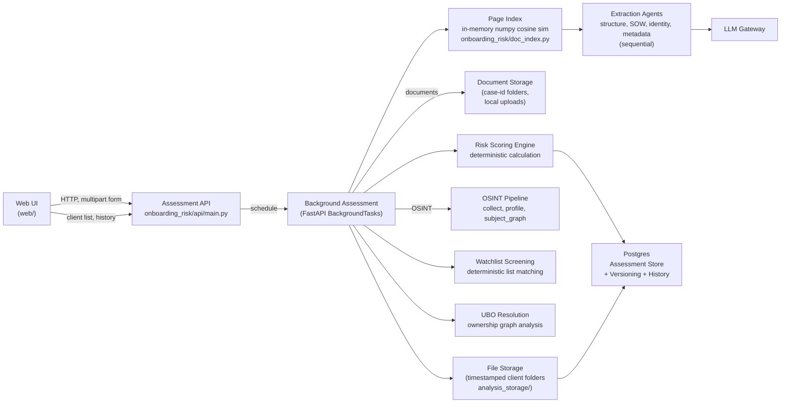
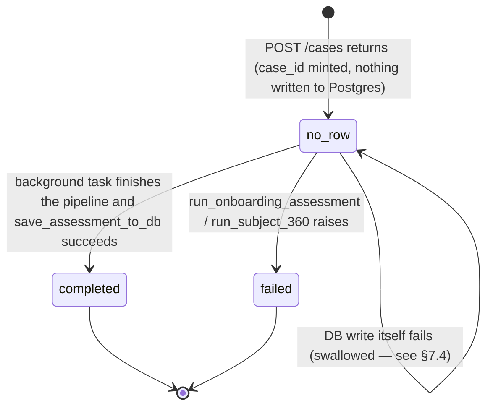
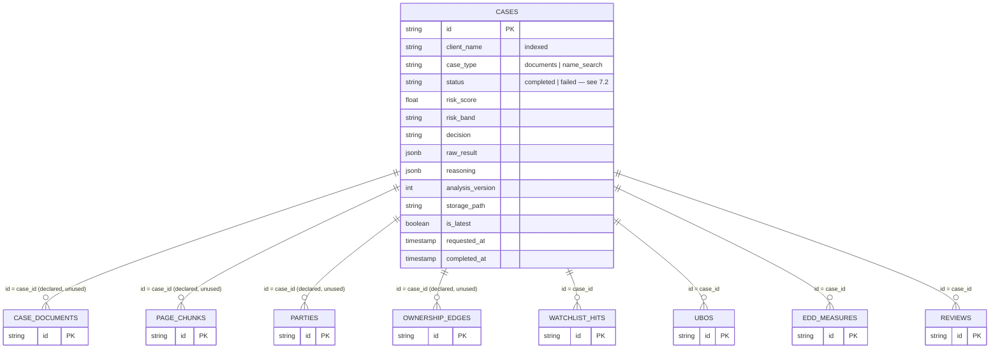

# Fraud Detection Agent — Case Study (Interview Format)

> A mock case-study interview in which a candidate walks an interviewer through a
> production-style agentic AI system for financial crime detection and KYC/EDD
> assessment. §§1–6 describe the business problem and requirements in illustrative
> terms, as originally written. **§7 (System Design) has been updated to describe the
> actual implementation** — the module, file, and endpoint names there are literal
> references to this codebase (`onboarding_risk/`, `web/`, `Dockerfile`, `k8s/`), not
> illustrative ones. Within §7, each claim is one of three things and is labeled when it
> isn't simply "live": **live** (matches the code as of this writing), **aspirational**
> (described as a design goal, not yet built — e.g. cloud storage migration), or **dead**
> (code exists — a DB table, a dependency, a file — but nothing in the running system
> writes to or exercises it). §7.4 also notes a handful of non-architectural issues
> (stale tests, config/manifest mismatches, a dead-code branch) found while verifying
> this section against the code.

---

## 1. Context & Business Narrative

**Interviewer:** Let's start broad. What problem were you actually solving, and who was it for?

**Candidate:** When a high-net-worth individual or complex corporate structure applies for
banking services — private banking, wealth management, corporate accounts, or trading
facilities — the bank has to assess two critical risks: first, is this client legitimate,
and second, what level of due diligence do they actually require? Today, compliance
analysts do this by manually reviewing KYC documents, trust deeds, ownership charts,
watchlist screenings, and public records. For complex structures with multiple layers of
holding companies, trusts, and offshore entities, this can take days or weeks. When the
same client comes back for additional services, the process often repeats because the
historical analysis isn't easily accessible or structured for reuse.

**Interviewer:** So what did you actually build?

**Candidate:** An agent that automates the entire KYC/EDD assessment pipeline for both
document-based onboarding and name-based OSINT research. It reads KYC packs, extracts
parties and ownership structures, screens against watchlists, calculates risk scores,
generates EDD rationales, and maintains a complete audit trail. Crucially, it follows the
same principle as other financial AI systems: the AI only reads documents and writes
explanations. Every risk decision, ownership calculation, and watchlist match comes from
deterministic rules. The system also handles multiple analyses for the same client with
proper versioning and file storage.

**Interviewer:** Why split it that way instead of letting the model make risk decisions?

**Candidate:** Because AML/KYC decisions have to be defensible to regulators, auditors,
and internal compliance committees. If a risk score came out of a language model's
judgment, you can't guarantee the same client profile would get the same rating if run
twice, and you can't point to the specific rule that produced it. A deterministic
scoring engine gives you both reproducibility and explainability. The AI's value is in
converting unstructured documents into structured data and writing the rationale — it never
sits in the decision path itself.

---

## 2. Business Requirement

**Interviewer:** From the business side, what did the bank actually ask for?

**Candidate:** Fundamentally: turn complex KYC document packs or simple name searches
into a complete, auditable risk assessment in minutes instead of days, with full
historical tracking for repeat clients. Four things mattered most: speed, consistency,
auditability, and reusability. The same client information, assessed twice, must produce
the same risk rating, and when a client returns, the bank should be able to see their
complete assessment history without starting from scratch.

**Interviewer:** What does the compliance analyst actually get out of a run?

**Candidate:** For document-based assessments: extracted parties and entities, complete
ownership graphs with ultimate beneficial owners (UBOs), watchlist screening results
against PEP, sanctions, and adverse media lists, structured risk factor analysis with
weighted scoring, a risk band (LOW/MEDIUM/HIGH/PROHIBITED), an onboarding decision
(APPROVE_STANDARD_CDD/APPROVE_WITH_EDD/ESCALATE_MLRO/DECLINE), and a detailed EDD
rationale with specific measures. For name-based OSINT searches: a 360° public profile
including biography, professional history, company affiliations, adverse media findings,
political exposure indicators, relationship analysis, and behavioral assessment — all
derived from the same deterministic scoring engine.

**Interviewer:** And the historical tracking requirement — how does that work in practice?

**Candidate:** Every assessment is versioned by client name. If "John Smith" is assessed
three times over a year, the system stores all three analyses with timestamped folders
for document storage, marks the latest as current, and provides a complete historical
view through the UI. The database stores each version with metadata, so analysts can
compare how a client's risk profile has evolved over time without re-analyzing historical
documents.

---

## 3. Requirements

**Interviewer:** Let's get concrete. Walk me through the functional requirements.

**Candidate:** At minimum, the system has to:

- Accept KYC document packs (PDFs) or initiate name-based OSINT searches
- Parse documents page by page with semantic indexing for efficient retrieval
- Extract parties, ownership structures, relationships, and source of wealth information
- Resolve ultimate beneficial owners (UBOs) through complex ownership chains
- Screen all parties against watchlists (PEP, sanctions, adverse media)
- For OSINT searches, collect public evidence across multiple dimensions
- Apply deterministic risk scoring with configurable weights and hard-stop rules
- Generate EDD rationales grounded in the assessment results
- Store results with proper versioning for historical analysis
- Provide both document-upload and name-search workflows
- Support historical review and comparison of client assessments
- Maintain complete audit trails with evidence citations
- Allow analysts to review and override system decisions

**Interviewer:** And the non-functional side — what actually constrains the design?

**Candidate:** This is the table I'd put in front of a reviewer:

| Area            | Requirement                                                                                           |
| --------------- | ----------------------------------------------------------------------------------------------------- |
| Reproducibility | The same inputs, watchlist data, and rule set must produce the same risk rating.                      |
| Explainability  | Every risk factor, UBO calculation, and watchlist match must have evidence or rule references.        |
| Grounding       | The AI may only use the evidence it was given and must never invent relationships or risk factors.    |
| Security        | KYC documents and assessment results must be encrypted in transit and at rest.                        |
| Access control  | Enterprise SSO and role-based access must protect the compliance workspace.                           |
| Auditability    | Inputs, outputs, watchlist sources, rule versions, and assessment history must all be retained.       |
| Availability    | Optional OSINT backend failures must not prevent document-based assessments from completing.          |
| Scalability     | Independent assessments should run in parallel; storage should grow predictably with document volume. |
| Maintainability | Prompts, models, watchlist sources, and scoring rules must be versioned independently.                |
| Human control   | A decision stays a draft until an authorized compliance officer or MLRO approves it.                  |
| Versioning      | Multiple assessments of the same client must be properly versioned and retrievable.                   |

Explainability and auditability are the two I'd call load-bearing — especially in AML/KYC
where regulators routinely ask for the exact reasoning behind a decision.

---

## 4. Data Requirement

**Interviewer:** What actually feeds this system?

**Candidate:** Every extracted relationship and risk factor carries its source document,
page, confidence level, and validation status. On top of that, four broad categories of
data flow in.

**Interviewer:** Start with the documents themselves.

**Candidate:**

| Data point                              | Why it's needed                                                                          |
| --------------------------------------- | ---------------------------------------------------------------------------------------- |
| KYC application forms                   | Primary source of client identity, declared PEP status, and basic information.           |
| Trust deeds and foundation documents    | Define complex ownership structures, trustees, beneficiaries, and control relationships. |
| Ownership charts and cap tables         | Show direct and indirect ownership percentages and voting rights.                        |
| Certificate of incorporation            | Legal entity details, directors, shareholders, and registered addresses.                 |
| Passports and national IDs              | Identity verification and document authenticity checks.                                  |
| Bank statements and transaction history | Source of wealth verification and transaction pattern analysis.                          |
| Business plans and financial statements | Understanding of business activities and revenue sources.                                |

**Interviewer:** And for the OSINT name-based workflow?

**Candidate:** The system automatically gathers evidence across multiple dimensions:

| Evidence dimension  | Sources and purpose                                                                               |
| ------------------- | ------------------------------------------------------------------------------------------------- |
| Biography           | Wikipedia, official biographies, company websites for basic identity verification.                |
| Professional        | LinkedIn, company registries, press releases for employment history and directorships.            |
| Company performance | Financial news, market data, industry reports for affiliated company health.                      |
| Adverse media       | News search for fraud allegations, litigation, regulatory actions, negative coverage.             |
| PEP screening       | Government databases, political registries for political exposure indicators.                     |
| Social behavioral   | Public posts, interviews, speeches for behavioral risk indicators.                                |
| Relationships       | News, public records for family, business associates, and connections.                            |
| Wealth              | Public wealth rankings, asset disclosures, philanthropic activities for source of wealth signals. |

**Interviewer:** What about the reference data the system needs?

**Candidate:** Watchlist databases (PEP, sanctions, adverse media), geographic risk
classifications (high-risk jurisdictions, offshore jurisdictions), risk factor weight
tables and thresholds, EDD measure templates, and company identity data for OSINT
disambiguation. The watchlist data is particularly critical — it has to be regularly
updated and versioned since regulatory lists change frequently.

---

## 5. Agentic AI Solution

**Interviewer:** Let's get into the design itself. What's the one-sentence version?

**Candidate:** The AI reads documents and gathers public evidence, then writes explanations.
Deterministic services calculate ownership, screen watchlists, score risk, and route the
decision. The same principle applies here as in other financial AI: no AI-produced
relationship or risk assessment crosses into the decision layer without being treated as
evidence to be validated.

**Interviewer:** Walk me through what actually happens when an analyst starts a case.

**Candidate:** The analyst either uploads KYC documents or initiates a name-based OSINT
search. For document-based assessments, the system reads every page and builds a semantic
index for efficient retrieval. Separate extraction agents handle structure (parties and
ownership), source of wealth, identity verification, and case metadata. For OSINT searches,
the system conducts targeted web searches across multiple research dimensions, collects
evidence, and synthesizes a 360° profile. Both workflows then feed into the same
deterministic engine for UBO resolution, watchlist screening, and risk scoring.

**Interviewer:** And extraction itself — is that one model call, or several?

**Candidate:** Several deliberately narrow ones. For documents: separate agents extract
the legal structure (parties, ownership edges, relationships), source of wealth
information, identity verification details, and case metadata. For OSINT: the system
runs targeted searches across research dimensions (biography, professional, adverse media,
PEP, relationships, wealth), collects evidence, and then a synthesis agent builds a
coherent 360° profile. Each extraction is grounded in specific evidence with source
citations.

**Interviewer:** What happens once the data exists — how do you actually get from raw
extraction to a risk decision?

**Candidate:** A deterministic engine takes over completely. For document-based cases,
it resolves UBOs by tracing ownership chains, identifying control roles, and applying
ownership thresholds. For both workflows, it screens all parties against watchlists,
applies risk factor scoring with configurable weights, checks hard-stop rules (sanctions
hits force an automatic decline), and produces a risk band and onboarding decision. A
final LLM call is given the completed scorecard and asked only to write the EDD
rationale — it never revisits the risk assessment itself.

**Interviewer:** How do you validate the extraction, especially for complex ownership
structures?

**Candidate:** Schema validation first — every party must have proper identification,
every ownership edge must have valid owner/owned relationships, and every risk factor
must have evidence backing it. Structural validation checks for circular ownership,
impossible percentages, and disconnected entities. Grounding validation ensures every
relationship cites a real document page. For OSINT, we validate that profile claims are
supported by the collected evidence and flag low disambiguation confidence when the
evidence might refer to the wrong person.

**Interviewer:** And the watchlist screening — how do you handle false positives?

**Candidate:** The system records every watchlist hit with match scores, source lists,
and details, but doesn't automatically decline based on matches alone. High-confidence
sanctions matches trigger hard-stop review, while PEP and adverse media matches contribute
to the risk score based on severity and corroborating evidence. Analysts can review and
override watchlist findings, with their decisions becoming part of the audit trail.

---

## 6. Business and Technical Metrics

**Interviewer:** How would you know if this was actually working, from the business
side?

**Candidate:**

| Metric                                | Why it matters                                                  |
| ------------------------------------- | --------------------------------------------------------------- |
| Time to first-pass assessment         | Direct measure of compliance analyst turnaround improvement.    |
| Time to EDD-ready case                | End-to-end business value for complex onboarding.               |
| Assessments per analyst per week      | Productivity improvement.                                       |
| First-pass decision acceptance rate   | Whether the automated risk assessment is actually useful as-is. |
| Material correction rate              | Quality of extraction and risk assessment.                      |
| Risk rating consistency across reruns | Confirms reproducibility holds in practice.                     |
| False positive watchlist rate         | Screening accuracy and analyst burden.                          |
| Regulatory finding rate               | Control quality and defensibility.                              |
| UBO identification accuracy           | Critical for complex structure analysis.                        |
| Client assessment reuse rate          | Value of historical tracking and versioning.                    |

**Interviewer:** And on the engineering side?

**Candidate:**

| Metric                                 | Why it matters                                                 |
| -------------------------------------- | -------------------------------------------------------------- |
| Party extraction precision, recall, F1 | Core extraction accuracy for entity identification.            |
| Ownership edge accuracy                | Correctness of relationship extraction.                        |
| Source-page attribution accuracy       | Traceability and auditability.                                 |
| Watchlist match accuracy               | Screening effectiveness and false positive rate.               |
| Risk factor grounding accuracy         | Whether risk claims are supported by evidence.                 |
| OSINT evidence collection completeness | Coverage of public information for name searches.              |
| Profile disambiguation accuracy        | Guards against same-name-person mistakes in OSINT.             |
| Risk score reproducibility             | Should be effectively 100% by construction; any drop is a bug. |
| Assessment version integrity           | Proper handling of duplicate client assessments.               |
| File storage reliability               | Ensures historical analysis data is preserved.                 |
| Model latency, token usage, cost       | Operational planning and cost management.                      |
| Job success rate, end-to-end latency   | Production reliability.                                        |

**Interviewer:** If you had to pick the one metric you'd watch most closely, which would
it be?

**Candidate:** Risk score reproducibility. In AML/KYC, consistency is non-negotiable.
If the same client profile assessed twice produces different risk ratings, that's not just
a quality issue — it's a regulatory and trust issue that undermines the entire system.

---

## 7. System Design

### 7.1 High-Level Design

**Interviewer:** Sketch the architecture for me.

**Candidate:** One FastAPI service (`onboarding_risk/api/`) serves as the entire backend
with dual workflows. The web UI (`web/`) provides both document upload and name search
interfaces, plus a historical KYC view — there's also a separate Streamlit UI
(`app_streamlit/`) that talks to the pipeline functions directly for local development,
but it's explicitly excluded from the deployed image. The system uses FastAPI
BackgroundTasks for assessment execution, Postgres for the assessment/versioning store,
and a local file storage system — the doc-page index and orchestration itself are
simpler than "pgvector" and "LangGraph" might suggest, so let me be precise: the page
index is a plain in-memory numpy cosine-similarity search rebuilt per request, not a
pgvector-backed store (there's a `PageChunk` table with an `embedding` JSON column meant
for that, but nothing ever writes to it), `agent_graph.py`/`subject_graph.py` are
sequential Python function pipelines, not LangGraph state graphs (the `langgraph`
dependency is pinned but unused), and `tools.py`'s `search_pages`/`get_page` are real
LangChain `@tool`-decorated functions with a `set_page_index()` global-injection
mechanism, but nothing ever binds them to an LLM for tool-calling — `agent_graph.py`
calls `set_page_index()` once and then every extractor in `extraction.py` takes the
`PageIndex` as a plain function argument and calls `index.search()` directly, so the
global that `set_page_index` populates is never actually read. The key innovation is the
client-level versioning system that handles duplicate assessments while maintaining
complete historical records.

Note the API layer never writes to Postgres at case-creation time — only the background
task does, once the assessment finishes (`bg --> db`); the earlier version of this
diagram had an `api -->|create case| db` edge that contradicted the "no processing
record" prose below it.

**Interviewer:** Walk me through that flow step by step.

**Candidate:**

1. **Request Initiation**: The analyst uses the web UI to either upload KYC documents
   or start a name-based OSINT search. The API validates the request, generates a case ID,
   and immediately returns a response without creating a processing record in the database.
   For document uploads, files are saved synchronously in this same request — into a
   case-ID-keyed folder under local upload storage — before the background task is even
   scheduled; that's separate from the timestamped *client* folder used later, in step 6.
2. **Background Execution**: The actual assessment runs as a background task. For OSINT
   searches, the system initiates web evidence collection here.
3. **Document Processing** (if applicable): The system builds an in-memory semantic index
   over all document pages (numpy cosine similarity, not a persisted vector store), then
   runs four extraction agents in sequence — structure, source of wealth, identity
   verification, and metadata — each later step depends on the parties the first one
   extracts, so this is not parallelized.
4. **OSINT Processing** (if applicable): The system conducts targeted searches across
   multiple research dimensions, collects evidence, and synthesizes a 360° profile using
   the OSINT pipeline.
5. **Deterministic Analysis**: Both workflows converge on the same deterministic engine:
   UBO resolution traces ownership chains, watchlist screening checks all parties against
   regulatory lists, and the risk scoring engine applies weighted factors with hard-stop
   rules.
6. **Result Storage**: The completed assessment is saved to the database with version
   information. For document uploads, the original files and complete results are stored
   in timestamped client folders. The system handles duplicate client names by marking
   previous versions as non-latest and incrementing version numbers.
7. **Historical Access**: The web UI provides a "Historical KYC" tab that shows all
   unique clients and their complete assessment history, allowing analysts to review and
   compare previous analyses.

**Interviewer:** What's the logic around handling duplicate client names?

**Candidate:** When a case is saved, the system checks if the client name already exists.
If it does, the existing latest analysis is marked as `is_latest=False`, and the new
analysis gets an incremented `analysis_version`. Both records remain in the database for
historical tracking, but only the latest is flagged as current. The file storage system
creates separate timestamped folders for each analysis, so no data is lost. The UI
shows unique clients in the dropdown but displays their complete history when selected.

### 7.2 Low-Level Design

**Interviewer:** Break the system down into its actual modules.

**Candidate:**

| Module                          | Real file(s)                                         | Responsibility                                                                                                                                              |
| -------------------------------- | ----------------------------------------------------- | -------------------------------------------------------------------------------------------------------------------------------------------------------------- |
| Web UI                            | `web/index.html`                                       | Document upload, name search, and Historical KYC tabs — served by the FastAPI app itself; the only production client.                                          |
| Dev-only Streamlit UIs             | `app_streamlit/ui.py`, `ui_subject.py`                 | Call `agent_graph`/`subject_graph` pipeline functions directly, bypassing the HTTP API entirely. Excluded from the Docker image; run via `make run-streamlit`.  |
| API                                | `onboarding_risk/api/main.py`                          | All 8 endpoints, background-task scheduling, every DB read/write, mounts `web/` as static files.                                                               |
| Document orchestration            | `agent_graph.py`                                       | `assess_pack`/`run_onboarding_assessment`: build the page index, run the 4 extraction calls in sequence, call the deterministic engine, then the EDD narrative. |
| OSINT orchestration                | `subject_graph.py`                                     | `assess_subject`/`run_subject_360`: collect web evidence, synthesize a profile, turn it into parties (`profile_to_parties`), call the same deterministic engine.|
| Page index                         | `doc_index.py`                                         | PDF → per-page text (`fitz`/PyMuPDF, text PDFs only, no OCR) → in-memory numpy cosine-similarity search. Rebuilt per request; nothing is persisted.             |
| Extraction agents                  | `extraction.py`                                        | 4 grounded LLM calls: `extract_structure`, `extract_source_of_wealth`, `extract_identity`, `detect_case_metadata`. Each takes the `PageIndex` directly and calls `index.search()` — no shared/global state. |
| Agent tool scaffold (unused)        | `tools.py`                                             | `search_pages`/`get_page` LangChain `@tool`s plus a `set_page_index()` global setter — real code, but never bound to an LLM for tool-calling; see §7.1.        |
| OSINT collection                   | `osint/collect.py`, `osint/search.py`                  | Free-web query building across 8 research angles, DuckDuckGo/Google/Wikipedia/news backends, de-duplication by URL/snippet. `search.ipynb` is a scratch notebook, not part of the runtime. |
| OSINT profile synthesis            | `osint/profile.py`                                     | One grounded LLM call turning collected evidence into a `Profile360` (biography, companies, adverse media, PEP indicators, relationships, behavioral read).    |
| Deterministic engine                | `ownership.py`, `screening.py`, `scoring.py`, `reference.py` | No LLM calls anywhere in these four files. UBO resolution, watchlist/geography screening, fixed-weight scoring + band/decision; `reference.py` supplies the (illustrative, swappable) sample lists and thresholds the other three depend on. |
| EDD narrative                      | `edd.py`                                               | One grounded LLM call that explains the already-computed scorecard — instructed never to re-rate the case.                                                     |
| File storage                       | `storage.py`, class `StorageManager`                   | Timestamped-folder storage per client analysis. "Designed to be easily extended to S3 or ADLS" is aspirational — a single concrete class over `pathlib`/`shutil`, no cloud SDK or adapter interface today. |
| Configuration                      | `config.py`                                            | LLM/embedding client construction; also defines `Config.pg_*`/`redis_*` fields that are loaded from env but never read anywhere else in the codebase — see §7.4. |
| Data model                          | `db/models.py`, `db/session.py`                        | 9 declared tables (5 live, 4 dead — see §7.3); `db/session.py` builds its own independent `DATABASE_URL` rather than using `config.py`'s `Config.pg_*` fields.  |

**Interviewer:** How does a case actually move through its lifecycle?

**Candidate:** Simpler — and stranger — than the status column's own comment implies.
`db/models.py` documents `Case.status` as one of `created, processing, awaiting_review,
approved, rejected, prohibited`, but the code only ever writes two of those:
`"completed"` and `"failed"`. There is no persisted "in progress" state at all — no
`Case` row exists until the background task finishes.

While `no_row` is true, `GET /cases/{case_id}` returns `404`, and
`GET /cases/{case_id}/status` synthesizes a hardcoded `{"status": "processing",
"progress": 0.5}` rather than reporting real progress — there simply isn't a row to read
a phase from yet. `CaseResponse.status == "queued"` (returned by `POST /cases` itself) is
never written to the database either; it exists only in that one response payload.

### 7.3 Database Schema — Full Reference

**Interviewer:** Let's go one level deeper — every table, every column, exactly when
each one gets written.

**Candidate:** This is a literal reference to `onboarding_risk/db/models.py`.

#### Entity-relationship shape

Four of the nine declared tables — `CaseDocument`, `PageChunk`, `Party`,
`OwnershipEdge` — are never instantiated by any code path. `Party(...)` and
`PageChunk(...)` are constructed constantly in the codebase, but every one of those is
the **Pydantic** schema class of the same name (`schemas.Party`, `doc_index.PageChunk`),
not the SQLAlchemy model — grepping for `db.add(Party` / `db.add(CaseDocument` /
`db.add(PageChunk` / `db.add(OwnershipEdge` across the codebase returns nothing. `Party`
and `OwnershipEdge` are exactly the tables you'd expect to hold the extraction output —
that output only ever lives in the in-memory assessment object and the JSON blob under
`storage_path`, never in relational form.

#### The five tables that actually get written

| Table            | Written                                             | Notes                                                                                                     |
| ------------------ | ------------------------------------------------------ | --------------------------------------------------------------------------------------------------------------- |
| `cases`           | Once, at the end of the background task                | See §7.2 — `status` is only ever `"completed"` or `"failed"`. `analysis_version`/`is_latest`/`storage_path` are the versioning fields; live and actively read/written. |
| `ubos`            | Deleted-then-reinserted alongside `cases`                | One row per resolved UBO; `control_roles`/`ownership_paths` stored as JSON lists.                          |
| `watchlist_hits`  | Deleted-then-reinserted alongside `cases`                | One row per PEP/sanctions/adverse-media hit, from either the static lists or (for OSINT cases) web-derived findings. |
| `edd_measures`    | Deleted-then-reinserted alongside `cases`                | One row per recommended EDD measure text, from the LLM-written rationale.                                  |
| `reviews`         | Inserted once alongside `cases` (never deleted/updated)  | An automatic `reviewer="system"` row is written for every completed case — see §8 item 4 for what's still missing here. |

#### The write timeline — what happens, in order

**`POST /cases`:** writes **nothing** to Postgres. It mints a `case_id` (`uuid.uuid4()`
in Python, not a DB sequence), optionally saves uploaded files synchronously to
`config.document_storage_dir/{case_id}/`, schedules the background task, and returns —
milliseconds, not minutes, on purpose (same reasoning as any long-running pipeline behind
a browser or load balancer's idle-connection timeout).

**Background task (`run_pdf_assessment_wrapper` / `run_subject_assessment_wrapper` →
`save_assessment_to_db`):**

| # | What runs | Table(s) touched | Committed? |
| - | ----------- | ------------------- | ------------ |
| 1 | Run the full pipeline (`run_onboarding_assessment` / `run_subject_360`) | — | — |
| 2 | Query for an existing `is_latest=True` row for this `client_name`; if found, mark it `is_latest=False` and increment `analysis_version` | `cases` (in-memory only so far) | Not yet |
| 3 | `StorageManager.save_analysis_files()` writes the uploaded PDFs (if any), `metadata.json`, and `analysis_result.json` to a new timestamped folder under `analysis_storage/` | *(filesystem, not DB)* | — |
| 4 | Query `cases` by `id == case_id`; since `case_id` is a fresh UUID minted in step 1 of `POST /cases` and nothing else ever calls this function for the same id, this is always a miss in practice — insert a new `Case(status="completed", ...)` row | `cases` INSERT | Not yet |
| 5 | Delete any existing `ubos`/`watchlist_hits`/`edd_measures` for this `case_id` (a no-op on the insert path — there's nothing to delete yet), then insert the freshly computed rows | `ubos`, `watchlist_hits`, `edd_measures` DELETE + INSERT | Not yet |
| 6 | Insert one automatic `reviews` row, derived from the decision | `reviews` INSERT | Not yet |
| 7 | `db.commit()` | — | **One commit for everything above**, at the very end of `save_assessment_to_db` |

The "update an existing case" branch in step 4 (`else: case.status = "completed"; ...`)
is real code but effectively dead today — nothing in the current call graph ever invokes
`save_assessment_to_db` twice for the same `case_id`.

On any exception in steps 2–6, the inner `try` rolls back and re-raises — but the
**outer** `try` in `save_assessment_to_db` catches that re-raised exception, logs it, and
returns normally without propagating it. Concretely: if Postgres is unreachable when step
7's commit would run, step 3 has already written real files to `analysis_storage/`, but
no `cases` row is ever created — the case is stuck in the `no_row` state from §7.2
*forever*, indistinguishable from "still processing," even though the underlying
assessment actually completed successfully. `run_pdf_assessment_wrapper`'s own
`except Exception` (which writes a `status="failed"` row) never fires in this scenario,
because `save_assessment_to_db` doesn't re-raise for it to catch — it only fires when the
pipeline itself (`run_onboarding_assessment`/`run_subject_360`) throws, e.g. during
extraction.

**Interviewer:** What does the UI actually call, under the hood?

**Candidate:**

| Endpoint                         | Method | Purpose                                                  |
| -------------------------------- | ------ | -------------------------------------------------------- |
| `/`                              | GET    | Serves `web/index.html`                                  |
| `/health`                        | GET    | Liveness/readiness probe (used by Docker and k8s)        |
| `/cases`                         | POST   | Create new assessment (documents or name search); writes nothing to Postgres — see the write timeline above |
| `/cases/{case_id}`               | GET    | Case status and basic information; `404` while the case is in the `no_row` state |
| `/cases/{case_id}/result`        | GET    | Full assessment result for a completed case              |
| `/cases/{case_id}/status`        | GET    | Cheap poll target; hardcoded `progress: 0.5` guess while `no_row`, real terminal values (`1.0`/`0.0`) once the row exists |
| `/clients`                       | GET    | Every unique client name with its latest analysis info    |
| `/clients/{client_name}/history` | GET    | All analyses for one client, newest `analysis_version` first |

**Interviewer:** What about CI/CD and deployment — what's actually automated?

**Candidate:** `.github/workflows/ci-cd.yml` is real and runs on every push, with the
same three-job shape as the other agents in this codebase:

1. **`test`**: installs dependencies, runs `ruff check` (advisory — `|| true`, not a
   required gate yet), runs `bandit` against `onboarding_risk/`, then `pytest tests/ -v`.
2. **`build-and-push`**: on a push to `main` only, after `test` passes — logs into GHCR
   with the built-in `GITHUB_TOKEN` (no external registry account needed), builds the
   Docker image, and pushes it tagged with both the commit SHA and `latest`.
3. **`deploy`**: a real `kubectl set image` + rolling-update-wait, but gated behind a
   `KUBE_CONFIG` repository secret that doesn't exist yet — it checks for the secret
   first and skips cleanly with an explanatory message if it's absent, rather than
   failing red against a cluster that was never configured.

The Kubernetes manifests in `k8s/` are real, not illustrative — a `Deployment` pinned to
`replicas: 1`, a `Service`, a `ConfigMap`, and a `Secret`. The deployment comment
explains *why* it's pinned to one replica: uploaded documents land on the pod's local
disk, so a second replica (or even a rolling pod replacement mid-upload) wouldn't see
documents an earlier pod received — that's the real, current reason cloud storage
migration (§8 item 1) matters, not just a future scalability nicety. One inaccuracy
worth flagging in that same comment: it cites `onboarding_risk/api/routes.py::
_save_uploads` as where uploads are written — that file and function don't exist; the
actual logic is inline inside `create_case` in `api/main.py`.

A second, separate gap between the manifests and the code: `k8s/configmap.yaml` sets
`LLM_BASE_URL`, `LLM_MODEL`, and `EMBED_MODEL`, but `config.py` actually reads
`LLM_ENDPOINT`, `LLM_MODEL_NAME`, and `EMBED_MODEL_NAME` — three different names for the
same three settings. Deployed as-is, none of the ConfigMap's LLM/embedding intent takes
effect; the app silently falls back to `config.py`'s hardcoded defaults instead (see §7.4
for what those defaults are). `PGHOST`/`PGPORT`/`PGDATABASE` and the `Secret`'s
`PGUSER`/`PGPASSWORD`/`LLM_API_KEY` do use the names the code actually reads, so the
database connection and the LLM API key itself are the parts of this manifest that would
work correctly today.

**Interviewer:** And the development workflow?

**Candidate:** The Makefile: `install`, `test`, `lint`/`lint-fix` (ruff), `security`
(bandit), `build` (Docker), `run` (uvicorn with `--reload`), `run-streamlit`, `clean`,
`init-db` — no `deploy` target; that logic lives in the CI/CD workflow instead.
`pyproject.toml` pins Python `>=3.12`, configures `ruff` (line-length 100,
`E`/`F`/`I`/`N`/`W`/`UP` rule sets), and configures pytest for `asyncio_mode = "auto"`
test discovery.

### 7.4 What's Still Incomplete

**Interviewer:** If you were being honest about what's still incomplete here, what would
you flag?

**Candidate:** In rough priority order — a mix of design gaps already called out
elsewhere in this doc, plus a few things a close read of the code turned up that aren't
design decisions at all, just things nobody has gotten to yet:

1. **A DB-write failure is fully swallowed, and can strand a completed assessment.** As
   detailed in §7.3's write timeline: `save_assessment_to_db`'s outer `except` logs and
   returns normally rather than re-raising. If Postgres is unreachable at commit time,
   the pipeline can have completed successfully and even written real files to
   `analysis_storage/`, but the case never gets a `cases` row — it stays in the `no_row`
   state from §7.2 forever, indistinguishable via the API from "still processing."
2. **Two independent, inconsistent paths configure the same database connection.**
   `config.py`'s `Config.pg_host`/`pg_port`/`pg_database`/`pg_user`/`pg_password` fields
   are populated from environment variables in `Config.from_env()` but never read by any
   other code — the actual SQLAlchemy engine is built independently in `db/session.py`,
   which reads the same environment variable *names* but with different hardcoded
   fallback defaults (a different default port, and a different default password) than
   `config.py`'s own fallbacks. Similarly, `config.py` defines and loads
   `redis_host`/`redis_port`/`redis_password`/`redis_db` from the environment, and
   `redis` is a declared dependency in `pyproject.toml`, but no Redis client is
   constructed anywhere in the codebase — it's configured, but entirely unused.
3. **`config.py`'s module docstring says "No secrets are hard-coded" — that's not
   accurate.** The `Config` dataclass has literal hardcoded default values for the LLM
   gateway API key and the Postgres password (not reproduced here). They only take
   effect when the corresponding environment variable is unset, but a hardcoded
   fallback secret in source control is exactly the pattern the docstring claims doesn't
   exist. Worth rotating and removing outright, independent of anything else in this
   document.
4. **`k8s/configmap.yaml`'s LLM/embedding settings don't reach the app.** As detailed in
   §7.3: the ConfigMap's `LLM_BASE_URL`/`LLM_MODEL`/`EMBED_MODEL` keys don't match the
   environment variable names `config.py` actually reads
   (`LLM_ENDPOINT`/`LLM_MODEL_NAME`/`EMBED_MODEL_NAME`), so a cluster deploy would
   silently fall back to the hardcoded defaults in item 3 above instead of whatever the
   ConfigMap intended.
5. **`tools.py`'s LangChain tool-calling scaffold is unused.** `search_pages`/`get_page`
   are real `@tool`-decorated functions and `set_page_index()` populates a real module
   global, but nothing ever binds them to an LLM for tool-calling — extraction calls
   `PageIndex.search()` directly instead (§7.1, §7.2).
6. **Environment caveat, not a code defect, worth flagging so nobody over-trusts
   `make test`:** `onboarding_risk/db/session.py` builds its SQLAlchemy `engine` at
   import time against a hardcoded local-Postgres default. On a machine where
   `psycopg2` can't load `libpq` (e.g. a Homebrew `postgresql` upgrade that leaves a
   stale dylib path), importing `api/main.py` — and so collecting `tests/test_api.py`
   — fails before any test body runs. Running that suite requires either a reachable
   Postgres at the configured `DATABASE_URL` or a working `psycopg2`/`libpq` install;
   it is not something a code change here fixes.
7. **A previously-broken test is now fixed.** `tests/test_extraction.py` used to import
   `extract_parties` and `extract_ownership_edges` from `extraction.py` — neither
   existed (the real functions are `extract_structure`, `extract_source_of_wealth`,
   `extract_identity`, `detect_case_metadata`), so the file failed on import rather
   than testing anything. It now imports and exercises the real four functions. Two
   other issues once tracked here — a JSON-vs-`Form(...)` body mismatch in
   `tests/test_api.py`, and a dead second `return` in `POST /cases` — no longer
   reproduce against the current code and have been removed from this list.

The remaining, more strategic gaps — local-disk storage vs. a real object store,
commercial watchlist integration, real progress tracking, the analyst-facing half of the
review workflow, bulk assessment, analytics, and broader OSINT coverage — are the same
ones §8 already tracks in the original business-roadmap framing; they aren't repeated
here.

---

## 8. What's Still Incomplete

**Interviewer:** What would you prioritize if you had to extend this system?

**Candidate:**

1. **Cloud Storage Migration**: The current local file storage works for development
   but should be migrated to S3 or ADLS for production scalability and reliability.
2. **Advanced Watchlist Integration**: The current screening uses basic list matching.
   Production systems would benefit from commercial watchlist APIs with better
   disambiguation and false positive handling.
3. **Real-time Status Updates**: The current status polling works but is cruder than
   "functional" implies — before a case row exists it just returns a hardcoded
   `progress: 0.5` guess. Real progress tracking, let alone WebSocket push, is still
   ahead of us.
4. **Analyst Review Workflow**: Partially done. A `Review` row is written automatically
   for every completed case (`reviewer="system"`, an auto-derived action/reason) — so the
   audit-trail schema exists — but there's no endpoint for an analyst to actually submit
   a review, override a decision, or populate the `corrected_fields` column. That
   human-facing half is what's still missing.
5. **Bulk Assessment**: Support for batch processing of multiple clients simultaneously.
6. **Advanced Analytics**: Trend analysis across client assessments, risk pattern
   identification, and regulatory reporting capabilities.
7. **Enhanced OSINT**: More sophisticated OSINT collection with better source diversity
   and real-time monitoring capabilities.

---

## 9. Summary

**Interviewer:** If you had to summarize this system in three sentences, what would you say?

**Candidate:** It's an automated KYC/EDD assessment system that combines document
analysis and OSINT research with deterministic risk scoring to produce consistent,
auditable compliance decisions. The system handles both complex document-based
onboarding and name-based background checks while maintaining complete historical
tracking for repeat clients. By strictly separating AI-powered extraction from
rule-based decision-making, it achieves both the speed of automation and the
reproducibility required in regulated financial services.
