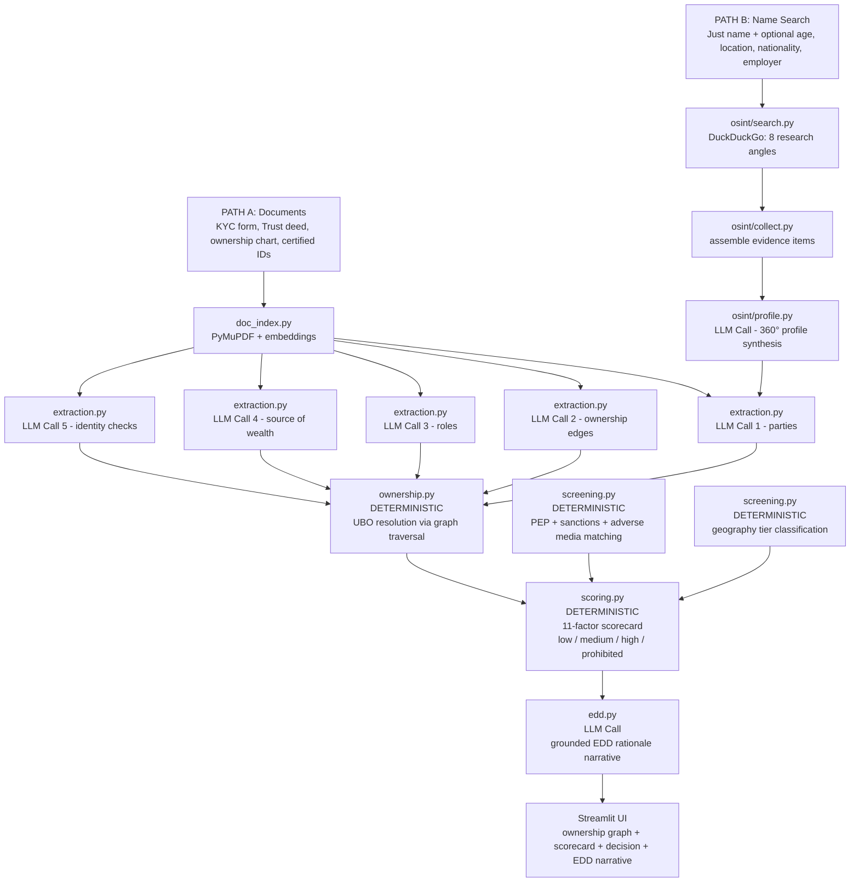
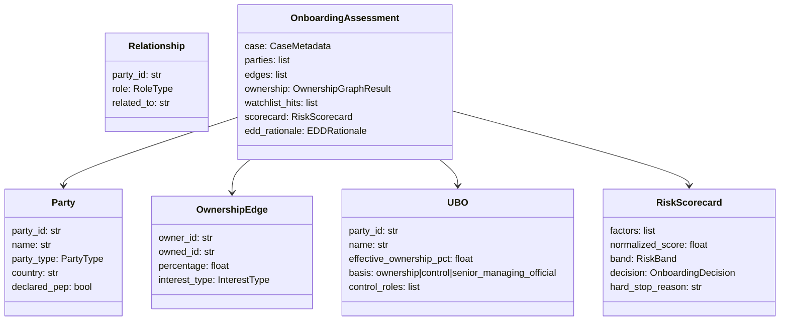
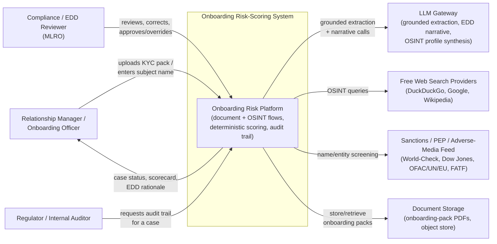
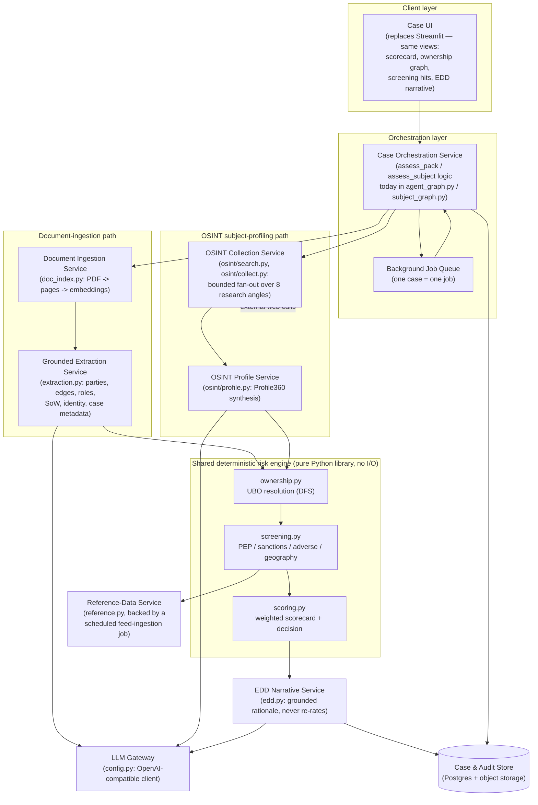
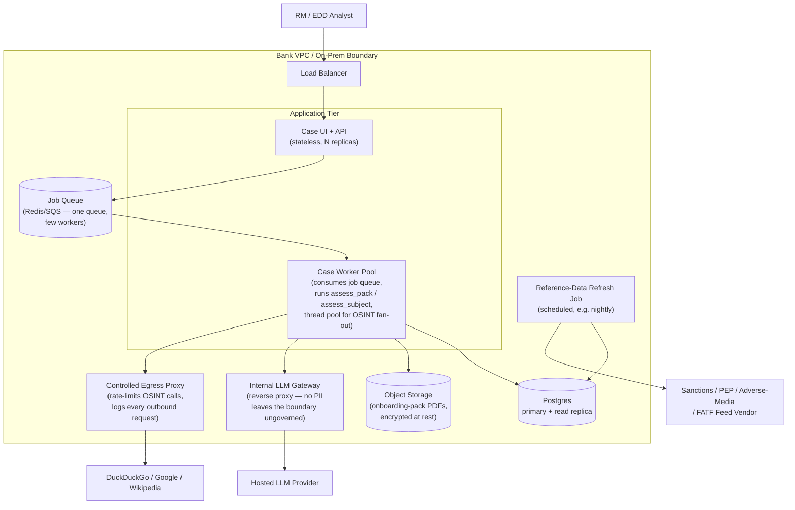
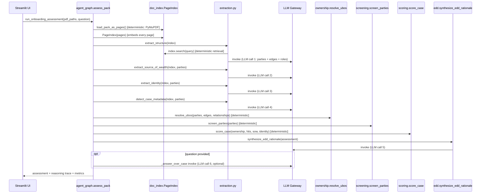
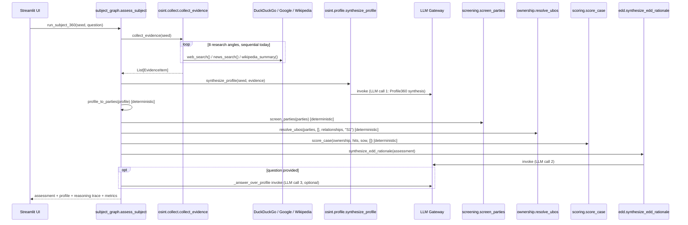

# Fraud Detection Agent (Customer Onboarding Risk Scoring) — Complete Documentation

## What This Project Does (Plain English)

A private bank or wealth management firm wants to accept a new HNI (High Net-Worth Individual) or UHNI (Ultra High Net-Worth Individual) client. Before accepting them, the bank must perform **Know Your Customer (KYC)** due diligence:

1. **Who is this person?** Verify their identity.
2. **Who else is involved?** Companies and trusts often have complex ownership chains. Who ultimately controls and benefits from the structure?
3. **Is anyone on a sanctions list?** (Hard stop if yes.)
4. **Is anyone a Politically Exposed Person (PEP)?** Higher scrutiny required.
5. **Where is the money coming from?** Unexplained wealth is a red flag.
6. **Is the structure suspicious?** Nominee directors, bearer shares, and circular ownership are money-laundering typologies.

This agent takes either **KYC documents** (PDFs: application forms, trust deeds, ID copies) or just a **name** (and publicly searches for the person), then produces a deterministic risk score, risk band, and EDD (Enhanced Due Diligence) decision.

---

## Two Input Paths



---

## Module-by-Module Deep Dive

### `extraction.py` — Grounded LLM Extraction (5 LLM Calls)

The LLM reads the KYC documents and extracts a **graph** of entities and their relationships.

#### Why a Graph, Not a Single Record?

A private banking client might be: an individual who owns 40% of a Cayman holding company, which owns 100% of a BVI trust, which owns the account. There is no single "applicant" — there is a structure with multiple legal entities and people.

The extraction creates:
- **Parties**: every individual and legal entity in the structure
- **Ownership Edges**: who owns what percentage of whom
- **Roles**: who is settlor, trustee, director, signatory, beneficiary
- **Source of Wealth**: how did the money originate?
- **Identity Checks**: what ID documents were verified?

#### LLM Call 1 — Extract Parties

**Evidence fed to LLM:** Top pages from the KYC pack matching `"company name director trustee shareholder individual entity"`

**System prompt:**
```
From the provided page text ONLY, extract every individual person and legal entity
mentioned in this onboarding pack. For each party, extract:
- party_id (stable ID like 'P1', 'P2')
- name (exact as printed)
- party_type: individual | trust | foundation | holding_company | operating_company | spv | nominee
- country (residence for persons, incorporation for entities)
- declared_pep status (as stated on the form)
Return ONLY a JSON array.
```

**What comes back:**
```json
[
  {"party_id": "P1", "name": "Sheikh Abdullah Al-Fahad",
   "party_type": "individual", "country": "UAE", "declared_pep": false},
  {"party_id": "P2", "name": "Al-Fahad Holdings Ltd",
   "party_type": "holding_company", "country": "Cayman Islands"},
  {"party_id": "P3", "name": "Crescent Trust",
   "party_type": "trust", "country": "British Virgin Islands"}
]
```

#### LLM Call 2 — Extract Ownership Edges

**System prompt:**
```
From the provided text, extract every ownership edge: who owns what % of whom.
For each edge: owner_id, owned_id, percentage (if stated), interest_type.
If only control is stated (not %), leave percentage as null.
Return ONLY a JSON array of OwnershipEdge objects.
```

**What comes back:**
```json
[
  {"owner_id": "P1", "owned_id": "P2", "percentage": 100.0, "interest_type": "equity"},
  {"owner_id": "P2", "owned_id": "P3", "percentage": 100.0, "interest_type": "beneficial"}
]
```

---

### `ownership.py` — UBO Resolution Engine (No LLM)

**UBO = Ultimate Beneficial Owner.** The real person who ultimately controls or benefits from an account, even if the legal account holder is a company or trust.

Regulators (FATF, FinCEN, FCA) require banks to identify anyone who owns ≥25% of the structure, or who exercises control through other means.

#### Graph Traversal Algorithm

The ownership edges form a **directed graph**. The UBO engine performs **depth-first search (DFS)** from each natural person, following ownership edges toward the applicant entity.

**Effective ownership computation:**
For each person, effective ownership = sum over all paths of the product of edge percentages along each path.

**Example:**
```
P1 (Sheikh Abdullah) → P2 (Holdings) 100% → P3 (Trust) 100% → Bank Account
P1's effective ownership in the account = 100% × 100% = 100% ✓
```

**Multi-path example:**
```
P1 → Co_A (60%) → Applicant
P1 → Co_B (100%) → Co_A (40%) → Applicant
P1's effective ownership = 60% + (100% × 40%) = 60% + 40% = 100%
```

#### Three Ways to Qualify as UBO

1. **Ownership basis**: effective ownership ≥ 25% (configurable via `UBO_THRESHOLD_PCT`)
2. **Control basis**: holds a control role (settlor, trustee, protector, director, sole signatory) even without ≥25% ownership
3. **Senior managing official fallback**: if no one qualifies on ownership or control, the most senior director is recorded as UBO on "control" basis — this is the FATF-required fallback

#### Structure Opacity Metrics

| Metric | What it flags |
|--------|--------------|
| `max_layering_depth` | Number of legal entities stacked above the person. 3+ layers = potential layering typology |
| `num_entities` | Total legal entities in the structure. High count = complexity |
| `has_nominee` | Nominee directors or shareholders — a classic anonymization technique |
| `has_bearer_shares` | Bearer shares are physical certificates — whoever holds them owns the company, making beneficial ownership untraceable |
| `has_circular_ownership` | A → B → A creates a loop that makes UBO resolution impossible — serious red flag |

---

### `screening.py` — PEP / Sanctions / Geography Screening (No LLM)

This module compares each party against reference lists.

#### Name Matching

Uses fuzzy string matching (normalized similarity) against configurable lists:
- **Sanctions lists**: OFAC (US), SECO (Switzerland), UN Security Council, EU consolidated list
- **PEP lists**: senior government officials, heads of state, judges, military generals and their families
- **Adverse media lists**: companies/individuals flagged for financial crime, fraud, corruption

A match above the similarity threshold (configurable) produces a `WatchlistHit`.

**Sanctions = HARD STOP**: any sanctions match immediately forces `band = PROHIBITED` and `decision = DECLINE`, regardless of any other factors.

**PEP tiers:**
- `high` tier: current head of state, current minister, current judicial official
- `medium` tier: former senior official, senior military, close associate
- `low` tier: more distant political connection

#### Geography Risk Classification

Each party's country (country of residence, country of incorporation, country where assets are held) is checked against a tiered list:

- **Prohibited**: North Korea, Iran, Syria, Russia (OFAC full block), Belarus — HARD STOP
- **High-risk**: FATF grey-listed countries, jurisdictions with weak AML frameworks
- **Offshore**: traditional secrecy jurisdictions (BVI, Cayman, Liechtenstein, etc.)

---

### `scoring.py` — Deterministic Risk Scorecard (No LLM)

**Factor weights:**

```
SANCTIONS:                100 pts  ← HARD STOP (forced PROHIBITED regardless)
PEP:                       30 pts
ADVERSE_MEDIA:             28 pts
OPAQUE_SOURCE_OF_WEALTH:   26 pts
NOMINEE_ARRANGEMENT:       24 pts
BEARER_SHARES:             24 pts
HIGH_RISK_GEOGRAPHY:       20 pts
COMPLEX_STRUCTURE:         16 pts
LAYERING:                  16 pts
ID_VERIFICATION_GAP:       14 pts
OFFSHORE_JURISDICTION:     10 pts
```

**Severity multipliers:**
```
"low"    → 0.5
"medium" → 1.0
"high"   → 1.5
```

**Band thresholds:**
```
Score 0–24   → LOW band
Score 25–49  → MEDIUM band
Score 50+    → HIGH band
Any sanctions or prohibited geography → PROHIBITED (score overridden)
```

**Decision mapping:**
| Band | Decision | Meaning |
|------|---------|---------|
| `LOW` | `approve_standard_cdd` | Standard customer due diligence only |
| `MEDIUM` or EDD trigger | `approve_with_edd` | Approve but require enhanced due diligence measures |
| `HIGH` | `escalate_mlro` | Must be reviewed by the Money Laundering Reporting Officer |
| `PROHIBITED` | `decline` | Cannot onboard regardless of circumstances |

**Hard EDD triggers:** Even if the score lands in LOW band, any of these factors automatically requires EDD:
`PEP`, `ADVERSE_MEDIA`, `HIGH_RISK_GEOGRAPHY`, `OPAQUE_SOURCE_OF_WEALTH`, `COMPLEX_STRUCTURE`, `NOMINEE_ARRANGEMENT`, `BEARER_SHARES`

**Adverse Media Credibility Discount:**
Curated list hits (World-Check, Refinitiv, accredited AML databases) are trusted at face value. OSINT-sourced findings (from public web searches) are discounted one severity level, and a single OSINT finding cannot reach "high" severity alone — it requires corroboration from at least 2 high-severity OSINT hits.

---

### `edd.py` — Grounded EDD Rationale (LLM Call)

After the deterministic scorecard runs, the LLM writes the formal EDD narrative.

**What goes into the prompt (compact assessment):**
```json
{
  "applicant": "Sheikh Abdullah Al-Fahad",
  "product": "Discretionary Mandate",
  "decision": "approve_with_edd",
  "band": "medium",
  "normalized_score": 38.5,
  "triggers": ["pep", "opaque_source_of_wealth"],
  "active_factors": [
    {"factor": "pep", "severity": "medium", "contribution": 18.0,
     "evidence": ["Sheikh Abdullah Al-Fahad: Former Minister of Trade (tier=medium)"]},
    {"factor": "opaque_source_of_wealth", "severity": "high", "contribution": 26.0,
     "evidence": ["P1: 'private investment' (no corroboration)"]}
  ],
  "ubos": [
    {"name": "Sheikh Abdullah Al-Fahad", "effective_ownership_pct": 100.0,
     "basis": "ownership", "control_roles": []}
  ],
  "structure": {
    "entities": 2, "parties": 3, "layering_depth": 2,
    "nominee": false, "bearer_shares": false, "circular": false
  }
}
```

**System prompt:**
```
You are a financial-crime / EDD analyst writing the rationale for an HNI/UHNI
onboarding case. You are given a DETERMINISTICALLY computed risk scorecard,
ownership graph and decision — these are AUTHORITATIVE. Do NOT recompute the
score, change the band, or override the decision; explain them.
Write the rationale grounded strictly in the supplied facts, quoting the UBOs,
effective ownership %, triggers and hits. Recommend concrete EDD measures
(e.g. source-of-wealth corroboration, senior sign-off, ongoing monitoring) and
list the specific information still required to clear the case.
Output ONLY JSON.
```

**What comes back:**
```json
{
  "risk_summary": "Sheikh Abdullah Al-Fahad presents medium risk primarily due to his PEP status as a former government minister and an opaque source-of-wealth declaration...",
  "key_drivers": [
    "Former Minister of Trade (tier=medium) — political exposure requires enhanced scrutiny",
    "Source of wealth declared as 'private investment' with no corroborating documentation"
  ],
  "edd_measures": [
    "Obtain source-of-wealth corroboration: audited accounts for underlying investments",
    "Senior manager sign-off required before onboarding",
    "Annual refresh of PEP status and adverse media screening"
  ],
  "information_required": [
    "3 years of audited financial statements for Al-Fahad Holdings Ltd",
    "Declaration of all directorships and public roles (current and past 3 years)",
    "Bank references from two reputable financial institutions"
  ],
  "watch_items": [
    "Monitor for any change in PEP status (return to public office)",
    "Flag any adverse media relating to Ministry of Trade tenure"
  ]
}
```

---

### `osint/` — Name-Driven 360° Profiling (Path B)

When no documents are available, the agent can research a person from scratch using only their name.

#### 8 Research Angles

Each angle runs 2–3 DuckDuckGo queries:

| Angle | What we're looking for | Example queries |
|-------|------------------------|----------------|
| `BIOGRAPHY` | Who is this person? Age, background | `"Sheikh Abdullah Al-Fahad" biography` |
| `PROFESSIONAL` | Jobs, roles, directorships | `"Sheikh Abdullah Al-Fahad" CEO director company` |
| `COMPANY_PERFORMANCE` | How are their companies doing? | `"Al-Fahad Holdings" revenue performance news` |
| `ADVERSE_MEDIA` | Fraud, litigation, investigations | `"Sheikh Abdullah Al-Fahad" fraud OR investigation OR lawsuit` |
| `PEP` | Political connections, public office | `"Sheikh Abdullah Al-Fahad" minister government official` |
| `SOCIAL_BEHAVIORAL` | Public posts, interviews, conduct | `"Sheikh Abdullah Al-Fahad" interview speech conference` |
| `RELATIONSHIPS` | Spouse, family, associates | `"Sheikh Abdullah Al-Fahad" family associate partner` |
| `WEALTH` | Net worth, source of funds | `"Sheikh Abdullah Al-Fahad" net worth wealth assets` |

#### Evidence Collection and Profile Synthesis

All search results (typically 80–120 items) are collected, deduplicated by URL, and assembled into a `Profile360` via an LLM call:

**Evidence block example (first few items):**
```
[1] (biography/web) Sheikh Abdullah Al-Fahad — Wikipedia
    url: https://en.wikipedia.org/wiki/Sheikh_Abdullah_Al-Fahad
    Sheikh Abdullah Al-Fahad (born 1962) served as UAE Minister of Trade from 2008-2016...

[2] (adverse_media/news) Former UAE minister involved in business dispute
    url: https://gulfnews.com/...
    Sheikh Abdullah Al-Fahad is named in a commercial dispute over a joint venture...
```

**LLM synthesis prompt:** The LLM reads all evidence and produces a structured `Profile360` with:
- Biography, professional summary, company affiliations
- Adverse findings (fraud, litigation, regulatory) with severity
- PEP indicators
- Wealth summary and source-of-wealth signal
- Relationships with names and PEP status of associates
- Behavioral profile
- `disambiguation_confidence`: is this the right person?

The `Profile360` then feeds the same deterministic scoring engine as the document-based path.

---

## Data Schema Overview



---

## Business Terms Glossary

| Term | Explanation |
|------|-------------|
| **KYC (Know Your Customer)** | The regulatory requirement for banks to verify who their customers are, what they do, and where their money comes from. Failure to do KYC can result in massive fines and criminal prosecution. |
| **AML (Anti-Money Laundering)** | The set of laws and procedures designed to prevent criminals from disguising illegally obtained funds as legitimate income. |
| **UBO (Ultimate Beneficial Owner)** | The natural person who ultimately owns or controls an entity. If a trust owns a company, the trust's settlor or beneficiaries may be the UBO. |
| **HNI/UHNI** | High Net-Worth Individual (HNI: typically $1M–$30M investable assets) and Ultra High Net-Worth Individual (UHNI: $30M+). These clients are handled by private banking divisions. |
| **PEP (Politically Exposed Person)** | Someone who holds or has held a prominent public function — politicians, senior civil servants, military commanders, judges. They present higher bribery and corruption risk by nature of their position. |
| **Sanctions** | Legal prohibitions against doing business with certain individuals, entities, or countries, imposed by governments or international bodies (OFAC, UN, EU). A bank that processes a payment for a sanctioned party faces massive fines and criminal liability. |
| **EDD (Enhanced Due Diligence)** | Additional scrutiny applied to high-risk customers: more documentation, senior sign-off, more frequent reviews, source-of-wealth verification. |
| **CDD (Customer Due Diligence)** | Standard baseline checks: verify identity, understand the business relationship. EDD goes further. |
| **MLRO (Money Laundering Reporting Officer)** | The designated person at a financial institution responsible for receiving and assessing internal suspicious activity reports and deciding whether to file with regulators. |
| **Layering** | A money laundering typology: moving money through multiple legal entities and jurisdictions to obscure its origin. Multiple ownership layers are a red flag. |
| **Bearer Shares** | Physical share certificates that grant ownership to whoever physically holds them — no registered owner. Now heavily restricted but historically used to anonymize ownership. |
| **Nominee** | A person or entity that acts as the official owner on paper, while the actual beneficial owner remains hidden. Nominee directors and shareholders are a classic opacity tool. |
| **Source of Wealth (SoW)** | Explanation of how the customer accumulated their wealth. "Inheritance," "sale of business," "salary" are common declarations. "Unknown" or "private investments" without supporting evidence is considered opaque. |
| **Circular Ownership** | A → B → A. Entity A owns B which owns A back. This makes UBO resolution impossible and is a serious red flag. |
| **FATF** | Financial Action Task Force — the global money laundering watchdog. Its grey list (countries under increased monitoring) is a key input to geography risk scoring. |
| **Disambiguation Confidence** | In OSINT profiling, how confident are we that the search results are about the correct person? A common name may return results for different people. Low confidence → all adverse findings are discounted. |

---

## High-Level Design (HLD) — Ideal Production Architecture

Everything below is a **target design for a real production deployment**, not a description of the current Streamlit/CLI proof-of-concept. It exists to show what would need to change — and what already generalizes cleanly — if a bank actually put this in front of its onboarding/EDD team.

### Assumptions (illustrative — there is no production traffic yet; confirm every number with the business before building to it)

- **This is an internal enterprise tool**, not a customer-facing product. Users are the bank's own **KYC/compliance analysts, EDD/financial-crime analysts and relationship managers (RMs)** — roughly **20–60 named internal users**, all inside the corporate network or VPN.
- **Load is low and bursty, not high-throughput.** Onboarding a new HNI/UHNI client or running a periodic EDD refresh happens **tens of times per day** across the whole team, not per second. There is no reason to design for concurrent-request scaling the way a public API would.
- **Each review is a small, document-heavy unit of work**: a handful of KYC documents (an onboarding pack rarely exceeds ~10–20 pages) or one OSINT subject lookup per case.
- **Turnaround is measured in minutes, not milliseconds.** A single case makes 5–8 grounded LLM calls (extraction, EDD narrative, optional Q&A) and, on the OSINT path, dozens of outbound web searches — this is inherently a multi-minute job, and the design should embrace that rather than fight it.
- **Audit and regulatory defensibility are paramount.** Every risk decision must be reconstructable months or years later: which documents were used, which OSINT sources were cited, which entities/edges were extracted, which score inputs and weights applied, which model/version produced the extraction and narrative, who reviewed the case, when, and what (if anything) they overrode.

These numbers are **assumptions to validate with the business**, not measured production data — the current build has never run against a real caseload.

### System Context



**Reasoning.** The regulator/auditor is drawn as a first-class actor even though they never touch the system directly today — every other design decision below (the audit-trail schema, provenance retention, immutable review log) exists to answer *their* question ("show me why this case was rated this way"), so they belong in the context diagram alongside the two operational users.

### Component / Container Architecture



**Reasoning — why the deterministic engine is drawn as a shared library, not a service.** `ownership.py`, `screening.py` and `scoring.py` do no I/O today and shouldn't gain any: they are pure functions over in-memory Pydantic objects, and their entire value proposition (NFR-1: identical input → identical output) depends on being simple, inspectable Python, not a networked microservice with its own failure modes. Splitting them into a separate service would add a network hop and a new source of latency/partial-failure for zero benefit — both call sites (the document path and the OSINT path) already converge on the same in-process call chain (`resolve_ubos` → `screen_parties` → `score_case`), which is exactly the reuse the current code already achieves.

### Concurrency Model

**What's true today:** `osint/collect.py`'s `collect_evidence()` loops over 8 research angles, each with 1–3 queries, and for two of those angles (`ADVERSE_MEDIA`, `COMPANY_PERFORMANCE`) also issues a follow-up news search — roughly **16–24 outbound web calls per subject**, executed **strictly sequentially** in a single Python `for` loop. Each call can take up to `OSINT_TIMEOUT` (10s default) before it fails over. Sequentially, a worst-case subject lookup spends **up to ~4 minutes just waiting on network I/O**, before a single LLM call happens.

**Recommendation: a bounded thread pool (or `asyncio.gather` with a semaphore) around the OSINT fan-out step only — not a distributed task queue, and not end-to-end async.**

- **Why concurrency here is justified, unlike the rest of the pipeline.** The OSINT fan-out is the one step in either flow that is (a) I/O-bound — each call is dominated by waiting on a third-party HTTP response, not CPU — and (b) embarrassingly parallel — the 16–24 queries have no data dependency on each other; every one can start immediately. That is precisely the profile a thread pool exists for: while one thread blocks on a socket read, the GIL is released and another thread's request proceeds. A `ThreadPoolExecutor(max_workers=8)` submitting all queries and collecting results `as_completed` turns a ~4-minute worst case into roughly `ceil(24/8) × 10s ≈ 30s` worst case — the concrete "what breaks without it": at tens of reviews/day, a purely sequential OSINT step alone could dominate the SLA and make the UI feel broken even though nothing is actually failing.
- **Why not `asyncio` end-to-end.** The rest of the stack (LangChain's `ChatOpenAI.invoke`, PyMuPDF, the deterministic engine) is synchronous, and nothing here is a web server juggling thousands of concurrent connections — the actual concurrency need is "run ~20 blocking HTTP calls in parallel inside one job," which a thread pool does with far less code than introducing `httpx.AsyncClient` + `asyncio.gather` + rewriting every downstream call site to be awaitable. `asyncio.gather` would be the right call only if the stack were already async end-to-end (e.g., an async web framework); forcing it in here just to parallelize one step would mean bridging sync and async code at every boundary for no additional benefit over a thread pool.
- **Why not a distributed task queue (Celery/RabbitMQ/Kafka-style fan-out) for the searches themselves.** Distributing 20 web searches across worker *processes* on separate machines would pay serialization and network overhead for work that is already parallelizable in-thread on a single machine — there is no CPU-bound work to spread across cores here, only I/O wait to overlap. At tens of subjects/day, a thread pool inside one process handles the load with no additional infrastructure to operate, patch, or monitor.
- **Where a lightweight queue *is* justified: per-case job dispatch, not per-query fan-out.** Because a full case takes minutes (5–8 LLM calls plus, on the OSINT path, the search fan-out), the UI should not hold an open HTTP request for that long — a blocked RM tab risks gateway timeouts and gives no progress feedback. The fix is **one background job per case** (RQ/Celery with a single Redis or SQS-backed queue, or even a simple `case_status` table polled by one or two workers) so the UI can submit a case, get a `case_id` back immediately, and poll or subscribe for status. This is a shallow, single-tier queue justified purely by "don't block the browser for 2 minutes" — not the kind of distributed, autoscaled, multi-consumer-group task infrastructure that tens-of-cases-per-day volume would never justify. Reject a heavier system (Kafka, SQS fan-out to many worker types) until case volume or the number of independent processing stages grows enough to need independent scaling per stage.

### Data & Persistence Design

**What needs a database, and why.**

| Need | Why it must persist | Access pattern it must support |
|---|---|---|
| Case record (parties, edges, relationships, scorecard, EDD rationale, `Profile360`) | The regulator must be able to reopen any past case exactly as it was decided | write-once per case (a single burst at case completion), then read-by-case-id, occasionally re-read for a re-screening pass |
| Audit trail of decisions & human overrides | FR-7.2 requires the analyst/MLRO's review, correction and approval to be versioned — this is the record a regulator actually asks for | append-only inserts keyed by case_id, read chronologically per case |
| Screening-hit history | Shows what a case looked like against the watchlists *at the time*, separately from what it looks like after a watchlist refresh | write at scoring time; read for point-in-time reconstruction and for the periodic re-screening diff |
| OSINT evidence with source provenance | Every `EvidenceItem` (url, snippet, query, timestamp) is the *evidence* behind an adverse-media/PEP flag — without it, the EDD narrative is an unverifiable claim | write once per case; read only on demand (case review, audit) |

**What stays transient.** The per-case `PageIndex` (PDF pages + embeddings, `doc_index.py`) is only needed while a case is being assessed — the Q&A functions (`_answer_over_case`, `_answer_over_profile`) already work off the *compact, already-computed* assessment JSON, not the raw page index, so there's no need to keep embeddings around after scoring finishes. Rebuilding the index on the rare occasion an analyst needs to re-open a specific page is cheaper than persisting and version-managing a vector index per case.

**Concrete schema shape (entities, not DDL):**
- `case(case_id, applicant_name, product, relationship_purpose, status, created_at, created_by, source_type[doc|osint])`
- `party(case_id, party_id, name, party_type, country, nationality, declared_pep, page, source_snippet)` — one row per `Party`
- `ownership_edge(case_id, owner_id, owned_id, percentage, interest_type, page)`
- `relationship(case_id, party_id, role, related_to, page)`
- `ubo(case_id, party_id, effective_ownership_pct, basis, control_roles, paths, pages)`
- `watchlist_hit(case_id, party_id, list_type, matched_name, match_score, source_list, tier, details, screened_against_version)`
- `geography_hit(case_id, party_id, country, tier, offshore)`
- `risk_factor(case_id, factor, present, severity, weight, contribution, evidence, pages)`
- `scorecard(case_id, raw_score, normalized_score, band, edd_required, decision, hard_stop_reason, model_version, scored_at)`
- `edd_rationale(case_id, risk_summary, key_drivers, edd_measures, information_required, watch_items, llm_model_version)`
- `osint_evidence(case_id, dimension, query, title, url, snippet, source, published, fetched_at)`
- `review_action(case_id, actor, action[approve|correct|override|escalate], before_value, after_value, reason, acted_at)` — the human-in-the-loop audit record
- `reference_list_version(version_id, list_type, effective_from, source, checksum)` — so a stored `watchlist_hit` can point at exactly which PEP/sanctions snapshot produced it
- `document(case_id, filename, storage_uri, page_count, uploaded_at, checksum)` — pointer only; the PDF bytes live in object storage, not the relational DB

**Storage choice: a relational database (e.g., Postgres), not a document/NoSQL store.** The deciding factor is the access pattern: writes happen once, in a burst, at case completion (all of a case's parties/edges/hits/factors land together and should either all commit or none do — a textbook transaction); reads are almost always by `case_id` (a single indexed lookup); and periodic re-screening needs to *scan across cases* for parties matching an updated watchlist entry — a query that a normalized, indexed relational schema answers far more directly than a per-case JSON blob would (a document store would need a secondary index over every nested party name across every document, essentially reinventing relational indexing on top of a store that isn't built for it). A single JSONB column for `EDDRationale` and `Profile360` (which are read/written as-a-whole, never queried by sub-field) keeps the flexible parts flexible without abandoning relational integrity for the parts that are genuinely relational — the ownership graph *is* a graph of foreign keys, not a naturally document-shaped structure. The rejected alternative — a general document database (MongoDB-style) — would fit "write the whole case as one blob, read it back by id" reasonably well, but loses the free referential integrity between `party_id`s across `ownership_edge`/`relationship`/`watchlist_hit`, and turns "find every open case referencing this now-sanctioned name" (exactly what periodic re-screening needs) into an application-level scatter-gather instead of one indexed SQL query.

### Deployment Topology



**Reasoning.**
- **Reference-list refresh is a separate scheduled job, not part of the request path.** `reference.py` already isolates the lists behind loader functions (`pep_list()`, `sanctions_list()`, …) precisely so the matching logic in `screening.py` never has to know whether the data came from a bundled sample or a live feed. In production, a nightly (or vendor-cadence) job pulls the licensed feed, writes a new `reference_list_version` row, and the app always screens against "current" — this is also what makes periodic re-screening (rerunning `screen_parties` for existing cases against the new version) a well-defined, schedulable operation rather than an ad hoc script.
- **OSINT egress goes through a controlled proxy, not directly from worker to the open internet.** Two reasons: (1) rate-limit discipline — `osint/search.py` already free-rides on DuckDuckGo/Google's free tiers and degrades gracefully on failure; a shared egress point lets you enforce a global rate limit so one busy day of reviews doesn't get the bank's IP throttled or blocked, and (2) every outbound OSINT request is itself part of the audit trail (FR-7.3), so logging it centrally at the egress point is simpler than instrumenting every call site in `search.py`.
- **The LLM Gateway is internal**, matching NFR-5 ("no PII leaving the customer boundary" / OSS-or-gateway models only) — `config.py`'s `get_llm()`/`get_embedder()` already target an OpenAI-compatible `base_url`, so pointing that at an internal reverse proxy in front of the actual model provider requires no code change, only configuration.

### Security & Compliance

- **Access control is need-to-know per case, not just role-based.** RBAC alone ("anyone with the EDD-analyst role can see any case") is too coarse for HNI/UHNI clients, where the client list itself is reputationally sensitive. Case access should be scoped to analysts actually assigned to that case (plus MLRO/compliance who need cross-case visibility), enforced at the query layer, not just the UI.
- **Retention vs. right-to-erasure is a real tension here, and retention wins for this data category.** AML/KYC recordkeeping obligations typically mandate multi-year retention of exactly the records a subject might later ask to have erased. The resolution is to document this conflict explicitly (don't silently ignore erasure requests, and don't silently violate retention law): for a closed case within the mandatory retention window, an erasure request results in access restriction/pseudonymization of directly-identifying fields where the regulation allows it, not deletion of the case record or its audit trail.
- **Encryption at rest and in transit** applies to all three data surfaces above — Postgres (case data), object storage (PDFs), and the audit trail — consistent with NFR-5; this is a standard, non-negotiable control for KYC PII and isn't a novel design choice worth belaboring further here.
- **Source-provenance retention is a compliance requirement, not a nice-to-have.** Every OSINT-derived adverse-media or PEP flag traces back to a specific `EvidenceItem` (url, snippet, query). If that provenance isn't retained immutably, a regulator challenging "why was this person flagged as adverse media" has nothing to inspect but the LLM's summary — which is exactly the ungrounded claim the whole architecture (deterministic scoring, page citations, evidence urls) is designed to avoid. The `osint_evidence` table above exists specifically to keep that evidence trail intact even after the source web page changes or disappears.

### Observability

| Stage boundary | What to log/measure | Why |
|---|---|---|
| Document ingestion (`doc_index.py`) | page count, extraction failures (scanned/image-only PDFs) | catches silent data loss before extraction even starts |
| Grounded extraction (`extraction.py`) | LLM latency and token cost per call, parties/edges/roles extracted per document | extraction is 4 of the 5–6 LLM calls per document case — this is most of the per-case cost and latency budget |
| OSINT collection (`osint/collect.py`) | queries issued per angle, evidence items kept vs. discarded, per-backend failure counts | tells you whether a "thin" profile is a real gap or a search-backend outage — directly actionable, unlike a raw evidence count |
| Screening (`screening.py`) | hit counts by list type, hit rate over time, and — fed back from analyst review — false-positive rate on each match | the `_MATCH_THRESHOLD` (0.85 token-overlap) is a tunable constant; without a measured false-positive rate you're guessing at the right value |
| OSINT disambiguation (`osint/profile.py`) | `disambiguation_confidence` distribution, and (fed back from analyst review) how often "high confidence" profiles turn out to be the wrong person | this is the single biggest correctness risk on the OSINT path — a common name can silently attach someone else's adverse media to the wrong subject |
| Scoring (`scoring.py`) | band distribution, decision distribution, per-factor contribution frequency | shows whether the fixed weights in `FACTOR_WEIGHTS` are producing a sane spread of outcomes, or whether one factor is dominating every case |
| EDD narrative + Q&A (`edd.py`, `_answer_over_case`/`_answer_over_profile`) | LLM cost per case, and time-to-decision from case creation to final decision | LLM cost per case (5–8 calls) is the main recurring operating cost; time-to-decision is the metric BR-1 exists to move |

All of the above are **operation-boundary, aggregate metrics** (counts, rates, durations, costs) — never row-level PII dumps — consistent with the "structured, one event per operation" logging discipline the rest of this system already follows in its deterministic modules.

---

## Low-Level Design (LLD)

This section is structural — tables, signatures and call-order diagrams grounded directly in the code — and complements rather than repeats the "Module-by-Module Deep Dive" narrative above.

### Module Responsibility Table

| Module | Responsibility | Key functions / classes it exports |
|---|---|---|
| `config.py` | Central LLM/embedding client factory; reads all endpoint/model config from environment variables; installs a custom CA bundle for the gateway | `get_llm()`, `get_embedder()`, `setup_ssl_certificate()` |
| `reference.py` | Illustrative-but-swappable PEP / sanctions / adverse-media / jurisdiction reference data, plus scoring thresholds | `pep_list()`, `sanctions_list()`, `adverse_media_list()`, `high_risk_jurisdictions()`, `ubo_threshold_pct()`, `COMPLEX_LAYERING_DEPTH`, `COMPLEX_ENTITY_COUNT` |
| `schemas.py` | Pydantic data contracts shared by both flows: extraction records, deterministic outputs, and OSINT records | `Party`, `OwnershipEdge`, `Relationship`, `SourceOfWealth`, `IdentityCheck`, `CaseMetadata`, `UBO`, `OwnershipGraphResult`, `WatchlistHit`, `GeographyHit`, `RiskFactorResult`, `RiskScorecard`, `EDDRationale`, `OnboardingAssessment`, `SubjectSeed`, `EvidenceItem`, `Profile360`, plus the controlled-vocabulary enums |
| `doc_index.py` | Loads text PDFs into per-page chunks and builds a cosine-similarity semantic index over them | `PageChunk`, `load_pdf_as_pages()`, `load_pack_as_pages()`, `PageIndex` (`.search()`, `.get_page()`) |
| `tools.py` | LangChain `@tool`-decorated wrappers (`search_pages`, `get_page`) over the current `PageIndex` for LLM tool-calling | `search_pages()`, `get_page()`, `set_page_index()`, `TOOLS`, `TOOL_MAP` — **note:** these are registered and `set_page_index()` is called in `assess_pack()`, but neither `agent_graph.py` nor `extraction.py` currently binds `TOOLS` to an LLM tool-calling loop; grounding today happens via direct `PageIndex.search()` calls inside `extraction.py`, not through the tool interface |
| `extraction.py` | Grounded LLM extraction of the legal structure, source of wealth, identity evidence and case metadata from KYC pack pages | `extract_structure()`, `extract_source_of_wealth()`, `extract_identity()`, `detect_case_metadata()` |
| `ownership.py` | Deterministic UBO resolution via depth-first search over the ownership graph, plus structure-opacity metrics | `resolve_ubos()`, `_resolve_applicant()`, `_paths_to_applicant()` |
| `screening.py` | Deterministic name matching against PEP/sanctions/adverse-media lists and geography-tier lookup | `screen_parties()`, `_name_score()`, `_best_hit()` |
| `scoring.py` | Deterministic weighted risk scorecard, band assignment, EDD triggers and onboarding decision | `score_case()`, `_adverse_media_severity()`, `_band()`, `_decide()` |
| `edd.py` | Grounded LLM synthesis of the EDD narrative from the already-computed scorecard; instructed never to re-rate | `synthesize_edd_rationale()` |
| `agent_graph.py` | Orchestrates the document-ingestion path end to end, plus case Q&A | `assess_pack()`, `run_onboarding_assessment()`, `_answer_over_case()` |
| `subject_graph.py` | Orchestrates the OSINT name-driven path end to end, plus Q&A | `assess_subject()`, `run_subject_360()`, `profile_to_parties()`, `_answer_over_profile()` |
| `osint/search.py` | Free web/news/Wikipedia search and public-page-fetch wrappers; degrades to empty results rather than raising if a backend is unavailable | `web_search()`, `news_search()`, `wikipedia_summary()`, `fetch_page_text()`, `search_available()` |
| `osint/collect.py` | Builds the per-research-angle queries and runs them (sequentially today) into de-duplicated evidence | `collect_evidence()`, `_build_queries()` |
| `osint/profile.py` | Grounded LLM synthesis of a `Profile360` from the collected evidence | `synthesize_profile()` |

### Schema Reference (`schemas.py`)

**Controlled vocabularies (enums)**

| Enum | Values |
|---|---|
| `PartyType` | `individual, trust, foundation, holding_company, operating_company, spv, partnership, fund, nominee, other` |
| `RoleType` | `applicant, settlor, trustee, protector, beneficiary, director, shareholder, signatory, spouse, nominee, authorized_person, partner, ubo` |
| `InterestType` | `equity, voting, beneficial, control` |
| `RiskFactorType` | `sanctions, pep, adverse_media, high_risk_geography, opaque_source_of_wealth, complex_structure, layering, nominee_arrangement, bearer_shares, id_verification_gap, offshore_jurisdiction` |
| `RiskBand` | `low, medium, high, prohibited` |
| `OnboardingDecision` | `approve_standard_cdd, approve_with_edd, escalate_mlro, decline` |
| `OsintDimension` | `biography, professional, company_performance, adverse_media, pep, social_behavioral, relationships, wealth` |

`CONTROL_ROLES = {settlor, trustee, protector, director, signatory}` — the subset of `RoleType` that confers UBO status on its own, without needing to cross the ownership-percentage threshold.

**Extraction records (filled by the grounded LLM extractors)**

| Model | Field | Type | Description |
|---|---|---|---|
| `Party` | `party_id` | `str` | Stable id within the case, e.g. `'P1'` |
| | `name` | `str` | Exact name as printed |
| | `party_type` | `PartyType` | Default `OTHER` |
| | `country` | `Optional[str]` | Residence (person) or incorporation (entity) |
| | `nationality` | `Optional[str]` | |
| | `date_of_birth_or_incorporation` | `Optional[str]` | |
| | `identifiers` | `Dict[str, str]` | e.g. `{'passport': '...', 'reg_no': '...'}` |
| | `declared_pep` | `Optional[bool]` | As stated on the form; screening confirms independently |
| | `page` | `Optional[int]` | Source page |
| | `source_snippet` | `Optional[str]` | |
| `OwnershipEdge` | `owner_id` | `str` | |
| | `owned_id` | `str` | `owner_id` holds `percentage`% of `owned_id` |
| | `percentage` | `Optional[float]` | `None` when only control (no %) is disclosed |
| | `interest_type` | `InterestType` | Default `EQUITY` |
| | `page` | `Optional[int]` | |
| | `source_snippet` | `Optional[str]` | |
| `Relationship` | `party_id` | `str` | |
| | `role` | `RoleType` | |
| | `related_to` | `Optional[str]` | `party_id` of the entity the role is held in |
| | `page` | `Optional[int]` | |
| `SourceOfWealth` | `party_id` | `str` | |
| | `declared_source` | `str` | e.g. `'sale of business'`, `'inheritance'`, `'unknown'` |
| | `narrative` | `Optional[str]` | |
| | `corroborating_evidence_present` | `Optional[bool]` | |
| | `page` | `Optional[int]` | |
| `IdentityCheck` | `party_id` | `str` | |
| | `document_type` | `Optional[str]` | passport / national_id / certificate_of_incorporation |
| | `document_number` | `Optional[str]` | |
| | `verified` | `Optional[bool]` | |
| | `gaps` | `List[str]` | e.g. `'no certified copy'`, `'expired'` |
| | `page` | `Optional[int]` | |
| `CaseMetadata` | `applicant_name` | `Optional[str]` | |
| | `applicant_party_id` | `Optional[str]` | |
| | `product` | `Optional[str]` | e.g. `'discretionary mandate'` |
| | `relationship_purpose` | `Optional[str]` | |

**Deterministic outputs (produced by Python, never by the LLM)**

| Model | Field | Type | Description |
|---|---|---|---|
| `UBO` | `party_id` | `str` | |
| | `name` | `str` | |
| | `effective_ownership_pct` | `Optional[float]` | Sum over all ownership paths of the product of edge percentages |
| | `basis` | `str` | `'ownership' \| 'control' \| 'senior_managing_official'` |
| | `control_roles` | `List[str]` | |
| | `paths` | `List[str]` | Human-readable ownership chains to the applicant |
| | `pages` | `List[int]` | |
| `OwnershipGraphResult` | `applicant_party_id` | `Optional[str]` | |
| | `ubos` | `List[UBO]` | |
| | `num_entities` | `int` | Legal (non-individual) entities in the structure |
| | `num_parties` | `int` | |
| | `max_layering_depth` | `int` | Longest ownership chain (entities) to the applicant |
| | `has_nominee` | `bool` | |
| | `has_bearer_shares` | `bool` | |
| | `has_circular_ownership` | `bool` | |
| | `notes` | `List[str]` | |
| `WatchlistHit` | `party_id` | `str` | |
| | `party_name` | `str` | |
| | `list_type` | `str` | `'pep' \| 'sanctions' \| 'adverse_media'` |
| | `matched_name` | `str` | |
| | `match_score` | `float` | 0..1 normalized similarity |
| | `source_list` | `Optional[str]` | e.g. `'OFAC'`, `'World-Check'`, `'osint:web'` |
| | `details` | `Optional[str]` | |
| | `tier` | `Optional[str]` | PEP tier: `low\|medium\|high` |
| `GeographyHit` | `party_id` | `str` | |
| | `party_name` | `str` | |
| | `country` | `str` | |
| | `tier` | `str` | `'high' \| 'prohibited'` |
| | `offshore` | `bool` | |
| `RiskFactorResult` | `factor` | `RiskFactorType` | |
| | `present` | `bool` | |
| | `severity` | `str` | `'low' \| 'medium' \| 'high'` |
| | `weight` | `float` | Fixed per-factor base weight |
| | `contribution` | `float` | `weight * severity multiplier` (0 when absent) |
| | `evidence` | `List[str]` | |
| | `pages` | `List[int]` | |
| `RiskScorecard` | `factors` | `List[RiskFactorResult]` | |
| | `raw_score` | `float` | Sum of contributions |
| | `normalized_score` | `float` | `min(100, raw_score)` |
| | `band` | `RiskBand` | |
| | `edd_required` | `bool` | |
| | `triggers` | `List[RiskFactorType]` | Hard EDD triggers that fired |
| | `decision` | `OnboardingDecision` | |
| | `hard_stop_reason` | `Optional[str]` | Set on sanctions match / prohibited jurisdiction |
| `EDDRationale` | `risk_summary` | `str` | |
| | `key_drivers` | `List[str]` | |
| | `edd_measures` | `List[str]` | |
| | `information_required` | `List[str]` | |
| | `watch_items` | `List[str]` | |
| `OnboardingAssessment` | `case` | `CaseMetadata` | |
| | `parties` | `List[Party]` | |
| | `edges` | `List[OwnershipEdge]` | |
| | `relationships` | `List[Relationship]` | |
| | `source_of_wealth` | `List[SourceOfWealth]` | |
| | `identity_checks` | `List[IdentityCheck]` | |
| | `ownership` | `OwnershipGraphResult` | |
| | `watchlist_hits` | `List[WatchlistHit]` | |
| | `geography_hits` | `List[GeographyHit]` | |
| | `scorecard` | `RiskScorecard` | |
| | `edd_rationale` | `EDDRationale` | |
| | `profile_360` | `Optional[Profile360]` | Set only when the case came from the OSINT flow |

**Name-driven OSINT records**

| Model | Field | Type | Description |
|---|---|---|---|
| `SubjectSeed` | `full_name` | `str` | Required |
| | `aliases` | `List[str]` | |
| | `approx_age` | `Optional[str]` | |
| | `date_of_birth` | `Optional[str]` | |
| | `location` | `Optional[str]` | City / country of residence |
| | `nationality` | `Optional[str]` | |
| | `education` | `List[str]` | |
| | `work_history` | `List[str]` | |
| | `known_companies` | `List[str]` | |
| | `relationship_purpose` | `Optional[str]` | |
| | `search_region` | `Optional[str]` | 2-letter country code biasing web search |
| `EvidenceItem` | `dimension` | `OsintDimension` | |
| | `query` | `str` | The search that found it |
| | `title` | `Optional[str]` | |
| | `url` | `Optional[str]` | |
| | `snippet` | `Optional[str]` | |
| | `source` | `str` | `'web' \| 'news' \| 'wikipedia' \| 'page'` |
| | `published` | `Optional[str]` | |
| `CompanyAffiliation` | `company` | `str` | |
| | `role` | `Optional[str]` | director / partner / founder / shareholder |
| | `status` | `Optional[str]` | active / dissolved / unknown |
| | `performance_summary` | `Optional[str]` | |
| | `evidence_urls` | `List[str]` | |
| `AdverseFinding` | `category` | `str` | fraud / litigation / regulatory / reputational / other |
| | `summary` | `str` | |
| | `severity` | `str` | `low \| medium \| high` |
| | `url` | `Optional[str]` | |
| `RelationshipFinding` | `name` | `str` | |
| | `relation` | `str` | spouse / partner / parent / child / associate |
| | `details` | `Optional[str]` | |
| | `is_pep` | `Optional[bool]` | |
| | `evidence_urls` | `List[str]` | |
| `BehavioralProfile` | `summary` | `str` | |
| | `traits` | `List[str]` | |
| | `risk_indicators` | `List[str]` | |
| | `public_sentiment` | `Optional[str]` | positive / mixed / negative |
| | `confidence` | `str` | low / medium / high |
| `Profile360` | `seed` | `SubjectSeed` | |
| | `disambiguation_confidence` | `str` | Are we sure it's the same person? |
| | `biography` | `str` | |
| | `professional_summary` | `str` | |
| | `company_affiliations` | `List[CompanyAffiliation]` | |
| | `adverse_media` | `List[AdverseFinding]` | |
| | `pep_indicators` | `List[str]` | |
| | `wealth_summary` | `Optional[str]` | |
| | `source_of_wealth_signal` | `Optional[str]` | |
| | `source_of_wealth_corroborated` | `Optional[bool]` | |
| | `relationships` | `List[RelationshipFinding]` | |
| | `behavioral` | `BehavioralProfile` | |
| | `evidence` | `List[EvidenceItem]` | |
| | `citations` | `List[str]` | |
| | `data_gaps` | `List[str]` | What we could NOT find |

### Critical Function Signatures

**Document-ingestion path**

| Function | Inputs | Output | Key side effects |
|---|---|---|---|
| `extract_structure(index, k=8)` | `index: PageIndex`, `k: int` | `Dict[str, Any]` (`parties`, `edges`, `relationships`, `notes`) | Makes 1 LLM call; retrieves top-`k` pages via `index.search()` first |
| `extract_source_of_wealth(index, parties, k=6)` | `index: PageIndex`, `parties: List[Party]`, `k: int` | `List[SourceOfWealth]` | Makes 1 LLM call |
| `extract_identity(index, parties, k=6)` | `index: PageIndex`, `parties: List[Party]`, `k: int` | `List[IdentityCheck]` | Makes 1 LLM call |
| `detect_case_metadata(index, parties)` | `index: PageIndex`, `parties: List[Party]` | `CaseMetadata` | Makes 1 LLM call |
| `resolve_ubos(parties, edges, relationships, applicant_party_id=None, structure_notes=None)` | `List[Party]`, `List[OwnershipEdge]`, `List[Relationship]`, `Optional[str]`, `Optional[List[str]]` | `OwnershipGraphResult` | None — pure Python, DFS over the ownership graph |
| `screen_parties(parties)` | `List[Party]` | `Tuple[List[WatchlistHit], List[GeographyHit]]` | None — pure Python, in-memory list lookups |
| `score_case(ownership, watchlist_hits, geography_hits, source_of_wealth, identity_checks)` | `OwnershipGraphResult`, `List[WatchlistHit]`, `List[GeographyHit]`, `List[SourceOfWealth]`, `List[IdentityCheck]` | `RiskScorecard` | None — pure Python |
| `synthesize_edd_rationale(assessment)` | `OnboardingAssessment` | `EDDRationale` | Makes 1 LLM call |
| `assess_pack(pdf_paths)` | `List[str]` | `OnboardingAssessment` | Orchestrates all of the above — 5 LLM calls total per case |

**OSINT subject-profiling path**

| Function | Inputs | Output | Key side effects |
|---|---|---|---|
| `collect_evidence(seed)` | `SubjectSeed` | `List[EvidenceItem]` | Issues ~16–24 web/news search requests (sequential, no LLM call) plus one Wikipedia lookup |
| `synthesize_profile(seed, evidence)` | `SubjectSeed`, `List[EvidenceItem]` | `Profile360` | Makes 1 LLM call |
| `profile_to_parties(profile)` | `Profile360` | `Tuple[List[Party], List[Relationship], List[WatchlistHit], List[SourceOfWealth]]` | None — pure Python |
| `screen_parties(parties)` | `List[Party]` | `Tuple[List[WatchlistHit], List[GeographyHit]]` | Same deterministic function as the document path |
| `resolve_ubos(parties, [], relationships, applicant_party_id="S1")` | as above, no edges | `OwnershipGraphResult` | Same deterministic function; no ownership edges on this path, so the subject (`S1`) is always the applicant |
| `score_case(...)` | as above | `RiskScorecard` | Same deterministic function as the document path |
| `synthesize_edd_rationale(assessment)` | `OnboardingAssessment` | `EDDRationale` | Makes 1 LLM call — same function as the document path |
| `assess_subject(seed)` | `SubjectSeed` | `Tuple[OnboardingAssessment, Profile360, List[str]]` | Orchestrates all of the above — 2 LLM calls + the OSINT search fan-out per case |

### Sequence Diagrams

**Document-ingestion path (`agent_graph.py`)**



**OSINT subject-profiling path (`subject_graph.py`)**



---

## Running the Agent

```bash
cd Fraud_Detection_Agent
pip install -r requirements.txt
cp .env.example .env  # fill in LLM_ENDPOINT, LLM_API_KEY
# Documents path (upload PDFs in the UI):
streamlit run app_streamlit/ui.py
# Name-only path (search by name):
streamlit run app_streamlit/ui_subject.py
```
