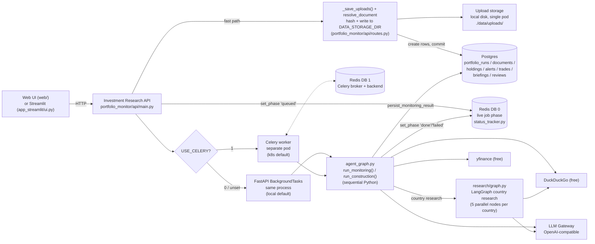
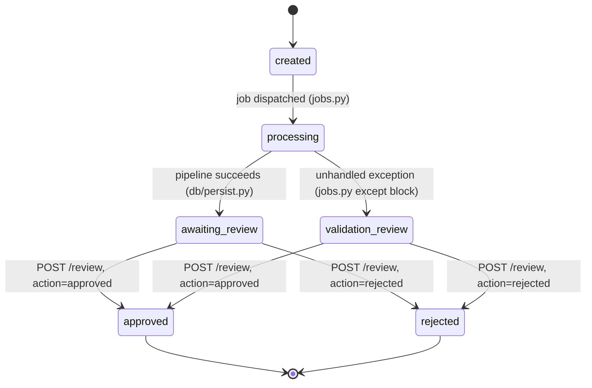
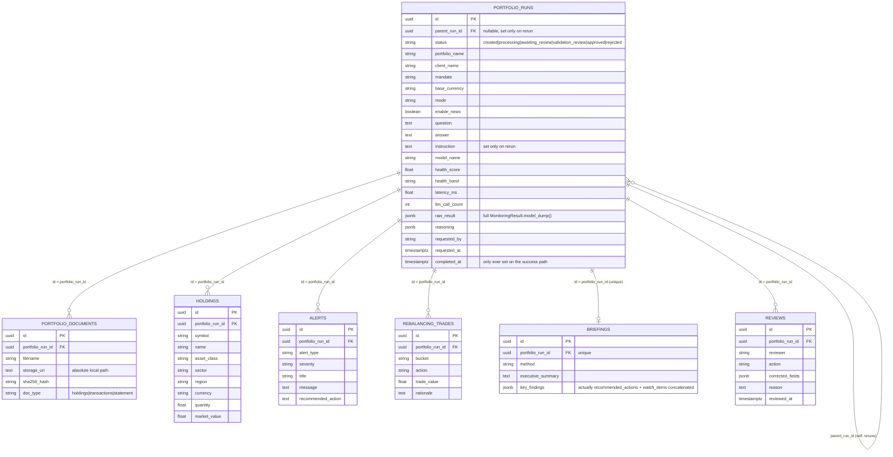

# Investment Research Copilot — Case Study (Interview Format)

> A mock case-study interview in which a candidate walks an interviewer through a
> production-style agentic AI system for portfolio monitoring and from-scratch portfolio
> construction. §§1–6 describe the business problem and requirements largely as originally
> written in `REQUIREMENTS.md` — a continuously-runnable monitoring and construction copilot
> for discretionary and advisory portfolios. **§7 (System Design) is a literal reference to
> this codebase** — the module, table, and endpoint names there are real (`portfolio_monitor/`,
> `web/`, `Dockerfile`, `k8s/`), and describe the system as it actually exists today: a FastAPI
> service backed by Postgres and Redis, with a dual-mode background-job dispatcher and a working
> Streamlit dev UI alongside the production web UI. Within §7, each claim is one of three things and is labeled when it
> isn't simply "live": **live** (matches the code as of this writing), **aspirational**
> (described as a design goal, not yet built — e.g. cloud storage migration), or **dead**
> (code exists — a DB table, a dependency, a file — but nothing in the running system
> writes to or exercises it). §7.4 also notes a handful of non-architectural issues
> (stale tests, config/manifest mismatches, a dead-code branch) found while verifying
> this section against the code.

---

## 1. Context & Business Narrative

**Interviewer:** Let's start broad. What problem were you actually solving, and who was it for?

**Candidate:** A portfolio manager or advisor answers two questions, over and over, for every account they run. First: "Is my portfolio still where it should be, and what should I do about it?" Markets move, so the asset mix drifts from plan, a position quietly grows too large, an expected dividend doesn't show up, volatility creeps past what the client signed up for, and bad news breaks on a name they hold. Catching all of that by hand, across many accounts, every day, is slow and error-prone. Second: "If I were starting today, what would I buy, and why?" Building a sensible portfolio from scratch for a given mandate, then being able to defend every holding to a client or an investment committee.

**Interviewer:** So what did you actually build?

**Candidate:** A tool that does both. You give it a portfolio as structured data — a holdings snapshot and a transactions ledger, a CSV/JSON export, not a document — pick the mandate, and it values every position from free live market data, tracks allocation and drift against the plan, proposes a rebalancing trade list, reconciles expected versus actual cash flow, computes risk metrics against limits, scans free public news for emerging risk on the largest holdings, and rolls all of that into prioritized alerts and a health score. Separately, it can construct a portfolio from scratch for a mandate — choosing securities from a universe fetched live from Yahoo Finance — in both a deterministic mode and an LLM-augmented mode, so the two can be compared side by side.

**Interviewer:** Why split it that way instead of just letting the model do the analysis?

**Candidate:** Because portfolio monitoring has to be reproducible and defensible in exactly the way investment research does. If a compliance reviewer asks why an alert fired, or why a trade was proposed, there has to be an exact, re-derivable number behind it — not a model's restated approximation. So the rule I held everywhere: the LLM does language work only — classify news, write the briefing, explain a construction, answer a question, transcribe a statement — and every decision-bearing number is deterministic Python. Allocation, drift, rebalancing sizing, cash-flow variance, every risk metric, every limit check, every alert severity, the health score, and every hard portfolio constraint. The same inputs always produce the same alerts and the same guardrailed portfolio.

**Interviewer:** And how is this different from what's already out there?

**Candidate:** Most portfolio tools are either pure calculators — they need clean, pre-normalized data and give you numbers with no narrative — or pure chat wrappers around an LLM that will happily explain a portfolio it's misread. What's missing is the combination: deterministic, auditable analytics feeding a language layer that's contractually forbidden from touching a number, plus a construction engine where an LLM's free-form security selection is passed through the exact same hard guardrails as the rules-based baseline, so it's structurally impossible for the LLM's picks to breach a constraint no matter what it proposes.

---

## 2. Business Requirement

**Interviewer:** From the business side, what was actually asked for?

**Candidate:** Five things, in `REQUIREMENTS.md`'s own language. Replace manual portfolio checking — turn a holdings file into a valued book, a drift-vs-policy view, a rebalancing plan, a cash-flow reconciliation, a risk dashboard, and a prioritized alert list, in seconds. Improve consistency of monitoring across managers and accounts, so the same portfolio raises the same alerts every time, independent of who's looking at it. Surface problems early and automatically — drift, concentration, limit breaches, income shortfalls, emerging news risk — so managers spend attention where the risk actually is. Produce defensible, explainable output, where every trade, alert, and constructed holding states its reason, ready for an investment-committee or compliance review. And accelerate portfolio construction with a reproducible deterministic baseline and an LLM advisor that can be compared side by side, both constrained by the same hard rules.

**Interviewer:** Who actually uses this day to day?

**Candidate:** Portfolio managers and financial advisors are the primary users — daily monitoring, rebalancing decisions, from-scratch construction, and explaining recommendations to clients across many accounts. Risk and compliance are secondary users, watching for limit breaches and concentration and relying on the audit trail from each alert back to its evidence and rule. The investment committee reviews constructed portfolios and rebalancing proposals with a stated rationale. Operations uses the cash-flow variance flags — missing dividends, unexpected outflows — to reconcile against the custodian.

**Interviewer:** How strict does the reproducibility guarantee actually need to be?

**Candidate:** Very strict, and it's the single most-repeated requirement in the spec. Given a fixed set of prices, monitoring has to be fully deterministic and re-run identically — same allocation, same drift, same rebalancing, same cash-flow variances, same risk metrics, same limit breaches, same alerts, same health score. Because the prices and news come from live free sources, the absolute numbers naturally move between runs as the market moves — that's expected — but nothing in the deterministic engine itself may introduce variance on top of that.

---

## 3. Requirements

**Interviewer:** Walk me through the functional requirements.

**Candidate:** Grouped the way the spec groups them:

- **Ingestion.** Accept a holdings snapshot and a transactions ledger as CSV or JSON, with flexible column-name matching (`ticker`/`symbol`, `qty`/`quantity`/`shares`, …); accept a mandate (conservative/balanced/growth/aggressive) that selects the target allocation, tolerance band, benchmark, and volatility ceiling. Optionally, when only a PDF brokerage statement is available, a grounded LLM extractor transcribes its holdings table into the same `Holding` records — numbers copied exactly as printed, never computed.
- **Market data.** For every held or candidate symbol, fetch a live price, a light classification (sector, market cap, dividend rate), and daily price history from free Yahoo Finance data — no API keys, no paid feed. Price priority is manual input, then market data, then a cost-basis fallback; an unpriceable position is flagged and excluded, and the fraction of market value that could be priced is reported as data coverage.
- **Allocation & drift.** Compute market value and weight by asset class, sector, region, currency, country, market cap, and position. Compare actual asset-class weights against the mandate's target allocation and tolerance bands, classify each sleeve as within-band, overweight, underweight, or breached, and propose a sized rebalancing trade — with a rationale — for every breached sleeve. Sleeves inside their band generate no trades, so there's no needless turnover.
- **Cash-flow variance.** Derive expected income per holding from the live dividend rate where available, else an assumed asset-class yield, and compare it to actual income from the ledger, classifying each as on-track, shortfall, excess, or missing, plus flags for unexpected flows.
- **Risk metrics & limits.** Compute annualized volatility, max drawdown, 1-day 95% historical VaR, beta and tracking error against the mandate benchmark, dividend yield, and concentration (HHI, effective N, top-1/top-5 weight), and check each against configured limits — single-name cap, sector cap, minimum cash, volatility ceiling, drawdown alert, VaR limit, tracking-error limit.
- **Emerging-risk news.** Build search queries for the largest holdings, the most-concentrated sectors, and the macro backdrop; collect free public results; have the LLM classify them into findings with a category, a severity, and an overall tone, grounded strictly in the collected snippets, with a deterministic keyword fallback if the LLM is unavailable.
- **Alerts & score.** Roll drift breaches, concentration, limit breaches, drawdown, cash-flow variances, emerging-risk findings, and data-quality issues into a prioritized alert list, each with a severity, evidence, and a recommended action, and fold the deterministic facts into a fixed-weight 0–100 risk score and a health band.
- **Construction.** Assemble a candidate universe live from Yahoo Finance; build a deterministic constructor that maps candidates to sleeves and weights within each sleeve by the chosen method; build an LLM-augmented constructor that freely selects securities and weights with a reason for each, grounded in the candidates' precomputed stats; pass both through the same hard guardrails — exclusions, single-name cap, sector cap, minimum position — so neither can breach a constraint; diff the two portfolios when both are run.
- **Briefing & Q&A.** Produce a deterministic templated briefing and/or a grounded LLM briefing that quotes the computed numbers and never recomputes them; answer natural-language questions only from the computed result.

**Interviewer:** And the non-functional side?

**Candidate:** This is the table I'd put in front of a reviewer, straight from `REQUIREMENTS.md`'s NFRs:

| Area | Requirement |
| --- | --- |
| Reproducibility | Identical inputs yield identical allocation, drift, rebalancing, cash-flow variances, risk metrics, alerts, and health score. All decision-bearing logic is deterministic Python with fixed weights and thresholds. |
| Grounding | The LLM sees only the computed facts, the collected news snippets, or the candidate stats — it is instructed to quote, not invent, and never to change a number, an alert, or the health band. |
| Hard-constraint safety | No LLM-proposed portfolio can violate a single-name cap, sector cap, exclusion, or minimum position — deterministic guardrails enforce them and record every correction. |
| Traceability | Every position links to a price source; every metric to its inputs; every alert to its evidence and recommended action. |
| Cost & openness | Market data and news use only free sources (`yfinance`, DuckDuckGo) with no API keys; the LLM targets a configurable OpenAI-compatible gateway. |
| Graceful degradation | Missing market data, missing news library, missing LLM gateway, or a missing ledger each degrade a feature without breaking the run; the fully deterministic, offline path always works. |
| Modularity | IPS targets, tolerance bands, risk limits, assumed yields, and the construction universe are config-driven (JSON via `*_PATH` env vars) and swap without touching the engine. |
| Security | No portfolio data leaves the customer boundary except the free market-data/news lookups; the LLM gateway is VPC-/on-prem-deployable; no trade execution. |

Reproducibility and grounding are the two I'd call load-bearing — nearly everything else in the design exists to satisfy those two, the same way explainability and data integrity anchor a document-extraction system.

---

## 4. Data Requirement

**Interviewer:** What actually feeds this system?

**Candidate:** Three broad categories.

**Interviewer:** Start with what the user actually uploads.

**Candidate:**

| Data point | Why it's needed |
| --- | --- |
| Holdings snapshot (CSV/JSON) | Per position: symbol, asset class, sector, region, currency, quantity, cost basis, optional manual price — the book being monitored. |
| Transactions / cash-flow ledger (CSV/JSON) | Per entry: date, type (dividend/coupon/interest/contribution/withdrawal/fee/tax/trade), symbol, signed amount — the actual income and flows to reconcile against. |
| Mandate | Conservative/balanced/growth/aggressive — selects the target allocation, tolerance band, benchmark, and volatility ceiling. |
| Optional PDF brokerage statement | Falls back through a grounded LLM transcription into the same `Holding` records when a structured export isn't available; text PDFs only, no OCR. |

**Interviewer:** And the data the system fetches on its own?

**Candidate:** Live market data from `yfinance` — price, sector, market cap, dividend rate, and daily close-price history for every held or candidate symbol — and free public news from DuckDuckGo for the emerging-risk scan, built from queries around the largest holdings, the most-concentrated sectors, and the macro/geopolitical backdrop.

**Interviewer:** What about reference data that isn't specific to one portfolio?

**Candidate:** The Investment Policy Statement targets and tolerance bands per mandate, the risk-limit thresholds, the assumed asset-class yields used when a live dividend rate isn't available, and the curated construction universe — the seed pool of candidate securities by country and style. All of it ships with illustrative defaults so the system runs out of the box, and is meant to be pointed at a firm's real policy documents via the `IPS_TARGETS_PATH`/`RISK_LIMITS_PATH` environment variables in production, without touching the engine logic.

---

## 5. Agentic AI Solution

**Interviewer:** What's the one-sentence version of the design?

**Candidate:** The LLM reads language and exercises selection judgement; deterministic Python computes, checks, and enforces every number. I held that line everywhere — nothing an LLM produces crosses into the calculation path untouched; it's either transcription of a printed number, classification of unstructured text, or a security-and-weight proposal that gets re-priced and re-checked by the same code path a purely deterministic run would use.

**Interviewer:** Before we go further — I noticed there's a module called `agent_graph.py`. Is that an actual LangGraph agent?

**Candidate:** No, and I'd rather say that plainly than let the name imply something it isn't. `agent_graph.py` imports `langchain_core.messages` and, indirectly through `config.py`, `langchain_openai.ChatOpenAI` as a thin client wrapper around an OpenAI-compatible gateway — but there's no `langgraph` import anywhere in `agent_graph.py`, no `StateGraph`, no nodes-and-edges graph. `run_monitoring` and `run_construction` are plain, sequential Python function calls. The name is aspirational or left over from an earlier design; the orchestration itself is exactly as easy to read as that implies — a fixed pipeline, not an agent loop deciding its own next step.

However, `research/graph.py` **does** use LangGraph for the country-research feature — a real `StateGraph` with 5 parallel analysis nodes per country, using LangGraph's `Send` primitive for concurrent country research. This is the only place in the codebase where LangGraph is actually used, and it's properly documented as such. The main monitoring and construction pipelines remain sequential Python functions.

**Interviewer:** Walk me through what actually happens when someone monitors a portfolio.

**Candidate:** `ingest.py` loads the holdings and transactions from CSV/JSON — or, if a statement path was given instead, `statement_extract.py` calls the LLM once to transcribe a PDF's holdings table, explicitly instructed to copy `quantity`, `price`, and `market_value` exactly as printed and never compute, sum, infer, or rescale them. From there the pipeline is a straight sequential chain, all in `agent_graph.py::assess_portfolio`: `allocation.price_holdings` prices every position (manual price, then market data, then cost basis, then flagged as missing), `allocation.compute_allocation` builds the full breakdown, `drift.compute_drift` classifies each sleeve against the mandate's bands and `drift.build_rebalance_plan` sizes the trades to fix any breach, `cashflow.analyse_cash_flows` reconciles expected against actual income, and `risk.compute_risk_metrics` plus `risk.check_limits` compute volatility, VaR, beta, tracking error, and concentration and check them against limits. Optionally `osint.scan.run_risk_scan` collects and classifies emerging-risk news. Then `alerts.build_alerts` and `scoring.score_portfolio` both consume all of the above — including the news scan — to produce the prioritized alert list and the 0–100 health score. Finally `monitor/deterministic.py` builds a templated briefing from the facts and, if the LLM is available, `monitor/llm_briefing.py` builds a second, grounded one from the same facts.

**Interviewer:** And construction — how does an LLM get to freely pick securities without being able to break a rule?

**Candidate:** `universe.build_universe` assembles the candidate pool from the curated country/style tables in `reference.py`, enriched live from `yfinance` with price, sector, market cap, dividend yield, and history-derived volatility and expected return — so every candidate arrives with precomputed stats, not raw price series. `construct/deterministic.py` builds a rules-based book: it sets sleeve targets from the mandate (or an explicit equity/debt override), selects names by style, cap mix, and country with sector-diversity guarantees, ranks by historical expected return, and weights within each sleeve by the chosen method. `construct/llm_advisor.py` builds the alternative: the LLM receives a digest of each candidate — symbol, sector, region, volatility, dividend yield, whether it has live price data, and its news-risk tone — and is told explicitly, "use ONLY the supplied candidates and their stats — do not invent tickers or numbers." It replies with a list of `{symbol, weight, reason}` and a narrative. That reply is not trusted as-is: `llm_advisor.py` first filters to symbols that actually exist in the fetched universe, dropping anything invented, and then both constructors — deterministic and LLM — pass their weights through the exact same `construct/guardrails.py`.

**Interviewer:** What does that guardrail layer actually enforce?

**Candidate:** Reading it directly: it drops excluded symbols and sectors first, then drops any position below the minimum size and renormalizes. It enforces the single-name cap by iterative water-filling — redistributing a capped name's excess weight only to names still under the cap, up to 200 iterations, and if that's not feasible, every name simply sits at the cap and the residual becomes cash. It enforces the sector cap by scaling an over-cap sector's members down proportionally and redistributing the freed weight elsewhere. Name-cap and sector-cap enforcement alternate for up to 50 iterations until nothing changes. Every correction it makes is recorded as a human-readable string that ends up in `ConstructedPortfolio.guardrail_corrections` — so a reviewer can see exactly what the LLM proposed versus what it was allowed to keep. Critically, share counts, dollar amounts, and every expected risk metric are always recomputed deterministically from the candidates' live prices and history afterward — never taken from the LLM. The LLM's only real degree of freedom is which names to include and the weight proportions between them, both hard-clamped by this layer.

**Interviewer:** Where else does the design distrust an LLM output by default?

**Candidate:** Everywhere the emerging-risk news scan feeds into something else, there's a consistent "credibility discount": public news can influence an alert or the health score, but it can never dominate one. `alerts.py` explicitly downgrades any `HIGH`-severity news finding to `MEDIUM` before it becomes an alert; `scoring.py` independently caps the emerging-risk factor's severity at `"medium"` when it computes the health score — the same rule enforced twice, in two different modules, rather than relied on once. The feasibility check — whether an investor's return target is realistic — is explicitly documented as having no LLM path at all; the LLM only rephrases the verdict in the briefing. And the grounded LLM briefing and Q&A modules are told, in the system prompt, that the snapshot they're given is authoritative and they must not recompute, reweight, or invent a different health band — which is easier to hold to structurally than it sounds, because the JSON schema they're asked to return is entirely string and string-list fields; there's no numeric field for the model to alter even if it tried.

**Interviewer:** Is any of that validated after the fact, or is it trust-by-instruction?

**Candidate:** Mostly trust-by-instruction, and I'd rather be upfront about that than overstate it. The one place there's a structural, code-level check rather than just a prompt — beyond the guardrails' ticker whitelist — is that construction's numeric outputs are always recomputed from real data, never taken from the model's text. But nothing cross-checks an LLM briefing's prose against the JSON snapshot it was given — there's no regex extraction of quoted figures compared back to the source numbers, the way a citation-validation layer would work in a document-extraction pipeline. Same for the per-security pros/cons in `construct/annotate.py`: the prompt says "do not invent facts or numbers not implied by the inputs," but nothing downstream verifies that. That's a real, named gap, not a design I'd defend as complete — see "What's still incomplete."

---

## 6. Business and Technical Metrics

**Interviewer:** How would you know this was working, from the business side?

**Candidate:**

| Metric | Why it matters |
| --- | --- |
| Time-to-monitor | Holdings file to full alerted assessment, before vs. after. |
| Breach-catch rate | % of true allocation/limit breaches surfaced vs. a manual review. |
| Alert precision | % of raised alerts a manager confirms as actionable — the alert-fatigue guard. |
| Rebalancing adoption | % of proposed rebalancing plans accepted with only minor edits. |
| Cash-flow exception hit rate | % of flagged income variances confirmed genuine (missing dividend, fee error, unauthorized flow). |
| Construction acceptance | % of constructed portfolios accepted or lightly edited. |

**Interviewer:** And on the engineering side?

**Candidate:**

| Metric | Why it matters |
| --- | --- |
| Monitoring reproducibility | Identical alerts and score on re-run with the same prices — must be 100% given fixed market data. |
| Constraint-safety | Zero hard-constraint violations in any constructed portfolio, including LLM-proposed ones. |
| Valuation / data coverage | Fraction of market value successfully priced with usable history. |
| Risk-metric accuracy | Computed volatility/VaR/beta vs. an independent calculation. |
| Drift / rebalancing correctness | Sleeve classification and trade sizing vs. hand calculation. |
| Grounding / hallucination rate | Briefing or Q&A claims that contradict or invent a computed fact — target zero. |
| News disambiguation precision | % of emerging-risk findings confirmed relevant to the held name — guards same-name false positives (a "Delta" the airline vs. "Delta" the fund). |
| System health | Latency, error rate, free-source availability, LLM-call count. |

**Interviewer:** If you had to watch one metric most closely?

**Candidate:** Monitoring reproducibility. A slightly lower news-disambiguation precision just means a manager dismisses one extra alert. But if the same portfolio, run twice against the same prices, ever produces a different drift classification or a different alert, that's not a quality slip — it undermines the entire premise that this is a system compliance can rely on instead of a spreadsheet.

---

## 7. System Design

### 7.1 High-Level Design

**Interviewer:** Sketch the architecture.

**Candidate:** One FastAPI service (`portfolio_monitor/api/main.py`) is the backend. It mounts the vanilla-JS `web/` directory as static files at the app root — same origin, no separate frontend deployment — provided that directory exists; if it doesn't, the app logs a warning and serves API routes only. Unlike some sibling projects in this book, the Streamlit UI here (`app_streamlit/ui.py`) is real and current, not a stale leftover — the Makefile's `run-streamlit` target actually works, and the Dockerfile comment explicitly calls Streamlit out as "a separate, unchanged local dev tool" deliberately excluded from the production container image, which only bakes in the FastAPI backend and `web/`.

The distinctive architectural decision is how a long-running job is dispatched. `POST /portfolios` always does the fast, synchronous part — save the uploads to disk, hash them, create the `PortfolioRun` and `PortfolioDocument` rows, commit, mark the Redis phase `"queued"` — and returns 202 in well under a second. What runs the actual pipeline is chosen by one environment variable, `USE_CELERY`: if it's unset or falsy, the job runs via FastAPI's own `BackgroundTasks`, in the same process, same pod, as the request that created it. If `USE_CELERY=1`, the identical job function is instead handed to a real Celery worker over Redis, running as a distinct deployment. Locally, `.env.example` ships `USE_CELERY=0` — the default developer experience is in-process. In Kubernetes, `k8s/configmap.yaml` ships `USE_CELERY: "1"` and `k8s/celery-worker.yaml` deploys the worker — the production target is the real queue. This is exactly the FastAPI-`BackgroundTasks`-versus-real-queue trade-off you'd expect a reviewer to probe: `BackgroundTasks` don't survive a process restart mid-job (a comment in `celery_app.py` says as much), so the in-process mode is fine for local iteration but not for anything that needs to keep running across a redeploy — which is precisely why the Kubernetes manifests flip the switch.

Job progress itself is tracked in Redis independently of Celery's own result backend — `status_tracker.py` writes a JSON `{phase, detail, updated_at}` blob to a per-run key with a one-hour TTL, and `GET /portfolios/{id}/status` reads that key first, falling back to the Postgres row only once the phase reaches a terminal state. Two separate Redis logical databases are in play: DB 0 for this live-phase tracking, DB 1 (`CELERY_REDIS_DB`) for Celery's broker and result backend — so a developer inspecting Redis for job status and a developer inspecting it for Celery internals are looking at different keyspaces on purpose.

The system uses LangGraph for one specific feature: country research in `research/graph.py`. This is a real `StateGraph` with 5 parallel analysis nodes per country (geopolitical, sectoral, bond risk, FD rates, market risk), using LangGraph's `Send` primitive for concurrent country research. The main monitoring and construction pipelines in `agent_graph.py` remain sequential Python functions, not LangGraph graphs — the `langgraph` dependency in `pyproject.toml` is properly used only in the research module.

**Interviewer:** Why does the accept step need to be fast, concretely?

**Candidate:** The pipeline can call the LLM several times (news classification, the LLM briefing, the LLM constructor, per-security annotation) and fetches live market data and news over the network for every held or candidate symbol — easily tens of seconds, sometimes longer. Holding one HTTP connection open for that is exactly what a browser's idle-connection timeout and any reverse proxy in front of the service are built to kill. Splitting accept from execute means the client polls `GET /portfolios/{id}/status` instead — no single request has to survive longer than one poll tick, regardless of how long the underlying job actually takes.

### 7.2 Low-Level Design

**Interviewer:** Break the system into its real modules.

**Candidate:** There are genuinely two pipelines sharing a common deterministic core, plus the API/persistence layer wrapping both.

| Module | Real file(s) | Responsibility |
| --- | --- | --- |
| Web UI | `web/index.html`, `web/js/*.js` | Upload form, mandate/mode selectors, status polling, Q&A, review — one HTTP client of the API. |
| Streamlit UI | `app_streamlit/ui.py` | A working, current local dev UI — task (Monitor/Construct) × mode (Deterministic/LLM/Both); not part of the container image. |
| API | `portfolio_monitor/api/main.py`, `routes.py`, `schemas.py`, `exceptions.py` | Uploads, dispatch, all reads/writes, the two custom exception types. |
| Job dispatch | `portfolio_monitor/jobs.py`, `celery_app.py`, `tasks.py` | `celery_enabled()` gate; `execute_monitoring_job` (shared by both dispatch paths); one Celery task, `portfolio_monitor.run_monitoring`, with 2 retries at 30s. |
| Live status | `portfolio_monitor/status_tracker.py` | Redis-backed phase tracking, independent of Postgres and of Celery's own backend; degrades to a permanent no-op if Redis is ever unreachable. |
| Persistence | `portfolio_monitor/db/models.py`, `persist.py`, `session.py` | 7 tables (below); `init_schema()` = `create_all()`, no migrations. |
| Ingestion | `portfolio_monitor/ingest.py` | Deterministic CSV/JSON loading with tolerant column aliasing. No LLM. |
| Statement fallback | `portfolio_monitor/statement_extract.py` | LLM transcribes a PDF statement's holdings table verbatim — no computation. |
| Market data | `portfolio_monitor/marketdata.py` | Free `yfinance` quotes + history, fails soft, per-process cache. |
| Analytics primitives | `portfolio_monitor/analytics.py` | Pure NumPy: returns, vol, drawdown, VaR, beta, tracking error, HHI. No LLM, no network. |
| Allocation / drift / cashflow / risk / alerts / scoring | `allocation.py`, `drift.py`, `cashflow.py`, `risk.py`, `alerts.py`, `scoring.py` | The deterministic monitoring core — see §5. All no-LLM. |
| Emerging-risk scan | `osint/search.py`, `collect.py`, `scan.py` | Free DuckDuckGo news, LLM-classified with a real deterministic keyword fallback; `search.web_search` exists but is dead code — nothing calls it. |
| Country research | `research/graph.py`, `research/nodes.py`, `research/collect.py` | **live** — Real LangGraph `StateGraph` with 5 parallel analysis nodes per country (geopolitical, sectoral, bond risk, FD rates, market risk). This is the only actual LangGraph usage in the codebase. |
| Construction universe | `universe.py` | Live-enriched candidate pool from curated seed tables in `reference.py`. |
| Construction (deterministic) | `construct/deterministic.py` | Rules-based constructor + `feasibility.py`. No LLM. |
| Construction (LLM) | `construct/llm_advisor.py` | Free-form LLM security/weight proposal, ticker-whitelisted, then guardrailed identically to the deterministic path. |
| Guardrails | `construct/guardrails.py` | The single hard-constraint gate both constructors pass through — see §5. |
| Comparison | `compare.py` | Diffs deterministic vs. LLM books — sleeve deltas, name-overlap Jaccard, metric deltas. |
| Briefing | `monitor/deterministic.py`, `monitor/llm_briefing.py` | Templated vs. grounded-LLM briefing and Q&A over the same `MonitoringResult`. |
| Orchestration | `portfolio_monitor/agent_graph.py` | Sequential Python exposing `run_monitoring`, `run_construction`, and a CLI. **Not LangGraph** — despite the name, this is plain sequential function calls; the real LangGraph is in `research/graph.py`. |
| Reference data | `portfolio_monitor/reference.py` | IPS targets, tolerance bands, risk limits, assumed yields, construction universe seed — env-overridable via `*_PATH`. |
| **Post-hoc grounding validation** | *(not built)* | Nothing cross-checks LLM prose (briefing, Q&A, pros/cons, construction rationale) against the JSON snapshot it was given. Trust rests on the prompt instruction alone. See "What's still incomplete." |

**Interviewer:** How does a portfolio run move through its lifecycle?

**Candidate:**

These are the literal values written to `PortfolioRun.status`. One thing worth naming plainly: there is no status literally called `"failed"` in the Postgres column — a pipeline exception lands the row in `"validation_review"`, a name that reads like a normal human review step rather than an error state. `"failed"` only exists as a Redis *phase* string (`status_tracker.set_phase(run_id, "failed", ...)`), which is a different, TTL'd, non-authoritative channel. A `POST /review` with `action="corrected"` inserts a `ReviewRow` but leaves `status` untouched — only `"approved"`/`"rejected"` transition it, per the `_TERMINAL_REVIEW_STATUS` mapping in `routes.py`.

### 7.3 Database Schema — Full Reference

**Interviewer:** Every table, every column, exactly when it's written.

**Candidate:** This is Postgres only — `db/session.py` builds a `postgresql+psycopg://` URL and there's no SQLite path anywhere. Schema creation is `Base.metadata.create_all()` on API startup, via a `lifespan` handler — there's no Alembic or other migration tooling in the repo.

#### Entity-relationship shape

`portfolio_runs` is the audit anchor every other table hangs off of, all via `cascade="all, delete-orphan"`. Every child row carries `portfolio_run_id` and nothing else ties them together — a holding, an alert, and a rebalancing trade from the same run share no identity beyond that foreign key, which is fine because none of them are ever queried independent of a run.

#### Notable column-level behavior

- **`portfolio_runs.status`** is written at four distinct points: `"created"` at insert (`routes.py`), `"processing"` when the job starts (`jobs.py`), `"awaiting_review"` or `"validation_review"` when the job finishes (`db/persist.py` / `jobs.py`'s except block), and `"approved"`/`"rejected"` from `POST /review`.
- **`completed_at`** is set only inside `persist_monitoring_result`'s success path (`run.completed_at = run.completed_at or datetime.now(timezone.utc)`). The failure branch in `jobs.py` never touches it — a run stuck in `"validation_review"` has `completed_at = NULL` forever, so any consumer that treats "`completed_at` is set" as "this run is finished" will misclassify every failed run as still open.
- **`briefings.key_findings`** is a `jsonb` column whose name promises the briefing's key findings, but `db/persist.py` actually writes `briefing.recommended_actions + briefing.watch_items` into it — a naming mismatch between the column and what it actually holds.
- **`briefings.portfolio_run_id`** declares `unique=True` on the column *and* a separate `UniqueConstraint("portfolio_run_id", ...)` in `__table_args__` — the same guarantee stated twice; harmless, but one of the two is dead weight.
- No table has an explicit secondary `Index(...)` beyond the implicit primary-key index — notably, nothing indexes `portfolio_runs.status` or `requested_at`, despite `GET /portfolios` sorting by `requested_at desc` unconditionally.

#### The write timeline

**`POST /portfolios`:**

| # | What runs | Table(s) touched | Committed? |
| - | --- | --- | --- |
| 1 | `_save_uploads()` writes each file to `DATA_STORAGE_DIR`, hashes it | — (disk only) | — |
| 2 | Route creates `PortfolioRun(status="created")`, calls `persist_documents()` for each saved file | `portfolio_runs` INSERT, `portfolio_documents` INSERT ×N | Yes — before the response is returned |
| 3 | `set_phase(run.id, "queued")`; `_schedule_job()` dispatches via Celery or `BackgroundTasks` | — (Redis only) | — |
| 4 | *(response sent: 202, `PortfolioResponse`)* | — | — |
| 5 | `execute_monitoring_job`: loads the run, sets `status="processing"` and `model_name` | `portfolio_runs` UPDATE | Yes, immediately |
| 6 | `set_phase(..., "ingesting_holdings")`; `run_monitoring(...)` executes the full pipeline | *(reads only)* | — |
| 7 | `set_phase(..., "persisting_results")`; `persist_monitoring_result(...)` | `holdings` INSERT ×N, `alerts` INSERT ×N, `rebalancing_trades` INSERT ×N, `briefings` INSERT ×(0 or 1), `portfolio_runs` UPDATE (`status="awaiting_review"`, `health_score`, `health_band`, `raw_result`, `completed_at`, …) | Yes — one commit |
| 8 | `set_phase(..., "done")` | — (Redis) | — |

On any unhandled exception in step 6 or 7: `jobs.py`'s except block re-fetches the run, sets `status="validation_review"`, `set_phase(..., "failed")`, and commits — with a bare `session.rollback()` and no re-raise if *that* itself fails, so a truly pathological failure just goes silent from an operational standpoint.

**Interviewer:** What does the UI actually call?

**Candidate:**

| Endpoint | Operation |
| --- | --- |
| `GET /health` | Liveness/readiness probe target — returns `{"status": "ok"}`. |
| `GET /portfolios` | Every run, newest first — no pagination. |
| `POST /portfolios` | Multipart upload (holdings/transactions/statement files + mandate/mode/etc. as form fields); 202, dispatches the job. |
| `GET /portfolios/{id}` | Full `PortfolioResponse` — status, metrics, `raw_result`, documents. |
| `GET /portfolios/{id}/status` | Cheap poll target — Redis phase preferred over the DB row while the phase is non-terminal. |
| `POST /portfolios/{id}/rerun` | New `PortfolioRun` with `parent_run_id` set, re-links the parent's stored documents, re-dispatches. |
| `POST /portfolios/{id}/question` | Q&A over the stored `raw_result` via `monitor/llm_briefing.answer_question`; 409 if the run has no result yet. |
| `POST /portfolios/{id}/review` | Records a reviewer action; `approved`/`rejected` also update `status`. |
| `GET /portfolios/{id}/audit` | Dumps documents/holdings/alerts/reviews for the run. |

**Interviewer:** What's automated in CI/CD and deployment?

**Candidate:** `.github/workflows/ci-cd.yml` is real and runs on every push. One `quality` job installs dependencies, runs `ruff check`/`ruff format --check`, runs `bandit -r portfolio_monitor/`, and runs `pytest tests/ -v` — lint, security, and tests combined into a single job, unlike some sibling projects in this book that split them. `build-and-push` runs after `quality` succeeds on `main`, logs into GHCR with the built-in token, and pushes the image tagged with both the commit SHA and `latest`. `deploy` runs after that, gated behind a `KUBE_CONFIG` secret that isn't set yet — it checks for the secret and either applies `k8s/configmap.yaml`, `service.yaml`, and `celery-worker.yaml` and rolls out both the API and worker deployments, or skips cleanly with an explanatory message.

The Kubernetes manifests describe two deployments — `investment-research-api` and `investment-research-worker` — both pinned to `replicas: 1`. The API's `deployment.yaml` is explicit about why: uploads land on the pod's local disk (`DATA_STORAGE_DIR`), so a second replica, or even a rolling pod replacement, would not see data an earlier pod received; scaling out today would silently lose uploads that land on the wrong pod. The worker deployment runs `celery -A portfolio_monitor.celery_app worker`. Both read the same `ConfigMap`/`Secret` pair, which — importantly — use the correctly-named `PG_HOST`/`REDIS_HOST` variables that the actual code reads (see "What's still incomplete" for where the local `.env.example` gets this wrong).

**Interviewer:** And the local dev workflow?

**Candidate:** The Makefile: `make install`, `make test`, `make lint`/`lint-fix`, `make security`, `make build`, `make run` (uvicorn with `--reload`), `make run-worker` (the Celery worker, requires Redis), `make run-streamlit` (the working Streamlit UI), `make init-db` (calls `init_schema()` directly), `make clean`. `pyproject.toml` configures `ruff` (target `py312`, line length 100) and `pytest` (auto asyncio mode, `tests/` as the only test path).

### 7.4 What's Still Incomplete (Implementation Gaps)

**Interviewer:** Being honest about it — what would you flag?

**Candidate:** More than I'd like, and in a couple of cases it's a real functional bug rather than a design gap. In rough priority order:

1. **`.env.example` documents Postgres/Redis variable names the code doesn't actually read — a reproducible onboarding bug, not a style nit.** The real Postgres connection (`db/session.py::_database_url()`) reads `PG_HOST`, `PG_PORT`, `PG_USER`, `PG_PASSWORD`, `PG_DATABASE`; the real Redis connections (`status_tracker.py`, `celery_app.py`) read `REDIS_HOST`, `REDIS_PORT`. `.env.example` instead documents `PGHOST`, `PGPORT`, `PGUSER`, `PGPASSWORD`, `PGDATABASE` and `REDISHOST`, `REDISPORT` — no underscore. A developer who copies `.env.example` to `.env` and fills those in exactly as written will connect to none of it; the app silently falls through to `db/session.py`'s own hard-coded defaults instead. Worse, one of those hard-coded defaults is a live-looking fallback password: `os.getenv("PG_PASSWORD", "7194")`, matching `.env.example`'s own `PGPASSWORD=7194` — so the wrong-named env var and the hard-coded default happen to agree, masking the mismatch until a deployment actually changes the password and nothing picks it up. The `k8s/` manifests get the names right (`PG_HOST`, `REDIS_HOST`); it's specifically the local-dev template that's stale.

2. **The API's own test suite doesn't match the API.** All three tests in `tests/test_api.py` target an imagined earlier version of the service: `test_health_check` asserts `{"status": "healthy", "timestamp": ...}`, but the real `/health` returns `{"status": "ok"}` with no timestamp field at all. `test_create_portfolio` and the two tests built on it POST a JSON body (`{"portfolio_name": ..., "description": ...}`) to an endpoint that only accepts `multipart/form-data` — `description` isn't even one of the real form fields — and expects HTTP 200, while the real endpoint returns 202 and requires at least one holdings file or a statement file or it 500s (see #3). Every assertion in this file would fail against the real app; `tests/test_scoring.py` and `tests/test_monitoring.py` weren't checked as part of this pass but the API layer's coverage is effectively zero despite the file existing.

3. **A client error is reported as a server error.** `create_portfolio` raises a bare `ValueError("Upload a holdings CSV/JSON or a PDF brokerage statement.")` when neither was provided. That's not one of the two custom exception types with a registered handler, so it falls into the catch-all `Exception` handler and comes back as HTTP 500 with `"Internal error processing the request."` — hiding a legitimate 400-class input validation failure behind a message that reads like a server bug.

4. **Failed runs are invisible to anything that checks `completed_at` or expects the word "failed."** As covered in §7.3, a pipeline exception sets `status="validation_review"` — a name that reads like a pending human step, not an error — and never sets `completed_at`. There is no DB status literally spelled `"failed"`; that word only exists as a non-authoritative, TTL'd Redis phase string. A dashboard built naively against the Postgres rows would show every failed run as perpetually in-progress.

5. **Document storage is local disk on a single, unreplicated pod — acknowledged in the k8s manifest, but with a real downstream consequence.** `_save_uploads()` writes to `DATA_STORAGE_DIR` with no object-storage abstraction, and `replicas: 1` is set deliberately for exactly that reason. The concrete failure mode: `POST /portfolios/{id}/rerun` re-reads the original files from their stored absolute paths (`persist_documents(session, new_run.id, [doc.storage_uri], ...)`) — if that upload directory was ever cleaned up, a rerun of an old portfolio throws a bare `FileNotFoundError` deep inside persistence code, not a clean 404.

6. **No authentication or authorization anywhere.** No `Depends()` security scheme on any route. `requested_by` and `reviewer` are free-text strings supplied by the caller with no verification — anyone who can reach the API can create runs, ask questions, or approve/reject someone else's portfolio review.

7. **`GET /portfolios/{id}/status` can report `"processing"` for an ID that was never actually created.** It checks Redis first and returns early whenever the phase is non-terminal, without ever confirming the row exists in Postgres — so a stale or guessed Redis key from an unrelated run can make a bogus portfolio ID look like a real, in-flight job instead of returning 404.

8. **A Redis outage degrades status tracking permanently for the life of the process, not just for the outage's duration.** `status_tracker.py` sets a module-level `_unavailable = True` the first time `client.ping()` fails and never clears it — there's no retry or backoff to notice Redis coming back. The comment calls this "graceful degradation," but it degrades in one direction only.

9. **`ReviewRequest.action` is documented but not enforced.** The docstring says "One of: approved | corrected | rejected," but the field is a plain `str` with no `Literal`/enum/validator — the API will accept and persist any string into `reviews.action`, and only the two specific strings `"approved"`/`"rejected"` are recognized by `_TERMINAL_REVIEW_STATUS` for the status transition; anything else silently inserts a review row with no status effect.

10. **`agent_graph.py`'s name overstates what it is.** As covered in §5, there's no LangGraph anywhere in `agent_graph.py` — it's sequential Python function calls. Not a functional bug, but worth naming precisely rather than letting the filename imply an agent loop that isn't there. The real LangGraph usage is in `research/graph.py` for country research.

11. **A couple of smaller loose ends worth naming rather than hiding:** `osint/search.web_search` is fully implemented but never called by anything — dead code, likely aspirational for a future general web-search capability beyond DuckDuckGo news. `reference.py`'s own module docstring advertises a third `*_PATH` override, `UNIVERSE_SEED_PATH`, alongside the two that are actually wired up (`IPS_TARGETS_PATH`, `RISK_LIMITS_PATH`) — grepping the module shows it was never implemented. And `config.py::setup_ssl_certificate()` makes an undisclosed network call to a hard-coded, vendor-specific URL (`ca-certificates.factset.io`) as a side effect of simply importing `portfolio_monitor.config`, wrapped in a silent try/except — harmless in practice since it fails soft, but a surprising thing for an import statement to do, and specific to one vendor's infrastructure in an otherwise generic module.

12. **`config.py`'s module docstring says "No secrets are hard-coded" — that's not accurate.** The `Config` dataclass has literal hardcoded default values for the LLM gateway API key and the Postgres password (not reproduced here). They only take effect when the corresponding environment variable is unset, but a hardcoded fallback secret in source control is exactly the pattern the docstring claims doesn't exist. Worth rotating and removing outright, independent of anything else in this document.

None of these are disagreements with the design — every one of the deterministic/LLM boundary decisions in §5 held up under this level of scrutiny. They're the actual distance between "the architecture is right" and "the implementation fully matches it," and that distance is worth stating precisely rather than letting it surface later as a surprise in an audit or an incident.

---

## 8. What's Still Incomplete (Business Roadmap)

**Interviewer:** What would you prioritize if you had to extend this system?

**Candidate:**

1. **Cloud Storage Migration**: The current local file storage works for development but should be migrated to S3 or ADLS for production scalability and reliability, enabling proper horizontal scaling beyond `replicas: 1`.
2. **Authentication & Authorization**: Add enterprise SSO integration and role-based access control to secure the API endpoints and ensure proper attribution of `requested_by` and `reviewer` fields.
3. **Real-time Status Updates**: The current status polling works but WebSocket-based push notifications would provide a better user experience for long-running jobs.
4. **Advanced Analytics**: Trend analysis across portfolio runs, risk pattern identification, and regulatory reporting capabilities.
5. **Enhanced News Sources**: Integration with premium news APIs and better disambiguation for same-name companies across different sectors.
6. **Expanded Construction Universe**: More sophisticated candidate universe management with style-aware filtering and better coverage across global markets.
7. **Post-hoc Grounding Validation**: Automated verification that LLM-generated prose (briefings, Q&A, pros/cons) matches the computed facts it was given, rather than relying solely on prompt instructions.

---

## 9. Summary

**Interviewer:** If you had to summarize this system in three sentences, what would you say?

**Candidate:** It's an investment research copilot that combines deterministic portfolio analytics with LLM-powered language capabilities to provide continuous monitoring, alerts, and from-scratch portfolio construction. The system maintains strict separation between decision-bearing calculations (allocation, drift, risk metrics, limit checks) and language work (news classification, briefings, construction rationale), ensuring reproducibility and auditability while leveraging AI for narrative and explanation. By supporting both rules-based and LLM-augmented construction modes with identical hard guardrails, it enables comparison between deterministic and AI-driven approaches without compromising on constraints or regulatory requirements.
