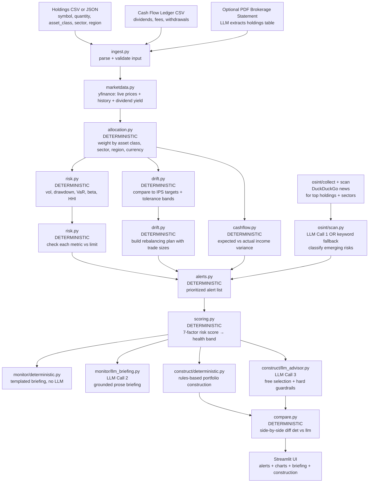
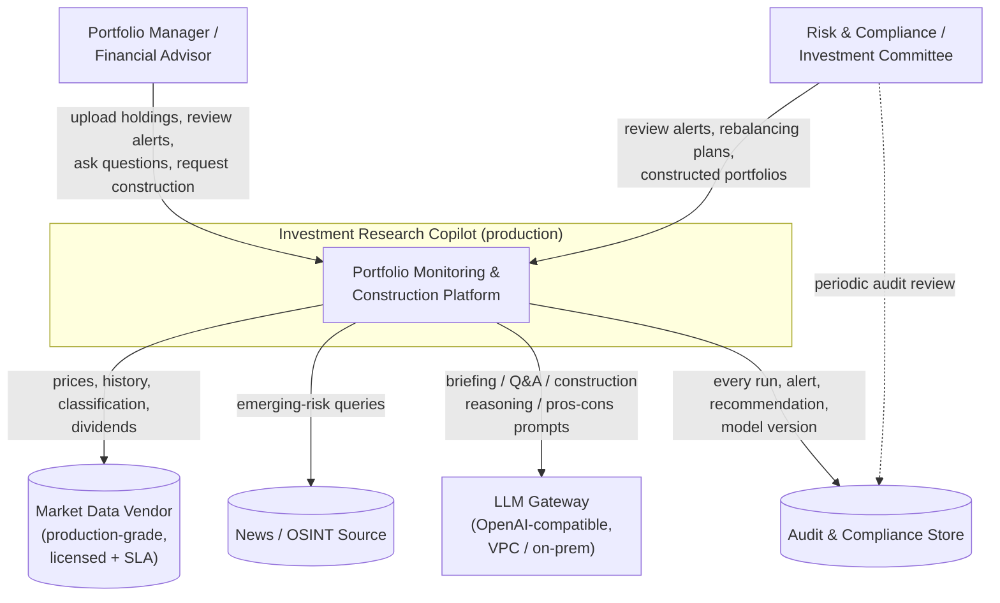
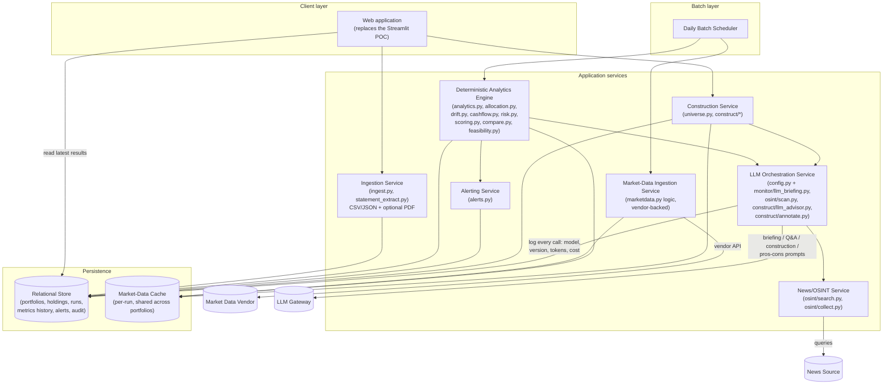
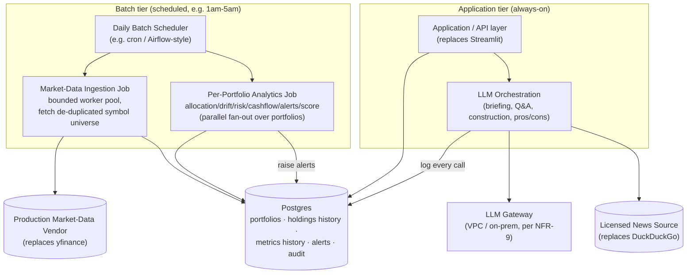
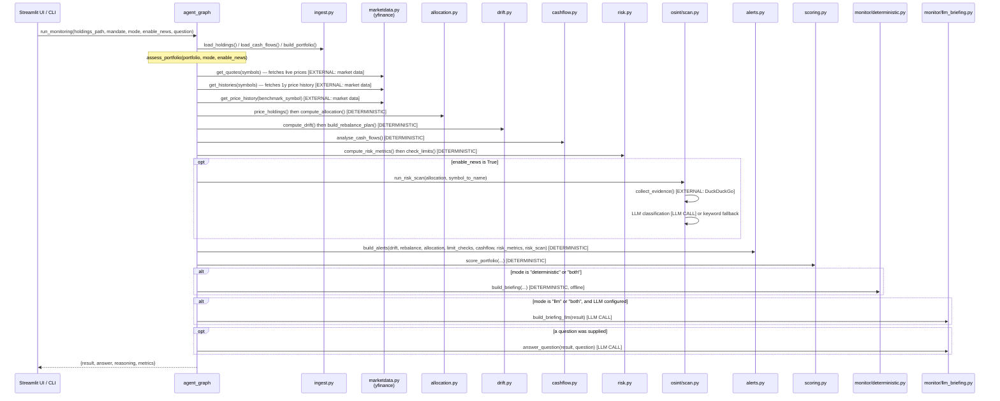

# Investment Research Copilot — Complete Documentation

## What This Project Does (Plain English)

A portfolio manager at a wealth management firm or family office manages a basket of investments on behalf of clients. Their daily job involves:

1. **Monitoring**: Are the client's investments drifting away from the agreed allocation? Is equities at 80% when the agreed limit is 60–70%?
2. **Risk-checking**: Has volatility spiked? Is any single stock too concentrated?
3. **Income tracking**: Did the dividends we expected actually arrive?
4. **Rebalancing**: Which trades need to be made to get back to target?
5. **News scanning**: Are there emerging risks in any holdings we should worry about?
6. **Constructing new portfolios**: What should a new client's portfolio look like given their risk tolerance?

This agent automates all of the above. The input is a simple CSV of holdings and an optional transactions ledger. The output is a full monitoring report with alerts, a risk score, a rebalancing plan, and an optional LLM-written briefing.

---

## Full Architecture Flow



---

## Module-by-Module Deep Dive

### `ingest.py` + `marketdata.py` — Input Parsing and Price Enrichment

**What the CSV looks like (sample_data/holdings.csv):**
```csv
symbol,name,asset_class,sector,region,currency,quantity,cost_basis,price
AAPL,Apple Inc,equity,Technology,us,USD,100,,
MSFT,Microsoft Corp,equity,Technology,us,USD,50,,
BND,Vanguard Bond ETF,fixed_income,,us,USD,200,,
```

`marketdata.py` calls `yfinance.Ticker(symbol)` for each holding to fetch:
- **Live price**: used to compute market value = price × quantity
- **Price history**: last 252 trading days (1 year) for risk calculations
- **Dividend yield**: for cash-flow expected income estimation
- **Info fields**: asset class, sector, region classification (backfills missing CSV fields)

**Price priority:**
1. Manual override (user set `price` in CSV)
2. Yahoo Finance live price
3. Cost basis as proxy
4. Flagged as "missing" (unpriced symbol)

---

### `allocation.py` — Portfolio Allocation (No LLM)

Computes weight breakdowns by:
- **Asset class**: equity, fixed_income, cash, alternatives, real_estate, commodity
- **Sector**: Technology, Healthcare, Financials, etc.
- **Region**: US, Developed ex-US, Emerging Markets, Global
- **Currency**: USD, EUR, GBP, etc.
- **Position**: individual holdings sorted by weight

For each bucket:
```
weight = market_value_of_bucket / total_portfolio_market_value
```

Also reports `priced_coverage` — the fraction of total portfolio value that has a live price. If this is below 50%, risk metrics are flagged as unreliable.

---

### `drift.py` — IPS Drift Detection + Rebalancing Plan (No LLM)

#### What Is an IPS?

**IPS (Investment Policy Statement):** A formal document agreed between the portfolio manager and client that specifies:
- Target allocation per asset class (e.g., "60% equity, 30% bonds, 10% cash")
- Tolerance bands (e.g., "±5% before rebalancing is triggered")
- Risk limits, mandated constraints, investment horizon

**SAA (Strategic Asset Allocation):** The target mix from the IPS.

#### How Drift Is Detected

For a "balanced" mandate, `reference.py` might specify:
```python
target = {"equity": 0.60, "fixed_income": 0.30, "cash": 0.10}
band = 0.05  # ±5%
```

For the equity sleeve:
- Target = 60%
- Lower band = 55%, Upper band = 65%
- Actual = 72% → **BREACH_OVER** (equity is 7% above the upper band)

Drift statuses:
| Status | Meaning |
|--------|---------|
| `WITHIN_BAND` | Actual is between lower and upper band — no action needed |
| `OVERWEIGHT` | Above target but within band — monitor |
| `UNDERWEIGHT` | Below target but within band — monitor |
| `BREACH_OVER` | Above the upper band — sell to rebalance |
| `BREACH_UNDER` | Below the lower band — buy to rebalance |

**Active Share:**
```
Active Share = 0.5 × Σ|actual_weight - target_weight|
```
This measures total distance from the target allocation. 0% = perfect match. 30% = significantly off-policy.

#### Rebalancing Plan

For each breached sleeve, the plan calculates:
```
trade_value = (target_weight - actual_weight) × total_portfolio_value
```
Positive = buy, negative = sell.

**Transaction cost estimation:**
```
est_cost = (total_buy + total_sell) × (TRANSACTION_COST_BPS / 10_000)
```
Where `TRANSACTION_COST_BPS` is configurable (default ~15 bps = 0.15%).

**Turnover:**
```
one_way_turnover = total_sell / total_portfolio_value
```
Industry standard is to report one-way (sell-side only) to avoid double-counting.

---

### `cashflow.py` — Cash-Flow Variance (No LLM)

**Business context:** Institutional and HNI portfolios have predictable cash flows: dividends from equity, coupon payments from bonds, management fees, tax payments. A portfolio manager tracks these against expectations.

#### How Expected Income is Estimated

For each holding, the expected annual income is:
- **If Yahoo Finance dividend yield available**: `yield × market_value`
- **If missing yield**: `assumed_yield[asset_class] × market_value`
  - equity → 1.5% assumed
  - fixed_income → 3.5% assumed
  - cash → 0.5% assumed

This expected annual income is prorated to the ledger period.

#### Variance Classification

| Status | Meaning |
|--------|---------|
| `on_track` | Actual ≈ expected (within tolerance) |
| `shortfall` | Expected income didn't arrive (dividend may have been cut) |
| `excess` | More income than expected (special dividend?) |
| `missing` | Expected income entirely absent — possible missed payment |
| `unexpected` | An outflow that wasn't expected (unusual fee, withholding tax) |

---

### `analytics.py` — Statistical Risk Math (No LLM)

Pure numpy functions:

**Daily Returns:**
```
r_t = (price_t - price_{t-1}) / price_{t-1}
```
A list of daily return numbers like [-0.012, +0.008, +0.021, ...]

**Annualized Volatility:**
```
vol = std(daily_returns) × sqrt(252)
```
`252` = trading days per year. A vol of 20% means the portfolio typically moves ±20% per year (1 standard deviation).

**Max Drawdown:**
```
max_drawdown = min over all t of (price_t / max(price_0..price_t) - 1)
```
The worst peak-to-trough drop. If a portfolio went from 100 to 130 then dropped to 91, the max drawdown is (91-130)/130 = **-30%**.

**VaR (Value at Risk, 95%, 1-day historical):**
Sort all daily returns from worst to best. The 5th percentile is the VaR.
Example: if the 5th-worst daily return in the past year was -2.3%, then with 95% confidence, you won't lose more than 2.3% in one day.

**Beta (vs benchmark):**
```
beta = Cov(portfolio_returns, benchmark_returns) / Var(benchmark_returns)
```
Beta measures how much the portfolio moves when the benchmark moves.
- Beta = 1.0: moves exactly with the market
- Beta = 0.7: 30% less volatile than the market (conservative)
- Beta = 1.3: 30% more volatile (aggressive)

**Tracking Error:**
```
TE = std(portfolio_returns - benchmark_returns) × sqrt(252)
```
How much the portfolio deviates from its benchmark. A low tracking error means the portfolio closely follows the benchmark; high tracking error means active bets.

**HHI (Herfindahl-Hirschman Index):**
```
HHI = sum of (weight_i)^2
```
Concentration measure. HHI = 1/N for perfectly equal-weighted N positions.
- HHI = 0.05 → low concentration (diversified)
- HHI = 0.20 → moderately concentrated
- HHI = 0.50 → high concentration (2 stocks dominate)

**Effective N:**
```
Effective_N = 1 / HHI
```
The equivalent number of equal-sized positions. HHI=0.10 → Effective N = 10 (even if you hold 50 stocks, the risk is like holding 10).

---

### `risk.py` — Risk Limit Checks (No LLM)

Each metric is checked against limits from `reference.py`:

| Limit | Typical Value | What a breach means |
|-------|--------------|---------------------|
| `single_name_max_weight` | 10% | One stock can't exceed 10% of the portfolio |
| `sector_max_weight` | 30% | No sector can be >30% (concentration risk) |
| `max_volatility_annual` | 15% (balanced) | Annualized vol exceeds the mandate's risk ceiling |
| `max_drawdown_alert` | 20% | Peak-to-trough drop exceeds 20% — flag for review |
| `var_95_1d_limit_pct` | 2% | 1-day 95% VaR exceeds 2% of portfolio |
| `min_cash_weight` | 2% | Must maintain a minimum cash buffer |

Status categories:
- `ok`: within limit
- `warn`: within 90% of limit (approaching)
- `breach`: limit exceeded

---

### `osint/` — Emerging Risk News Scan

The portfolio manager wants to know: "Is anything in the news that could hurt my biggest positions?"

#### How News Data Flows Into the Prompt

**Step 1 — Identify what to scan:**
From the allocation breakdown, pick the 5 largest positions + 3 most concentrated sectors + a macro backdrop query.

**Step 2 — Build queries** (`collect.py`):
```python
# Per-holding queries (for top 5 holdings)
queries["company_specific"] = [
  "AAPL Apple stock risk news",
  "MSFT Microsoft regulatory legal risk"
]
# Per-sector queries
queries["sector"] = [
  "Technology sector risk selloff ETF",
  "interest rate impact bond prices"
]
# Macro queries
queries["macro"] = [
  "Federal Reserve interest rates outlook",
  "S&P 500 market risk correction"
]
```

**Step 3 — DuckDuckGo news search:**
Each query hits `ddgs.news(query, max_results=5)`. Typical total: 30–50 news snippets.

**Step 4 — LLM synthesis** (`scan.py`):
All snippets are formatted as a compact JSON array:
```json
[
  {"dimension": "company_specific", "related_symbol": "AAPL",
   "title": "Apple faces EU antitrust fine", "snippet": "Regulators...", "url": "..."},
  {"dimension": "macro", "title": "Fed signals rate cuts delayed",
   "snippet": "Federal Reserve officials...", "url": "..."}
]
```

**System prompt:**
```
You are a risk analyst reading recent public-news snippets about a portfolio's holdings,
sectors and the macro backdrop. From the SNIPPETS ONLY, identify genuine emerging risks.
For each, give: scope ('portfolio'|'position'|'sector'), subject (ticker/sector/'market'),
category, severity ('low'|'medium'|'high'), a one-line summary, and source url.
Then give an overall risk tone: 'calm'|'normal'|'elevated'|'stressed'.
Do NOT invent events not in the snippets. Output ONLY JSON.
```

**Fallback (no LLM):** If the LLM is unavailable, a keyword scanner flags snippets containing words like `"lawsuit", "probe", "investigation", "fine", "downgrade", "default", "crash", "bankrupt"`.

#### Credibility Discount in Scoring

News findings are always discounted in the risk scorecard:
- Market news → at most "medium" severity contribution
- Never overrides a hard limit breach
- The agent explicitly tells the LLM briefing to treat news as "corroborating colour only"

---

### `scoring.py` — Portfolio Risk Scorecard (No LLM)

```
Factor Weights:
ALLOCATION_DRIFT:    20 pts max
CONCENTRATION:       22 pts max
VOLATILITY:          20 pts max
DRAWDOWN:            20 pts max
CASHFLOW_VARIANCE:   14 pts max
RISK_LIMIT_BREACH:   28 pts max  ← hardest signal
EMERGING_RISK:       12 pts max  (discounted - public news)
```

**Health Bands:**
| Score | Band | Meaning |
|-------|------|---------|
| 0–25 | `HEALTHY` | Portfolio on track, no action needed |
| 26–45 | `WATCH` | Some drift or volatility — monitor closely |
| 46–65 | `ELEVATED` | Multiple issues — consider rebalancing |
| 66+ | `CRITICAL` | Significant breaches — immediate action required |

---

### `construct/` — Portfolio Construction from Scratch

Two independent modes that can be run side-by-side:

#### `deterministic.py` — Rules-Based Construction

```mermaid
flowchart LR
    A[Mandate: balanced\nSAA: 60% equity, 30% bond, 10% cash]
    B[Universe candidates\nfetched from yfinance or provided]
    C[Map to sleeves\nby asset_class]
    D[Select top 8 per sleeve\nby liquidity/availability]
    E[Weight within sleeve\nequal / inverse-vol / risk-parity]
    F[Scale to SAA target\n60% equity sleeve weight × within-sleeve weight]
    G[Enforce guardrails\nmax 10% single name, max 30% sector]
    H[Compute share quantities\nat live prices]
    I[ConstructedPortfolio]

    A --> B --> C --> D --> E --> F --> G --> H --> I
```



**Weighting Methods:**

| Method | Logic | When to use |
|--------|-------|-------------|
| **Equal Weight** | Each stock gets 1/N weight within sleeve | Simplest; no volatility data needed |
| **Inverse Vol** | Weight ∝ 1/volatility | Lower-risk stocks get more weight; reduces overall vol |
| **Risk Parity** | Same as Inverse Vol (simplified) | Standard risk-budgeting approach |

**Guardrails** (`guardrails.py`) — same rules enforced regardless of method:
1. No single security > `single_name_cap` (default 10%)
2. No sector > `sector_cap` (default 30%)
3. Positions below `min_position` (default 1%) are dropped
4. Excluded symbols are filtered out

Any guardrail enforcement is recorded in `guardrail_corrections` for full transparency.

#### `llm_advisor.py` — LLM-Advised Construction

**What the LLM sees (universe digest with stats):**
```json
[
  {"symbol": "AAPL", "name": "Apple Inc", "asset_class": "equity",
   "sector": "Technology", "region": "us",
   "volatility": 0.22, "dividend_yield": 0.006, "has_price": true, "news_risk": null},
  {"symbol": "BND", "name": "Vanguard Bond ETF", "asset_class": "fixed_income",
   "volatility": 0.04, "dividend_yield": 0.038, "has_price": true, "news_risk": null}
]
```

**System prompt:**
```
You are a portfolio manager constructing a portfolio for a balanced mandate
(risk tolerance: medium, horizon 10y). You may select any subset of the universe
and set weights freely, expressing your investment judgement (diversification,
quality, valuation, income, the supplied volatility and recent news-risk signals).
HARD RULES you must respect (enforced after you too):
  - weights are fractions summing to ~1.0
  - no single security above 10%
  - no sector above 30%
  - do not pick excluded names
  - aim the overall mix near: equity 60%, fixed_income 30%, cash 10%
For EACH selected security give a concise reason.
Output ONLY JSON: {"positions": [...], "narrative": str}
```

**Post-LLM guardrail enforcement:**
After the LLM returns its proposal, the **same deterministic guardrails** from `deterministic.py` are applied. Any changes (trimming an overweight position, removing an excluded name) are recorded. The comparison shows exactly what the LLM wanted vs what the rules allowed.

#### `compare.py` — Side-by-Side Comparison

After both constructions run, the comparison shows:
- **Jaccard similarity**: what fraction of names overlap (0 = completely different, 1 = identical)
- **Allocation diff**: per sleeve, how different are the weights?
- **det_only**: names in the deterministic portfolio not in the LLM's
- **llm_only**: names the LLM picked that the deterministic method didn't
- **metric_diff**: volatility delta, yield delta, HHI delta between the two

---

### `monitor/llm_briefing.py` — Grounded Monitoring Briefing (LLM Call 2)

The briefing LLM receives the entire computed monitoring result as a compact snapshot:
```json
{
  "portfolio": "Client Growth Portfolio",
  "mandate": "balanced",
  "market_value": 1250000,
  "health_band": "watch",
  "risk_score": 38.5,
  "asset_class_mix": {"equity": 0.68, "fixed_income": 0.25, "cash": 0.07},
  "drift_breaches": [{"sleeve": "equity", "actual": 0.68, "target": 0.60, "status": "breach_over"}],
  "rebalance_summary": "1 sleeve breached — sell 100,000 (8% turnover); est. cost 150",
  "risk_metrics": {"volatility": 0.132, "max_drawdown": -0.087, "var_95_1d": 0.0095, "hhi": 0.08},
  "limit_breaches": [{"name": "sector_max_weight", "observed": 0.35, "limit": 0.30, "status": "breach"}],
  "alerts": [{"type": "rebalance", "severity": "medium", "title": "Equity breach", "action": "Trim equity"}]
}
```

**System prompt:**
```
You are an investment-risk officer writing a monitoring briefing. You are given a
DETERMINISTICALLY computed snapshot — these are AUTHORITATIVE. Do NOT recompute
any number, change a weight, alter the health band, or invent an alert; explain them.
Write grounded prose quoting the actual figures and alert titles. Treat emerging-risk
(public-news) signals as corroborating colour only — never override a hard limit breach.
Output ONLY JSON.
```

---

## Business Terms Glossary

| Term | Explanation |
|------|-------------|
| **IPS (Investment Policy Statement)** | A formal agreement between investor and portfolio manager specifying targets, constraints, risk limits, and return objectives. |
| **SAA (Strategic Asset Allocation)** | The long-term target mix: "60% equity, 30% bonds, 10% cash." The starting point before market moves drift it. |
| **Tolerance Band** | The acceptable drift range around the target. ±5% means equity can drift to 55–65% before rebalancing is triggered. |
| **Rebalancing** | Selling over-target positions and buying under-target ones to restore the SAA. Done to manage risk, not to outperform. |
| **Mandate** | The type of portfolio: conservative (low risk), balanced (medium), growth (higher equity), aggressive (high equity/alternatives). |
| **Alpha** | Return earned above the benchmark. A portfolio returning 12% when the benchmark returned 10% generated +2% alpha. |
| **Beta** | Sensitivity to market moves. Beta 0.7 = the portfolio moves 70% as much as the market in either direction. |
| **Tracking Error** | Standard deviation of the difference between portfolio and benchmark returns. Low TE = indexing behaviour; high TE = active management. |
| **VaR** | Value at Risk. "With 95% confidence, we won't lose more than X% in a single day." A common risk limit in institutional mandates. |
| **HHI** | Herfindahl-Hirschman Index. A concentration measure: higher = more concentrated in fewer names. |
| **Active Share** | Half the sum of absolute deviations from target weights. 0% = index clone; 50% = active manager. |
| **Drawdown** | The decline from a portfolio's peak to its trough. -30% drawdown means the portfolio fell 30% from its highest point. |
| **Cash-Flow Shortfall** | Expected dividend/coupon income didn't arrive. Could signal a dividend cut or missed coupon payment (distress signal for bonds). |
| **Risk Parity** | Portfolio construction method where each position contributes equally to total portfolio risk, typically achieved by giving higher weights to lower-volatility assets. |
| **Turnover** | The fraction of the portfolio bought or sold when rebalancing. High turnover = high transaction costs. |
| **Benchmark** | A reference index (S&P 500, Bloomberg Aggregate Bond) against which portfolio performance is measured. |
| **Emerging Risk** | A newly developing risk not yet reflected in prices — new legislation, geopolitical event, management scandal. |

---

## High-Level Design (HLD) — Ideal Production Architecture

Everything above describes the **working proof-of-concept**: a Streamlit app plus a CLI, driven off uploaded CSV/JSON files, with `yfinance` as the only market-data source and no database — every run recomputes everything from scratch. This section is different: it is a **target design** for what this would look like as an internal production system at a wealth-manager or asset-manager. Nothing here is built yet; it is the redesign this POC would evolve into.

### Assumptions (illustrative — confirm with the business before building)

There is no production traffic to measure yet, so the numbers below are **illustrative planning assumptions**, not measured data. They should be confirmed with the business (heads of portfolio management / advisory) before any capacity or architecture decision is finalised:

- **Users**: an **internal enterprise tool** — roughly **30–100 internal portfolio managers / advisors**, not a public or client-facing product.
- **Scale**: each user manages a book of clients; in aggregate the firm monitors **low hundreds to low thousands of portfolios**, each with tens of holdings.
- **Access pattern**: two distinct workloads, not one —
  1. a **periodic (daily / on-demand) batch monitoring run** across every portfolio (refresh market data, recompute drift/risk, raise alerts), and
  2. **on-demand single-portfolio work** — an advisor opening one client's dashboard, asking a Q&A question, or constructing one new portfolio.
  Neither is a high-throughput, sub-second, many-requests-per-second API — this is nothing like a retail trading system.
- **Compute per run**: pulling live market data for a portfolio's holdings, then running the deterministic risk/drift/allocation analytics, plus **occasional** LLM-based narrative (briefing, Q&A) or construction assistance.
- **Governance**: standard internal audit requirements — **what data was used, when, what alert or recommendation was generated, and by which model version** — because outputs can reach a client-facing advisor and, indirectly, a client conversation.

These assumptions drive every choice below; where a number changes materially (e.g. 50,000 portfolios, or sub-minute intraday monitoring), the architecture — especially the concurrency model and the persistence tier — should be revisited.

### System Context



**Market data vendor — explicitly flagged.** The current POC's only market-data source is **`yfinance`** (unofficial Yahoo Finance scraping, via `marketdata.py`). This is appropriate for a free proof-of-concept but **not production-grade**: no SLA, no rate-limit guarantee, no entitlement/licensing agreement, and it can silently break when Yahoo changes its internal endpoints (the whole reason `marketdata.py` fails soft — `market_data_available()` and try/except around every call — is that this dependency is known to be unreliable). A production deployment for a regulated wealth manager needs a **licensed vendor relationship** — e.g. Bloomberg (B-PIPE / Server API), Refinitiv/LSEG Eikon or Elektron, ICE Data Services, or a lower-tier commercial API such as Xignite or Intrinio — with a support contract, defined entitlements per data field, and a documented data lineage the compliance team can point to when a number is questioned. Because `marketdata.py` already isolates all vendor access behind a small `Quote` / `get_quote` / `get_price_history` interface, swapping the vendor is a contained change: only that module's internals change, not the deterministic engine that consumes `Quote` objects.

**News/OSINT source.** The POC's `osint/` package uses free DuckDuckGo web/news search (`ddgs`) for the emerging-risk scan — also fine for a demo, but with no coverage guarantee and no compliance-grade sourcing (no publisher licensing, no de-duplication guarantees, no historical archive). A production deployment would replace `osint/search.py`'s DuckDuckGo calls with a licensed news/sentiment feed (e.g. RavenPack, Factiva, or a Bloomberg News feed) behind the same `news_search()` interface, so `collect.py` and `scan.py` do not need to change.

### Component / Container Architecture



This maps directly onto the existing modules — nothing here invents new business logic, it only wraps the existing deterministic and LLM-calling code behind service boundaries with a scheduler and a database in front of them:

- **Ingestion Service** = today's `ingest.py` (CSV/JSON) and `statement_extract.py` (PDF, LLM-assisted). Unchanged logic; production adds writing the parsed `Holding`/`CashFlow` records to the database instead of holding them only in memory for one Streamlit session.
- **Market-Data Ingestion Service** = today's `marketdata.py`, but vendor-backed and run as a scheduled batch step that populates a **shared cache** for the day's run (see Concurrency below), rather than each portfolio independently calling `yfinance` per-symbol.
- **Deterministic Analytics Engine** = `analytics.py`, `allocation.py`, `drift.py`, `cashflow.py`, `risk.py`, `scoring.py`, `compare.py`, `feasibility.py` — exactly as they are today, since they are already pure functions with no I/O. This is the one part of the system that should change the least; it is also the part with the reproducibility guarantee (NFR-1), so it deserves to stay a boring, well-tested library.
- **Alerting Service** = `alerts.py`, unchanged, but now writing to an `Alert` table instead of an in-memory list so alerts can be tracked, acknowledged and trended over time.
- **Construction Service** = `universe.py` + `construct/` (deterministic optimizer, guardrails, LLM advisor, comparison, annotation) — unchanged logic, wrapped as an on-demand service (construction is inherently a single-request, single-portfolio action, not a batch job).
- **LLM Orchestration Service** = a thin wrapper around the four existing LLM call sites (`monitor/llm_briefing.py`'s briefing + Q&A, `osint/scan.py`'s news classification, `construct/llm_advisor.py`'s construction, `construct/annotate.py`'s pros/cons) that adds **call logging** (model name, model version, token counts, cost, latency) for every invocation — this is what makes "by which model version" answerable in an audit, which the code today does not record anywhere.

### Concurrency Model

This is the one place where this agent's production design genuinely differs from the other three agents in this book, and it deserves explicit reasoning rather than a default.

**The batch monitoring run is naturally parallel, and the numbers justify a bounded worker pool.** Using the illustrative assumptions above — say **2,000 portfolios** averaging **~40 holdings** each — a naive per-portfolio sequential fetch is 80,000 (portfolio, symbol) pairs. In practice most of that overlaps: institutional and advisory books share a small universe of liquid names, so after de-duplicating to unique symbols the actual fetch is closer to **a few thousand unique tickers**. Each fetch is a **network I/O call** to the market-data vendor (this is visible in the POC's own code: `marketdata.get_quote()` and `get_price_history()` are simple `yf.Ticker(...)` calls that block on HTTP). Run sequentially — exactly how today's `get_quotes()`/`get_histories()` loop over symbols in `marketdata.py` — a few thousand calls at, say, 100–200ms each is **10–15 minutes** just for the fetch, before any analytics run. A **bounded worker pool** (e.g. a `ThreadPoolExecutor` with 20–50 workers) fetching unique symbols concurrently cuts that to well under a minute, comfortably inside an overnight batch window (e.g. 1am–5am local).

- **Threads, not `async`, and not processes.** The workload is I/O-bound (waiting on the vendor's HTTP response), so a thread releases the GIL while blocked and a bounded `ThreadPoolExecutor` scales this close to linearly until the vendor's own rate limit is hit. `asyncio` would only pay off if the whole stack were already async end-to-end; here it is not — `yfinance` and a typical vendor SDK are synchronous, so adopting `async` would mean writing an async HTTP client adapter for a benefit a thread pool already delivers with far less code change. Multiprocessing is the wrong tool for the wrong reason: there is no CPU-bound work here — the downstream `analytics.py` computations (volatility, VaR, beta, etc.) run over ~252-point arrays and take microseconds — so a process pool's startup and IPC overhead would dominate for no gain.
- **Deduplicate before fanning out.** The POC already has a per-process cache (`_QUOTE_CACHE`, `_HISTORY_CACHE` in `marketdata.py`) that avoids refetching a symbol twice **within one run**. Production should elevate this to a **per-batch shared cache**: compute the union of symbols across every portfolio in the run once, fetch each unique symbol exactly once via the worker pool, and let every portfolio's analytics step read from that shared cache. This is a direct extension of an idea already present in the code, not a new concept.
- **The deterministic analytics step is also embarrassingly parallel across portfolios** (each portfolio's allocation/drift/risk/cashflow/alerts/score computation is independent of every other portfolio, and cheap), so it can run on the same bounded pool once market data is cached — but the fetch, not the analytics, is the bottleneck worth engineering for.

**On-demand, single-portfolio work should stay simple and synchronous — this is the contrast that matters.** When an advisor opens the UI, uploads one portfolio, or asks a Q&A question, that is a single request for ~10–50 holdings. The current code already does this adequately: `get_quotes()`/`get_histories()` sequentially fetch a few dozen symbols in a couple of seconds, which is acceptable interactive latency. Introducing a thread pool for a single request adds executor lifecycle management for a saving of maybe one second — not worth the complexity, and it matches the single-request, synchronous pattern used by the other three agents in this book. **The general principle**: concurrency here is justified by the *batch fan-out across many independent portfolios/symbols*, not by "this agent does I/O so it should be concurrent" — the access pattern, not the mechanism, decides.

### Data & Persistence Design

The POC persists **nothing** — every run recomputes allocation, drift, risk and alerts from whatever CSV/JSON was just uploaded, and `logconf.py` only writes human-readable log lines to stderr/a file. Production needs to remember state across runs for three reasons the POC doesn't have: **trend-based alerts** (e.g. "volatility has risen for three consecutive daily runs"), **an audit trail** (what data, when, what was generated, by which model), and **giving an advisor a dashboard of history**, not just a single ad-hoc run.

**What needs a database vs what stays recomputed:**

| Needs persistence | Stays recomputed (deterministic, cheap) |
|---|---|
| Portfolio & holdings definitions (`PortfolioInput`, `Holding`) | Allocation breakdown (`AllocationBreakdown`) — pure function of priced holdings |
| Cash-flow ledger entries (`CashFlow`) | Drift report, rebalance plan — pure function of allocation + mandate |
| Computed risk/drift metric snapshots **per run**, for trend detection | Risk metrics, limit checks — pure function of weights + price history |
| Generated alerts (`Alert`) — so they can be acknowledged/tracked, not just shown once | The risk score / health band — pure function of the above |
| Audit trail: run metadata, LLM call log (model, version, cost) | Constructed-portfolio expected metrics — recomputed per construction request |
| Constructed portfolios that were actually acted on (accepted/edited) | — |

**Schema shape (entities, not DDL):**

- **Portfolio** — id, name, mandate, base_currency, owning_advisor_id, client_id, created_at.
- **HoldingSnapshot** — portfolio_id, as_of_date, symbol, asset_class, sector, region, quantity, cost_basis, price, price_source (append-only: one row per holding per run, so "what the book looked like on date X" is never overwritten — this mirrors `Holding.price_source` already in `schemas.py`).
- **CashFlowEntry** — portfolio_id, date, type, symbol, amount, currency (immutable once posted).
- **MonitoringRun** — id, portfolio_id, run_timestamp, mode, market_data_snapshot_ref, latency_ms, llm_call_count. This is the audit anchor every other run-scoped row links back to.
- **RiskMetricSnapshot** — run_id, portfolio_id, as_of_date, volatility, max_drawdown, var_95_1d, beta, tracking_error, hhi, effective_n, data_coverage (one row per run per portfolio — this is what makes a trend query like "3 consecutive rises" a simple `ORDER BY as_of_date` scan).
- **DriftLine / RebalanceTrade** (run-scoped) — mirrors `PolicyLine` / `RebalanceTrade` in `schemas.py`.
- **Alert** — run_id, portfolio_id, type, severity, title, detail, evidence (JSON), recommended_action, raised_at, acknowledged_by, acknowledged_at, outcome (confirmed-actionable / false-positive) — the outcome field is what lets the business measure "Alert precision" (REQUIREMENTS.md §5.1) over time, which the POC has no way to capture today.
- **ConstructionRun / ConstructedPortfolioSnapshot** — mirrors `ConstructionRequest` / `ConstructedPortfolio`, for auditing what was proposed vs what a PM actually adopted.
- **LLMCallLog** — id, run_id, call_site (briefing | news_scan | construction | annotate | qa), model_name, model_version, prompt_hash, token counts, cost, latency, timestamp — this is the row that answers "by which model version" in an audit; nothing in the current codebase records this anywhere (`config.py`'s `get_llm()` builds a fresh client with no logging of what was actually called).

**Storage choice: a single relational store, not a separate time-series database.** The "requires history" data here — `RiskMetricSnapshot`, `DriftLine` — is time-series-*shaped* (one row per portfolio per day), but at this scale (low thousands of portfolios × one run per day × a few dozen numeric columns) that is on the order of **a few hundred thousand to low millions of rows per year** — trivially small for a well-indexed Postgres table partitioned or indexed on `(portfolio_id, as_of_date)`. A dedicated time-series database (InfluxDB, TimescaleDB as a separate deployment, etc.) earns its keep at much higher write rates or cardinality — e.g. tick-level or intraday-minute data across tens of thousands of instruments — which this system does not have: it is a **daily** batch, not a streaming feed. Running Postgres for everything (portfolio/holdings relational data **and** the metric history) means one system to operate, one backup strategy, and native referential integrity between `Alert.run_id` and `MonitoringRun.id` — a second specialised store would add operational surface area (a second thing to deploy, secure, back up, and query with a different dialect) for a performance problem this workload does not have. If usage later grows to near-real-time/intraday monitoring across a much larger portfolio book, that assumption should be revisited — but that is not what the stated usage profile describes.

### Deployment Topology



The batch tier and the always-on application tier are deliberately separate deployables: the batch job needs a burst of I/O-bound worker capacity for a few hours a day, while the application tier needs to be always available for advisors but at a much lower, steady request rate — sizing and scaling them together would over-provision one or under-provision the other.

### Security & Compliance

Portfolio holdings and cash-flow data are **sensitive client financial data** — this is a stronger requirement than the "language only, no number from the LLM" guarantee the POC already has (NFR-2/NFR-3), and needs its own controls:

- **Access control per PM's book of clients.** Every `Portfolio` row is owned by an advisor/PM (and ultimately a client); the application layer must enforce that an advisor can only read/act on portfolios in their own book, with a separate read-only role for risk & compliance (who need to see across books for surveillance) and investment-committee reviewers. This is row-level authorization on top of the `Portfolio.owning_advisor_id` field in the schema above — it does not exist in the POC because the POC has no concept of "which user is asking."
- **Audit logging for any LLM-generated content shown to a client-facing advisor.** Per NFR-9 in `REQUIREMENTS.md`, no portfolio data should leave the customer boundary except the free market-data/news lookups (symbols and public queries) and the LLM call itself — and the LLM gateway should be VPC-/on-prem-deployable. In production, every LLM call that could influence what an advisor tells a client (the briefing, the Q&A answer, the construction rationale, the per-stock pros/cons) must be recorded in `LLMCallLog` with enough context (which portfolio, which snapshot of data, which model version, and — for compliance review — the prompt and response) to reconstruct *why* the system said what it said, months later if a client complaint arises.
- **Secrets** (LLM API key, vendor market-data key) belong in a secrets manager, not the `.env` file the POC uses for local development — `.env` is fine for a proof-of-concept run on a laptop, not for a system holding client financial data.

### Observability

What to measure at each stage boundary, and why it matters here specifically (not a generic "add logging" — each of these maps to a real failure mode or business metric already named in `REQUIREMENTS.md`):

- **Market-data fetch**: per-symbol success/failure, latency, and **staleness** (how old is the returned price) — because `allocation.py`'s `priced_coverage` and `risk.py`'s `data_coverage` are already first-class outputs the deterministic engine degrades on; production should alert when coverage drops **across many portfolios in the same run** (a systemic vendor outage) differently from a single portfolio having one bad ticker (a data-quality issue on that book).
- **Drift-alert precision**: track, per alert type, the fraction a PM later confirms as actionable vs dismisses — this is exactly REQUIREMENTS.md's "Alert precision" business metric (§5.1), and it is only measurable once alerts are persisted with an `outcome` field (see the `Alert` entity above) rather than shown once in a Streamlit tab and discarded.
- **LLM cost per construction/narrative call**: token count and cost per call site (briefing, news classification, construction advisor, pros/cons annotation), aggregated per day and per portfolio — because "both" mode issues multiple LLM calls per run (the code's own `agent_graph.py` already counts `llm_calls` per run in its metrics dict), and construction in particular can be requested repeatedly by an advisor iterating on a client's profile; without per-call-site cost tracking, a runaway prompt or a chatty advisor session is invisible until the LLM gateway bill arrives.
- **Guardrail correction rate** (`ConstructedPortfolio.guardrail_corrections`, already computed in `construct/guardrails.py`): trend this over time — a rising correction rate means the LLM's free proposals are drifting further from what the hard constraints allow, which is a signal to revisit the construction prompt or model, not a silent one-off.
- **Run-level metrics**: latency and LLM-call count are already computed per run in `agent_graph.py`'s `metrics` dict; persisting them (rather than only returning them to the caller) turns them into a trend rather than a one-off number in a UI caption.

---

## Low-Level Design (LLD)

This section is structural — module responsibilities, schemas, function signatures and the actual call sequence — as a companion to the "Module-by-Module Deep Dive" above (which explains the business logic in prose). Everything below is read directly from the source in `portfolio_monitor/`.

### Module Responsibility Table

| Module | Responsibility | Key functions / classes |
|---|---|---|
| `schemas.py` | All Pydantic models and controlled-vocabulary enums for inputs, deterministic outputs and construction outputs | `Holding`, `PortfolioInput`, `ConstructionRequest`, `MonitoringResult`, `ConstructionResult` (full list below) |
| `config.py` | LLM client configuration (OpenAI-compatible gateway), SSL bootstrap; import-safe with no LLM configured | `get_llm()`, `llm_available()`, `setup_ssl_certificate()` |
| `logconf.py` | Single named logger (`portfolio_monitor`) to stderr + optional file | `get_logger()` |
| `reference.py` | All illustrative reference data (IPS targets/bands, risk limits, assumed yields, universe seed, country universe, scoring weights), each swappable via a `*_PATH` env var | `target_allocation()`, `tolerance_band()`, `risk_limits()`, `vol_ceiling()`, `country_universe()`, `classify_market_cap()`, `theme_basket()`, `FACTOR_WEIGHTS`, `health_band_for_score()` |
| `ingest.py` | Parse holdings/transactions from CSV or JSON, tolerant of column-name variants; fully deterministic, no LLM | `load_holdings()`, `load_cash_flows()`, `load_holdings_from_text()`, `build_portfolio()` |
| `statement_extract.py` | Optional grounded PDF-statement ingest — LLM transcribes a holdings table into the same `Holding` schema (no arithmetic) | `extract_holdings_from_statement()` |
| `marketdata.py` | Free `yfinance` market data — live price, price history, light classification/dividends; fails soft, cached per process | `Quote`, `get_quote()`, `get_quotes()`, `get_price_history()`, `get_histories()`, `market_data_available()` |
| `analytics.py` | Pure NumPy quantitative primitives shared by the risk engine and the constructor | `daily_returns()`, `annualised_volatility()`, `max_drawdown()`, `historical_var()`, `beta()`, `tracking_error()`, `herfindahl()`, `effective_n()`, `portfolio_returns()` |
| `allocation.py` | Price holdings (manual > market data > cost basis) and compute the full allocation breakdown | `price_holdings()`, `compute_allocation()`, `asset_class_weights()`, `sector_weights()`, `position_weights()` |
| `drift.py` | Compare actual weights to the mandate's IPS target/bands; build the rebalancing trade plan | `compute_drift()`, `build_rebalance_plan()` |
| `cashflow.py` | Expected-vs-actual income variance from the ledger, plus unexpected-outflow flags | `analyse_cash_flows()` |
| `risk.py` | Portfolio risk metrics (vol, drawdown, VaR, beta, TE, concentration) and risk-limit checks | `compute_risk_metrics()`, `check_limits()` |
| `alerts.py` | Turn all deterministic facts (+ the news scan) into one prioritised, severity-ranked `Alert` list | `build_alerts()` |
| `scoring.py` | Fixed-weight 7-factor risk scorecard → 0–100 score → health band | `score_portfolio()` |
| `feasibility.py` | Compare the investor's return objective to the book's/universe's expected return; flag unrealistic targets | `implied_target_annual()`, `assess_feasibility()` |
| `universe.py` | Build & enrich the construction candidate universe (yfinance-only) per the investor's geography/style/instrument profile | `Candidate`, `build_universe()`, `candidates_by_sleeve()` |
| `compare.py` | Diff two constructed portfolios: Jaccard overlap, per-sleeve allocation delta, metric deltas | `compare_constructions()` |
| `agent_graph.py` | Orchestration: `run_monitoring()` / `run_construction()` entry points + reasoning trace + CLI | `assess_portfolio()`, `run_monitoring()`, `run_construction()`, `_main()` |
| `construct/common.py` | Shared helpers used by both constructors — turn `SelectedPosition`s into an allocation + `RiskMetrics` | `positions_to_holdings()`, `sleeve_allocation()`, `cap_allocation()`, `country_allocation()`, `compute_expected_metrics()` |
| `construct/deterministic.py` | Rules-based constructor: sleeve targets → sector/cap-diverse equity selection ranked by expected return → within-sleeve weighting → guardrails → positions | `construct_deterministic()` |
| `construct/guardrails.py` | Hard-constraint enforcement shared by both constructors: exclusions, min position, single-name/sector caps (water-filling), position finalisation | `enforce()`, `finalise_positions()` |
| `construct/llm_advisor.py` | LLM freely proposes securities/weights/reasons from the enriched universe digest, then passed through the same `guardrails.enforce()` | `construct_llm()` |
| `construct/annotate.py` | Per-position pros/cons grounded in stats + news (LLM primary, deterministic fallback) | `annotate_positions()` |
| `monitor/deterministic.py` | Templated (offline, no LLM) monitoring briefing from the computed facts | `build_briefing()` |
| `monitor/llm_briefing.py` | Grounded LLM briefing (quotes, never recomputes, the facts) + free-text Q&A over the computed result | `build_briefing_llm()`, `answer_question()` |
| `osint/search.py` | Free DuckDuckGo web/news wrappers with "no results" fallback-query retry and rate-limit backoff | `news_search()`, `web_search()`, `search_available()` |
| `osint/collect.py` | Build company-name-based news queries per top holding / top sector / macro backdrop | `collect_evidence()` |
| `osint/scan.py` | Classify collected snippets into `EmergingRiskFinding`s + overall tone (LLM primary, keyword fallback) | `run_risk_scan()` |
| `app_streamlit/ui.py` | Streamlit UI: task (Monitor/Construct) × mode (Deterministic/LLM/Both) selection, renders all outputs | `render_monitoring()`, `render_construction()` |

### Controlled Vocabularies (enums referenced by the schema tables below)

| Enum | Members |
|---|---|
| `AssetClass` | equity, fixed_income, cash, alternatives, real_estate, commodity, multi_asset, other |
| `Region` | us, developed_ex_us, emerging_markets, global, other |
| `CashFlowType` | dividend, coupon, interest, contribution, withdrawal, fee, tax, trade_buy, trade_sell, other |
| `AlertType` | rebalance, concentration, cashflow_variance, risk_limit, drawdown, emerging_risk, data_quality |
| `Severity` | info, low, medium, high, critical |
| `HealthBand` | healthy, watch, elevated, critical |
| `DriftStatus` | within_band, overweight, underweight, breach_over, breach_under |
| `WeightingMethod` | equal_weight, inverse_vol, risk_parity, return_tilted |
| `GeographyMode` | global, country_specific, country_list |
| `MarketCap` | large_cap, mid_cap, small_cap, unknown |
| `PortfolioStyle` | large_cap, mid_cap, small_cap, multi_cap, fund_of_funds, thematic, elss |
| `InstrumentType` | stock, etf, mutual_fund, other |
| `RiskDimension` | market, macro, geopolitical, regulatory, sector, company_specific, liquidity |
| `RiskFactorType` | allocation_drift, concentration, volatility, drawdown, cashflow_variance, risk_limit_breach, emerging_risk |

### Schema Tables (`schemas.py`)

#### `Holding` — one portfolio position
| Field | Type | Description |
|---|---|---|
| symbol | str | Ticker, upper-cased on ingest |
| name | Optional[str] | Company/fund name (backfilled from `yfinance.info` if absent) |
| asset_class | AssetClass | Defaults `other`; backfilled from market data if unknown |
| sector | Optional[str] | GICS-style sector string |
| region | Region | Defaults `other` |
| country | Optional[str] | Issuer country, for country exposure views |
| currency | str | Defaults "USD" |
| quantity | float | Shares/units held |
| cost_basis | Optional[float] | Total cost (not per-share) |
| price | Optional[float] | Manual override; else filled from market data / cost basis |
| market_value | Optional[float] | Computed = price × quantity |
| weight | Optional[float] | Computed = market_value / total portfolio MV |
| market_cap | MarketCap | Filled from market data when available |
| instrument_type | InstrumentType | stock / etf / mutual_fund / other |
| price_source | str | 'input' \| 'marketdata' \| 'cost_basis' \| 'missing' |

#### `CashFlow` — one ledger entry
| Field | Type | Description |
|---|---|---|
| date | Optional[str] | ISO 'YYYY-MM-DD' |
| type | CashFlowType | Defaults `other` |
| symbol | Optional[str] | Associated holding, if any |
| amount | float | Positive = inflow, negative = outflow |
| currency | str | Defaults "USD" |
| note | Optional[str] | Free text |

#### `PortfolioInput` — the monitored portfolio
| Field | Type | Description |
|---|---|---|
| name | str | Defaults "Portfolio" |
| base_currency | str | Defaults "USD" |
| as_of | Optional[str] | As-of date |
| mandate | str | Selects the IPS target allocation |
| holdings | List[Holding] | The book |
| cash_flows | List[CashFlow] | The ledger |

#### `ConstructionConstraints` — hard guardrail parameters
| Field | Type | Description |
|---|---|---|
| single_name_cap | float | Default 0.10 — max weight in any one security |
| sector_cap | float | Default 0.30 — max weight in any one sector |
| min_position | float | Default 0.01 — drop positions below this weight |
| exclusions | List[str] | Excluded symbols / sector names |
| region_preference | Optional[Region] | Legacy optional tilt/filter |
| max_holdings | Optional[int] | Optional cap on total number of names |

#### `ConstructionRequest` — the investor profile driving construction
| Field | Type | Description |
|---|---|---|
| mandate | str | conservative \| balanced \| growth \| aggressive |
| risk_tolerance | str | low \| medium \| high (qualitative colour) |
| horizon_years | int | Default 5 |
| base_currency | str | Default "USD" |
| invest_amount | float | Default 1,000,000 |
| constraints | ConstructionConstraints | Hard guardrails |
| universe_symbols | List[str] | Empty ⇒ use country/style universe |
| weighting_method | WeightingMethod | Default equal_weight |
| geography_mode | GeographyMode | Default global |
| countries | List[str] | Allowed/favoured countries |
| style | PortfolioStyle | Default multi_cap |
| cap_mix | Dict[str, float] | e.g. {large_cap: 0.6, mid_cap: 0.3, small_cap: 0.1} |
| theme | Optional[str] | For THEMATIC style |
| instrument_types | List[InstrumentType] | Empty ⇒ any |
| equity_pct | Optional[float] | Overrides mandate's equity share when set |
| debt_pct | Optional[float] | Overrides mandate's debt share when set |
| target_return_pct | Optional[float] | Annualised % objective |
| target_value | Optional[float] | Target end value objective |

#### `AllocationBucket` / `AllocationBreakdown`
| Field | Type | Description |
|---|---|---|
| `AllocationBucket.name` | str | Bucket label (asset class / sector / region / …) |
| `AllocationBucket.market_value` | float | Summed MV in the bucket |
| `AllocationBucket.weight` | float | Bucket MV / total MV |
| `AllocationBreakdown.total_market_value` | float | Sum of all priced holdings |
| `AllocationBreakdown.base_currency` | str | — |
| `AllocationBreakdown.by_asset_class` / `by_sector` / `by_region` / `by_country` / `by_market_cap` / `by_currency` / `by_position` | List[AllocationBucket] | One breakdown per dimension |
| `AllocationBreakdown.equity_debt` | Dict[str, float] | {equity, debt, cash, other} weights |
| `AllocationBreakdown.priced_coverage` | float | Fraction of MV that could be priced |
| `AllocationBreakdown.unpriced_symbols` | List[str] | Symbols with no obtainable price |

#### `PolicyLine` / `DriftReport`
| Field | Type | Description |
|---|---|---|
| `PolicyLine.dimension` | str | Always "asset_class" today |
| `PolicyLine.bucket` | str | e.g. "equity" |
| `PolicyLine.target_weight` / `actual_weight` | float | From the IPS / from the book |
| `PolicyLine.lower_band` / `upper_band` | float | Tolerance band edges |
| `PolicyLine.drift` | float | actual − target |
| `PolicyLine.status` | DriftStatus | Classification |
| `PolicyLine.rationale` | str | Why this status |
| `DriftReport.mandate` | str | — |
| `DriftReport.lines` | List[PolicyLine] | One per sleeve |
| `DriftReport.n_breaches` | int | Count of BREACH_OVER/UNDER |
| `DriftReport.active_share` | float | 0.5 × Σ\|drift\| |
| `DriftReport.within_tolerance` | bool | n_breaches == 0 |

#### `RebalanceTrade` / `RebalancePlan`
| Field | Type | Description |
|---|---|---|
| `RebalanceTrade.bucket` | str | Sleeve being adjusted |
| `RebalanceTrade.action` | str | buy \| sell \| hold |
| `RebalanceTrade.current_weight` / `target_weight` | float | — |
| `RebalanceTrade.current_value` | float | — |
| `RebalanceTrade.trade_value` | float | Signed: + buy, − sell |
| `RebalanceTrade.trade_pct` | float | \|trade_value\| / total |
| `RebalanceTrade.rationale` | str | Which band breached, by how much |
| `RebalancePlan.trades` | List[RebalanceTrade] | One per breached sleeve |
| `RebalancePlan.total_buy_value` / `total_sell_value` | float | — |
| `RebalancePlan.turnover_pct` | float | One-way turnover |
| `RebalancePlan.est_transaction_cost` | float | At `TRANSACTION_COST_BPS` |
| `RebalancePlan.summary` | str | Human-readable plan summary |

#### `CashFlowVariance` / `CashFlowReport`
| Field | Type | Description |
|---|---|---|
| `CashFlowVariance.type` | CashFlowType | — |
| `CashFlowVariance.symbol` | Optional[str] | — |
| `CashFlowVariance.expected` / `actual` / `variance` | float | — |
| `CashFlowVariance.variance_pct` | Optional[float] | — |
| `CashFlowVariance.status` | str | on_track \| shortfall \| excess \| missing \| unexpected |
| `CashFlowVariance.severity` | Severity | — |
| `CashFlowVariance.basis` | str | How 'expected' was derived |
| `CashFlowVariance.note` | str | Human-readable explanation |
| `CashFlowReport.period_start` / `period_end` | Optional[str] | Ledger date span |
| `CashFlowReport.variances` | List[CashFlowVariance] | — |
| `CashFlowReport.total_expected_income` / `total_actual_income` / `net_variance` | float | — |
| `CashFlowReport.n_flags` | int | Count of non-on_track variances |
| `CashFlowReport.notes` | List[str] | e.g. proration notes |

#### `RiskMetrics` / `RiskLimitCheck`
| Field | Type | Description |
|---|---|---|
| lookback_days | int | Length of the portfolio return series used |
| n_holdings | int | Priced holdings count |
| market_value | float | — |
| volatility_annual | Optional[float] | Annualised stdev |
| max_drawdown | Optional[float] | ≤ 0 |
| var_95_1d_pct / var_95_1d_value | Optional[float] | 1-day 95% historical VaR, fraction and value |
| beta | Optional[float] | vs mandate benchmark |
| tracking_error | Optional[float] | vs benchmark |
| expected_return_annual | Optional[float] | Naive historical mean, annualised |
| dividend_yield | Optional[float] | Weighted |
| concentration_hhi / effective_n | Optional[float] | Σweight² and 1/HHI |
| top1_weight / top5_weight | Optional[float] | — |
| largest_position | Optional[str] | — |
| data_coverage | float | Fraction of MV with usable price history |
| notes | List[str] | e.g. low-coverage warning |
| `RiskLimitCheck.name` | str | e.g. "single_name_max_weight" |
| `RiskLimitCheck.observed` / `limit` | Optional[float] | — |
| `RiskLimitCheck.higher_is_worse` | bool | — |
| `RiskLimitCheck.status` | str | ok \| warn \| breach \| not_available |
| `RiskLimitCheck.severity` | Severity | — |
| `RiskLimitCheck.detail` | str | — |

#### `Alert` / `RiskFactorResult` / `PortfolioRiskScore`
| Field | Type | Description |
|---|---|---|
| `Alert.type` | AlertType | — |
| `Alert.severity` | Severity | — |
| `Alert.title` / `detail` | str | — |
| `Alert.evidence` | List[str] | Supporting figures |
| `Alert.recommended_action` | str | — |
| `Alert.symbols` | List[str] | Affected symbols |
| `RiskFactorResult.factor` | RiskFactorType | — |
| `RiskFactorResult.present` | bool | severity != "low" |
| `RiskFactorResult.severity` | str | low \| medium \| high \| critical |
| `RiskFactorResult.weight` | float | Factor's max-points weight |
| `RiskFactorResult.contribution` | float | weight × severity multiplier |
| `RiskFactorResult.evidence` | List[str] | — |
| `PortfolioRiskScore.factors` | List[RiskFactorResult] | All 7 factors |
| `PortfolioRiskScore.raw_score` / `normalized_score` | float | 0–100, higher = riskier |
| `PortfolioRiskScore.health_band` | HealthBand | — |
| `PortfolioRiskScore.summary` | str | — |

#### `NewsEvidenceItem` / `EmergingRiskFinding` / `MarketRiskScan`
| Field | Type | Description |
|---|---|---|
| `NewsEvidenceItem.dimension` | RiskDimension | — |
| `NewsEvidenceItem.query` | str | The exact query sent |
| `NewsEvidenceItem.title` / `url` / `snippet` | Optional[str] | — |
| `NewsEvidenceItem.source` | str | 'web' \| 'news' |
| `NewsEvidenceItem.published` | Optional[str] | — |
| `NewsEvidenceItem.related_symbol` | Optional[str] | For cross-referencing only |
| `EmergingRiskFinding.scope` | str | portfolio \| position \| sector |
| `EmergingRiskFinding.subject` | str | symbol / sector / 'market' |
| `EmergingRiskFinding.category` | RiskDimension | — |
| `EmergingRiskFinding.severity` | str | low \| medium \| high (LLM-read; discounted downstream) |
| `EmergingRiskFinding.summary` | str | — |
| `EmergingRiskFinding.url` | Optional[str] | — |
| `MarketRiskScan.overall_risk_tone` | str | calm \| normal \| elevated \| stressed |
| `MarketRiskScan.summary` | str | — |
| `MarketRiskScan.findings` | List[EmergingRiskFinding] | — |
| `MarketRiskScan.evidence` | List[NewsEvidenceItem] | Full evidence trail |
| `MarketRiskScan.watchlist_symbols` | List[str] | — |
| `MarketRiskScan.data_gaps` | List[str] | e.g. "classified by keywords, not the LLM" |

#### `SelectedPosition` / `ExcludedCandidate` / `FeasibilityVerdict` / `ConstructedPortfolio` / `ConstructionComparison`
| Field | Type | Description |
|---|---|---|
| `SelectedPosition.symbol` / `name` | str / Optional[str] | — |
| `SelectedPosition.asset_class` / `sector` / `region` / `country` | — | Classification |
| `SelectedPosition.market_cap` / `instrument_type` | — | — |
| `SelectedPosition.target_weight` | float | — |
| `SelectedPosition.amount` | float | Base-currency allocation |
| `SelectedPosition.shares` / `price` | Optional[float] | — |
| `SelectedPosition.expected_return` | Optional[float] | Annualised historical proxy |
| `SelectedPosition.rationale` | str | Why this name & weight |
| `SelectedPosition.pros` / `cons` | List[str] | From `construct/annotate.py` |
| `ExcludedCandidate.symbol` / `reason` | str | — |
| `FeasibilityVerdict.target_return_annual` | Optional[float] | Investor's resolved annualised target |
| `FeasibilityVerdict.target_basis` | str | percent \| target_value \| none |
| `FeasibilityVerdict.expected_return_annual` | Optional[float] | Book's expected return |
| `FeasibilityVerdict.universe_ceiling_annual` | Optional[float] | Best single-asset historical return |
| `FeasibilityVerdict.projected_value` | Optional[float] | Compounded projection |
| `FeasibilityVerdict.realistic` | bool | — |
| `FeasibilityVerdict.message` | str | Plain-English verdict |
| `ConstructedPortfolio.method` | str | 'deterministic' \| 'llm' |
| `ConstructedPortfolio.weighting_method` / `style` / `countries` | — | — |
| `ConstructedPortfolio.positions` | List[SelectedPosition] | — |
| `ConstructedPortfolio.sleeve_allocation` / `cap_allocation` / `country_allocation` | List[AllocationBucket] | — |
| `ConstructedPortfolio.expected_metrics` | RiskMetrics | — |
| `ConstructedPortfolio.feasibility` | Optional[FeasibilityVerdict] | — |
| `ConstructedPortfolio.excluded` | List[ExcludedCandidate] | — |
| `ConstructedPortfolio.guardrail_corrections` | List[str] | Every override, human-readable |
| `ConstructedPortfolio.narrative` | str | — |
| `ConstructedPortfolio.total_invested` / `cash_residual` | float | — |
| `ConstructionComparison.allocation_diff` | List[Dict] | Per-sleeve det vs llm |
| `ConstructionComparison.name_overlap` / `det_only` / `llm_only` | List[str] | — |
| `ConstructionComparison.jaccard` | float | — |
| `ConstructionComparison.metric_diff` | Dict[str, Optional[float]] | vol/yield/hhi/effective_n deltas |
| `ConstructionComparison.notes` | List[str] | — |

#### `MonitoringBriefing` / `MonitoringResult` / `ConstructionResult`
| Field | Type | Description |
|---|---|---|
| `MonitoringBriefing.method` | str | 'deterministic' \| 'llm' |
| `MonitoringBriefing.executive_summary` / `allocation_commentary` / `risk_commentary` / `cashflow_commentary` | str | — |
| `MonitoringBriefing.recommended_actions` / `watch_items` | List[str] | — |
| `MonitoringResult.portfolio` | PortfolioInput | — |
| `MonitoringResult.allocation` / `drift` / `rebalance` / `cashflow` / `risk_metrics` | — | One field per pipeline stage |
| `MonitoringResult.limit_checks` | List[RiskLimitCheck] | — |
| `MonitoringResult.risk_scan` | Optional[MarketRiskScan] | — |
| `MonitoringResult.alerts` | List[Alert] | — |
| `MonitoringResult.score` | PortfolioRiskScore | — |
| `MonitoringResult.briefing_deterministic` / `briefing_llm` | Optional[MonitoringBriefing] | Both attached in mode "both" |
| `ConstructionResult.request` | ConstructionRequest | — |
| `ConstructionResult.deterministic` / `llm` | Optional[ConstructedPortfolio] | — |
| `ConstructionResult.comparison` | Optional[ConstructionComparison] | — |
| `ConstructionResult.risk_scan` | Optional[MarketRiskScan] | — |

### Critical Function Signatures

| Function | Inputs (type) | Output (type) | Key side effects |
|---|---|---|---|
| `ingest.load_holdings(path)` | `path: str` | `List[Holding]` | Reads a CSV/JSON file from disk |
| `ingest.build_portfolio(holdings, cash_flows, ...)` | `List[Holding], Optional[List[CashFlow]], ...` | `PortfolioInput` | None (pure) |
| `marketdata.get_quotes(symbols)` | `List[str]` | `Dict[str, Quote]` | Makes 1 `yfinance` call per symbol not already cached; network I/O |
| `marketdata.get_histories(symbols)` | `List[str]` | `Dict[str, List[float]]` | Makes 1 `yfinance` history call per symbol not already cached; network I/O |
| `allocation.price_holdings(holdings, quotes)` | `List[Holding], Dict[str, Quote]` | `List[Holding]` (mutated in place) | None (pure over inputs) |
| `allocation.compute_allocation(holdings, base_currency)` | `List[Holding], str` | `AllocationBreakdown` | None (pure) |
| `drift.compute_drift(actual_weights, mandate)` | `Dict[str, float], str` | `DriftReport` | None (pure) |
| `drift.build_rebalance_plan(drift, total_market_value)` | `DriftReport, float` | `RebalancePlan` | None (pure) |
| `cashflow.analyse_cash_flows(holdings, cash_flows, quotes)` | `List[Holding], List[CashFlow], Dict[str, Quote]` | `CashFlowReport` | None (pure) |
| `risk.compute_risk_metrics(holdings, allocation, histories, bench_hist, quotes)` | `List[Holding], AllocationBreakdown, Dict[str, List[float]], List[float], Dict[str, Quote]` | `RiskMetrics` | None (pure — assumes histories already fetched) |
| `risk.check_limits(metrics, allocation, mandate)` | `RiskMetrics, AllocationBreakdown, str` | `List[RiskLimitCheck]` | None (pure) |
| `alerts.build_alerts(drift, rebalance, allocation, limit_checks, cashflow, risk_metrics, risk_scan)` | 7 deterministic result objects | `List[Alert]` | None (pure) |
| `scoring.score_portfolio(drift, risk_metrics, limit_checks, cashflow, mandate, risk_scan)` | 6 deterministic result objects | `PortfolioRiskScore` | None (pure) |
| `osint.scan.run_risk_scan(allocation, symbol_to_name)` | `AllocationBreakdown, Dict[str, str]` | `MarketRiskScan` | Makes multiple DuckDuckGo queries (network); makes 1 LLM call (or keyword fallback if unavailable) |
| `monitor.deterministic.build_briefing(...)` | Portfolio name + 6 deterministic result objects | `MonitoringBriefing` | None — fully offline, no LLM |
| `monitor.llm_briefing.build_briefing_llm(result)` | `MonitoringResult` | `MonitoringBriefing` | Makes 1 LLM call |
| `monitor.llm_briefing.answer_question(result, question)` | `MonitoringResult, str` | `str` | Makes 1 LLM call (if configured; else returns a fixed message) |
| `universe.build_universe(request)` | `ConstructionRequest` | `List[Candidate]` | Makes 1 `yfinance` quote + 1 history call per candidate symbol (network I/O) |
| `construct.deterministic.construct_deterministic(request, universe)` | `ConstructionRequest, List[Candidate]` | `ConstructedPortfolio` | None beyond what `universe`/`common` already fetched — pure selection/weighting logic |
| `construct.llm_advisor.construct_llm(request, universe, risk_scan)` | `ConstructionRequest, List[Candidate], Optional[MarketRiskScan]` | `ConstructedPortfolio` | Makes 1 LLM call (falls back to `construct_deterministic` if unavailable/fails) |
| `construct.guardrails.enforce(weights, meta, constraints)` | `Dict[str, float], Dict[str, Candidate], ConstructionConstraints` | `Tuple[Dict[str, float], List[str]]` | None (pure) |
| `construct.annotate.annotate_positions(positions, scan, use_llm)` | `List[SelectedPosition], Optional[MarketRiskScan], bool` | `List[SelectedPosition]` (mutated) | Makes 1 LLM call when `use_llm=True` and available; else deterministic fallback |
| `compare.compare_constructions(det, llm)` | `ConstructedPortfolio, ConstructedPortfolio` | `ConstructionComparison` | None (pure) |
| `feasibility.assess_feasibility(request, positions, universe_expected_returns)` | `ConstructionRequest, List[SelectedPosition], Optional[List[float]]` | `FeasibilityVerdict` | None (pure) |
| `agent_graph.assess_portfolio(portfolio, mode, enable_news)` | `PortfolioInput, str, bool` | `MonitoringResult` | Orchestrates all of the above: market-data fetch, deterministic pipeline, optional news scan (LLM), optional briefing (LLM) |
| `agent_graph.run_monitoring(...)` | Paths/options (see signature) | `Dict[str, Any]` (`result`, `answer`, `reasoning`, `metrics`) | Ingestion (file/PDF I/O), delegates to `assess_portfolio`; optional Q&A LLM call |
| `agent_graph.run_construction(request, mode, enable_news, question)` | `ConstructionRequest, str, bool, str` | `Dict[str, Any]` (`result`, `reasoning`, `metrics`) | Universe fetch (network), optional news scan (LLM), deterministic and/or LLM construction, annotation (LLM), comparison |

### Sequence Diagram — Monitoring Pipeline (`agent_graph.py`)



---

## Running the Agent

```bash
cd Investment_Research_Copilot
pip install -r requirements.txt
cp .env.example .env  # fill in LLM_ENDPOINT, LLM_API_KEY
streamlit run app_streamlit/ui.py
```

Sample data is in `sample_data/holdings.csv` and `sample_data/transactions.csv`.

---

## News Search: Company Names vs Tickers

**Rule: yfinance uses tickers; DuckDuckGo uses company names.**

Exchange-suffixed tickers like `RELIANCE.NS`, `AZN.L`, `SAP.DE` are Yahoo Finance / NSE / LSE
conventions. DuckDuckGo's news search does not understand them — a query like
`"RELIANCE.NS stock risk warning"` returns **no results** even when plenty of Reliance news
exists. The fix is to search by company name:

| Ticker | ❌ DuckDuckGo query (broken) | ✅ DuckDuckGo query (works) |
| --- | --- | --- |
| `RELIANCE.NS` | "RELIANCE.NS risk warning" | "Reliance Industries risk warning" |
| `TCS.NS` | "TCS.NS downgrade" | "Tata Consultancy Services downgrade" |
| `AZN.L` | "AZN.L probe" | "AstraZeneca probe" |
| `GOOGL` | works fine — no suffix | "Alphabet Inc risk" |

**How it works in the code:**

1. `agent_graph.py` builds `symbol_to_name = {h.symbol: h.name for h in holdings}` from the
   yfinance-enriched holding objects (which carry the company name from `yfinance.info`).
2. This map is passed to `osint/scan.py → osint/collect.py`.
3. `collect.py` calls `_search_name(symbol, symbol_to_name)` which returns the company name when known,
   or strips the exchange suffix (`RELIANCE.NS` → `RELIANCE`) as a best-effort fallback.
4. The full query is sent to DuckDuckGo with the company name; the `fallback_query` (just the name) is
   sent automatically if the complex query returns no results.

**"No results found" error — what it means:**

- `DDGSException: No results found` is **not a network error** — it means DuckDuckGo understood the
  query but found nothing matching (too niche, unusual phrasing, or a ticker it doesn't recognise).
- The code now retries once with a simpler `fallback_query` (just the company name).
- `DDGSException: Ratelimit` means too many requests too fast — increase `PM_NEWS_DELAY` in `.env`.
- `PM_NEWS_DEBUG=1` prints each query and its result count to stderr so you can see exactly what is searched.

**Region tip for India portfolios:** Set `PM_NEWS_REGION=in-en` (English-language India results) or
`in-hi` (Hindi) for better coverage of Indian companies. Use `wt-wt` for a global portfolio.

---

## Investor Profile Inputs (Construction Task)

The **Construct** task builds a portfolio from the investor's full profile, not just a mandate name.
These inputs are in the Streamlit sidebar and the `ConstructionRequest` schema:

| Input | What it does |
| --- | --- |
| **Mandate** | conservative / balanced / growth / aggressive — sets base SAA + risk tolerance |
| **Time horizon** | years; used for feasibility (e.g. 100k → 150k in 5y = 8.45% p.a. implied return) |
| **Geography** | Global (major markets), Specific country, or List of countries |
| **Countries** | e.g. India + US — equity is split equally across named countries, ranked by expected return *within* each |
| **Style** | Large-cap / Mid-cap / Small-cap / Multi-cap / Fund-of-Funds / Thematic / ELSS |
| **Cap mix** | For Multi-cap: e.g. Large 60%, Mid 30%, Small 10% |
| **Theme** | For Thematic: "AI", "clean energy", "cybersecurity", etc. → maps to a basket of representative ETFs/names |
| **Equity/Debt split** | e.g. 80% equity, 20% debt — overrides the mandate's default split |
| **Instrument filter** | Stock / ETF / Mutual Fund (optional — filters the universe) |
| **Return target** | Annual % (e.g. 12%) **or** target value (e.g. 150k from 100k in 5y) |

**Return feasibility check:** The target is compared to the book's expected return (annualised
historical proxy) and the universe's best single-asset return:

- `Unrealistic` (red): target > 50% p.a., or higher than any holding in the universe ever returned
- `Ambitious` (amber): target > expected return + 5% — achievable only with higher risk
- `Achievable` (green): target ≤ expected return + 5%

**Per-stock pros & cons** appear for each suggested holding. They are grounded in:

1. The holding's own stats (expected return, volatility, market cap, country, dividend)
2. The **sector / geopolitical sentiment** from the news scan for that symbol or sector
   (e.g. "Regulatory probe (regulatory): Reliance faces TRAI investigation")

The LLM writes pros/cons in LLM/Both modes; a deterministic fallback runs in Deterministic
mode or if the LLM is unavailable — so every constructed portfolio always explains its holdings.

---

## Country Universe (Production Swap)

The curated per-country trusted-name lists (`reference.py → _SAMPLE_COUNTRY_UNIVERSE`) are
illustrative. In production, point `COUNTRY_UNIVERSE_PATH` at a JSON file with the same
structure:

```json
{
  "india": {
    "large_cap": ["RELIANCE.NS", "TCS.NS", "HDFCBANK.NS", ...],
    "mid_cap":   ["PERSISTENT.NS", ...],
    "small_cap": ["IRCON.NS", ...],
    "etf":       ["NIFTYBEES.NS", ...]
  },
  "united_states": { ... }
}
```

Market-cap thresholds (for classifying yfinance `marketCap`) are in `MARKET_CAP_THRESHOLDS_PATH`:

```json
{ "large_min": 10000000000, "mid_min": 2000000000 }
```

All other reference data (IPS targets, risk limits, assumed yields, universe seed) also swap
via `*_PATH` env vars without touching any engine code.
